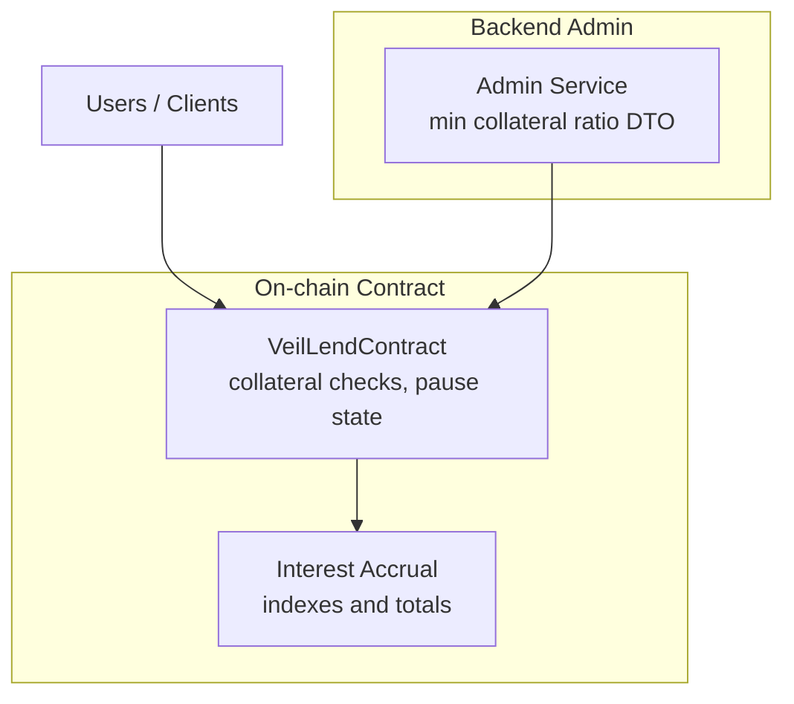
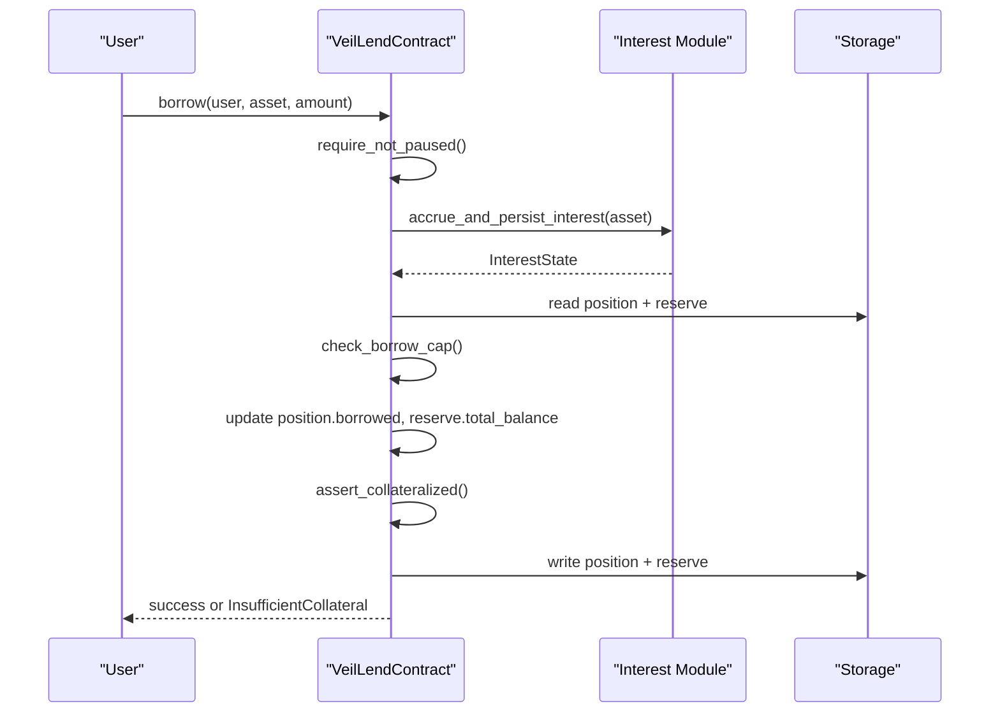
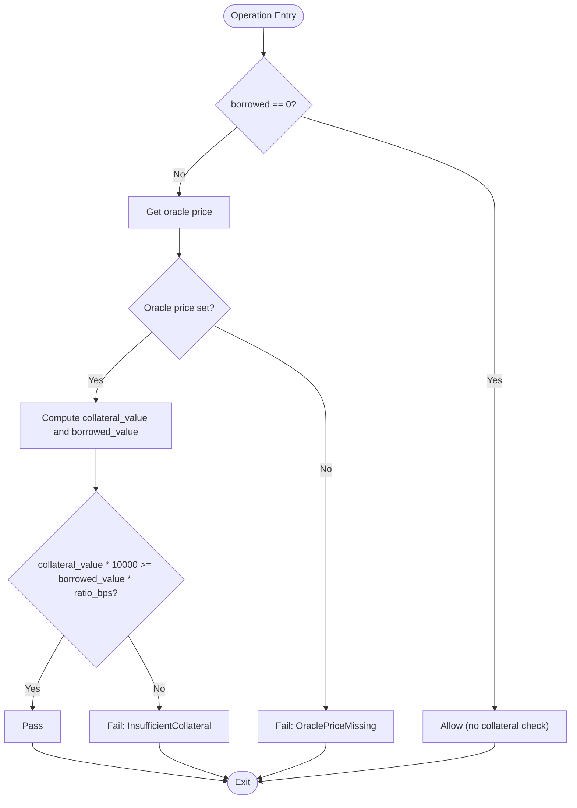
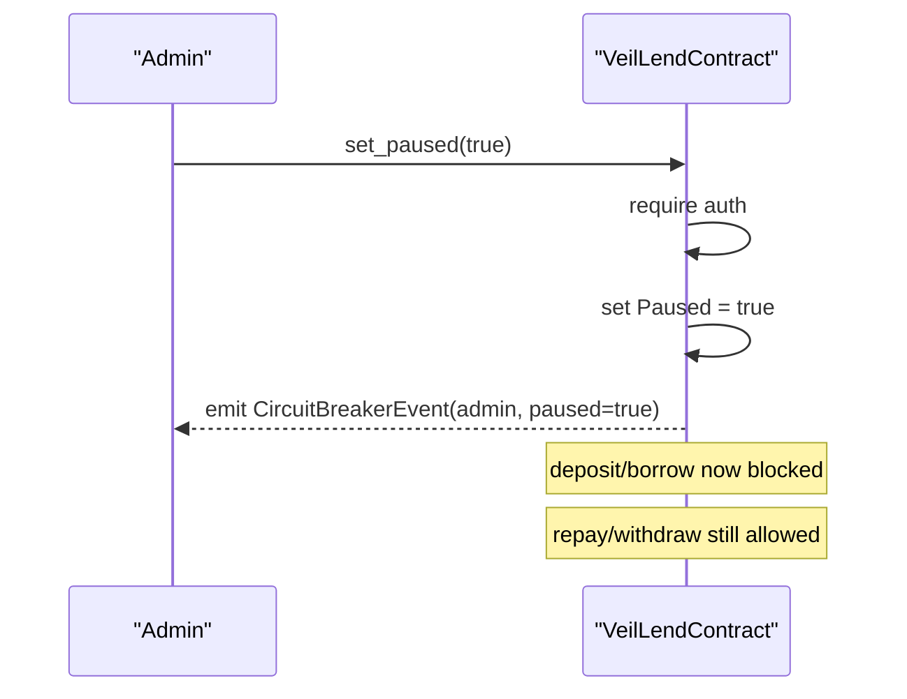
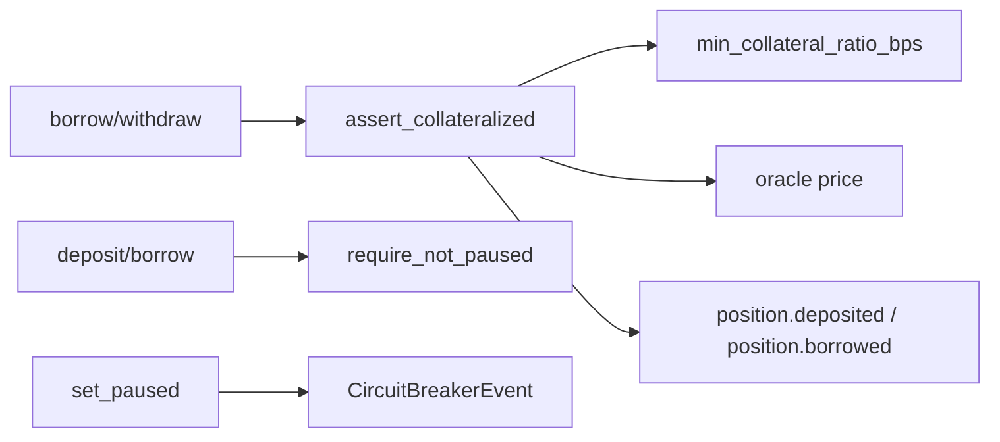

# Risk Management & Circuit Breaker

<cite>
**Referenced Files in This Document**
- [lib.rs](file://veilend-soroban/src/lib.rs)
- [interest.rs](file://veilend-soroban/src/interest.rs)
- [integration.rs](file://veilend-soroban/tests/integration.rs)
- [admin.service.ts](file://veilend-backend/src/admin/admin.service.ts)
- [set-min-collateral-ratio.dto.ts](file://veilend-backend/src/admin/dto/set-min-collateral-ratio.dto.ts)
</cite>

## Table of Contents
1. Introduction
2. Project Structure
3. Core Components
4. Architecture Overview
5. Detailed Component Analysis
6. Dependency Analysis
7. Performance Considerations
8. Troubleshooting Guide
9. Conclusion
10. Appendices

## Introduction
This document explains the protocol safety mechanisms that enforce collateral ratios and provide a circuit breaker to protect the lending protocol during emergencies. It covers:
- How min_collateral_ratio_bps is configured and enforced via assert_collateralized in borrow and withdraw operations
- The circuit breaker mechanism using set_paused and is_paused, including which operations remain available (repay, withdraw) versus blocked (deposit, borrow)
- Practical examples for risk parameter configuration, activation scenarios, and operational impact analysis
- The CircuitBreakerEvent emission and its role in alerting systems
- Common issues such as collateral ratio violations and emergency pause scenarios, plus recovery procedures

## Project Structure
The risk management logic is implemented in the on-chain Soroban contract and supported by backend admin interfaces. Key areas:
- On-chain enforcement: collateral ratio checks, pause state, and event emissions live in the Soroban contract
- Backend admin endpoints: DTOs and service placeholders for configuring protocol parameters like minimum collateral ratio

**Diagram sources**
- [lib.rs:242-258](file://veilend-soroban/src/lib.rs#L242-L258)
- [lib.rs:450-479](file://veilend-soroban/src/lib.rs#L450-L479)
- [lib.rs:521-639](file://veilend-soroban/src/lib.rs#L521-L639)
- [lib.rs:913-934](file://veilend-soroban/src/lib.rs#L913-L934)
- [interest.rs:51-87](file://veilend-soroban/src/interest.rs#L51-L87)
- [admin.service.ts:48-55](file://veilend-backend/src/admin/admin.service.ts#L48-L55)
- [set-min-collateral-ratio.dto.ts:3-7](file://veilend-backend/src/admin/dto/set-min-collateral-ratio.dto.ts#L3-L7)

**Section sources**
- [lib.rs:242-258](file://veilend-soroban/src/lib.rs#L242-L258)
- [lib.rs:450-479](file://veilend-soroban/src/lib.rs#L450-L479)
- [lib.rs:521-639](file://veilend-soroban/src/lib.rs#L521-L639)
- [lib.rs:913-934](file://veilend-soroban/src/lib.rs#L913-L934)
- [interest.rs:51-87](file://veilend-soroban/src/interest.rs#L51-L87)
- [admin.service.ts:48-55](file://veilend-backend/src/admin/admin.service.ts#L48-L55)
- [set-min-collateral-ratio.dto.ts:3-7](file://veilend-backend/src/admin/dto/set-min-collateral-ratio.dto.ts#L3-L7)

## Core Components
- Collateral ratio enforcement:
  - Minimum collateral ratio is stored as basis points and enforced in borrow and withdraw through assert_collateralized
  - Oracle price must be set; otherwise operations fail with a specific error
- Circuit breaker:
  - Admin-only set_paused toggles pause state
  - When paused, deposit and borrow are blocked; repay and withdraw remain available
  - CircuitBreakerEvent is emitted on pause/unpause for alerting

Key implementation references:
- Constructor sets min_collateral_ratio_bps and initializes Paused to false
- Borrow and withdraw call assert_collateralized after updating positions
- Repay and withdraw do not check pause; deposit and borrow do
- assert_collateralized uses oracle price and compares collateral value against borrowed value using bps thresholds

**Section sources**
- [lib.rs:242-258](file://veilend-soroban/src/lib.rs#L242-L258)
- [lib.rs:450-479](file://veilend-soroban/src/lib.rs#L450-L479)
- [lib.rs:521-561](file://veilend-soroban/src/lib.rs#L521-L561)
- [lib.rs:563-639](file://veilend-soroban/src/lib.rs#L563-L639)
- [lib.rs:913-934](file://veilend-soroban/src/lib.rs#L913-L934)

## Architecture Overview
The protocol enforces safety at two layers:
- Collateral ratio layer: Ensures positions remain adequately collateralized relative to the configured minimum collateral ratio and current oracle prices
- Circuit breaker layer: Provides an emergency stop that blocks new risky exposure (deposit/borrow) while allowing users to reduce risk (repay/withdraw)

**Diagram sources**
- [lib.rs:521-561](file://veilend-soroban/src/lib.rs#L521-L561)
- [lib.rs:856-865](file://veilend-soroban/src/lib.rs#L856-L865)
- [lib.rs:890-911](file://veilend-soroban/src/lib.rs#L890-L911)
- [lib.rs:913-934](file://veilend-soroban/src/lib.rs#L913-L934)
- [interest.rs:51-87](file://veilend-soroban/src/interest.rs#L51-L87)

## Detailed Component Analysis

### Collateral Ratio Enforcement
- Configuration:
  - min_collateral_ratio_bps is set at initialization and validated to be at least 100% (10_000 bps)
  - Default fallback exists if not present in storage
- Enforcement:
  - assert_collateralized runs after borrow and withdraw updates
  - Requires oracle price to be set; otherwise fails
  - Compares collateral_value * 10_000 vs borrowed_value * collateral_ratio_bps to ensure compliance
- Impact:
  - Prevents undercollateralized positions from being created or maintained
  - Protects lenders by ensuring sufficient collateral coverage

**Diagram sources**
- [lib.rs:913-934](file://veilend-soroban/src/lib.rs#L913-L934)

**Section sources**
- [lib.rs:242-258](file://veilend-soroban/src/lib.rs#L242-L258)
- [lib.rs:713-718](file://veilend-soroban/src/lib.rs#L713-L718)
- [lib.rs:913-934](file://veilend-soroban/src/lib.rs#L913-L934)

### Circuit Breaker Mechanism
- Control:
  - set_paused(admin, paused): Admin-only toggle; emits CircuitBreakerEvent
  - is_paused(): Read-only query of pause state
- Operational impact:
  - When paused: deposit and borrow are blocked (require_not_paused)
  - When paused: repay and withdraw remain available to allow users to reduce debt and remove collateral
- Eventing:
  - CircuitBreakerEvent includes admin address and paused flag for alerting and monitoring

**Diagram sources**
- [lib.rs:450-479](file://veilend-soroban/src/lib.rs#L450-L479)
- [lib.rs:483-519](file://veilend-soroban/src/lib.rs#L483-L519)
- [lib.rs:521-561](file://veilend-soroban/src/lib.rs#L521-L561)
- [lib.rs:563-639](file://veilend-soroban/src/lib.rs#L563-L639)

**Section sources**
- [lib.rs:450-479](file://veilend-soroban/src/lib.rs#L450-L479)
- [lib.rs:483-519](file://veilend-soroban/src/lib.rs#L483-L519)
- [lib.rs:521-561](file://veilend-soroban/src/lib.rs#L521-L561)
- [lib.rs:563-639](file://veilend-soroban/src/lib.rs#L563-L639)

### Backend Admin Integration
- DTO validation ensures min_collateral_ratio_bps meets minimum threshold (>= 10_000)
- AdminService exposes placeholder methods for setting min collateral ratio and other admin actions; integration with on-chain calls can be layered here

**Section sources**
- [set-min-collateral-ratio.dto.ts:3-7](file://veilend-backend/src/admin/dto/set-min-collateral-ratio.dto.ts#L3-L7)
- [admin.service.ts:48-55](file://veilend-backend/src/admin/admin.service.ts#L48-L55)

## Dependency Analysis
- Collateral checks depend on:
  - Oracle price availability
  - Current position balances and accrued interest
  - Configured min_collateral_ratio_bps
- Circuit breaker depends on:
  - Admin authorization
  - Persistent pause state
  - Event emission for observability

**Diagram sources**
- [lib.rs:913-934](file://veilend-soroban/src/lib.rs#L913-L934)
- [lib.rs:450-479](file://veilend-soroban/src/lib.rs#L450-L479)
- [lib.rs:521-561](file://veilend-soroban/src/lib.rs#L521-L561)
- [lib.rs:600-639](file://veilend-soroban/src/lib.rs#L600-L639)

**Section sources**
- [lib.rs:913-934](file://veilend-soroban/src/lib.rs#L913-L934)
- [lib.rs:450-479](file://veilend-soroban/src/lib.rs#L450-L479)
- [lib.rs:521-561](file://veilend-soroban/src/lib.rs#L521-L561)
- [lib.rs:600-639](file://veilend-soroban/src/lib.rs#L600-L639)

## Performance Considerations
- Collateral checks are O(1) per operation and rely on stored values and oracle price lookups
- Interest accrual is performed before balance mutations to ensure caps and totals reflect up-to-date values; this adds computational cost but preserves correctness
- Circuit breaker checks are simple boolean reads and should have negligible overhead

[No sources needed since this section provides general guidance]

## Troubleshooting Guide
Common issues and resolutions:
- Collateral ratio violation:
  - Symptom: borrow or withdraw fails with InsufficientCollateral
  - Causes: insufficient deposited collateral relative to borrowed amount, or oracle price missing
  - Resolution: increase deposits, repay debt, or ensure oracle price is set correctly
- Emergency pause scenario:
  - Symptom: deposit and borrow fail with ContractPaused
  - Cause: admin activated circuit breaker
  - Resolution: wait for admin to unpause; users can repay and withdraw even when paused
- Recovery after pause:
  - Admin calls set_paused(false) to resume normal operations
  - Monitor CircuitBreakerEvent to confirm state changes

Operational tips:
- Always set oracle price before enabling borrowing
- Use caps to limit exposure per asset while investigating risks
- Observe events for audit trails and alerting

**Section sources**
- [lib.rs:521-561](file://veilend-soroban/src/lib.rs#L521-L561)
- [lib.rs:600-639](file://veilend-soroban/src/lib.rs#L600-L639)
- [lib.rs:450-479](file://veilend-soroban/src/lib.rs#L450-L479)
- [lib.rs:913-934](file://veilend-soroban/src/lib.rs#L913-L934)

## Conclusion
The protocol’s risk management combines strict collateral ratio enforcement with an admin-controlled circuit breaker to maintain safety under stress. Collateral checks prevent undercollateralized exposures, while the pause mechanism allows rapid response to emergencies by blocking new risky operations and preserving user ability to reduce risk. Events enable robust monitoring and alerting for operational teams.

[No sources needed since this section summarizes without analyzing specific files]

## Appendices

### Practical Examples

- Risk parameter configuration:
  - Set min_collateral_ratio_bps at initialization; must be at least 100% (10_000 bps)
  - Validate via backend DTO constraints before submitting to contract

- Circuit breaker activation scenarios:
  - Admin activates pause during market stress or oracle anomalies
  - Deposit and borrow are blocked; repay and withdraw continue
  - CircuitBreakerEvent emitted for alerting systems

- Operational impact analysis:
  - During pause, liquidity inflows stop; existing positions can be reduced
  - After pause removal, normal operations resume; monitor for collateral ratio compliance

**Section sources**
- [lib.rs:242-258](file://veilend-soroban/src/lib.rs#L242-L258)
- [lib.rs:450-479](file://veilend-soroban/src/lib.rs#L450-L479)
- [lib.rs:521-561](file://veilend-soroban/src/lib.rs#L521-L561)
- [lib.rs:600-639](file://veilend-soroban/src/lib.rs#L600-L639)
- [set-min-collateral-ratio.dto.ts:3-7](file://veilend-backend/src/admin/dto/set-min-collateral-ratio.dto.ts#L3-L7)

### Monitoring and Alerting

- CircuitBreakerEvent:
  - Emits admin address and paused flag
  - Use event listeners to trigger alerts and dashboards

- Collateral ratio monitoring:
  - Track positions approaching minimum collateral ratio thresholds
  - Alert when oracle price is missing or stale

**Section sources**
- [lib.rs:450-479](file://veilend-soroban/src/lib.rs#L450-L479)
- [lib.rs:913-934](file://veilend-soroban/src/lib.rs#L913-L934)

### Test Coverage Highlights

- Initialization and defaults:
  - Verifies min_collateral_ratio_bps and initial pause state
- Circuit breaker behavior:
  - Confirms deposit/block and repay/withdraw availability when paused
  - Validates unauthorized attempts to pause
- Collateral ratio enforcement:
  - Demonstrates enforcement across borrow and withdraw paths

**Section sources**
- [integration.rs:7-18](file://veilend-soroban/tests/integration.rs#L7-L18)
- [integration.rs:85-146](file://veilend-soroban/tests/integration.rs#L85-L146)
- [integration.rs:266-281](file://veilend-soroban/tests/integration.rs#L266-L281)