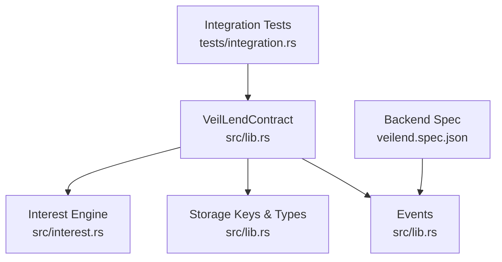
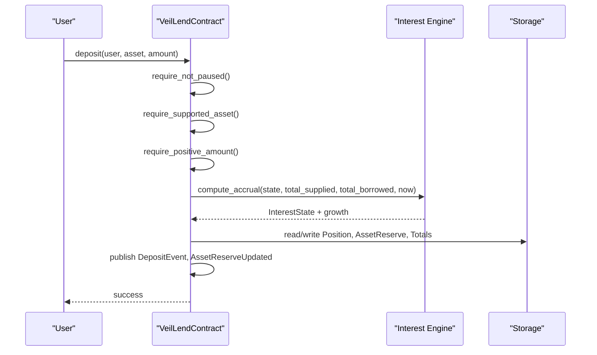
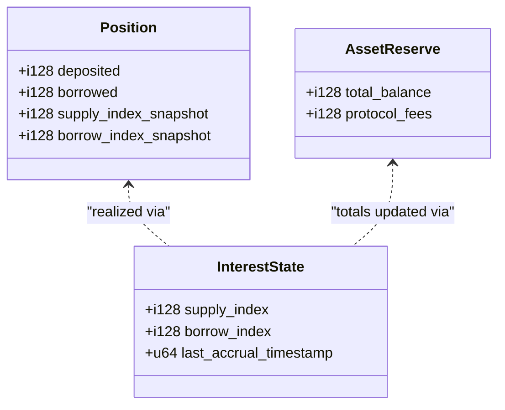
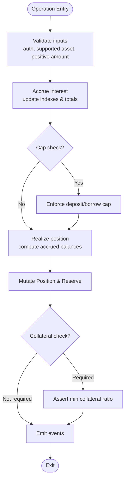
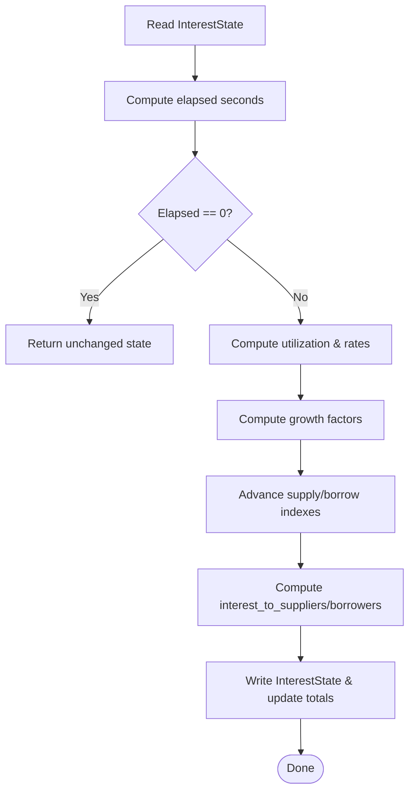
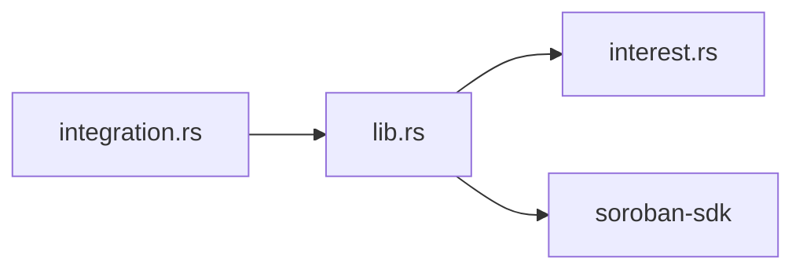

# Smart Contracts (Soroban/Rust)

<cite>
**Referenced Files in This Document**
- [lib.rs](file://veilend-soroban/src/lib.rs)
- [interest.rs](file://veilend-soroban/src/interest.rs)
- [Cargo.toml](file://veilend-soroban/Cargo.toml)
- [integration.rs](file://veilend-soroban/tests/integration.rs)
- [veilend.spec.json](file://veilend-backend/src/common/contracts/veilend.spec.json)
</cite>

## Table of Contents
1. [Introduction](#introduction)
2. [Project Structure](#project-structure)
3. [Core Components](#core-components)
4. [Architecture Overview](#architecture-overview)
5. [Detailed Component Analysis](#detailed-component-analysis)
6. [Dependency Analysis](#dependency-analysis)
7. [Performance Considerations](#performance-considerations)
8. [Troubleshooting Guide](#troubleshooting-guide)
9. [Conclusion](#conclusion)
10. [Appendices](#appendices)

## Introduction
This document explains the VeilLend lending protocol implemented as a Soroban smart contract in Rust. It covers initialization with an admin and minimum collateral ratio, asset configuration, position tracking for deposits and borrows, core lending operations (deposit, borrow, repay, withdraw), interest accrual using time-based indexes and fixed-point arithmetic, oracle-backed collateral valuation, event emission for indexing, and the complete API surface including error codes. The goal is to help both new Soroban developers understand the conceptual model and experienced Rust developers navigate the implementation details.

## Project Structure
The Soroban contract lives under veilend-soroban:
- src/lib.rs defines the VeilLendContract, storage schema, events, and all public entrypoints.
- src/interest.rs implements the interest accrual engine with fixed-point math and per-position realization.
- tests/integration.rs contains end-to-end scenarios validating caps, circuit breaker, accrual, and conservation of value.
- Cargo.toml declares the Soroban SDK dependency and crate type for on-chain deployment.
- The backend includes a minimal spec describing emitted events used by off-chain indexers.

**Diagram sources**
- [lib.rs:226-719](file://veilend-soroban/src/lib.rs#L226-L719)
- [interest.rs:1-121](file://veilend-soroban/src/interest.rs#L1-L121)
- [integration.rs:1-461](file://veilend-soroban/tests/integration.rs#L1-L461)
- [veilend.spec.json:1-27](file://veilend-backend/src/common/contracts/veilend.spec.json#L1-L27)

**Section sources**
- [Cargo.toml:1-15](file://veilend-soroban/Cargo.toml#L1-L15)
- [lib.rs:1-146](file://veilend-soroban/src/lib.rs#L1-L146)
- [interest.rs:1-22](file://veilend-soroban/src/interest.rs#L1-L22)

## Core Components
- Contract metadata and versioning: exposes contract and storage schema versions and a stable schema ID for migrations.
- Storage schema: keys for admin, min collateral ratio, supported assets, positions, oracle prices, deposit/borrow caps, totals, pause state, and per-asset interest state.
- Data models: Position, InterestState, AssetCaps, AssetReserve, ReserveUpdateKind.
- Error handling: VeilLendError enum enumerates all failure modes with unique u32 codes.
- Events: AssetConfigured, DepositEvent, BorrowEvent, RepayEvent, WithdrawEvent, CapsUpdated, CircuitBreakerEvent, AssetReserveUpdated.
- Admin functions: configure_asset, set_oracle_price, update_asset_caps, set_paused, record_protocol_fee.
- User functions: deposit, borrow, repay, withdraw, get_position, get_asset_reserve, get_interest_state, accrue_interest.
- Read-only helpers: is_asset_supported, get_total_deposited, get_total_borrowed, get_asset_caps, admin, min_collateral_ratio_bps.

**Section sources**
- [lib.rs:19-146](file://veilend-soroban/src/lib.rs#L19-L146)
- [lib.rs:226-719](file://veilend-soroban/src/lib.rs#L226-L719)

## Architecture Overview
The contract separates concerns into three layers:
- Entry points enforce authorization, validation, and orchestration.
- Interest engine computes time-based accruals and per-position realized balances using fixed-point indexes.
- Storage layer persists positions, reserves, caps, oracle prices, and interest state.

**Diagram sources**
- [lib.rs:483-519](file://veilend-soroban/src/lib.rs#L483-L519)
- [interest.rs:51-87](file://veilend-soroban/src/interest.rs#L51-L87)

## Detailed Component Analysis

### Initialization and Admin Controls
- Constructor initializes admin, minimum collateral ratio (in basis points), and ensures it is at least 100% (10_000 bps). Also sets initial paused state to false.
- Admin can configure assets (enable/disable), set oracle prices, update per-asset deposit/borrow caps, toggle pause, and record protocol fees. Each admin action requires authentication and emits relevant events.

Key behaviors:
- Minimum collateral ratio must be >= 100%.
- New assets start with unlimited caps (-1) and zero totals.
- Oracle price must be positive; missing price triggers specific errors during collateral checks.

**Section sources**
- [lib.rs:242-331](file://veilend-soroban/src/lib.rs#L242-L331)
- [lib.rs:356-420](file://veilend-soroban/src/lib.rs#L356-L420)
- [lib.rs:450-479](file://veilend-soroban/src/lib.rs#L450-L479)
- [lib.rs:686-704](file://veilend-soroban/src/lib.rs#L686-L704)

### Asset Configuration System
- SupportedAsset flag gates access to asset-specific operations.
- Per-asset DepositCap and BorrowCap limit aggregate usage; -1 means unlimited.
- TotalDeposited and TotalBorrowed track protocol-wide exposure per asset.
- OraclePrice provides asset valuation for collateral checks.

**Section sources**
- [lib.rs:28-57](file://veilend-soroban/src/lib.rs#L28-L57)
- [lib.rs:260-306](file://veilend-soroban/src/lib.rs#L260-L306)
- [lib.rs:342-344](file://veilend-soroban/src/lib.rs#L342-L344)
- [lib.rs:422-448](file://veilend-soroban/src/lib.rs#L422-L448)

### Position Tracking for Deposits and Borrows
- Position stores deposited and borrowed amounts plus snapshots of supply_index and borrow_index at last interaction.
- On each mutation, positions are “realized” against current interest state to reflect accrued interest without changing stored balances until touched again.
- Positions are keyed by user and asset.

**Diagram sources**
- [lib.rs:59-93](file://veilend-soroban/src/lib.rs#L59-L93)
- [interest.rs:97-120](file://veilend-soroban/src/interest.rs#L97-L120)

**Section sources**
- [lib.rs:59-93](file://veilend-soroban/src/lib.rs#L59-L93)
- [lib.rs:753-780](file://veilend-soroban/src/lib.rs#L753-L780)
- [interest.rs:97-120](file://veilend-soroban/src/interest.rs#L97-L120)

### Core Lending Operations
- deposit: Validates inputs, accrues interest, enforces deposit cap, realizes position, updates reserve and totals, emits events.
- borrow: Validates inputs, accrues interest, enforces borrow cap, ensures sufficient reserve, increases debt, asserts collateralization, updates reserve and totals, emits events.
- repay: Validates inputs, accrues interest, ensures repayment does not exceed outstanding debt, reduces debt, updates reserve and totals, emits events.
- withdraw: Validates inputs, accrues interest, ensures withdrawal does not exceed deposited balance or reserve, reduces deposit, asserts collateralization, updates reserve and totals, emits events.

All mutating operations call interest accrual first so caps and totals reflect up-to-date values.

**Diagram sources**
- [lib.rs:483-639](file://veilend-soroban/src/lib.rs#L483-L639)
- [lib.rs:867-911](file://veilend-soroban/src/lib.rs#L867-L911)
- [lib.rs:913-934](file://veilend-soroban/src/lib.rs#L913-L934)

**Section sources**
- [lib.rs:483-639](file://veilend-soroban/src/lib.rs#L483-L639)

### Interest Calculation Engine
- Uses fixed-point arithmetic with RATE_SCALE = 1e9.
- Computes utilization from total_supplied and total_borrowed.
- Derives borrow_rate_bps and supply_rate_bps based on BASE_RATE_BPS and SLOPE_BPS.
- Advances supply_index and borrow_index proportionally to elapsed seconds and rates.
- Realizes per-position balances by applying delta between current indexes and position snapshots.
- Idempotent: if no time has elapsed, accrual returns unchanged state and zero growth.

**Diagram sources**
- [interest.rs:29-87](file://veilend-soroban/src/interest.rs#L29-L87)
- [lib.rs:792-815](file://veilend-soroban/src/lib.rs#L792-L815)

**Section sources**
- [interest.rs:1-121](file://veilend-soroban/src/interest.rs#L1-L121)
- [lib.rs:792-827](file://veilend-soroban/src/lib.rs#L792-L827)

### Oracle-Backed Collateral Valuation
- Collateral checks use the configured oracle price for the asset.
- Collateral value equals deposited * price; borrowed value equals borrowed * price.
- Enforces that collateral_value * 10_000 >= borrowed_value * min_collateral_ratio_bps.
- If oracle price is missing when needed, fails with a dedicated error.

**Section sources**
- [lib.rs:913-934](file://veilend-soroban/src/lib.rs#L913-L934)

### Event Emission for Indexing
- Emits standardized events for asset configuration, deposits, borrows, repayments, withdrawals, cap updates, circuit breaker toggles, and reserve updates.
- Backend spec documents key event topics for indexer integration.

**Section sources**
- [lib.rs:147-224](file://veilend-soroban/src/lib.rs#L147-L224)
- [veilend.spec.json:1-27](file://veilend-backend/src/common/contracts/veilend.spec.json#L1-L27)

## Dependency Analysis
- lib.rs depends on interest.rs for accrual logic and uses Soroban SDK primitives for storage, events, and addresses.
- Integration tests exercise the full lifecycle: initialize, configure assets, set oracle prices, apply caps, pause/unpause, accrue interest, and validate conservation of value.

**Diagram sources**
- [Cargo.toml:11-15](file://veilend-soroban/Cargo.toml#L11-L15)
- [lib.rs:1-8](file://veilend-soroban/src/lib.rs#L1-L8)
- [interest.rs:1-2](file://veilend-soroban/src/interest.rs#L1-L2)
- [integration.rs:1-4](file://veilend-soroban/tests/integration.rs#L1-L4)

**Section sources**
- [Cargo.toml:1-15](file://veilend-soroban/Cargo.toml#L1-L15)
- [integration.rs:1-461](file://veilend-soroban/tests/integration.rs#L1-L461)

## Performance Considerations
- Interest accrual is O(1) per call and idempotent; repeated calls at the same timestamp do nothing.
- Fixed-point math avoids floating point and exponentiation, keeping computations safe and efficient in no_std environments.
- Reading view functions simulate accrual without writing storage, minimizing gas costs for queries.
- Caps and totals are checked after accrual to ensure consistency without extra passes.

[No sources needed since this section provides general guidance]

## Troubleshooting Guide
Common errors and their causes:
- AlreadyInitialized: constructor called more than once.
- Unauthorized: caller is not the stored admin.
- UnsupportedAsset: operation on an asset not enabled by admin.
- InvalidAmount / ZeroAmount: negative or zero amounts passed to functions expecting positive values.
- InsufficientCollateral: post-operation collateral ratio below minimum.
- InsufficientDeposit / RepayTooLarge: attempting to withdraw more than deposited or repay more than owed.
- InvalidCollateralRatio: minimum collateral ratio below 100%.
- NotInitialized: accessing admin-dependent data before initialization.
- OraclePriceMissing: collateral check attempted without setting oracle price.
- ContractPaused: deposit/borrow blocked while paused.
- DepositCapExceeded / BorrowCapExceeded: exceeding per-asset caps.
- InvalidCap: cap value must be -1 (unlimited) or positive.
- CircuitBreakerTriggered: reserved for future asset-level pausing.
- InsufficientReserve: borrowing or withdrawing exceeds available reserve balance.

Operational tips:
- Always set oracle price before enabling borrowing or allowing withdrawals that require collateral checks.
- Use update_asset_caps to control risk exposure per asset.
- Toggle pause to halt risky operations while preserving repay/withdraw functionality.
- Call accrue_interest periodically to keep indexes and totals fresh for indexers and analytics.

**Section sources**
- [lib.rs:107-145](file://veilend-soroban/src/lib.rs#L107-L145)
- [lib.rs:847-934](file://veilend-soroban/src/lib.rs#L847-L934)

## Conclusion
VeilLend’s Soroban contract provides a robust, time-based lending protocol with clear separation between administration, user operations, and interest mechanics. Its design emphasizes safety through explicit validations, collateral checks backed by oracle prices, and conservative accrual using fixed-point arithmetic. The event system enables reliable off-chain indexing, while caps and circuit breakers offer operational controls. Together, these components form a solid foundation for building decentralized lending applications on Stellar.

[No sources needed since this section summarizes without analyzing specific files]

## Appendices

### API Surface Summary
- contract_metadata(): Returns contract and storage schema metadata.
- __constructor(admin, min_collateral_ratio_bps): Initializes contract with admin and minimum collateral ratio.
- configure_asset(admin, asset, supported): Enable/disable asset support; initializes caps and totals when supported.
- set_oracle_price(admin, asset, price): Set oracle price for an asset (must be positive).
- update_asset_caps(admin, asset, deposit_cap, borrow_cap): Update per-asset caps (-1 for unlimited).
- set_paused(admin, paused): Pause/unpause contract; blocks deposit/borrow when paused.
- record_protocol_fee(admin, asset, amount): Record protocol fees and refresh interest clock.
- deposit(user, asset, amount): Deposit funds into a supported asset.
- borrow(user, asset, amount): Borrow against deposited collateral subject to caps and collateral ratio.
- repay(user, asset, amount): Repay outstanding debt up to accrued amount.
- withdraw(user, asset, amount): Withdraw deposited funds subject to reserve availability and collateral ratio.
- get_position(user, asset): Read simulated accrued position without persisting changes.
- get_asset_reserve(asset): Read reserve totals for an asset.
- get_interest_state(asset): Read simulated interest state without persisting changes.
- accrue_interest(asset): Force reserve-level interest accrual and emit reserve update event.
- is_asset_supported(asset): Check if asset is enabled.
- get_total_deposited(asset), get_total_borrowed(asset): Read protocol-wide totals.
- get_asset_caps(asset): Read current caps for an asset.
- admin(), min_collateral_ratio_bps(): Read admin and collateral policy.

**Section sources**
- [lib.rs:234-240](file://veilend-soroban/src/lib.rs#L234-L240)
- [lib.rs:242-719](file://veilend-soroban/src/lib.rs#L242-L719)

### Practical Examples
- Initialize contract with admin and 150% minimum collateral ratio.
- Configure an asset and set its oracle price.
- Deposit funds, then borrow against them ensuring collateral ratio holds.
- Advance ledger time and call accrue_interest to grow indexes and totals.
- Repay accrued debt and withdraw remaining deposits.
- Toggle pause to block new deposits/borrows while allowing repay/withdraw.

These flows are validated in integration tests and demonstrate typical interactions with the contract.

**Section sources**
- [integration.rs:7-18](file://veilend-soroban/tests/integration.rs#L7-L18)
- [integration.rs:21-39](file://veilend-soroban/tests/integration.rs#L21-L39)
- [integration.rs:283-342](file://veilend-soroban/tests/integration.rs#L283-L342)
- [integration.rs:344-378](file://veilend-soroban/tests/integration.rs#L344-L378)
- [integration.rs:85-127](file://veilend-soroban/tests/integration.rs#L85-L127)