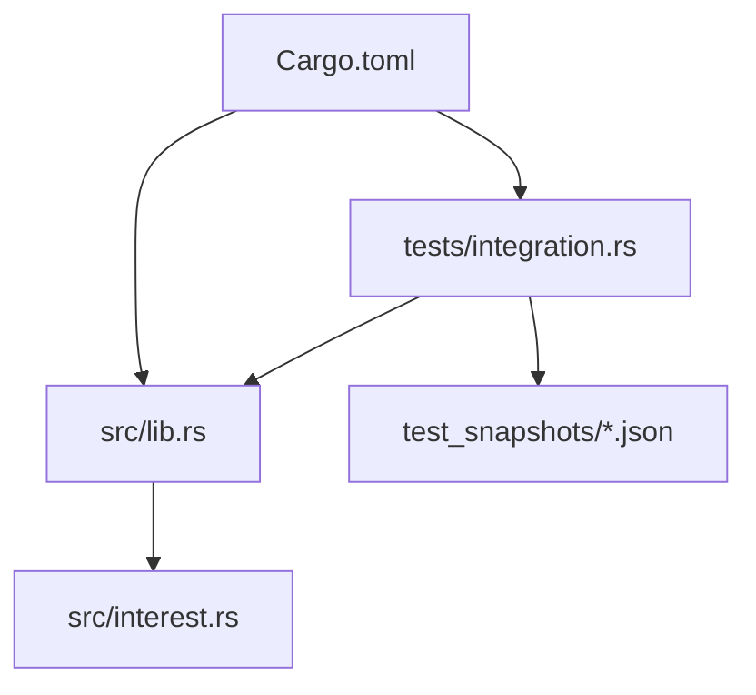
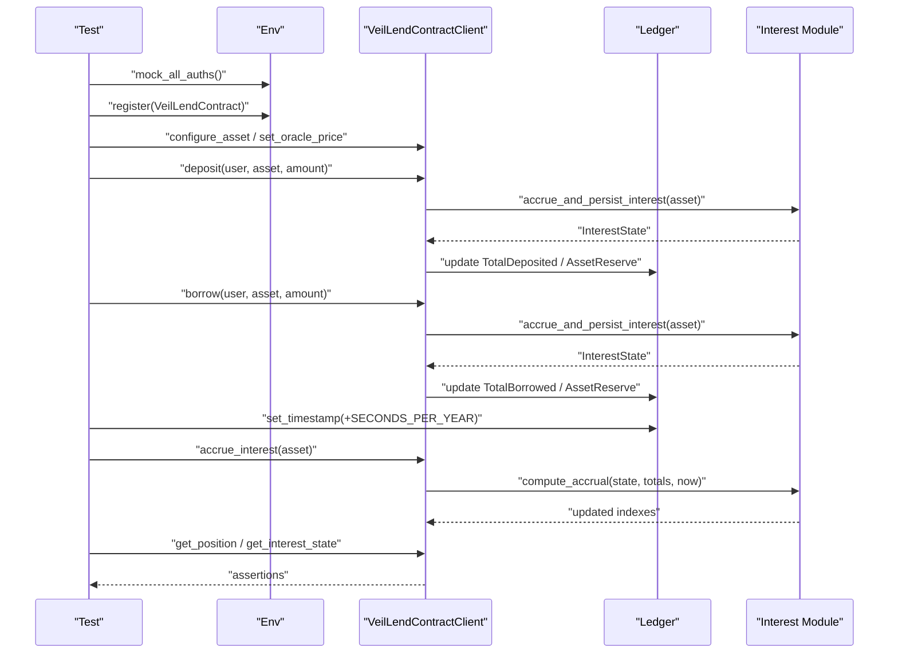
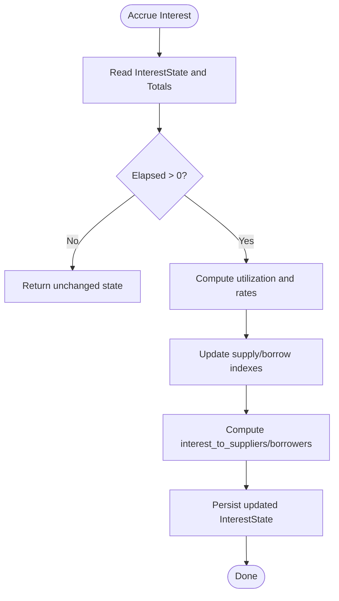
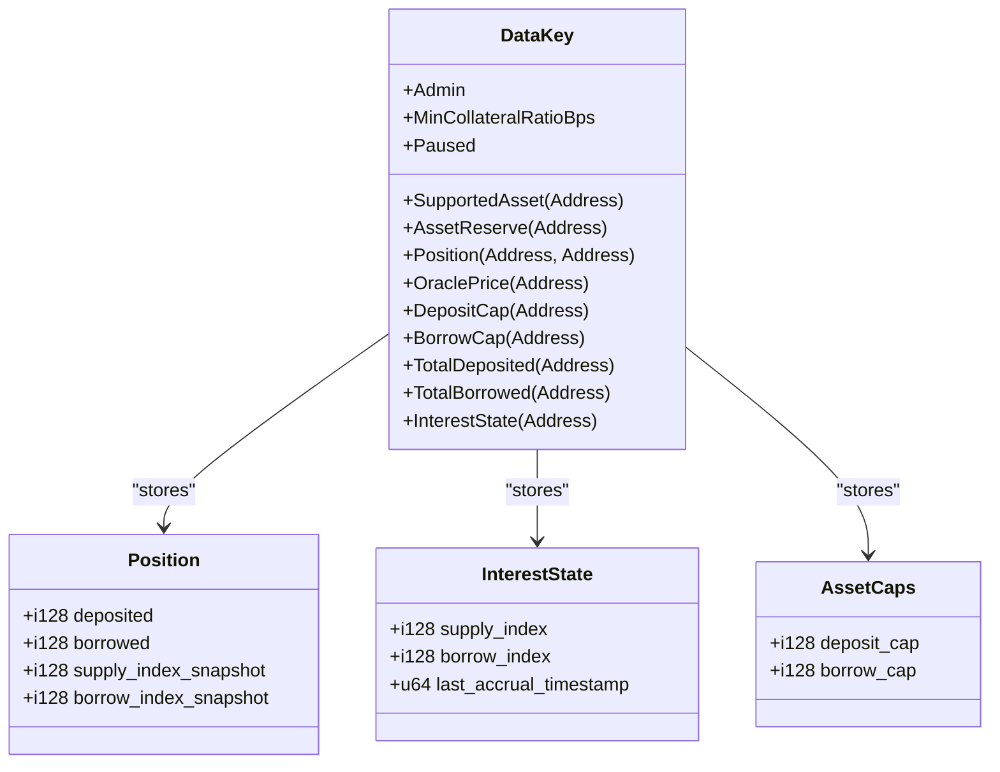
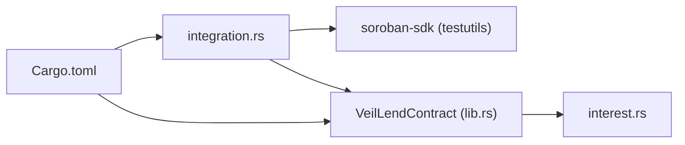

# Testing & Integration

<cite>
**Referenced Files in This Document**
- [integration.rs](file://veilend-soroban/tests/integration.rs)
- [lib.rs](file://veilend-soroban/src/lib.rs)
- [interest.rs](file://veilend-soroban/src/interest.rs)
- [Cargo.toml](file://veilend-soroban/Cargo.toml)
- [test_initialize_contract.1.json](file://veilend-soroban/test_snapshots/test_initialize_contract.1.json)
- [test_deposit_then_borrow_then_time_advances_grows_debt_matching_formula.1.json](file://veilend-soroban/test_snapshots/test_deposit_then_borrow_then_time_advances_grows_debt_matching_formula.1.json)
- [test_conservation_of_value_between_suppliers_and_borrower.1.json](file://veilend-soroban/test_snapshots/test_conservation_of_value_between_suppliers_and_borrower.1.json)
</cite>

## Table of Contents
1. [Introduction](#introduction)
2. [Project Structure](#project-structure)
3. [Core Components](#core-components)
4. [Architecture Overview](#architecture-overview)
5. [Detailed Component Analysis](#detailed-component-analysis)
6. [Dependency Analysis](#dependency-analysis)
7. [Performance Considerations](#performance-considerations)
8. [Troubleshooting Guide](#troubleshooting-guide)
9. [Conclusion](#conclusion)
10. [Appendices](#appendices)

## Introduction
This document explains the testing and integration strategy for the VeilLend Soroban smart contract. It focuses on how integration tests are structured using the Soroban SDK, how test environments are set up with mock accounts and contracts, and how assertions validate contract behavior. It also documents the test snapshot system that uses JSON files to capture and verify contract state after operations, including positions, reserves, and interest state. The guide provides both conceptual overviews for DeFi testing methodologies and technical implementation details for writing effective tests. Terminology such as test snapshots, integration tests, mock accounts, and state assertions is used consistently throughout.

## Project Structure
The testing surface lives under veilend-soroban:
- Tests are written in Rust under tests/integration.rs using the Soroban SDK’s Env and testutils.
- Contract code and data models live under src/lib.rs and src/interest.rs.
- Test snapshots are stored under test_snapshots as JSON files named after each test function.
- Dependencies and test utilities are declared in Cargo.toml.

**Diagram sources**
- [integration.rs:1-20](file://veilend-soroban/tests/integration.rs#L1-L20)
- [lib.rs:1-120](file://veilend-soroban/src/lib.rs#L1-L120)
- [interest.rs:1-30](file://veilend-soroban/src/interest.rs#L1-L30)
- [Cargo.toml:1-15](file://veilend-soroban/Cargo.toml#L1-L15)

**Section sources**
- [integration.rs:1-40](file://veilend-soroban/tests/integration.rs#L1-L40)
- [Cargo.toml:1-15](file://veilend-soroban/Cargo.toml#L1-L15)

## Core Components
- Integration tests: Each test sets up a fresh Env, mocks authentication, registers the contract, configures assets and oracles, performs operations (deposit, borrow, repay, withdraw), and asserts outcomes via client queries.
- Mock accounts: Addresses are generated per test to simulate users and admin without real keys.
- State assertions: Tests assert on positions, totals, caps, pause state, and interest indexes.
- Time simulation: Ledger timestamps are advanced to exercise accrual logic idempotently.
- Snapshot verification: JSON snapshots capture ledger entries, auth flows, and events for deterministic regression checks.

Key patterns observed:
- env.mock_all_auths() to bypass signature checks during tests.
- env.register(...) to deploy the contract with an admin and configuration.
- Client methods like deposit, borrow, repay, withdraw, get_position, get_interest_state, get_asset_caps, is_paused.
- Capturing panics for expected failures (e.g., cap exceeded, unauthorized).

**Section sources**
- [integration.rs:8-18](file://veilend-soroban/tests/integration.rs#L8-L18)
- [integration.rs:21-39](file://veilend-soroban/tests/integration.rs#L21-L39)
- [integration.rs:41-83](file://veilend-soroban/tests/integration.rs#L41-L83)
- [integration.rs:283-342](file://veilend-soroban/tests/integration.rs#L283-L342)
- [integration.rs:344-378](file://veilend-soroban/tests/integration.rs#L344-L378)
- [integration.rs:380-421](file://veilend-soroban/tests/integration.rs#L380-L421)
- [integration.rs:423-460](file://veilend-soroban/tests/integration.rs#L423-L460)

## Architecture Overview
The integration test flow interacts with the VeilLend contract through its client API. Interest accrual is time-based and driven by ledger timestamps. Tests advance time and call accrue_interest or rely on entrypoints to refresh indexes.

**Diagram sources**
- [integration.rs:283-342](file://veilend-soroban/tests/integration.rs#L283-L342)
- [lib.rs:483-561](file://veilend-soroban/src/lib.rs#L483-L561)
- [lib.rs:662-677](file://veilend-soroban/src/lib.rs#L662-L677)
- [interest.rs:51-87](file://veilend-soroban/src/interest.rs#L51-L87)

## Detailed Component Analysis

### Integration Test Setup and Patterns
- Environment initialization: Create Env, enable mock auth, generate addresses for admin/user, register contract with admin and min collateral ratio.
- Asset configuration: Configure asset, set oracle price, update caps when needed.
- Operations: Deposit, borrow, repay, withdraw; use panic-catching helpers to assert expected failures.
- Time advancement: Use env.ledger().timestamp() and set_timestamp to move forward by SECONDS_PER_YEAR to trigger accrual.
- Assertions: Check positions, totals, caps, pause state, and interest indexes.

Example references:
- Initialization and basic assertions
- Caps enforcement and failure cases
- Circuit breaker pause/unpause behavior
- Multi-user interactions and conservation of value
- Idempotent accrual at same timestamp

**Section sources**
- [integration.rs:8-18](file://veilend-soroban/tests/integration.rs#L8-L18)
- [integration.rs:41-83](file://veilend-soroban/tests/integration.rs#L41-L83)
- [integration.rs:85-127](file://veilend-soroban/tests/integration.rs#L85-L127)
- [integration.rs:148-192](file://veilend-soroban/tests/integration.rs#L148-L192)
- [integration.rs:283-342](file://veilend-soroban/tests/integration.rs#L283-L342)
- [integration.rs:344-378](file://veilend-soroban/tests/integration.rs#L344-L378)
- [integration.rs:380-421](file://veilend-soroban/tests/integration.rs#L380-L421)
- [integration.rs:423-460](file://veilend-soroban/tests/integration.rs#L423-L460)

### Interest Accrual and Position Realization
- Accrual model: Uses fixed-point rates and time-based index updates. Rates depend on utilization; supply rate is derived from borrow rate and utilization to ensure conservation of value.
- Indexes: supply_index and borrow_index grow over time; position snapshots anchor per-user growth until next touch.
- Idempotency: Accrual at the same timestamp is a no-op; repeated calls do not change state.
- Position realization: compute_accrued_position applies accrued growth to deposited/borrowed balances and re-anchors snapshots.

**Diagram sources**
- [interest.rs:51-87](file://veilend-soroban/src/interest.rs#L51-L87)
- [lib.rs:782-800](file://veilend-soroban/src/lib.rs#L782-L800)

**Section sources**
- [interest.rs:1-22](file://veilend-soroban/src/interest.rs#L1-L22)
- [interest.rs:24-38](file://veilend-soroban/src/interest.rs#L24-L38)
- [interest.rs:51-87](file://veilend-soroban/src/interest.rs#L51-L87)
- [interest.rs:89-120](file://veilend-soroban/src/interest.rs#L89-L120)
- [lib.rs:641-677](file://veilend-soroban/src/lib.rs#L641-L677)

### Test Snapshots System
- Purpose: Capture full ledger state, auth flows, and events after test execution to detect unintended changes.
- Location: test_snapshots directory contains one JSON file per test, named after the test function with a version suffix.
- Content: Includes generators, auth invocations, ledger entries (contract data, instance, code), and events.
- Usage: When modifying contract logic or storage layout, regenerate snapshots and compare to catch regressions.

Examples:
- test_initialize_contract.1.json shows initial instance storage and paused flag.
- test_deposit_then_borrow_then_time_advances_grows_debt_matching_formula.1.json captures positions, reserves, and interest state after time advances.
- test_conservation_of_value_between_suppliers_and_borrower.1.json validates multi-user conservation across deposits and borrows.

**Section sources**
- [test_initialize_contract.1.json:1-197](file://veilend-soroban/test_snapshots/test_initialize_contract.1.json#L1-L197)
- [test_deposit_then_borrow_then_time_advances_grows_debt_matching_formula.1.json:1-800](file://veilend-soroban/test_snapshots/test_deposit_then_borrow_then_time_advances_grows_debt_matching_formula.1.json#L1-L800)
- [test_conservation_of_value_between_suppliers_and_borrower.1.json:1-800](file://veilend-soroban/test_snapshots/test_conservation_of_value_between_suppliers_and_borrower.1.json#L1-L800)

### Data Models and Storage Keys
- DataKey enum defines persistent and instance storage keys: Admin, MinCollateralRatioBps, SupportedAsset, AssetReserve, Position, OraclePrice, DepositCap, BorrowCap, TotalDeposited, TotalBorrowed, Paused, InterestState.
- Position stores deposited, borrowed, and index snapshots for per-user accrual.
- InterestState tracks supply_index, borrow_index, and last_accrual_timestamp per asset.
- AssetCaps holds deposit_cap and borrow_cap per asset (-1 means unlimited).

**Diagram sources**
- [lib.rs:28-93](file://veilend-soroban/src/lib.rs#L28-L93)

**Section sources**
- [lib.rs:28-93](file://veilend-soroban/src/lib.rs#L28-L93)

## Dependency Analysis
- Tests depend on Soroban SDK testutils for Env, Address, Ledger utilities, and mock auth.
- Contract depends on Soroban SDK for contract macros, types, and storage APIs.
- Interest module is internal to the contract and used by entrypoints to compute accruals.

**Diagram sources**
- [Cargo.toml:1-15](file://veilend-soroban/Cargo.toml#L1-L15)
- [integration.rs:1-4](file://veilend-soroban/tests/integration.rs#L1-L4)
- [lib.rs:1-10](file://veilend-soroban/src/lib.rs#L1-L10)

**Section sources**
- [Cargo.toml:1-15](file://veilend-soroban/Cargo.toml#L1-L15)
- [integration.rs:1-4](file://veilend-soroban/tests/integration.rs#L1-L4)

## Performance Considerations
- Gas cost optimization: Avoid unnecessary accrual calls; rely on entrypoints to accrue before mutations. Tests demonstrate calling accrue_interest only when needed.
- Floating-point precision: All math uses fixed-point i128 arithmetic with RATE_SCALE to avoid floating-point errors. Tests validate exact integer growth values.
- Test execution performance: Reuse minimal setup per test; keep amounts small where possible; batch operations within single tests to reduce overhead.
- Idempotency: Ensure accrual is safe to call multiple times at the same timestamp; tests verify no state change on duplicate calls.

[No sources needed since this section provides general guidance]

## Troubleshooting Guide
Common issues and debugging techniques:
- Unexpected failures on deposit/borrow: Check if contract is paused or asset is unsupported; verify oracle price is set; confirm caps allow the operation.
- Cap exceeded errors: Validate deposit_cap and borrow_cap settings; ensure totals reflect accrued values before checking caps.
- Unauthorized errors: Confirm caller matches stored admin for privileged functions; tests use mock_all_auths to simplify but still require correct roles.
- Zero amount errors: Ensure all amounts are positive; zero amounts are rejected by validation.
- Insufficient reserve or deposit: Verify total_balance and user position balances after accrual; repay/withdraw must not exceed accrued amounts.
- Snapshot mismatches: Regenerate snapshots after intentional changes; inspect ledger_entries for unexpected keys or values; diff auth sequences to find extra calls.

Practical steps:
- Use std::panic::catch_unwind to assert expected failures in tests.
- Advance ledger timestamp deliberately to force accrual and then query get_interest_state and get_position to validate growth.
- Compare against known constants (e.g., SECONDS_PER_YEAR) and expected index growth to pinpoint calculation issues.

**Section sources**
- [integration.rs:41-83](file://veilend-soroban/tests/integration.rs#L41-L83)
- [integration.rs:85-127](file://veilend-soroban/tests/integration.rs#L85-L127)
- [integration.rs:344-378](file://veilend-soroban/tests/integration.rs#L344-L378)
- [lib.rs:107-145](file://veilend-soroban/src/lib.rs#L107-L145)

## Conclusion
The VeilLend testing framework leverages Soroban SDK integration tests with mock accounts, precise time simulation, and robust state assertions. The test snapshot system ensures deterministic verification of contract state, including positions, reserves, and interest indexes. By following established patterns—setting up environments, configuring assets and oracles, performing operations, advancing time, and asserting outcomes—you can write effective tests that cover financial calculations, edge cases, and multi-user scenarios. Adhering to best practices around fixed-point arithmetic, idempotent accrual, and careful gas considerations will help maintain correctness and performance.

[No sources needed since this section summarizes without analyzing specific files]

## Appendices

### Best Practices for Writing Effective Tests
- Always initialize environment with mock auth and register the contract with a clear admin role.
- Configure assets and oracle prices before any deposit/borrow operations.
- Set explicit caps to test boundary conditions; include both limited and unlimited (-1) scenarios.
- Advance ledger timestamps to exercise accrual; verify idempotency by calling accrue_interest twice at the same timestamp.
- Assert both immediate effects (totals, positions) and long-term effects (index growth after time advances).
- Use snapshots to lock down expected ledger state; regenerate and review diffs when changing storage or logic.

[No sources needed since this section provides general guidance]

### Example Test Case Creation Workflow
- Define a new test function with a descriptive name.
- Create Env, mock auth, generate addresses for admin and users.
- Register contract and configure asset(s); set oracle price.
- Perform operations (deposit, borrow, repay, withdraw) and capture results.
- Advance time and call accrue_interest if needed.
- Assert positions, totals, caps, pause state, and interest indexes.
- Run tests to generate/update snapshots; commit snapshots alongside code changes.

[No sources needed since this section provides general guidance]