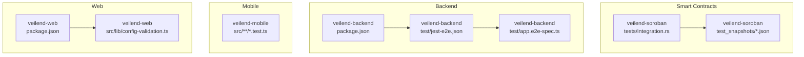
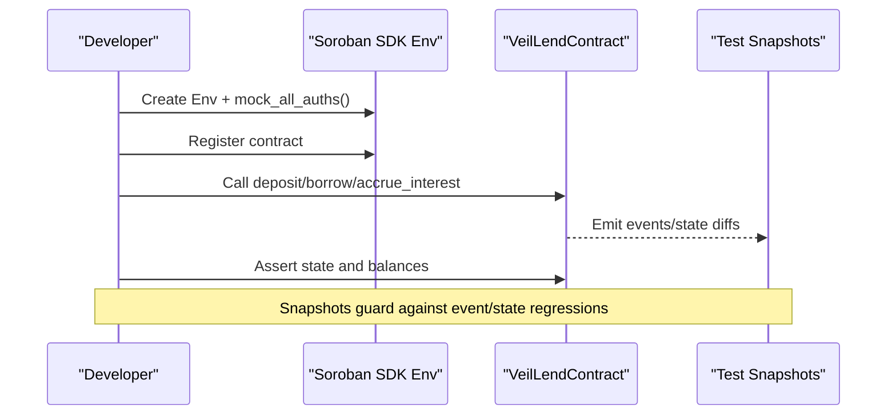
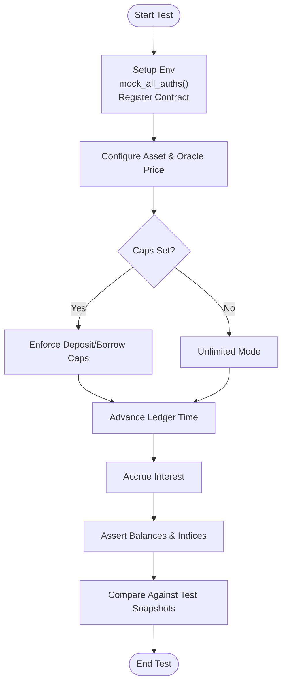
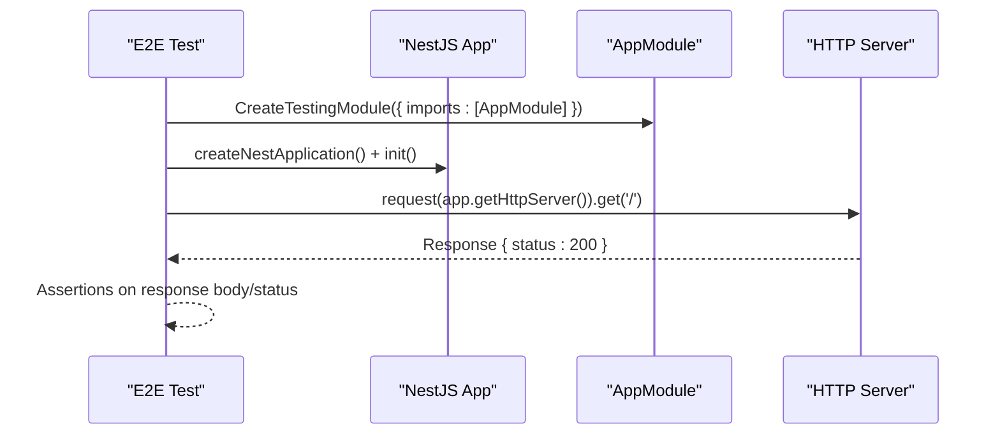
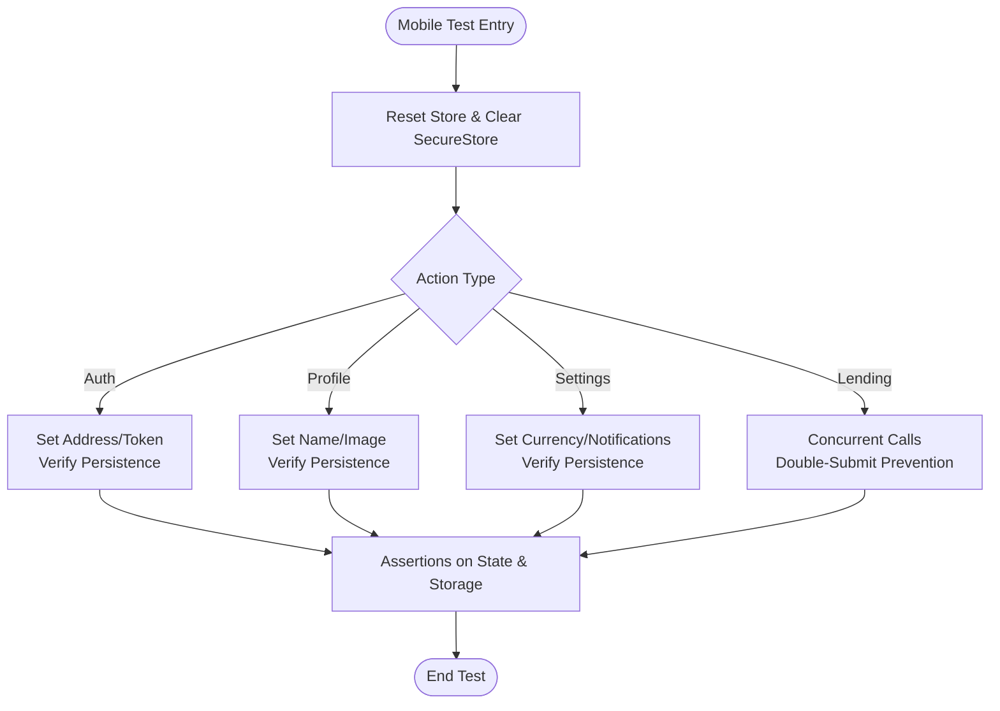
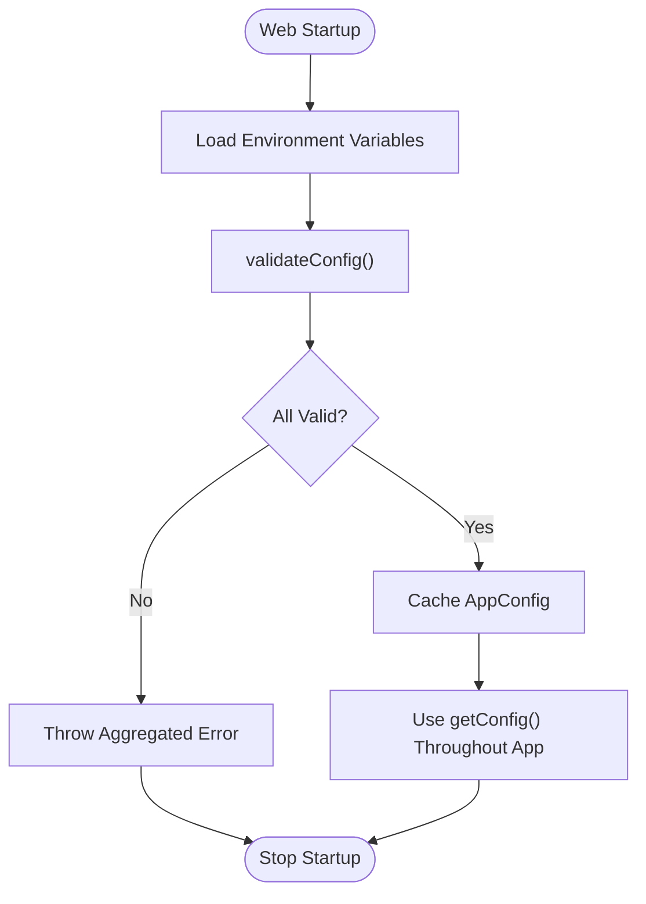
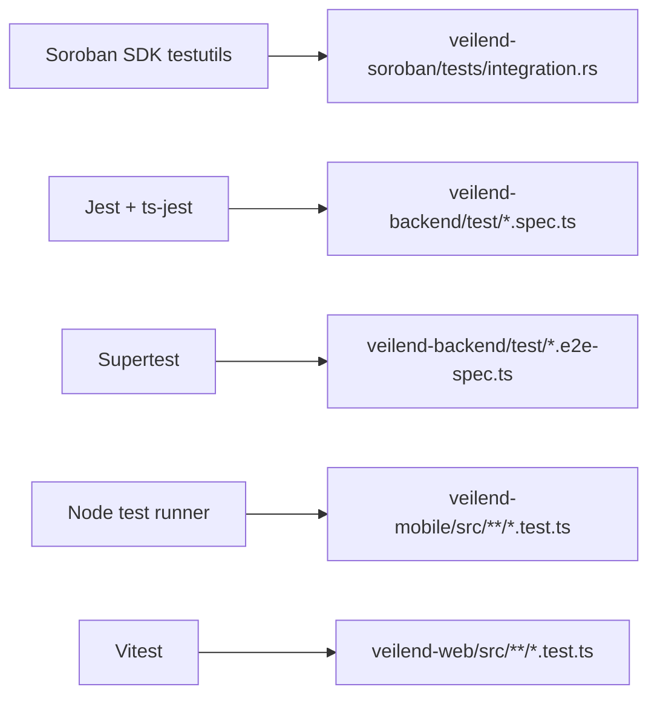

# Testing Strategy

<cite>
**Referenced Files in This Document**
- [Cargo.toml](file://veilend-soroban/Cargo.toml)
- [integration.rs](file://veilend-soroban/tests/integration.rs)
- [test_snapshots directory](file://veilend-soroban/test_snapshots)
- [package.json (backend)](file://veilend-backend/package.json)
- [jest-e2e.json](file://veilend-backend/test/jest-e2e.json)
- [app.e2e-spec.ts](file://veilend-backend/test/app.e2e-spec.ts)
- [store.test.ts](file://veilend-mobile/src/store/store.test.ts)
- [errorReporting.test.ts](file://veilend-mobile/src/utils/errorReporting.test.ts)
- [protocolStatus.test.ts](file://veilend-mobile/src/utils/protocolStatus.test.ts)
- [package.json (web)](file://veilend-web/package.json)
- [config-validation.ts](file://veilend-web/src/lib/config-validation.ts)
</cite>

## Table of Contents
1. Introduction
2. Project Structure
3. Core Components
4. Architecture Overview
5. Detailed Component Analysis
6. Dependency Analysis
7. Performance Considerations
8. Troubleshooting Guide
9. Conclusion
10. Appendices

## Introduction
This document defines the VeilLend testing strategy to ensure code quality and reliability across smart contracts, backend services, mobile app, and web application. It covers unit testing for Soroban contracts using the Soroban SDK, component tests for mobile and web, integration tests for backend services, test organization, mocking strategies, continuous integration practices, and QA processes. The guidance uses terminology consistent with the codebase: contract testing, component tests, integration tests, and test snapshots.

## Project Structure
VeilLend is organized into four primary layers with dedicated testing approaches per layer:
- Smart contracts (Soroban): Unit and integration tests with Soroban SDK and test snapshots.
- Backend (NestJS): Unit tests via Jest and end-to-end integration tests via Supertest.
- Mobile (Expo/React Native): Unit/component tests using Node test runner and assertions; mocks for secure storage.
- Web (Next.js/Vitest): Unit tests via Vitest and configuration validation at startup.

**Diagram sources**
- [integration.rs:1-461](file://veilend-soroban/tests/integration.rs#L1-L461)
- [package.json (backend):8-23](file://veilend-backend/package.json#L8-L23)
- [jest-e2e.json:1-10](file://veilend-backend/test/jest-e2e.json#L1-L10)
- [app.e2e-spec.ts:1-30](file://veilend-backend/test/app.e2e-spec.ts#L1-L30)
- [package.json (web):5-13](file://veilend-web/package.json#L5-L13)
- [config-validation.ts:74-154](file://veilend-web/src/lib/config-validation.ts#L74-L154)

**Section sources**
- [integration.rs:1-461](file://veilend-soroban/tests/integration.rs#L1-L461)
- [package.json (backend):8-23](file://veilend-backend/package.json#L8-L23)
- [jest-e2e.json:1-10](file://veilend-backend/test/jest-e2e.json#L1-L10)
- [app.e2e-spec.ts:1-30](file://veilend-backend/test/app.e2e-spec.ts#L1-L30)
- [package.json (web):5-13](file://veilend-web/package.json#L5-L13)
- [config-validation.ts:74-154](file://veilend-web/src/lib/config-validation.ts#L74-L154)

## Core Components
- Contract testing (Soroban): Tests use the Soroban SDK’s Env to register the contract, mock authentication, and assert state transitions, caps, circuit breaker behavior, interest accrual, and idempotency. Test snapshots capture emitted events and ledger state changes for regression safety.
- Backend integration tests: NestJS e2e tests spin up a full application module and exercise HTTP endpoints with Supertest.
- Mobile component tests: Store logic, persistence, error reporting, and protocol status banners are validated with strict assertions and mocked secure storage.
- Web configuration validation: Startup-time environment validation ensures correct network and API settings before runtime.

**Section sources**
- [integration.rs:1-461](file://veilend-soroban/tests/integration.rs#L1-L461)
- [package.json (backend):8-23](file://veilend-backend/package.json#L8-L23)
- [store.test.ts:1-266](file://veilend-mobile/src/store/store.test.ts#L1-L266)
- [errorReporting.test.ts:1-111](file://veilend-mobile/src/utils/errorReporting.test.ts#L1-L111)
- [protocolStatus.test.ts:1-51](file://veilend-mobile/src/utils/protocolStatus.test.ts#L1-L51)
- [config-validation.ts:74-154](file://veilend-web/src/lib/config-validation.ts#L74-L154)

## Architecture Overview
The testing architecture spans multiple layers with clear boundaries and tooling:
- Soroban contract tests run in an isolated environment with mocked auth and ledger time control.
- Backend e2e tests build a NestJS module and drive HTTP requests against it.
- Mobile tests validate store actions, persistence, and UI-related utilities using Node test runner.
- Web tests validate configuration and can be extended for component/unit tests via Vitest.

**Diagram sources**
- [integration.rs:1-461](file://veilend-soroban/tests/integration.rs#L1-L461)
- [test_snapshots directory](file://veilend-soroban/test_snapshots)

## Detailed Component Analysis

### Smart Contract Testing (Soroban)
- Environment setup: Tests create an Env instance, mock all authorizations, generate addresses, register the contract, and instantiate a client for method calls.
- Cap enforcement: Deposit and borrow operations enforce configured caps; exceeding caps triggers failures captured by panic catch patterns.
- Circuit breaker: Pausing prevents deposits/borrows while allowing repay/withdraw to reduce risk.
- Interest accrual: Time advancement via ledger timestamp controls accrual; tests verify supply/borrow index growth and conservation of value between suppliers and borrowers.
- Idempotency: Multiple accrual calls at the same timestamp must not change state.
- Test snapshots: Each test has a corresponding snapshot file capturing events and state changes to detect unintended regressions.

**Diagram sources**
- [integration.rs:21-83](file://veilend-soroban/tests/integration.rs#L21-L83)
- [integration.rs:85-127](file://veilend-soroban/tests/integration.rs#L85-L127)
- [integration.rs:283-342](file://veilend-soroban/tests/integration.rs#L283-L342)
- [integration.rs:423-460](file://veilend-soroban/tests/integration.rs#L423-L460)

**Section sources**
- [Cargo.toml:11-15](file://veilend-soroban/Cargo.toml#L11-L15)
- [integration.rs:1-461](file://veilend-soroban/tests/integration.rs#L1-L461)
- [test_snapshots directory](file://veilend-soroban/test_snapshots)

### Backend Integration Tests (NestJS)
- E2E configuration: Jest e2e config targets .e2e-spec.ts files under test/.
- Application bootstrap: Tests compile a TestingModule with AppModule and initialize the Nest application.
- HTTP assertions: Supertest sends requests and asserts status codes and responses.

**Diagram sources**
- [package.json (backend):8-23](file://veilend-backend/package.json#L8-L23)
- [jest-e2e.json:1-10](file://veilend-backend/test/jest-e2e.json#L1-L10)
- [app.e2e-spec.ts:1-30](file://veilend-backend/test/app.e2e-spec.ts#L1-L30)

**Section sources**
- [package.json (backend):8-23](file://veilend-backend/package.json#L8-L23)
- [jest-e2e.json:1-10](file://veilend-backend/test/jest-e2e.json#L1-L10)
- [app.e2e-spec.ts:1-30](file://veilend-backend/test/app.e2e-spec.ts#L1-L30)

### Mobile Component Tests
- Store persistence: Tests verify address, authToken, profile customization, privacy mode, currency, and notifications persistence via a mocked SecureStoreShim.
- Double-submit prevention: Concurrent calls to deposit/borrow/repay/withdraw are blocked after the first execution to prevent duplicate transactions.
- Error reporting: PII scrubbing, severity classification, and structured report creation are validated.
- Protocol status banners: Banners are reported based on wallet connectivity, network mismatch, and sync lag conditions.

**Diagram sources**
- [store.test.ts:1-266](file://veilend-mobile/src/store/store.test.ts#L1-L266)
- [errorReporting.test.ts:1-111](file://veilend-mobile/src/utils/errorReporting.test.ts#L1-L111)
- [protocolStatus.test.ts:1-51](file://veilend-mobile/src/utils/protocolStatus.test.ts#L1-L51)

**Section sources**
- [store.test.ts:1-266](file://veilend-mobile/src/store/store.test.ts#L1-L266)
- [errorReporting.test.ts:1-111](file://veilend-mobile/src/utils/errorReporting.test.ts#L1-L111)
- [protocolStatus.test.ts:1-51](file://veilend-mobile/src/utils/protocolStatus.test.ts#L1-L51)

### Web Configuration Validation
- Startup validation: Environment variables for Stellar network, Horizon URL, passphrase, and API URL are validated with safe defaults for local development.
- Error aggregation: All validation errors are collected and thrown together to guide quick fixes.
- Typed config: A cached AppConfig is exposed for safe access throughout the app.

**Diagram sources**
- [config-validation.ts:74-154](file://veilend-web/src/lib/config-validation.ts#L74-L154)

**Section sources**
- [config-validation.ts:74-154](file://veilend-web/src/lib/config-validation.ts#L74-L154)

## Dependency Analysis
Testing dependencies and tooling:
- Soroban contract tests depend on Soroban SDK testutils for Env, Address, Ledger helpers, and test utilities.
- Backend tests depend on Jest, ts-jest, and Supertest for HTTP assertions.
- Mobile tests rely on Node test runner and strict assertions; they mock secure storage to isolate persistence logic.
- Web tests leverage Vitest and configuration validation utilities.

**Diagram sources**
- [Cargo.toml:11-15](file://veilend-soroban/Cargo.toml#L11-L15)
- [package.json (backend):50-91](file://veilend-backend/package.json#L50-L91)
- [package.json (web):28-41](file://veilend-web/package.json#L28-L41)

**Section sources**
- [Cargo.toml:11-15](file://veilend-soroban/Cargo.toml#L11-L15)
- [package.json (backend):50-91](file://veilend-backend/package.json#L50-L91)
- [package.json (web):28-41](file://veilend-web/package.json#L28-L41)

## Performance Considerations
- Contract tests: Use minimal ledger time advances and targeted accrual calls to keep tests fast; leverage snapshots to avoid expensive re-comparisons.
- Backend e2e tests: Keep modules minimal and reuse shared fixtures; prefer in-memory or lightweight test databases where possible.
- Mobile tests: Mock asynchronous persistence and network calls to ensure deterministic performance; batch assertions to reduce flakiness.
- Web tests: Validate configuration once at startup; avoid heavy DOM interactions in unit tests.

[No sources needed since this section provides general guidance]

## Troubleshooting Guide
- Soroban contract tests:
  - If cap enforcement fails unexpectedly, verify asset configuration and oracle price setup prior to deposit/borrow.
  - For circuit breaker issues, ensure pause/unpause flows are authorized and that repay/withdraw remain allowed when paused.
  - Use test snapshots to identify unexpected event emissions or state changes.
- Backend e2e tests:
  - Ensure AppModule imports are correct and the Nest application initializes fully before sending requests.
  - Check Supertest assertions for expected status codes and response bodies.
- Mobile tests:
  - Confirm SecureStoreShim is cleared between tests to avoid cross-test pollution.
  - Validate double-submit prevention by simulating concurrent calls and asserting only one executes.
  - For error reporting, ensure PII scrubbing replaces sensitive keys and tokens.
- Web configuration:
  - If startup fails, review aggregated validation errors and fix environment variables accordingly.

**Section sources**
- [integration.rs:21-83](file://veilend-soroban/tests/integration.rs#L21-L83)
- [integration.rs:85-127](file://veilend-soroban/tests/integration.rs#L85-L127)
- [app.e2e-spec.ts:1-30](file://veilend-backend/test/app.e2e-spec.ts#L1-L30)
- [store.test.ts:1-266](file://veilend-mobile/src/store/store.test.ts#L1-L266)
- [errorReporting.test.ts:1-111](file://veilend-mobile/src/utils/errorReporting.test.ts#L1-L111)
- [config-validation.ts:74-154](file://veilend-web/src/lib/config-validation.ts#L74-L154)

## Conclusion
VeilLend’s testing strategy combines robust contract testing with Soroban SDK, comprehensive backend integration tests, and thorough mobile/web component tests. Test snapshots protect against regressions in smart contract events and state. Consistent tooling and clear separation of concerns enable reliable CI pipelines and maintain high code quality across the lending protocol.

[No sources needed since this section summarizes without analyzing specific files]

## Appendices

### Developer Guidance: Writing Tests
- Soroban contract testing:
  - Always set up Env, mock_all_auths(), configure assets and oracle prices before operations.
  - Use ledger timestamp manipulation to test accrual and interest growth deterministically.
  - Capture and compare test snapshots for events and state changes.
- Backend integration tests:
  - Build a TestingModule with required imports; initialize the Nest application before making HTTP requests.
  - Use Supertest to assert status codes and response payloads.
- Mobile component tests:
  - Reset store state and clear secure storage between tests.
  - Simulate concurrent calls to validate double-submit prevention.
  - Validate error reporting includes PII scrubbing and severity classification.
- Web configuration:
  - Validate environment variables at startup; provide actionable error messages for missing or invalid values.

**Section sources**
- [integration.rs:1-461](file://veilend-soroban/tests/integration.rs#L1-L461)
- [app.e2e-spec.ts:1-30](file://veilend-backend/test/app.e2e-spec.ts#L1-L30)
- [store.test.ts:1-266](file://veilend-mobile/src/store/store.test.ts#L1-L266)
- [errorReporting.test.ts:1-111](file://veilend-mobile/src/utils/errorReporting.test.ts#L1-L111)
- [config-validation.ts:74-154](file://veilend-web/src/lib/config-validation.ts#L74-L154)

### Quality Assurance Processes
- Maintain separate test suites per layer:
  - Contract tests in veilend-soroban/tests with snapshots in veilend-soroban/test_snapshots.
  - Backend unit and e2e tests in veilend-backend/src and veilend-backend/test.
  - Mobile tests co-located with source under veilend-mobile/src/**.test.ts.
  - Web tests under veilend-web/src/**.test.ts.
- Enforce coverage thresholds in CI for backend unit tests.
- Run Soroban contract tests and snapshot comparisons on every commit.
- Validate web configuration at build/startup to fail fast on misconfiguration.

**Section sources**
- [package.json (backend):78-91](file://veilend-backend/package.json#L78-L91)
- [jest-e2e.json:1-10](file://veilend-backend/test/jest-e2e.json#L1-L10)
- [test_snapshots directory](file://veilend-soroban/test_snapshots)
- [config-validation.ts:74-154](file://veilend-web/src/lib/config-validation.ts#L74-L154)