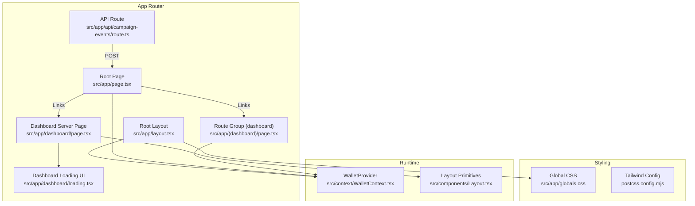
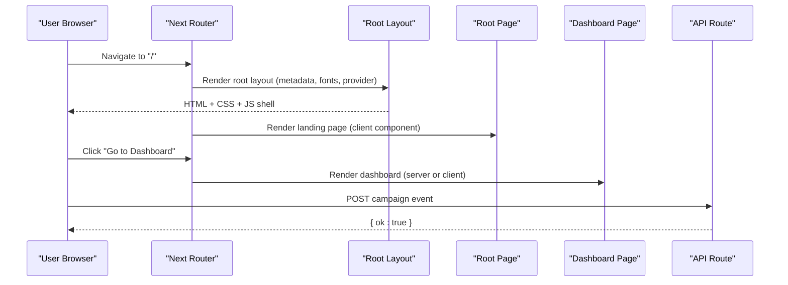
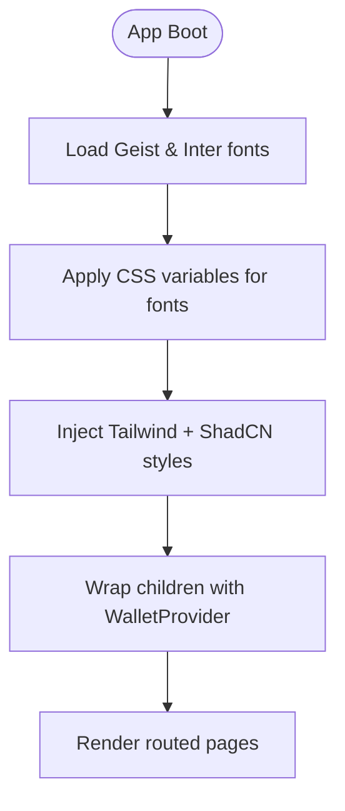
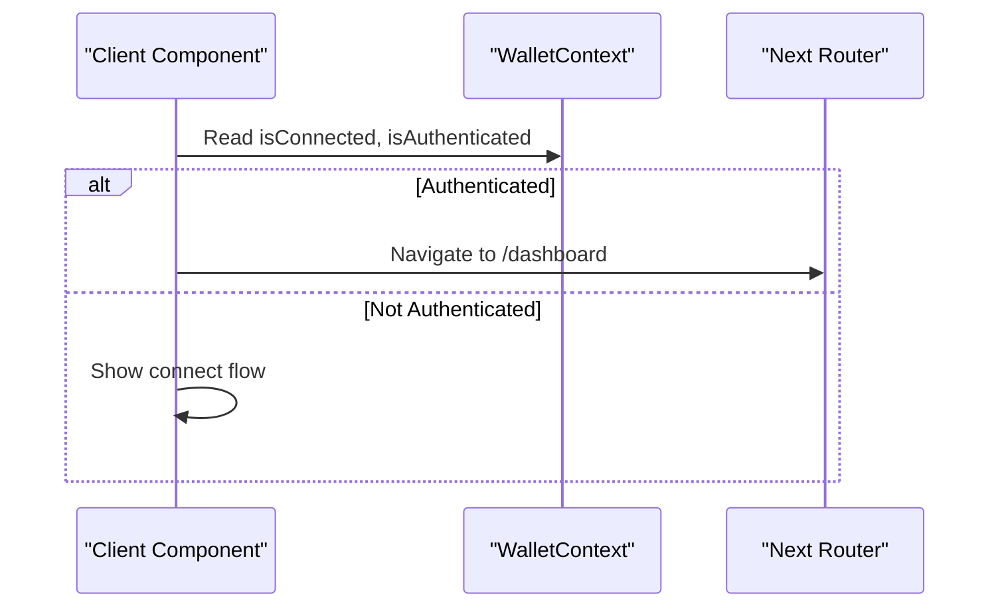
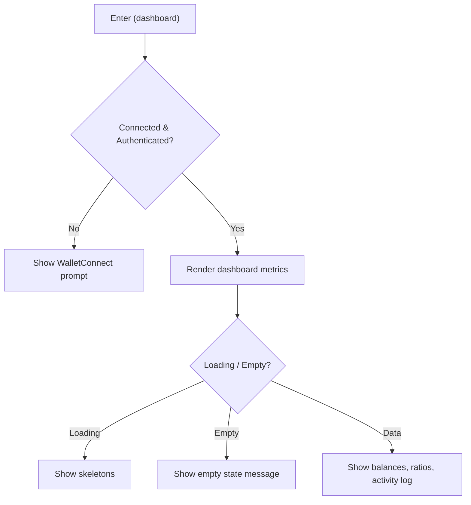
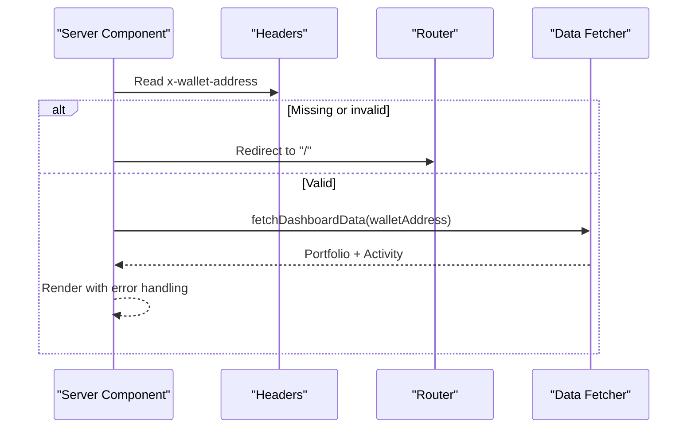
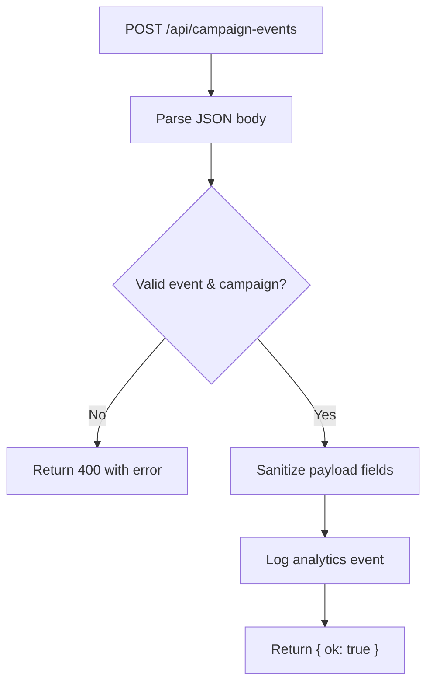
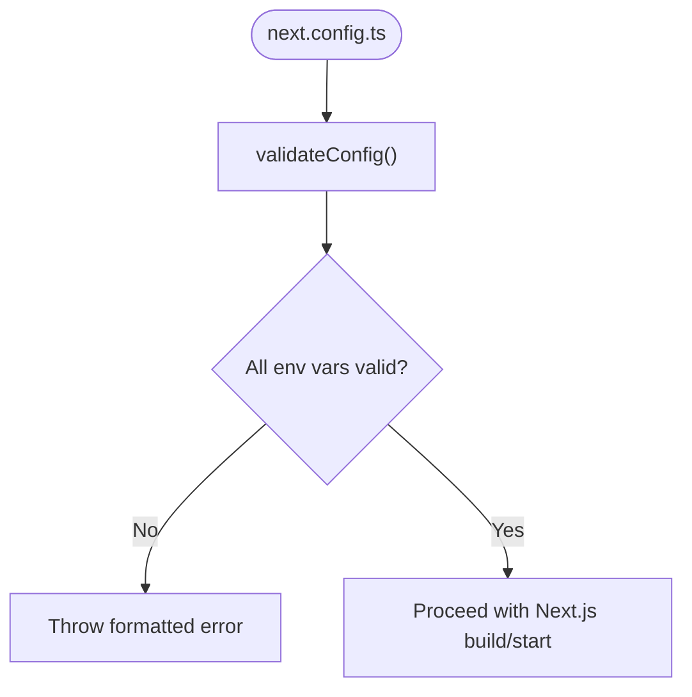
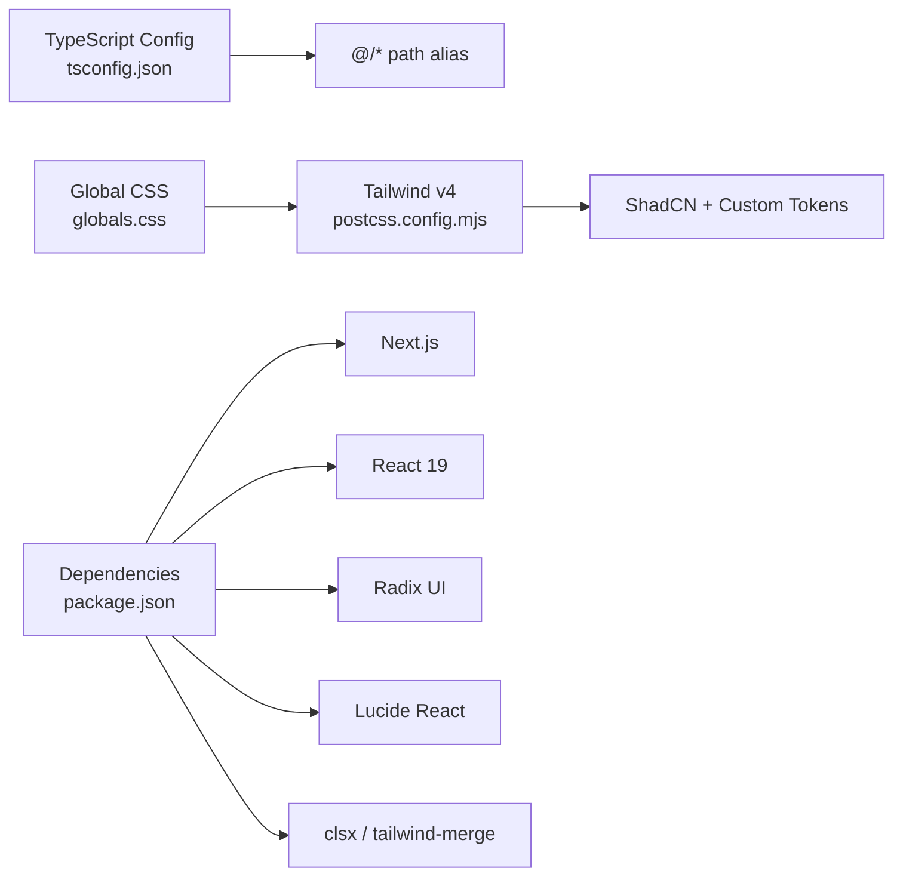

# App Architecture & Routing

<cite>
**Referenced Files in This Document**
- [layout.tsx](file://veilend-web/src/app/layout.tsx)
- [page.tsx](file://veilend-web/src/app/page.tsx)
- [globals.css](file://veilend-web/src/app/globals.css)
- [next.config.ts](file://veilend-web/next.config.ts)
- [package.json](file://veilend-web/package.json)
- [tsconfig.json](file://veilend-web/tsconfig.json)
- [postcss.config.mjs](file://veilend-web/postcss.config.mjs)
- [WalletContext.tsx](file://veilend-web/src/context/WalletContext.tsx)
- [Layout.tsx](file://veilend-web/src/components/Layout.tsx)
- [(dashboard)/page.tsx](file://veilend-web/src/app/(dashboard)/page.tsx)
- [dashboard/page.tsx](file://veilend-web/src/app/dashboard/page.tsx)
- [dashboard/loading.tsx](file://veilend-web/src/app/dashboard/loading.tsx)
- [api/campaign-events/route.ts](file://veilend-web/src/app/api/campaign-events/route.ts)
- [lib/config-validation.ts](file://veilend-web/src/lib/config-validation.ts)
</cite>

## Table of Contents
1. [Introduction](#introduction)
2. [Project Structure](#project-structure)
3. [Core Components](#core-components)
4. [Architecture Overview](#architecture-overview)
5. [Detailed Component Analysis](#detailed-component-analysis)
6. [Dependency Analysis](#dependency-analysis)
7. [Performance Considerations](#performance-considerations)
8. [Troubleshooting Guide](#troubleshooting-guide)
9. [Conclusion](#conclusion)

## Introduction
This document explains the VeilLend web application architecture built with Next.js App Router. It covers the root layout, metadata configuration, font optimization using Geist and Inter, global CSS integration, app directory structure (including dashboard routes and API routes), component organization patterns, server vs client components, route groups, layout composition, metadata inheritance, and performance considerations such as font loading strategies, code splitting, and bundle optimization. It also documents Tailwind CSS integration, TypeScript configuration, and the development workflow.

## Project Structure
The application follows Next.js App Router conventions under src/app:
- Root layout defines global HTML, fonts, theme variables, and providers.
- The root page serves a marketing-style landing experience.
- A route group (dashboard) provides an interactive client-side dashboard.
- A separate dashboard route demonstrates server-side data fetching and redirects based on authentication context.
- An API route handles campaign analytics events with strict validation and sanitization.
- Global styles integrate Tailwind v4, ShadCN theming, and custom design tokens.

**Diagram sources**
- [layout.tsx:1-39](file://veilend-web/src/app/layout.tsx#L1-L39)
- [page.tsx:1-340](file://veilend-web/src/app/page.tsx#L1-L340)
- [(dashboard)/page.tsx:1-302](file://veilend-web/src/app/(dashboard)/page.tsx#L1-L302)
- [dashboard/page.tsx:1-294](file://veilend-web/src/app/dashboard/page.tsx#L1-L294)
- [dashboard/loading.tsx:1-101](file://veilend-web/src/app/dashboard/loading.tsx#L1-L101)
- [api/campaign-events/route.ts:1-86](file://veilend-web/src/app/api/campaign-events/route.ts#L1-L86)
- [globals.css:1-161](file://veilend-web/src/app/globals.css#L1-L161)
- [postcss.config.mjs:1-8](file://veilend-web/postcss.config.mjs#L1-L8)
- [WalletContext.tsx:1-24](file://veilend-web/src/context/WalletContext.tsx#L1-L24)
- [Layout.tsx:1-219](file://veilend-web/src/components/Layout.tsx#L1-L219)

**Section sources**
- [layout.tsx:1-39](file://veilend-web/src/app/layout.tsx#L1-L39)
- [page.tsx:1-340](file://veilend-web/src/app/page.tsx#L1-L340)
- [(dashboard)/page.tsx:1-302](file://veilend-web/src/app/(dashboard)/page.tsx#L1-L302)
- [dashboard/page.tsx:1-294](file://veilend-web/src/app/dashboard/page.tsx#L1-L294)
- [dashboard/loading.tsx:1-101](file://veilend-web/src/app/dashboard/loading.tsx#L1-L101)
- [api/campaign-events/route.ts:1-86](file://veilend-web/src/app/api/campaign-events/route.ts#L1-L86)
- [globals.css:1-161](file://veilend-web/src/app/globals.css#L1-L161)
- [postcss.config.mjs:1-8](file://veilend-web/postcss.config.mjs#L1-L8)
- [WalletContext.tsx:1-24](file://veilend-web/src/context/WalletContext.tsx#L1-L24)
- [Layout.tsx:1-219](file://veilend-web/src/components/Layout.tsx#L1-L219)

## Core Components
- Root layout: Declares global metadata, imports Google Fonts (Geist Sans/Mono and Inter), applies CSS variables for fonts, and wraps children with WalletProvider.
- Global CSS: Integrates Tailwind v4 via @import, defines design tokens, maps theme variables to CSS variables, and sets base typography and colors.
- Wallet provider: Provides wallet state/actions to client components via React Context.
- Layout primitives: Reusable Container, Section, Flex, Grid components used by server-rendered pages.

Key implementation highlights:
- Font variables are applied to html/body classes to enable consistent typography across the app.
- Theme variables in globals.css map to Tailwind’s theme system for consistent styling.
- Client-only features (wallet interactions, animations) are isolated in 'use client' pages and components.

**Section sources**
- [layout.tsx:1-39](file://veilend-web/src/app/layout.tsx#L1-L39)
- [globals.css:1-161](file://veilend-web/src/app/globals.css#L1-L161)
- [WalletContext.tsx:1-24](file://veilend-web/src/context/WalletContext.tsx#L1-L24)
- [Layout.tsx:1-219](file://veilend-web/src/components/Layout.tsx#L1-L219)

## Architecture Overview
The app uses Next.js App Router with a clear separation between server and client boundaries:
- Server components render static or data-fetched content efficiently.
- Client components handle interactivity like wallet connections and live updates.
- Route groups organize feature-specific layouts without affecting URLs.
- API routes provide secure endpoints for analytics and future integrations.

**Diagram sources**
- [layout.tsx:1-39](file://veilend-web/src/app/layout.tsx#L1-L39)
- [page.tsx:1-340](file://veilend-web/src/app/page.tsx#L1-L340)
- [dashboard/page.tsx:1-294](file://veilend-web/src/app/dashboard/page.tsx#L1-L294)
- [api/campaign-events/route.ts:1-86](file://veilend-web/src/app/api/campaign-events/route.ts#L1-L86)

## Detailed Component Analysis

### Root Layout and Metadata
- Metadata: Title and description are defined at the root level, providing SEO-friendly defaults inherited by child pages unless overridden.
- Fonts: Geist Sans and Mono plus Inter are loaded via next/font/google and exposed as CSS variables for Tailwind usage.
- Providers: WalletProvider wraps all routes to supply wallet state to client components.
- Global styles: Tailwind v4 is imported through globals.css, which also configures dark mode variants and theme tokens.

**Diagram sources**
- [layout.tsx:1-39](file://veilend-web/src/app/layout.tsx#L1-L39)
- [globals.css:1-161](file://veilend-web/src/app/globals.css#L1-L161)

**Section sources**
- [layout.tsx:1-39](file://veilend-web/src/app/layout.tsx#L1-L39)
- [globals.css:1-161](file://veilend-web/src/app/globals.css#L1-L161)

### Landing Page (Client Component)
- Marked as a client component to support interactivity (wallet connection, timers, dynamic states).
- Uses shadcn/ui primitives and Tailwind utilities for layout and styling.
- Navigates to protected areas after successful wallet authentication.

**Diagram sources**
- [page.tsx:1-340](file://veilend-web/src/app/page.tsx#L1-L340)
- [WalletContext.tsx:1-24](file://veilend-web/src/context/WalletContext.tsx#L1-L24)

**Section sources**
- [page.tsx:1-340](file://veilend-web/src/app/page.tsx#L1-L340)
- [WalletContext.tsx:1-24](file://veilend-web/src/context/WalletContext.tsx#L1-L24)

### Dashboard Route Group (Client Component)
- Located under src/app/(dashboard)/page.tsx, this route group isolates dashboard-related routes without impacting URL paths.
- Enforces wallet authentication before rendering dashboard content.
- Demonstrates loading and empty states with skeleton UIs and conditional rendering.

**Diagram sources**
- [(dashboard)/page.tsx:1-302](file://veilend-web/src/app/(dashboard)/page.tsx#L1-L302)

**Section sources**
- [(dashboard)/page.tsx:1-302](file://veilend-web/src/app/(dashboard)/page.tsx#L1-L302)

### Dashboard Server Page
- Server component that fetches data and enforces authentication via headers; redirects if not authenticated.
- Uses layout primitives from src/components/Layout.tsx for consistent structure.
- Includes a dedicated loading UI file for progressive enhancement.

**Diagram sources**
- [dashboard/page.tsx:1-294](file://veilend-web/src/app/dashboard/page.tsx#L1-L294)
- [dashboard/loading.tsx:1-101](file://veilend-web/src/app/dashboard/loading.tsx#L1-L101)

**Section sources**
- [dashboard/page.tsx:1-294](file://veilend-web/src/app/dashboard/page.tsx#L1-L294)
- [dashboard/loading.tsx:1-101](file://veilend-web/src/app/dashboard/loading.tsx#L1-L101)

### API Route: Campaign Events
- Accepts POST requests with a typed payload and validates event names and campaign identifiers.
- Sanitizes user-provided fields to prevent injection and enforce length limits.
- Logs analytics events and returns a success response.

**Diagram sources**
- [api/campaign-events/route.ts:1-86](file://veilend-web/src/app/api/campaign-events/route.ts#L1-L86)

**Section sources**
- [api/campaign-events/route.ts:1-86](file://veilend-web/src/app/api/campaign-events/route.ts#L1-L86)

### Configuration and Environment Validation
- Startup validation ensures required environment variables are present and valid before Next.js continues initialization.
- Provides safe defaults for local development and throws a comprehensive error listing all issues when misconfigured.

**Diagram sources**
- [next.config.ts:1-20](file://veilend-web/next.config.ts#L1-L20)
- [lib/config-validation.ts:1-174](file://veilend-web/src/lib/config-validation.ts#L1-L174)

**Section sources**
- [next.config.ts:1-20](file://veilend-web/next.config.ts#L1-L20)
- [lib/config-validation.ts:1-174](file://veilend-web/src/lib/config-validation.ts#L1-L174)

## Dependency Analysis
- Styling stack: Tailwind v4 via PostCSS plugin, ShadCN themes, and custom CSS variables mapped into Tailwind’s theme.
- Runtime dependencies: React 19, Next.js 16, Radix UI primitives, Lucide icons, class-variance-authority, clsx, tailwind-merge, tw-animate-css.
- Development tooling: TypeScript with path aliases (@/*), ESLint, Prettier, Vitest for testing.

**Diagram sources**
- [tsconfig.json:1-35](file://veilend-web/tsconfig.json#L1-L35)
- [globals.css:1-161](file://veilend-web/src/app/globals.css#L1-L161)
- [postcss.config.mjs:1-8](file://veilend-web/postcss.config.mjs#L1-L8)
- [package.json:1-43](file://veilend-web/package.json#L1-L43)

**Section sources**
- [tsconfig.json:1-35](file://veilend-web/tsconfig.json#L1-L35)
- [globals.css:1-161](file://veilend-web/src/app/globals.css#L1-L161)
- [postcss.config.mjs:1-8](file://veilend-web/postcss.config.mjs#L1-L8)
- [package.json:1-43](file://veilend-web/package.json#L1-L43)

## Performance Considerations
- Font loading strategy:
  - Use next/font/google for Geist and Inter with subsets limited to latin to reduce payload size.
  - Expose fonts as CSS variables and apply via className to avoid runtime font switching overhead.
- Code splitting:
  - Client components are explicitly marked with 'use client', enabling Next.js to split bundles and load interactivity only where needed.
  - Server components render statically or fetch data on the server, reducing client-side work.
- Bundle optimization:
  - Import only necessary UI components from shadcn/ui and use utility libraries (clsx, tailwind-merge) to minimize runtime cost.
  - Keep global CSS scoped to essential layers and rely on Tailwind’s JIT compilation for unused style elimination.
- Network and caching:
  - Server pages can set dynamic behavior (e.g., force-dynamic) to control caching and revalidation strategies per route.
  - API routes validate and sanitize payloads early to avoid unnecessary processing.

[No sources needed since this section provides general guidance]

## Troubleshooting Guide
- Environment configuration errors:
  - If startup fails due to missing or invalid environment variables, consult the formatted error thrown by the configuration validator. Fix values in .env.local according to the provided instructions.
- Authentication redirects:
  - Server-side dashboard may redirect to the home page if no wallet address is detected in headers; ensure proper header propagation or session setup.
- API validation errors:
  - Campaign event POST requests must include a supported event name and correct campaign identifier; otherwise, a 400 error is returned.

**Section sources**
- [lib/config-validation.ts:1-174](file://veilend-web/src/lib/config-validation.ts#L1-L174)
- [dashboard/page.tsx:1-294](file://veilend-web/src/app/dashboard/page.tsx#L1-L294)
- [api/campaign-events/route.ts:1-86](file://veilend-web/src/app/api/campaign-events/route.ts#L1-L86)

## Conclusion
VeilLend’s web application leverages Next.js App Router to deliver a performant, type-safe, and maintainable frontend. The root layout centralizes metadata, fonts, and providers; global CSS integrates Tailwind v4 and ShadCN theming; and the app directory organizes routes with clear separation between server and client concerns. Route groups encapsulate feature-specific layouts, while API routes enforce strict validation and sanitization. With careful font loading, code splitting, and environment validation, the application achieves strong performance and developer ergonomics.