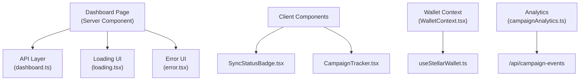
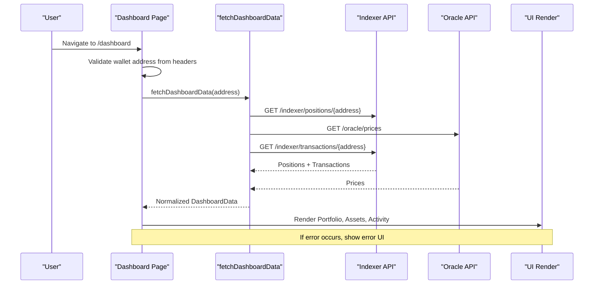
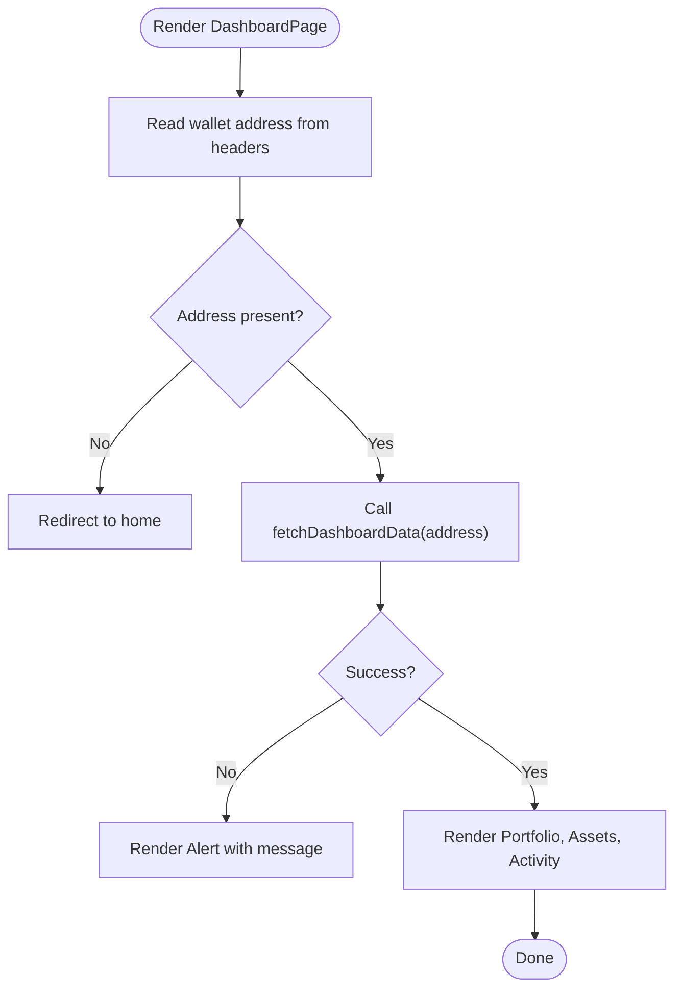
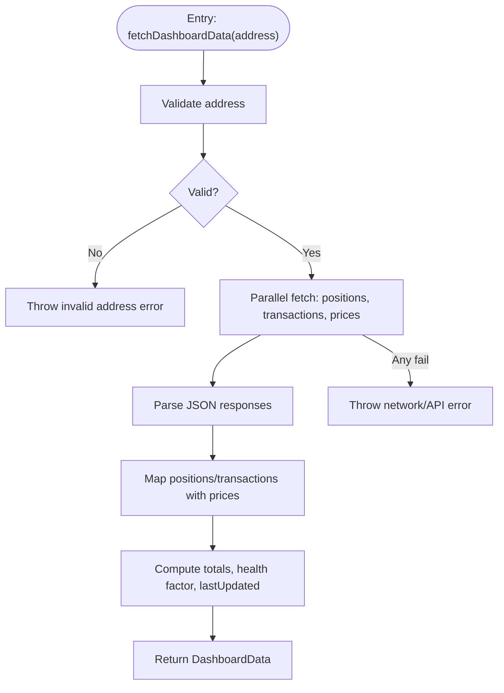
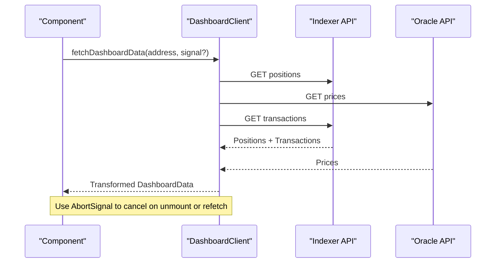
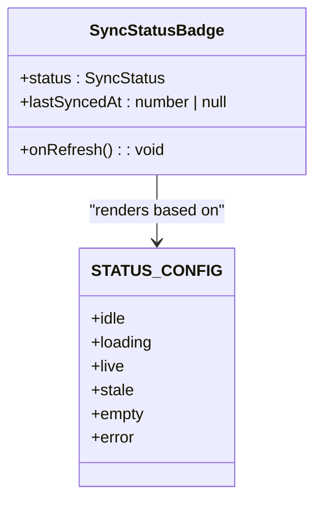
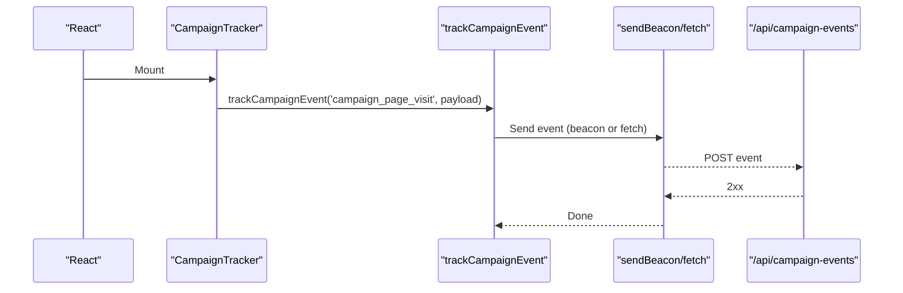
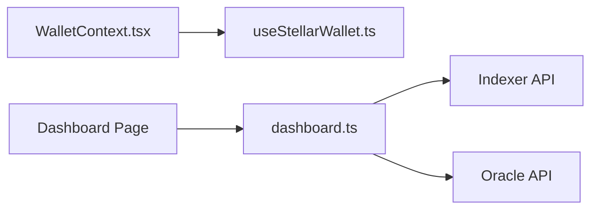
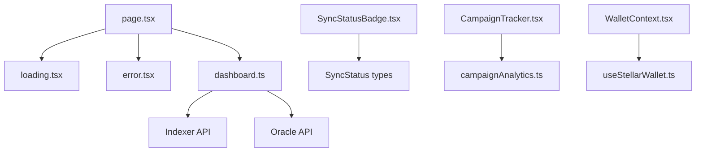

# Dashboard & User Interface

<cite>
**Referenced Files in This Document**
- [page.tsx](file://veilend-web/src/app/dashboard/page.tsx)
- [loading.tsx](file://veilend-web/src/app/dashboard/loading.tsx)
- [error.tsx](file://veilend-web/src/app/dashboard/error.tsx)
- [dashboard.ts](file://veilend-web/src/lib/api/dashboard.ts)
- [dashboard-client.ts](file://veilend-web/src/lib/api/dashboard-client.ts)
- [SyncStatusBadge.tsx](file://veilend-web/src/components/SyncStatusBadge.tsx)
- [CampaignTracker.tsx](file://veilend-web/src/components/CampaignTracker.tsx)
- [WalletContext.tsx](file://veilend-web/src/context/WalletContext.tsx)
- [useStellarWallet.ts](file://veilend-web/src/hooks/useStellarWallet.ts)
- [campaignAnalytics.ts](file://veilend-web/src/lib/campaignAnalytics.ts)
</cite>

## Table of Contents
1. [Introduction](#introduction)
2. [Project Structure](#project-structure)
3. [Core Components](#core-components)
4. [Architecture Overview](#architecture-overview)
5. [Detailed Component Analysis](#detailed-component-analysis)
6. [Dependency Analysis](#dependency-analysis)
7. [Performance Considerations](#performance-considerations)
8. [Troubleshooting Guide](#troubleshooting-guide)
9. [Conclusion](#conclusion)

## Introduction
This document explains the VeilLend dashboard user interface with a focus on page structure, loading states, error handling, and real-time data synchronization. It covers how the dashboard fetches live portfolio and activity data, displays blockchain sync status, integrates analytics, and interacts with wallet context and protocol data services. The guide includes concrete references to the codebase so both beginners and experienced developers can understand and extend the dashboard effectively.

## Project Structure
The dashboard is implemented as a Next.js app route with dedicated server-side rendering for data fetching, plus client components for interactive features like sync status and analytics tracking.

**Diagram sources**
- [page.tsx:54-98](file://veilend-web/src/app/dashboard/page.tsx#L54-L98)
- [dashboard.ts:31-160](file://veilend-web/src/lib/api/dashboard.ts#L31-L160)
- [loading.tsx:5-100](file://veilend-web/src/app/dashboard/loading.tsx#L5-L100)
- [error.tsx:14-80](file://veilend-web/src/app/dashboard/error.tsx#L14-L80)
- [SyncStatusBadge.tsx:18-53](file://veilend-web/src/components/SyncStatusBadge.tsx#L18-L53)
- [CampaignTracker.tsx:6-13](file://veilend-web/src/components/CampaignTracker.tsx#L6-L13)
- [WalletContext.tsx:10-22](file://veilend-web/src/context/WalletContext.tsx#L10-L22)
- [useStellarWallet.ts:23-121](file://veilend-web/src/hooks/useStellarWallet.ts#L23-L121)
- [campaignAnalytics.ts:25-57](file://veilend-web/src/lib/campaignAnalytics.ts#L25-L57)

**Section sources**
- [page.tsx:54-98](file://veilend-web/src/app/dashboard/page.tsx#L54-L98)
- [loading.tsx:5-100](file://veilend-web/src/app/dashboard/loading.tsx#L5-L100)
- [error.tsx:14-80](file://veilend-web/src/app/dashboard/error.tsx#L14-L80)

## Core Components
- Dashboard Page (server component): Validates wallet presence via headers, fetches portfolio and recent activity, handles errors, and renders cards for balances, assets, and activity.
- API Layer: Parallelizes indexer and oracle calls, normalizes data, computes USD values and health factor, and returns a consistent shape.
- Client Sync Status Badge: Displays live/stale/idle/error states with relative timestamps and optional refresh action.
- Campaign Tracker: Emits page visit events using sendBeacon or fetch fallback.
- Wallet Context: Provides wallet state and actions across the app; used by client components that need connection status.

Key responsibilities:
- Data fetching strategy and caching hints for near-real-time updates.
- Error boundaries and user-friendly messaging.
- Lightweight analytics integration without blocking UI.

**Section sources**
- [page.tsx:54-98](file://veilend-web/src/app/dashboard/page.tsx#L54-L98)
- [dashboard.ts:31-160](file://veilend-web/src/lib/api/dashboard.ts#L31-L160)
- [SyncStatusBadge.tsx:18-53](file://veilend-web/src/components/SyncStatusBadge.tsx#L18-L53)
- [CampaignTracker.tsx:6-13](file://veilend-web/src/components/CampaignTracker.tsx#L6-L13)
- [WalletContext.tsx:10-22](file://veilend-web/src/context/WalletContext.tsx#L10-L22)

## Architecture Overview
The dashboard uses a hybrid approach:
- Server-side data fetching for initial render with revalidation hints to keep data fresh.
- Client-side components for interactivity (sync status, analytics).
- Protocol data services (indexer and oracle) are called in parallel to minimize latency.

**Diagram sources**
- [page.tsx:54-98](file://veilend-web/src/app/dashboard/page.tsx#L54-L98)
- [dashboard.ts:31-160](file://veilend-web/src/lib/api/dashboard.ts#L31-L160)

## Detailed Component Analysis

### Dashboard Page (Server Component)
Responsibilities:
- Extracts wallet address from request headers and redirects if missing.
- Fetches dashboard data with try/catch and surfaces errors.
- Renders summary cards, asset breakdowns, and recent activity with formatting utilities.

Data flow:
- Calls fetchDashboardData with the wallet address.
- Uses default placeholders when data is unavailable to avoid layout shifts.
- Shows an alert on error and continues gracefully.

**Diagram sources**
- [page.tsx:54-98](file://veilend-web/src/app/dashboard/page.tsx#L54-L98)

**Section sources**
- [page.tsx:54-98](file://veilend-web/src/app/dashboard/page.tsx#L54-L98)

### API Layer: fetchDashboardData
Responsibilities:
- Validates Stellar address format.
- Performs parallel requests to positions, transactions, and oracle prices.
- Normalizes amounts, maps transaction types, computes USD values and health factor.
- Returns a consistent DashboardData object.

Optimization notes:
- Uses Promise.all for concurrency.
- Applies cache-control headers and revalidate hints to balance freshness and performance.
- Filters out zero-value activities and sorts by timestamp.

**Diagram sources**
- [dashboard.ts:31-160](file://veilend-web/src/lib/api/dashboard.ts#L31-L160)

**Section sources**
- [dashboard.ts:31-160](file://veilend-web/src/lib/api/dashboard.ts#L31-L160)

### Client-Side DashboardClient (for polling or advanced flows)
Responsibilities:
- Encapsulates fetch logic with AbortController support for cancellation.
- Combines external signals to cancel in-flight requests.
- Reuses transformation logic for consistency between server and client paths.

Use cases:
- Polling-based dashboards where you want to update UI without full reload.
- Integrating optimistic updates by temporarily adjusting local state before confirming server changes.

**Diagram sources**
- [dashboard-client.ts:18-69](file://veilend-web/src/lib/api/dashboard-client.ts#L18-L69)
- [dashboard-client.ts:90-187](file://veilend-web/src/lib/api/dashboard-client.ts#L90-L187)

**Section sources**
- [dashboard-client.ts:18-69](file://veilend-web/src/lib/api/dashboard-client.ts#L18-L69)
- [dashboard-client.ts:90-187](file://veilend-web/src/lib/api/dashboard-client.ts#L90-L187)

### SyncStatusBadge Component
Purpose:
- Visual indicator of sync state: idle, syncing, live, stale, no positions, offline.
- Shows relative time since last sync when applicable.
- Optional refresh button to trigger manual re-sync.

Integration points:
- Consumes a SyncStatus enum from position sync hooks.
- Can be wired into any section that depends on live data (e.g., positions list).

**Diagram sources**
- [SyncStatusBadge.tsx:18-53](file://veilend-web/src/components/SyncStatusBadge.tsx#L18-L53)
- [SyncStatusBadge.tsx:56-100](file://veilend-web/src/components/SyncStatusBadge.tsx#L56-L100)

**Section sources**
- [SyncStatusBadge.tsx:18-53](file://veilend-web/src/components/SyncStatusBadge.tsx#L18-L53)
- [SyncStatusBadge.tsx:56-100](file://veilend-web/src/components/SyncStatusBadge.tsx#L56-L100)

### CampaignTracker Component
Purpose:
- Tracks page visits for campaign analytics.
- Uses sendBeacon when available for reliable background delivery; falls back to fetch with keepalive.

Implementation notes:
- Runs once on mount.
- Sends payload including path and optional referrer/source.

**Diagram sources**
- [CampaignTracker.tsx:6-13](file://veilend-web/src/components/CampaignTracker.tsx#L6-L13)
- [campaignAnalytics.ts:25-57](file://veilend-web/src/lib/campaignAnalytics.ts#L25-L57)

**Section sources**
- [CampaignTracker.tsx:6-13](file://veilend-web/src/components/CampaignTracker.tsx#L6-L13)
- [campaignAnalytics.ts:25-57](file://veilend-web/src/lib/campaignAnalytics.ts#L25-L57)

### Wallet Context and Protocol Data Services
- WalletContext wraps useStellarWallet to provide wallet state and actions globally.
- The dashboard page reads wallet identity from headers during SSR; client components can use the context for connection-aware behavior.
- Protocol data services (indexer and oracle) are consumed by the API layer to compute portfolio metrics and recent activity.

**Diagram sources**
- [WalletContext.tsx:10-22](file://veilend-web/src/context/WalletContext.tsx#L10-L22)
- [useStellarWallet.ts:23-121](file://veilend-web/src/hooks/useStellarWallet.ts#L23-L121)
- [dashboard.ts:31-160](file://veilend-web/src/lib/api/dashboard.ts#L31-L160)

**Section sources**
- [WalletContext.tsx:10-22](file://veilend-web/src/context/WalletContext.tsx#L10-L22)
- [useStellarWallet.ts:23-121](file://veilend-web/src/hooks/useStellarWallet.ts#L23-L121)
- [dashboard.ts:31-160](file://veilend-web/src/lib/api/dashboard.ts#L31-L160)

## Dependency Analysis
- Dashboard Page depends on:
  - Layout and UI primitives for structure and presentation.
  - fetchDashboardData for data retrieval.
  - Loading and Error components for UX resilience.
- API Layer depends on:
  - Environment configuration for base URL.
  - Indexer endpoints for positions and transactions.
  - Oracle endpoint for price feeds.
- Client components depend on:
  - Analytics utility for event tracking.
  - Position sync hook types for badge states.

**Diagram sources**
- [page.tsx:54-98](file://veilend-web/src/app/dashboard/page.tsx#L54-L98)
- [dashboard.ts:31-160](file://veilend-web/src/lib/api/dashboard.ts#L31-L160)
- [SyncStatusBadge.tsx:18-53](file://veilend-web/src/components/SyncStatusBadge.tsx#L18-L53)
- [CampaignTracker.tsx:6-13](file://veilend-web/src/components/CampaignTracker.tsx#L6-L13)
- [WalletContext.tsx:10-22](file://veilend-web/src/context/WalletContext.tsx#L10-L22)
- [useStellarWallet.ts:23-121](file://veilend-web/src/hooks/useStellarWallet.ts#L23-L121)

**Section sources**
- [page.tsx:54-98](file://veilend-web/src/app/dashboard/page.tsx#L54-L98)
- [dashboard.ts:31-160](file://veilend-web/src/lib/api/dashboard.ts#L31-L160)

## Performance Considerations
- Parallel data fetching: The API layer uses concurrent requests to reduce total latency.
- Caching and revalidation: Cache-Control and revalidate hints help balance freshness with load.
- Data normalization: Transformations occur once per fetch to avoid redundant work.
- Pagination/slicing: Recent activity is limited to a reasonable slice to prevent large renders.
- Abortable requests: The client-side DashboardClient supports cancellation to avoid unnecessary work on rapid navigation or refetches.
- Optimistic updates: For write flows, consider updating local UI immediately and reconciling with server responses; ensure rollback on failure to maintain consistency.

[No sources needed since this section provides general guidance]

## Troubleshooting Guide
Common issues and resolutions:
- Network connectivity:
  - Symptoms: Errors mentioning fetch or network; dashboard shows error state.
  - Resolution: Verify backend availability, CORS, and environment variables. Retry with retry/backoff strategies in client polling flows.
- Data consistency:
  - Symptoms: Discrepancies between displayed balances and on-chain state.
  - Resolution: Ensure indexer is up-to-date; check revalidate intervals; confirm oracle prices are current.
- Large datasets:
  - Symptoms: Slow renders or memory spikes in activity lists.
  - Resolution: Limit items rendered; implement virtualization if necessary; paginate or filter by date.
- Wallet connection errors:
  - Symptoms: Auth-related messages or inability to load dashboard.
  - Resolution: Confirm wallet extension is installed and authenticated; verify header propagation for SSR.

Error UI highlights:
- Detects auth vs network errors and presents tailored messages.
- Offers “Try Again” and “Return Home” actions.

**Section sources**
- [error.tsx:14-80](file://veilend-web/src/app/dashboard/error.tsx#L14-L80)

## Conclusion
The VeilLend dashboard combines server-side data fetching with client-side interactivity to deliver a responsive, informative experience. The API layer ensures efficient, normalized data delivery, while components like SyncStatusBadge and CampaignTracker enhance user feedback and analytics. By following the patterns outlined here—parallel fetching, robust error handling, and thoughtful performance tuning—you can build similar dashboards that remain fast, reliable, and user-friendly under varying network conditions and data loads.