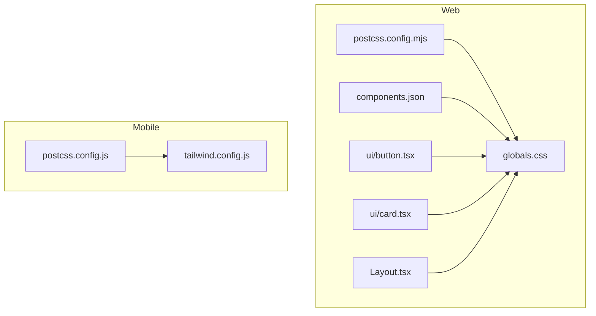
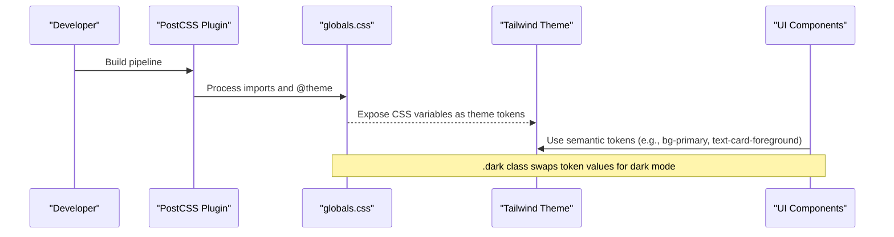
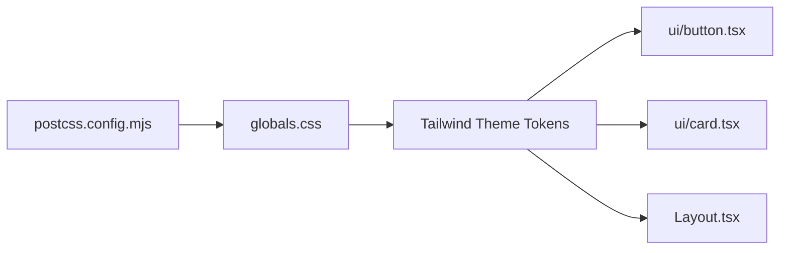

# Design System & Theming

<cite>
**Referenced Files in This Document**
- [globals.css](file://veilend-web/src/app/globals.css)
- [postcss.config.mjs](file://veilend-web/postcss.config.mjs)
- [components.json](file://veilend-web/components.json)
- [button.tsx](file://veilend-web/src/components/ui/button.tsx)
- [card.tsx](file://veilend-web/src/components/ui/card.tsx)
- [Layout.tsx](file://veilend-web/src/components/Layout.tsx)
- [tailwind.config.js](file://veilend-mobile/tailwind.config.js)
- [postcss.config.js](file://veilend-mobile/postcss.config.js)
</cite>

## Table of Contents
1. Introduction
2. Project Structure
3. Core Components
4. Architecture Overview
5. Detailed Component Analysis
6. Dependency Analysis
7. Performance Considerations
8. Troubleshooting Guide
9. Conclusion

## Introduction
This document describes the VeilLend design system across web and mobile applications. It covers color palettes, typography scales, spacing systems, component theming, Tailwind CSS configuration, custom utilities, and design tokens. It also explains responsive strategy, breakpoints, mobile-first approach, light/dark mode support, semantic color usage, accessibility considerations, and guidelines for creating new components that follow established patterns.

## Project Structure
The design system is implemented primarily in two places:
- Web (Next.js): Global theme tokens, Tailwind v4 via PostCSS plugin, ShadCN UI integration, and reusable UI components.
- Mobile (React Native + NativeWind/Tailwind): A minimal Tailwind config with brand colors and a simple PostCSS setup.

**Diagram sources**
- [globals.css:1-161](file://veilend-web/src/app/globals.css#L1-L161)
- [postcss.config.mjs:1-8](file://veilend-web/postcss.config.mjs#L1-L8)
- [components.json:1-26](file://veilend-web/components.json#L1-L26)
- [button.tsx:1-68](file://veilend-web/src/components/ui/button.tsx#L1-L68)
- [card.tsx:1-104](file://veilend-web/src/components/ui/card.tsx#L1-L104)
- [Layout.tsx:56-218](file://veilend-web/src/components/Layout.tsx#L56-L218)
- [tailwind.config.js:1-18](file://veilend-mobile/tailwind.config.js#L1-L18)
- [postcss.config.js:1-6](file://veilend-mobile/postcss.config.js#L1-L6)

**Section sources**
- [globals.css:1-161](file://veilend-web/src/app/globals.css#L1-L161)
- [postcss.config.mjs:1-8](file://veilend-web/postcss.config.mjs#L1-L8)
- [components.json:1-26](file://veilend-web/components.json#L1-L26)
- [tailwind.config.js:1-18](file://veilend-mobile/tailwind.config.js#L1-L18)
- [postcss.config.js:1-6](file://veilend-mobile/postcss.config.js#L1-L6)

## Core Components
- Color tokens: Centralized CSS variables define brand and semantic colors for both light and dark modes.
- Typography tokens: Font families and heading font are exposed as CSS variables and mapped into Tailwind theme tokens.
- Spacing and radius: Consistent spacing and border-radius tokens are provided via CSS variables and Tailwind utilities.
- UI primitives: Button and Card components use semantic tokens and variant/size APIs to ensure consistent styling.

Key highlights:
- Brand palette includes primary, secondary, background, card, text, and semantic success/warning/error tokens.
- Dark mode overrides provide accessible contrast by adjusting surface and foreground values.
- ShadCN UI is configured to use CSS variables and neutral base color, enabling seamless theme integration.

**Section sources**
- [globals.css:7-109](file://veilend-web/src/app/globals.css#L7-L109)
- [globals.css:117-149](file://veilend-web/src/app/globals.css#L117-L149)
- [components.json:1-26](file://veilend-web/components.json#L1-L26)
- [button.tsx:7-42](file://veilend-web/src/components/ui/button.tsx#L7-L42)
- [card.tsx:5-21](file://veilend-web/src/components/ui/card.tsx#L5-L21)

## Architecture Overview
The web app uses Tailwind v4 through a PostCSS plugin. Global CSS defines CSS variables for tokens and maps them into Tailwind’s theme namespace. The .dark class toggles dark-mode tokens. Components consume these tokens via utility classes and component-specific variants.

**Diagram sources**
- [postcss.config.mjs:1-8](file://veilend-web/postcss.config.mjs#L1-L8)
- [globals.css:1-161](file://veilend-web/src/app/globals.css#L1-L161)

**Section sources**
- [postcss.config.mjs:1-8](file://veilend-web/postcss.config.mjs#L1-L8)
- [globals.css:1-161](file://veilend-web/src/app/globals.css#L1-L161)

## Detailed Component Analysis

### Color Palette and Theming
- Light mode: Base surfaces and text are defined using CSS variables under :root.
- Dark mode: A .dark selector redefines key tokens to maintain contrast and visual hierarchy.
- Semantic mapping: Tailwind theme tokens map to CSS variables so components can reference semantic names like primary, secondary, background, card, text, success, warning, error.

Accessibility notes:
- Tokens are chosen to provide sufficient contrast between text and backgrounds in both modes.
- Focus rings and borders use dedicated ring/border tokens to ensure visibility.

**Section sources**
- [globals.css:7-55](file://veilend-web/src/app/globals.css#L7-L55)
- [globals.css:57-109](file://veilend-web/src/app/globals.css#L57-L109)
- [globals.css:117-149](file://veilend-web/src/app/globals.css#L117-L149)

### Typography Scale and Fonts
- Font families: Sans-serif and monospace fonts are exposed as variables and mapped into theme tokens.
- Headings: A dedicated heading font variable is used for titles and emphasis.
- Base typography: Body and HTML elements apply default font families via base layer utilities.

Best practices:
- Use semantic tokens (e.g., text-foreground, text-muted-foreground) instead of hard-coded colors.
- Prefer component-level typography classes (e.g., CardTitle) for consistent scale.

**Section sources**
- [globals.css:73-80](file://veilend-web/src/app/globals.css#L73-L80)
- [globals.css:151-161](file://veilend-web/src/app/globals.css#L151-L161)
- [card.tsx:36-47](file://veilend-web/src/components/ui/card.tsx#L36-L47)

### Spacing System and Layout Utilities
- Spacing: Reusable gap utilities are provided via a layout component that maps logical sizes to Tailwind gap utilities.
- Grids: Grid components expose responsive column configurations and gap options, following a mobile-first pattern.
- Consistency: All layout primitives rely on shared spacing tokens to keep rhythm consistent across screens.

Guidelines:
- Use the provided Flex/Grid components for common layouts to ensure consistent spacing and responsiveness.
- For complex grids, prefer responsive column definitions per breakpoint.

**Section sources**
- [Layout.tsx:64-91](file://veilend-web/src/components/Layout.tsx#L64-L91)
- [Layout.tsx:117-167](file://veilend-web/src/components/Layout.tsx#L117-L167)
- [Layout.tsx:176-208](file://veilend-web/src/components/Layout.tsx#L176-L208)

### Responsive Strategy and Breakpoints
- Mobile-first: Components and grids start from a single-column layout and expand at md/lg/xl breakpoints.
- Breakpoint usage: Utility classes such as md:grid-cols-2, lg:grid-cols-3, xl:grid-cols-4 demonstrate responsive behavior.
- Consistent scaling: Gap and sizing utilities remain consistent across breakpoints to preserve visual rhythm.

Recommendations:
- Start with a single-column layout and add columns at appropriate breakpoints.
- Keep spacing tokens consistent; adjust only when necessary for very small screens.

**Section sources**
- [Layout.tsx:131-153](file://veilend-web/src/components/Layout.tsx#L131-L153)
- [Layout.tsx:190-203](file://veilend-web/src/components/Layout.tsx#L190-L203)

### Component Styling Patterns
- Button: Uses a variant and size API built on top of semantic tokens. Variants include default, outline, secondary, ghost, destructive, link. Sizes include default, xs, sm, lg, icon variants.
- Card: Provides a structured composition with header, title, description, content, action, and footer, all styled with semantic tokens and spacing variables.

Best practices:
- Compose components using semantic tokens rather than hard-coded colors or sizes.
- Leverage data attributes (e.g., data-slot, data-variant) for consistent state-driven styling.

**Section sources**
- [button.tsx:7-42](file://veilend-web/src/components/ui/button.tsx#L7-L42)
- [button.tsx:44-67](file://veilend-web/src/components/ui/button.tsx#L44-L67)
- [card.tsx:5-21](file://veilend-web/src/components/ui/card.tsx#L5-L21)
- [card.tsx:23-93](file://veilend-web/src/components/ui/card.tsx#L23-L93)

### Mobile Design System
- Tailwind config defines brand colors (primary, secondary, background, card, text, textSecondary).
- PostCSS enables Tailwind processing for React Native via NativeWind-compatible setup.

Guidelines:
- Extend the color palette in the Tailwind config to maintain consistency across mobile screens.
- Use the same semantic naming conventions as the web app where possible.

**Section sources**
- [tailwind.config.js:2-17](file://veilend-mobile/tailwind.config.js#L2-L17)
- [postcss.config.js:1-6](file://veilend-mobile/postcss.config.js#L1-L6)

## Dependency Analysis
The design system relies on a layered dependency chain:
- PostCSS plugin processes global CSS and exposes theme tokens.
- Global CSS defines CSS variables and maps them to Tailwind theme tokens.
- Components consume semantic tokens via utility classes and internal variant APIs.

**Diagram sources**
- [postcss.config.mjs:1-8](file://veilend-web/postcss.config.mjs#L1-L8)
- [globals.css:1-161](file://veilend-web/src/app/globals.css#L1-L161)
- [button.tsx:1-68](file://veilend-web/src/components/ui/button.tsx#L1-L68)
- [card.tsx:1-104](file://veilend-web/src/components/ui/card.tsx#L1-L104)
- [Layout.tsx:56-218](file://veilend-web/src/components/Layout.tsx#L56-L218)

**Section sources**
- [postcss.config.mjs:1-8](file://veilend-web/postcss.config.mjs#L1-L8)
- [globals.css:1-161](file://veilend-web/src/app/globals.css#L1-L161)

## Performance Considerations
- Token-driven styles: Using CSS variables reduces duplication and improves maintainability.
- Minimal runtime: Tailwind utilities are compiled statically; avoid excessive dynamic class generation.
- Dark mode: Rely on the .dark class to toggle tokens rather than JS-based style changes for better performance.
- Mobile: Keep Tailwind content paths scoped to minimize generated CSS size.

[No sources needed since this section provides general guidance]

## Troubleshooting Guide
Common issues and resolutions:
- Colors not updating in dark mode: Ensure the .dark class is applied at the root level and that tokens are overridden in the .dark selector.
- Inconsistent spacing: Use the provided Flex/Grid components and their gap mappings to maintain consistent spacing.
- Component variants not applying: Verify that variant and size props are passed correctly and that semantic tokens exist in the theme.

Checklist:
- Confirm PostCSS plugin is active and globals.css is imported.
- Validate that components import from the correct paths and use semantic tokens.
- Test both light and dark modes across major browsers.

**Section sources**
- [globals.css:117-149](file://veilend-web/src/app/globals.css#L117-L149)
- [Layout.tsx:64-91](file://veilend-web/src/components/Layout.tsx#L64-L91)
- [button.tsx:7-42](file://veilend-web/src/components/ui/button.tsx#L7-L42)

## Conclusion
VeilLend’s design system centers on a robust token layer powered by CSS variables and Tailwind theme mapping. Components build on semantic tokens to ensure consistency, accessibility, and ease of customization. The mobile app mirrors the web’s approach with a concise Tailwind configuration. By following the guidelines here—using semantic tokens, leveraging layout primitives, and adhering to responsive patterns—you can create new components that integrate seamlessly with the existing design system.

[No sources needed since this section summarizes without analyzing specific files]