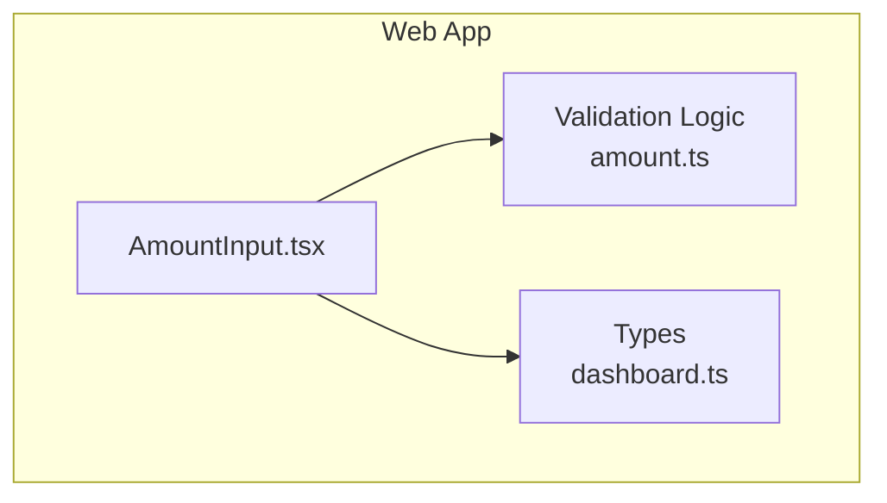
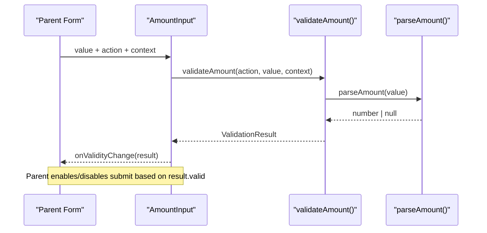
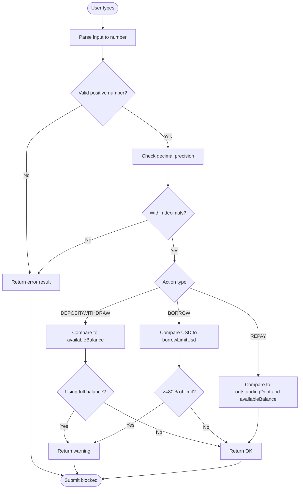
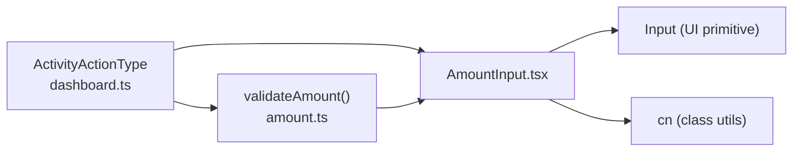

# AmountInput Component

<cite>
**Referenced Files in This Document**
- [AmountInput.tsx](file://veilend-web/src/components/AmountInput.tsx)
- [amount.ts](file://veilend-web/src/lib/validation/amount.ts)
- [dashboard.ts](file://veilend-web/src/lib/types/dashboard.ts)
</cite>

## Table of Contents
1. Introduction
2. Project Structure
3. Core Components
4. Architecture Overview
5. Detailed Component Analysis
6. Dependency Analysis
7. Performance Considerations
8. Troubleshooting Guide
9. Conclusion

## Introduction
The AmountInput component is a controlled input field designed for Veilend’s DeFi protocol actions (DEPOSIT, BORROW, REPAY, WITHDRAW). It provides inline validation, risk warnings, USD preview, and a Max button that respects available balances and outstanding debt. The component communicates validation results to parent components so they can enable or disable submit buttons accordingly.

## Project Structure
The AmountInput component lives under the web application’s shared components and relies on:
- A UI Input primitive
- Shared utility functions for class names
- Centralized validation logic for amounts and context
- Type definitions for activity actions

**Diagram sources**
- [AmountInput.tsx:1-23](file://veilend-web/src/components/AmountInput.tsx#L1-L23)
- [amount.ts:1-23](file://veilend-web/src/lib/validation/amount.ts#L1-L23)
- [dashboard.ts:18-18](file://veilend-web/src/lib/types/dashboard.ts#L18-L18)

**Section sources**
- [AmountInput.tsx:1-23](file://veilend-web/src/components/AmountInput.tsx#L1-L23)
- [amount.ts:1-23](file://veilend-web/src/lib/validation/amount.ts#L1-L23)
- [dashboard.ts:18-18](file://veilend-web/src/lib/types/dashboard.ts#L18-L18)

## Core Components
- AmountInput: Controlled input with inline validation, Max button, USD preview, and accessibility attributes.
- Validation module: Parses user input, enforces precision, and validates against action-specific rules using a ValidationContext.
- Types: ActivityActionType defines supported protocol actions used by the component and validator.

Key responsibilities:
- Parse and validate user input
- Compute USD preview from current price
- Provide Max shortcut respecting balances and debt
- Surface errors and warnings to users
- Notify parents about validity changes

**Section sources**
- [AmountInput.tsx:14-23](file://veilend-web/src/components/AmountInput.tsx#L14-L23)
- [amount.ts:3-23](file://veilend-web/src/lib/validation/amount.ts#L3-L23)
- [dashboard.ts:18-18](file://veilend-web/src/lib/types/dashboard.ts#L18-L18)

## Architecture Overview
The component composes a controlled input with a validation pipeline and exposes a simple event-driven interface to parents.

**Diagram sources**
- [AmountInput.tsx:40-47](file://veilend-web/src/components/AmountInput.tsx#L40-L47)
- [amount.ts:55-138](file://veilend-web/src/lib/validation/amount.ts#L55-L138)

## Detailed Component Analysis

### Prop Interface
- action: One of DEPOSIT, BORROW, REPAY, WITHDRAW. Determines which validation rules apply.
- context: ValidationContext providing availableBalance, borrowLimitUsd, outstandingDebt, priceUsd, decimals.
- assetSymbol: Displayed next to the input for clarity.
- value: Controlled string value representing the amount.
- onChange: Updates the parent’s state with the new value.
- onValidityChange: Optional callback invoked whenever validation result changes; parent uses this to enable/disable submit.
- disabled: Disables both input and Max button when true.

Integration tip:
- Keep value in parent state and pass it down.
- Use onValidityChange to compute whether the form can be submitted.

**Section sources**
- [AmountInput.tsx:14-23](file://veilend-web/src/components/AmountInput.tsx#L14-L23)

### Validation Context and Result
ValidationContext fields:
- availableBalance: Human-readable balance for the asset.
- borrowLimitUsd: Remaining borrow capacity in USD (for BORROW).
- outstandingDebt: Outstanding debt for the asset (for REPAY).
- priceUsd: Current price of the asset in USD.
- decimals: Asset decimal precision (default 7 if not provided).

ValidationResult fields:
- valid: Boolean indicating if submission should be allowed.
- severity: 'error' or 'warning'. Errors block submission; warnings inform but allow submission.
- message: Short, mobile-friendly feedback shown inline.

Rules overview:
- Common checks: empty/invalid input, non-positive values, precision limits.
- DEPOSIT/WITHDRAW: Enforce availableBalance; warn when using full balance.
- BORROW: Enforce borrowLimitUsd; warn near limit (>=80%).
- REPAY: Enforce outstandingDebt and availableBalance.

**Section sources**
- [amount.ts:3-23](file://veilend-web/src/lib/validation/amount.ts#L3-L23)
- [amount.ts:55-138](file://veilend-web/src/lib/validation/amount.ts#L55-L138)

### Inline Validation Flow

**Diagram sources**
- [amount.ts:31-49](file://veilend-web/src/lib/validation/amount.ts#L31-L49)
- [amount.ts:55-138](file://veilend-web/src/lib/validation/amount.ts#L55-L138)

### Amount Parsing and USD Preview
- Parsing: Accepts only clean positive decimals; returns null for invalid inputs.
- USD preview: When parsed value > 0, formats parsed * priceUsd as USD currency for display.

Behavior:
- Invalid or zero values do not show USD preview.
- Preview updates reactively as the user types.

**Section sources**
- [amount.ts:31-39](file://veilend-web/src/lib/validation/amount.ts#L31-L39)
- [AmountInput.tsx:61-67](file://veilend-web/src/components/AmountInput.tsx#L61-L67)

### Max Button Functionality
- For REPAY: Sets amount to the minimum of outstandingDebt and availableBalance.
- For other actions: Sets amount to availableBalance.
- Triggers touched state to ensure feedback visibility.

Edge cases:
- If outstandingDebt is undefined for REPAY, falls back to availableBalance.
- Respects disabled prop to prevent programmatic changes while disabled.

**Section sources**
- [AmountInput.tsx:52-59](file://veilend-web/src/components/AmountInput.tsx#L52-L59)

### Accessibility Features
- aria-invalid: Set to true when there is an error feedback visible.
- aria-describedby: Links the input to its feedback element via id when feedback is shown.
- Feedback element: Uses role="alert" for errors and role="status" for warnings to convey semantics to assistive technologies.
- Keyboard support: inputMode="decimal" improves numeric entry on mobile devices.

Best practices:
- Ensure parent associates labels and descriptions appropriately.
- Avoid hiding critical errors visually.

**Section sources**
- [AmountInput.tsx:72-85](file://veilend-web/src/components/AmountInput.tsx#L72-L85)
- [AmountInput.tsx:101-118](file://veilend-web/src/components/AmountInput.tsx#L101-L118)

### Integration Examples

#### Basic Controlled Usage
- Maintain value in parent state.
- Pass action, context, and assetSymbol.
- Subscribe to onValidityChange to control submit button enabled state.

#### Form Submission Guard
- Disable submit when result.valid is false.
- Optionally show warnings even when valid is true.

#### Handling Warnings vs Errors
- Errors block submission and are highlighted as destructive.
- Warnings inform users (e.g., liquidation risk or fee buffer) but still allow submission.

**Section sources**
- [AmountInput.tsx:40-47](file://veilend-web/src/components/AmountInput.tsx#L40-L47)
- [AmountInput.tsx:49-51](file://veilend-web/src/components/AmountInput.tsx#L49-L51)
- [amount.ts:76-133](file://veilend-web/src/lib/validation/amount.ts#L76-L133)

## Dependency Analysis

**Diagram sources**
- [dashboard.ts:18-18](file://veilend-web/src/lib/types/dashboard.ts#L18-L18)
- [AmountInput.tsx:1-12](file://veilend-web/src/components/AmountInput.tsx#L1-L12)
- [amount.ts:1-2](file://veilend-web/src/lib/validation/amount.ts#L1-L2)

**Section sources**
- [dashboard.ts:18-18](file://veilend-web/src/lib/types/dashboard.ts#L18-L18)
- [AmountInput.tsx:1-12](file://veilend-web/src/components/AmountInput.tsx#L1-L12)
- [amount.ts:1-2](file://veilend-web/src/lib/validation/amount.ts#L1-L2)

## Performance Considerations
- Validation runs via useMemo keyed by action, value, and context to avoid unnecessary recomputation.
- USD preview formatting uses Intl.NumberFormat only when needed (parsed > 0).
- Touched state minimizes feedback rendering until the user interacts.

Optimization tips:
- Memoize context objects in parent to prevent re-validation triggers.
- Debounce expensive context updates if fetching prices frequently.

[No sources needed since this section provides general guidance]

## Troubleshooting Guide
Common issues and resolutions:
- Submit button never enables:
  - Ensure onValidityChange is wired and parent reads result.valid.
  - Verify context values (availableBalance, borrowLimitUsd, outstandingDebt, priceUsd) are correct.
- USD preview not showing:
  - Confirm parsed value is greater than zero and priceUsd is set.
- Max button sets unexpected value:
  - For REPAY, check outstandingDebt availability; otherwise it defaults to availableBalance.
- Accessibility concerns:
  - Ensure aria-describedby target exists when feedback is shown.
  - Confirm roles are applied correctly for alerts/status.

**Section sources**
- [AmountInput.tsx:40-47](file://veilend-web/src/components/AmountInput.tsx#L40-L47)
- [AmountInput.tsx:61-67](file://veilend-web/src/components/AmountInput.tsx#L61-L67)
- [AmountInput.tsx:52-59](file://veilend-web/src/components/AmountInput.tsx#L52-L59)
- [AmountInput.tsx:72-85](file://veilend-web/src/components/AmountInput.tsx#L72-L85)
- [amount.ts:55-138](file://veilend-web/src/lib/validation/amount.ts#L55-L138)

## Conclusion
AmountInput delivers a robust, accessible, and reusable input for DeFi actions with precise validation, clear feedback, and helpful shortcuts. By integrating with parent forms through onValidityChange, it enables safe submission flows and enhances user experience across deposit, borrow, repay, and withdraw operations.

[No sources needed since this section summarizes without analyzing specific files]