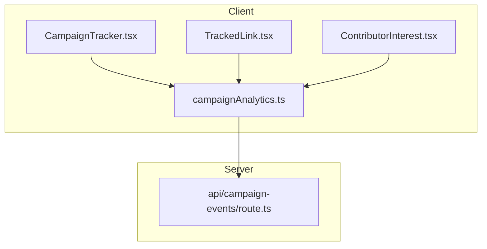
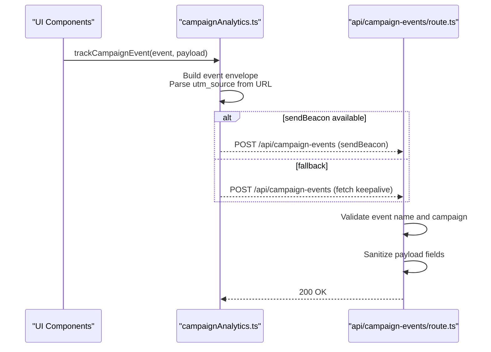
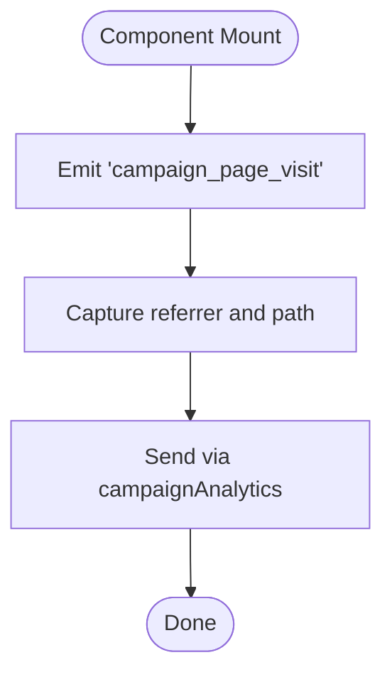
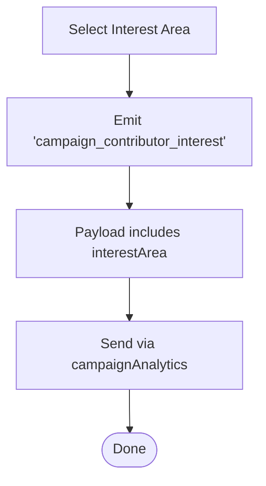
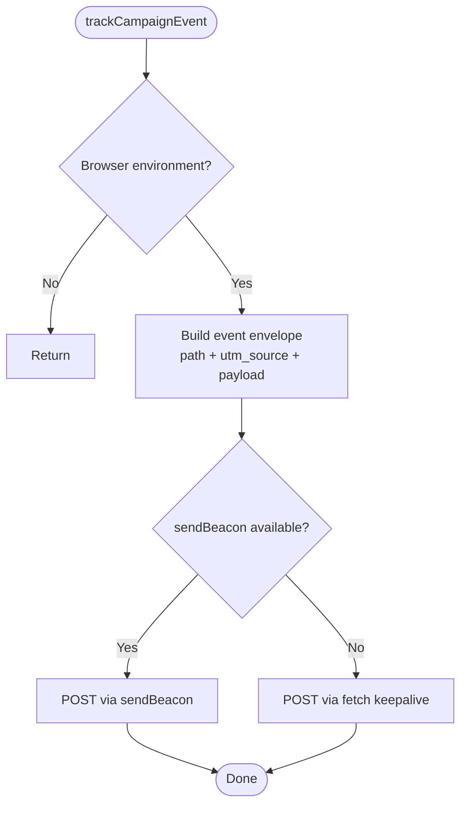
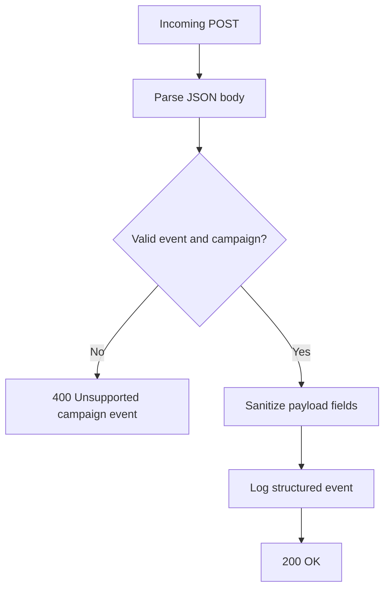
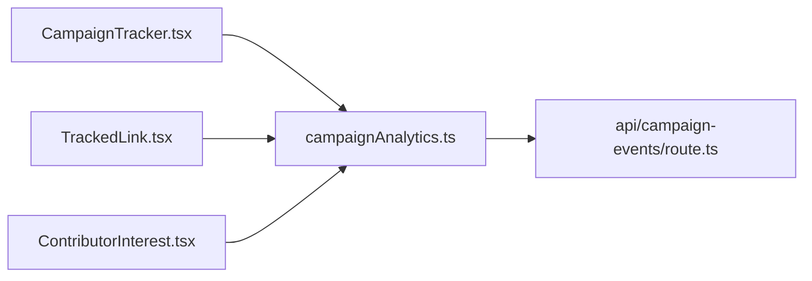

# CampaignTracker Component

<cite>
**Referenced Files in This Document**
- [CampaignTracker.tsx](file://veilend-web/src/components/CampaignTracker.tsx)
- [campaignAnalytics.ts](file://veilend-web/src/lib/campaignAnalytics.ts)
- [route.ts](file://veilend-web/src/app/api/campaign-events/route.ts)
- [TrackedLink.tsx](file://veilend-web/src/components/TrackedLink.tsx)
- [ContributorInterest.tsx](file://veilend-web/src/components/ContributorInterest.tsx)
- [README.md](file://veilend-web/README.md)
</cite>

## Table of Contents
1. [Introduction](#introduction)
2. [Project Structure](#project-structure)
3. [Core Components](#core-components)
4. [Architecture Overview](#architecture-overview)
5. [Detailed Component Analysis](#detailed-component-analysis)
6. [Dependency Analysis](#dependency-analysis)
7. [Performance Considerations](#performance-considerations)
8. [Troubleshooting Guide](#troubleshooting-guide)
9. [Conclusion](#conclusion)
10. [Appendices](#appendices)

## Introduction
This document explains the CampaignTracker component and its surrounding campaign analytics system used by VeilLend’s marketing initiatives. It covers how campaign parameters are detected, how UTM source is parsed, how conversion-like interactions are tracked, and how events flow to a first-party API endpoint for logging. It also documents privacy considerations, integration points with analytics services, setup examples, event tracking patterns, session-related behavior, attribution modeling guidance, testing strategies, and debugging tips.

## Project Structure
The campaign analytics implementation lives in the Next.js web application under veilend-web:
- Client-side components emit events via a shared analytics helper.
- A Next.js API route receives, validates, sanitizes, and logs events.
- The README documents the supported events and privacy posture.



**Diagram sources**
- [CampaignTracker.tsx:1-14](file://veilend-web/src/components/CampaignTracker.tsx#L1-L14)
- [TrackedLink.tsx:1-47](file://veilend-web/src/components/TrackedLink.tsx#L1-L47)
- [ContributorInterest.tsx:1-56](file://veilend-web/src/components/ContributorInterest.tsx#L1-L56)
- [campaignAnalytics.ts:1-58](file://veilend-web/src/lib/campaignAnalytics.ts#L1-L58)
- [route.ts:1-86](file://veilend-web/src/app/api/campaign-events/route.ts#L1-L86)

**Section sources**
- [README.md:196-222](file://veilend-web/README.md#L196-L222)

## Core Components
- CampaignTracker: Emits a page visit event on mount, capturing referrer and path.
- TrackedLink: Emits a CTA click event when users click tracked links, including target URL and identifiers.
- ContributorInterest: Emits an interest selection event for contribution areas without collecting personal data.
- campaignAnalytics: Central client helper that builds event payloads, parses UTM source from the current URL, and sends events using sendBeacon or fetch keepalive.
- API route: Validates event names, enforces allowed campaign identifier, sanitizes payload fields, and logs structured events.

Key responsibilities:
- Event emission from UI components.
- Minimal, privacy-preserving data collection (no cookies, no PII).
- Robust server-side validation and sanitization.
- First-party logging for downstream observability.

**Section sources**
- [CampaignTracker.tsx:1-14](file://veilend-web/src/components/CampaignTracker.tsx#L1-L14)
- [TrackedLink.tsx:1-47](file://veilend-web/src/components/TrackedLink.tsx#L1-L47)
- [ContributorInterest.tsx:1-56](file://veilend-web/src/components/ContributorInterest.tsx#L1-L56)
- [campaignAnalytics.ts:1-58](file://veilend-web/src/lib/campaignAnalytics.ts#L1-L58)
- [route.ts:1-86](file://veilend-web/src/app/api/campaign-events/route.ts#L1-L86)

## Architecture Overview
The system uses a lightweight, first-party analytics pipeline:
- Client components call trackCampaignEvent with typed events and payloads.
- The helper constructs a standardized event envelope including timestamp, campaign identifier, and sanitized payload.
- Events are sent via navigator.sendBeacon when available; otherwise, fetch with keepalive is used.
- The Next.js API route validates and sanitizes inputs, then logs them for analysis.



**Diagram sources**
- [campaignAnalytics.ts:25-57](file://veilend-web/src/lib/campaignAnalytics.ts#L25-L57)
- [route.ts:62-85](file://veilend-web/src/app/api/campaign-events/route.ts#L62-L85)

## Detailed Component Analysis

### CampaignTracker
- Purpose: Record a page visit event when the component mounts.
- Behavior: Captures referrer and relies on the analytics helper to include path and UTM source.
- Integration: Uses useEffect to ensure it runs only in the browser.



**Diagram sources**
- [CampaignTracker.tsx:6-11](file://veilend-web/src/components/CampaignTracker.tsx#L6-L11)
- [campaignAnalytics.ts:30-39](file://veilend-web/src/lib/campaignAnalytics.ts#L30-L39)

**Section sources**
- [CampaignTracker.tsx:1-14](file://veilend-web/src/components/CampaignTracker.tsx#L1-L14)

### TrackedLink
- Purpose: Track outbound CTA clicks with identifiers and target URLs.
- Behavior: Emits 'campaign_cta_click' before invoking any provided onClick handler.
- Data captured: ctaId, ctaLabel, targetUrl, plus path and source from the helper.

```mermaid
sequenceDiagram
participant User as "User"
participant Link as "TrackedLink"
participant Lib as "campaignAnalytics.ts"
participant API as "api/campaign-events/route.ts"
User->>Link : Click
Link->>Lib : trackCampaignEvent('campaign_cta_click', {ctaId, ctaLabel, targetUrl})
Lib-->>API : POST event
API-->>Lib : 200 OK
Link->>User : Continue navigation / run onClick
```

**Diagram sources**
- [TrackedLink.tsx:17-46](file://veilend-web/src/components/TrackedLink.tsx#L17-L46)
- [campaignAnalytics.ts:25-57](file://veilend-web/src/lib/campaignAnalytics.ts#L25-L57)
- [route.ts:62-85](file://veilend-web/src/app/api/campaign-events/route.ts#L62-L85)

**Section sources**
- [TrackedLink.tsx:1-47](file://veilend-web/src/components/TrackedLink.tsx#L1-L47)

### ContributorInterest
- Purpose: Capture anonymous interest in contribution areas.
- Behavior: Emits 'campaign_contributor_interest' with selected area; explicitly avoids collecting names, emails, wallet addresses, or cookies.



**Diagram sources**
- [ContributorInterest.tsx:14-55](file://veilend-web/src/components/ContributorInterest.tsx#L14-L55)
- [campaignAnalytics.ts:25-57](file://veilend-web/src/lib/campaignAnalytics.ts#L25-L57)

**Section sources**
- [ContributorInterest.tsx:1-56](file://veilend-web/src/components/ContributorInterest.tsx#L1-L56)

### campaignAnalytics Helper
- Responsibilities:
  - Build a consistent event envelope with event type, campaign identifier, timestamp, and payload.
  - Parse utm_source from the current URL query string and attach it to the payload.
  - Choose sendBeacon if available; otherwise use fetch with keepalive to improve delivery during page transitions.
  - Ensure no side effects in non-browser environments.



**Diagram sources**
- [campaignAnalytics.ts:25-57](file://veilend-web/src/lib/campaignAnalytics.ts#L25-L57)

**Section sources**
- [campaignAnalytics.ts:1-58](file://veilend-web/src/lib/campaignAnalytics.ts#L1-L58)

### API Route (Server-Side Validation and Logging)
- Responsibilities:
  - Accept POST requests at /api/campaign-events.
  - Validate event name against an allowlist and enforce the expected campaign identifier.
  - Sanitize all payload fields to safe lengths and types.
  - Log structured events with a distinct marker for observability.



**Diagram sources**
- [route.ts:28-85](file://veilend-web/src/app/api/campaign-events/route.ts#L28-L85)

**Section sources**
- [route.ts:1-86](file://veilend-web/src/app/api/campaign-events/route.ts#L1-L86)

## Dependency Analysis
- Components depend on the shared analytics helper for consistent event emission.
- The helper depends on browser APIs (window, URLSearchParams, navigator.sendBeacon, fetch).
- The API route depends on Next.js server response utilities and performs strict input validation and sanitization.
- No external analytics SDKs are embedded; events are logged server-side for later processing.



**Diagram sources**
- [CampaignTracker.tsx:1-14](file://veilend-web/src/components/CampaignTracker.tsx#L1-L14)
- [TrackedLink.tsx:1-47](file://veilend-web/src/components/TrackedLink.tsx#L1-L47)
- [ContributorInterest.tsx:1-56](file://veilend-web/src/components/ContributorInterest.tsx#L1-L56)
- [campaignAnalytics.ts:1-58](file://veilend-web/src/lib/campaignAnalytics.ts#L1-L58)
- [route.ts:1-86](file://veilend-web/src/app/api/campaign-events/route.ts#L1-L86)

**Section sources**
- [README.md:196-222](file://veilend-web/README.md#L196-L222)

## Performance Considerations
- sendBeacon usage minimizes request overhead and improves reliability during page unload or navigation.
- Fallback to fetch with keepalive ensures compatibility where sendBeacon is unavailable.
- Server-side sanitization reduces payload size and protects against malformed inputs.
- Avoid heavy computations in event emission paths to maintain UI responsiveness.

[No sources needed since this section provides general guidance]

## Troubleshooting Guide
Common issues and resolutions:
- Invalid JSON payload: The API returns a 400 error when the request body cannot be parsed.
- Unsupported campaign event: Only whitelisted event names and the configured campaign identifier are accepted.
- Missing UTM source: If utm_source is not present in the URL, the payload will omit the source field; ensure campaigns include utm_source in links.
- Network failures: sendBeacon may drop requests in some environments; the fetch fallback helps but can still fail silently. Check server logs for the structured event marker.

Operational tips:
- Inspect server logs for entries marked with the campaign analytics log prefix to verify event ingestion.
- Verify that components are mounted in the browser context; server-side rendering skips event emission.

**Section sources**
- [route.ts:62-85](file://veilend-web/src/app/api/campaign-events/route.ts#L62-L85)
- [campaignAnalytics.ts:25-57](file://veilend-web/src/lib/campaignAnalytics.ts#L25-L57)

## Conclusion
The CampaignTracker system provides a privacy-first, first-party analytics solution for VeilLend’s marketing campaigns. It captures essential interaction signals—page visits, CTA clicks, and contributor interests—while avoiding personal data collection. The design emphasizes robust validation, minimal client footprint, and clear server-side logging to support future analytics integrations.

[No sources needed since this section summarizes without analyzing specific files]

## Appendices

### Setup and Usage Examples
- Add the CampaignTracker component to pages where you want to record page visits.
- Use TrackedLink for outbound calls-to-action to capture engagement metrics.
- Include ContributorInterest on relevant pages to measure interest in contribution areas.
- Ensure your marketing links include utm_source so the system can attribute traffic sources.

**Section sources**
- [CampaignTracker.tsx:6-11](file://veilend-web/src/components/CampaignTracker.tsx#L6-L11)
- [TrackedLink.tsx:17-46](file://veilend-web/src/components/TrackedLink.tsx#L17-L46)
- [ContributorInterest.tsx:14-55](file://veilend-web/src/components/ContributorInterest.tsx#L14-L55)
- [campaignAnalytics.ts:30-39](file://veilend-web/src/lib/campaignAnalytics.ts#L30-L39)

### Privacy Considerations
- No cookies, local storage identifiers, wallet addresses, emails, names, or free-form text are collected.
- Referrer and UTM source are optional and truncated during sanitization.
- The system intentionally limits data to anonymous interaction metadata required for campaign measurement.

**Section sources**
- [README.md:216-222](file://veilend-web/README.md#L216-L222)
- [route.ts:32-60](file://veilend-web/src/app/api/campaign-events/route.ts#L32-L60)

### Event Tracking System Summary
- Supported events:
  - campaign_page_visit: Page view tracking.
  - campaign_cta_click: Outbound link engagement.
  - campaign_contributor_interest: Anonymous interest selection.
- Each event includes a timestamp, campaign identifier, and sanitized payload.

**Section sources**
- [README.md:200-206](file://veilend-web/README.md#L200-L206)
- [campaignAnalytics.ts:1-21](file://veilend-web/src/lib/campaignAnalytics.ts#L1-L21)

### Session Management Notes
- The current implementation does not persist sessions or user identifiers.
- Events are stateless and do not rely on cookies or local storage.
- For multi-step attribution, consider correlating events by time windows and source fields on the server side.

[No sources needed since this section provides general guidance]

### Attribution Modeling Guidance
- Use utm_source to group traffic by campaign channel.
- Combine event sequences (visit → CTA click → interest) to infer engagement funnels.
- Extend server-side logging to integrate with your observability platform for cohort analysis and funnel reporting.

[No sources needed since this section provides general guidance]

### Testing Strategies
- Unit tests:
  - Verify event emission functions construct correct envelopes and parse utm_source.
  - Mock navigator.sendBeacon and fetch to assert network calls.
- Integration tests:
  - Hit the /api/campaign-events endpoint with valid and invalid payloads.
  - Assert 400 responses for unsupported events and successful 200 responses for valid events.
- Component tests:
  - Confirm CampaignTracker emits a page visit event on mount.
  - Confirm TrackedLink emits a CTA click event before navigation.
  - Confirm ContributorInterest emits an interest event without capturing PII.

[No sources needed since this section provides general guidance]