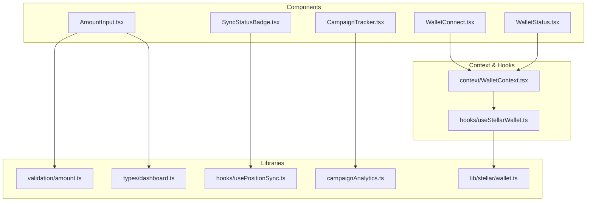
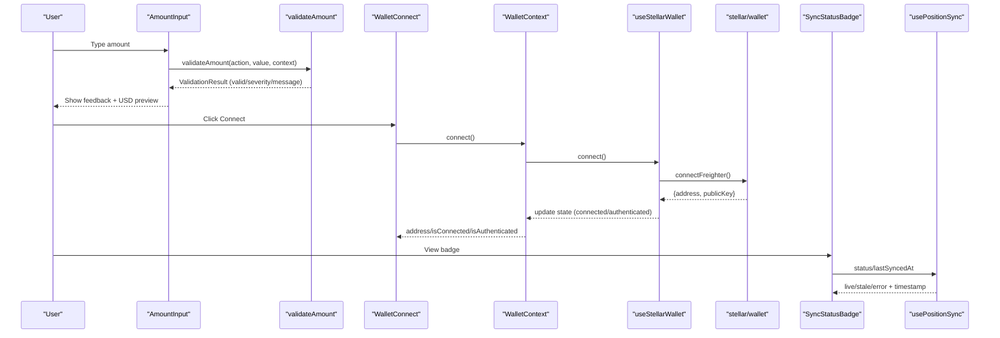
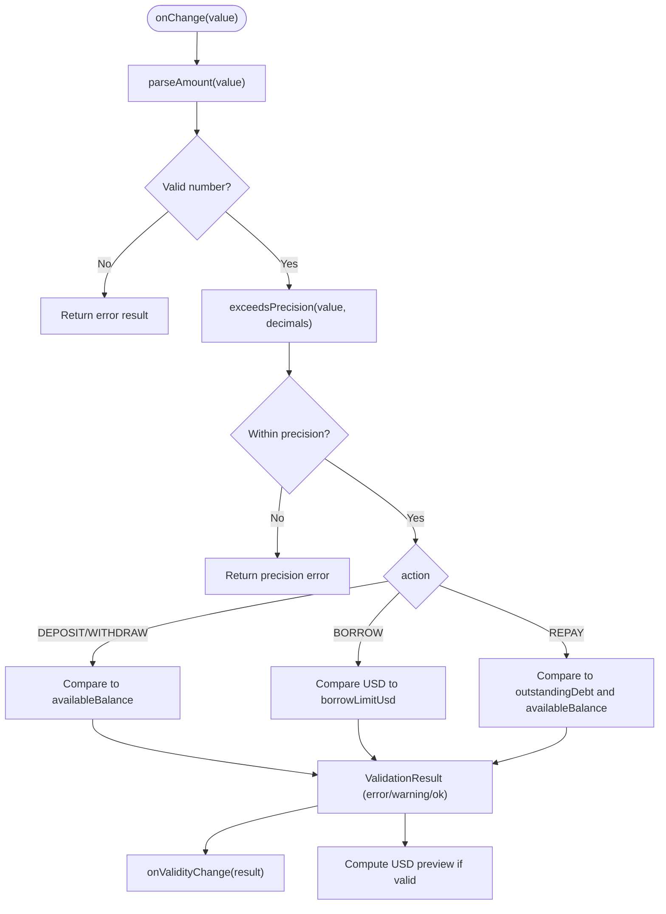
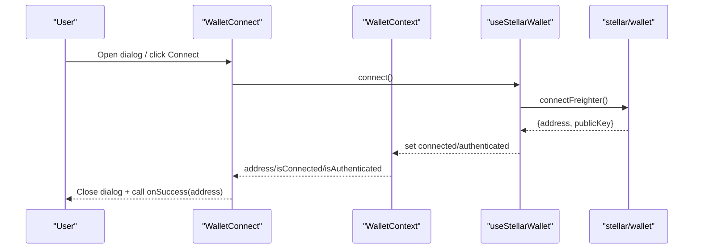
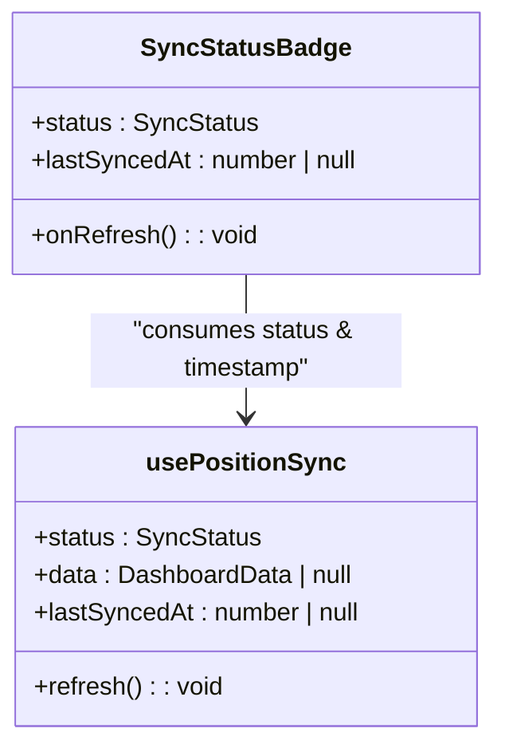
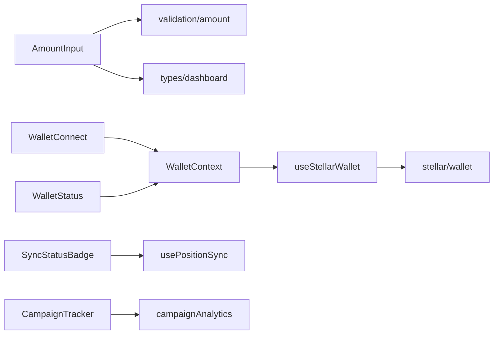

# Domain-Specific Components

<cite>
**Referenced Files in This Document**
- [AmountInput.tsx](file://veilend-web/src/components/AmountInput.tsx)
- [amount.ts](file://veilend-web/src/lib/validation/amount.ts)
- [dashboard.ts](file://veilend-web/src/lib/types/dashboard.ts)
- [WalletConnect.tsx](file://veilend-web/src/components/WalletConnect.tsx)
- [WalletStatus.tsx](file://veilend-web/src/components/WalletStatus.tsx)
- [WalletContext.tsx](file://veilend-web/src/context/WalletContext.tsx)
- [useStellarWallet.ts](file://veilend-web/src/hooks/useStellarWallet.ts)
- [wallet.ts](file://veilend-web/src/lib/stellar/wallet.ts)
- [SyncStatusBadge.tsx](file://veilend-web/src/components/SyncStatusBadge.tsx)
- [usePositionSync.ts](file://veilend-web/src/lib/hooks/usePositionSync.ts)
- [CampaignTracker.tsx](file://veilend-web/src/components/CampaignTracker.tsx)
- [campaignAnalytics.ts](file://veilend-web/src/lib/campaignAnalytics.ts)
</cite>

## Table of Contents
1. [Introduction](#introduction)
2. [Project Structure](#project-structure)
3. [Core Components](#core-components)
4. [Architecture Overview](#architecture-overview)
5. [Detailed Component Analysis](#detailed-component-analysis)
6. [Dependency Analysis](#dependency-analysis)
7. [Performance Considerations](#performance-considerations)
8. [Troubleshooting Guide](#troubleshooting-guide)
9. [Conclusion](#conclusion)
10. [Appendices](#appendices)

## Introduction
This document explains VeilLend’s domain-specific frontend components that power DeFi interactions on the Stellar network. It focuses on:
- AmountInput for numeric validation, formatting, and currency preview
- WalletConnect and WalletStatus for wallet integration with Freighter
- SyncStatusBadge for protocol synchronization status
- CampaignTracker for analytics event tracking

It also covers prop interfaces, event handling, state management patterns, error handling, loading states, user feedback, security considerations, and testing strategies for development environments.

## Project Structure
The relevant components live under veilend-web/src and integrate with shared libraries for validation, types, hooks, and utilities.

**Diagram sources**
- [AmountInput.tsx:1-123](file://veilend-web/src/components/AmountInput.tsx#L1-L123)
- [amount.ts:1-143](file://veilend-web/src/lib/validation/amount.ts#L1-L143)
- [dashboard.ts:1-35](file://veilend-web/src/lib/types/dashboard.ts#L1-L35)
- [WalletConnect.tsx:1-378](file://veilend-web/src/components/WalletConnect.tsx#L1-L378)
- [WalletStatus.tsx:1-155](file://veilend-web/src/components/WalletStatus.tsx#L1-L155)
- [WalletContext.tsx:1-24](file://veilend-web/src/context/WalletContext.tsx#L1-L24)
- [useStellarWallet.ts:1-122](file://veilend-web/src/hooks/useStellarWallet.ts#L1-L122)
- [wallet.ts:1-218](file://veilend-web/src/lib/stellar/wallet.ts#L1-L218)
- [SyncStatusBadge.tsx:1-101](file://veilend-web/src/components/SyncStatusBadge.tsx#L1-L101)
- [usePositionSync.ts:1-196](file://veilend-web/src/lib/hooks/usePositionSync.ts#L1-L196)
- [CampaignTracker.tsx:1-15](file://veilend-web/src/components/CampaignTracker.tsx#L1-L15)
- [campaignAnalytics.ts:1-58](file://veilend-web/src/lib/campaignAnalytics.ts#L1-L58)

**Section sources**
- [AmountInput.tsx:1-123](file://veilend-web/src/components/AmountInput.tsx#L1-L123)
- [WalletConnect.tsx:1-378](file://veilend-web/src/components/WalletConnect.tsx#L1-L378)
- [WalletStatus.tsx:1-155](file://veilend-web/src/components/WalletStatus.tsx#L1-L155)
- [SyncStatusBadge.tsx:1-101](file://veilend-web/src/components/SyncStatusBadge.tsx#L1-L101)
- [CampaignTracker.tsx:1-15](file://veilend-web/src/components/CampaignTracker.tsx#L1-L15)

## Core Components
- AmountInput: Controlled input with real-time validation against action-specific rules (deposit/borrow/repay/withdraw), precision checks, balance limits, borrow limit warnings, and USD value previews.
- WalletConnect: Multi-variant UI to connect/disconnect Freighter, handle installation prompts, errors, and success callbacks.
- WalletStatus: Compact status indicator showing connection state, errors, and quick actions.
- SyncStatusBadge: Visual badge reflecting sync state (idle/loading/live/stale/empty/error) with relative timestamps and optional refresh trigger.
- CampaignTracker: Lightweight component that emits a page visit analytics event using sendBeacon or fetch fallback.

**Section sources**
- [AmountInput.tsx:14-123](file://veilend-web/src/components/AmountInput.tsx#L14-L123)
- [amount.ts:3-143](file://veilend-web/src/lib/validation/amount.ts#L3-L143)
- [WalletConnect.tsx:20-378](file://veilend-web/src/components/WalletConnect.tsx#L20-L378)
- [WalletStatus.tsx:10-155](file://veilend-web/src/components/WalletStatus.tsx#L10-L155)
- [SyncStatusBadge.tsx:8-101](file://veilend-web/src/components/SyncStatusBadge.tsx#L8-L101)
- [CampaignTracker.tsx:6-14](file://veilend-web/src/components/CampaignTracker.tsx#L6-L14)

## Architecture Overview
The components interact through React context and hooks to provide wallet state, validation, and live data syncing.

**Diagram sources**
- [AmountInput.tsx:40-67](file://veilend-web/src/components/AmountInput.tsx#L40-L67)
- [amount.ts:55-138](file://veilend-web/src/lib/validation/amount.ts#L55-L138)
- [WalletConnect.tsx:58-82](file://veilend-web/src/components/WalletConnect.tsx#L58-L82)
- [WalletContext.tsx:10-22](file://veilend-web/src/context/WalletContext.tsx#L10-L22)
- [useStellarWallet.ts:54-88](file://veilend-web/src/hooks/useStellarWallet.ts#L54-L88)
- [wallet.ts:69-98](file://veilend-web/src/lib/stellar/wallet.ts#L69-L98)
- [SyncStatusBadge.tsx:18-53](file://veilend-web/src/components/SyncStatusBadge.tsx#L18-L53)
- [usePositionSync.ts:59-106](file://veilend-web/src/lib/hooks/usePositionSync.ts#L59-L106)

## Detailed Component Analysis

### AmountInput
- Purpose: Provide controlled numeric input with inline validation and USD preview for protocol actions.
- Key props:
  - action: ActivityActionType (DEPOSIT/BORROW/REPAY/WITHDRAW)
  - context: ValidationContext (availableBalance, borrowLimitUsd?, outstandingDebt?, priceUsd, decimals?)
  - assetSymbol: string
  - value: string
  - onChange: (value: string) => void
  - onValidityChange?: (result: ValidationResult) => void
  - disabled?: boolean
- State:
  - touched: boolean (to gate feedback visibility)
- Behavior:
  - Validates via validateAmount; surfaces errors and warnings
  - Max button sets amount to availableBalance (or min(debt, balance) for REPAY)
  - Parses input and shows USD preview using priceUsd
  - Accessibility: aria-invalid and aria-describedby when feedback is shown
- Data flow:
  - Input change -> parseAmount -> validateAmount -> setResult -> notify parent via onValidityChange
  - USD preview computed from parsed value and priceUsd

**Diagram sources**
- [amount.ts:31-138](file://veilend-web/src/lib/validation/amount.ts#L31-L138)
- [AmountInput.tsx:40-67](file://veilend-web/src/components/AmountInput.tsx#L40-L67)

**Section sources**
- [AmountInput.tsx:14-123](file://veilend-web/src/components/AmountInput.tsx#L14-L123)
- [amount.ts:3-143](file://veilend-web/src/lib/validation/amount.ts#L3-L143)
- [dashboard.ts:18-18](file://veilend-web/src/lib/types/dashboard.ts#L18-L18)

### WalletConnect
- Purpose: Unified UI to connect/disconnect Freighter wallet with variants (default/compact/full).
- Key props:
  - variant: 'default' | 'compact' | 'full'
  - className?: string
  - size?: "sm" | "default" | "lg"
  - onSuccess?: (address: string) => void
  - onError?: (error: Error) => void
- State:
  - isModalOpen, isConnecting
- Behavior:
  - Opens dialog to connect; handles install prompt if not installed
  - Calls connect() from useWallet; triggers onSuccess on success
  - Displays contextual messages via getWalletConnectionMessage based on error and installation status
  - Disconnect clears error and closes modal
- Integration:
  - Uses WalletContext to access address, isConnected, isAuthenticated, isInstalled, isLoading, error, connect, disconnect, clearError

**Diagram sources**
- [WalletConnect.tsx:58-82](file://veilend-web/src/components/WalletConnect.tsx#L58-L82)
- [useStellarWallet.ts:54-88](file://veilend-web/src/hooks/useStellarWallet.ts#L54-L88)
- [wallet.ts:69-98](file://veilend-web/src/lib/stellar/wallet.ts#L69-L98)

**Section sources**
- [WalletConnect.tsx:20-378](file://veilend-web/src/components/WalletConnect.tsx#L20-L378)
- [wallet.ts:23-98](file://veilend-web/src/lib/stellar/wallet.ts#L23-L98)

### WalletStatus
- Purpose: Compact status display for wallet connection with quick actions.
- Key props:
  - showDetails?: boolean
  - className?: string
  - onConnect?: () => void
  - onDisconnect?: () => void
- Behavior:
  - Shows loading, error (with tooltip and dismiss), missing extension, connected (with truncated address), or disconnected states
  - Delegates connect/disconnect to useWallet and optional parent callbacks

**Section sources**
- [WalletStatus.tsx:10-155](file://veilend-web/src/components/WalletStatus.tsx#L10-L155)

### SyncStatusBadge
- Purpose: Visual indicator of position sync state with last-synced time and optional refresh.
- Key props:
  - status: SyncStatus (idle/loading/live/stale/empty/error)
  - lastSyncedAt: number | null
  - onRefresh?: () => void
- Behavior:
  - Renders icon, label, and styling based on status config
  - Shows relative time since last sync for live/stale
  - Optional refresh button calls onRefresh

**Diagram sources**
- [SyncStatusBadge.tsx:8-101](file://veilend-web/src/components/SyncStatusBadge.tsx#L8-L101)
- [usePositionSync.ts:10-18](file://veilend-web/src/lib/hooks/usePositionSync.ts#L10-L18)

**Section sources**
- [SyncStatusBadge.tsx:8-101](file://veilend-web/src/components/SyncStatusBadge.tsx#L8-L101)
- [usePositionSync.ts:7-18](file://veilend-web/src/lib/hooks/usePositionSync.ts#L7-L18)

### CampaignTracker
- Purpose: Emit a campaign page visit event on mount.
- Behavior:
  - Tracks event with referrer and path via trackCampaignEvent
  - Uses sendBeacon when available, otherwise fetch with keepalive

**Section sources**
- [CampaignTracker.tsx:6-14](file://veilend-web/src/components/CampaignTracker.tsx#L6-L14)
- [campaignAnalytics.ts:25-57](file://veilend-web/src/lib/campaignAnalytics.ts#L25-L57)

## Dependency Analysis
- AmountInput depends on:
  - validation/amount.ts for parsing and rule-based validation
  - types/dashboard.ts for ActivityActionType
- WalletConnect and WalletStatus depend on:
  - context/WalletContext.tsx which wraps useStellarWallet
  - hooks/useStellarWallet.ts which orchestrates Freighter integration via lib/stellar/wallet.ts
- SyncStatusBadge depends on:
  - lib/hooks/usePositionSync.ts for sync state and polling
- CampaignTracker depends on:
  - lib/campaignAnalytics.ts for event emission

**Diagram sources**
- [AmountInput.tsx:1-123](file://veilend-web/src/components/AmountInput.tsx#L1-L123)
- [amount.ts:1-143](file://veilend-web/src/lib/validation/amount.ts#L1-L143)
- [dashboard.ts:1-35](file://veilend-web/src/lib/types/dashboard.ts#L1-L35)
- [WalletConnect.tsx:1-378](file://veilend-web/src/components/WalletConnect.tsx#L1-L378)
- [WalletStatus.tsx:1-155](file://veilend-web/src/components/WalletStatus.tsx#L1-L155)
- [WalletContext.tsx:1-24](file://veilend-web/src/context/WalletContext.tsx#L1-L24)
- [useStellarWallet.ts:1-122](file://veilend-web/src/hooks/useStellarWallet.ts#L1-L122)
- [wallet.ts:1-218](file://veilend-web/src/lib/stellar/wallet.ts#L1-L218)
- [SyncStatusBadge.tsx:1-101](file://veilend-web/src/components/SyncStatusBadge.tsx#L1-L101)
- [usePositionSync.ts:1-196](file://veilend-web/src/lib/hooks/usePositionSync.ts#L1-L196)
- [CampaignTracker.tsx:1-15](file://veilend-web/src/components/CampaignTracker.tsx#L1-L15)
- [campaignAnalytics.ts:1-58](file://veilend-web/src/lib/campaignAnalytics.ts#L1-L58)

**Section sources**
- [WalletContext.tsx:1-24](file://veilend-web/src/context/WalletContext.tsx#L1-L24)
- [useStellarWallet.ts:1-122](file://veilend-web/src/hooks/useStellarWallet.ts#L1-L122)
- [wallet.ts:1-218](file://veilend-web/src/lib/stellar/wallet.ts#L1-L218)

## Performance Considerations
- AmountInput:
  - Validation runs on every change; ensure context updates are memoized where possible
  - USD preview uses Intl.NumberFormat; consider caching formatted values if performance becomes an issue
- WalletConnect/WalletStatus:
  - Avoid re-renders by keeping variant and callbacks stable
  - Debounce frequent reconnect attempts; rely on isLoading flag to prevent duplicate requests
- SyncStatusBadge:
  - Polling interval defaults to 10s; adjust staleAfterMs to balance freshness vs. load
  - Use AbortController to cancel in-flight requests on unmount or new loads
- CampaignTracker:
  - Uses sendBeacon to avoid blocking navigation; fallback to fetch with keepalive

[No sources needed since this section provides general guidance]

## Troubleshooting Guide
- AmountInput:
  - Errors: invalid format, zero/negative amounts, exceeding decimals, exceeding balance/debt/borrow limit
  - Warnings: using full balance (no buffer for fees), borrowing near limit (liquidation risk)
  - Resolution: correct input, reduce amount, ensure sufficient balance or lower borrow target
- WalletConnect/WalletStatus:
  - Not installed: prompt to install Freighter
  - Not connected/unlocked: instruct user to unlock and approve connection
  - Errors: display message with retry option; clear error before retry
- SyncStatusBadge:
  - Stale: indicates no successful sync within threshold; trigger refresh
  - Offline/error: network or API failure; retry after resolving connectivity
- CampaignTracker:
  - Events may fail silently; verify endpoint availability and CORS settings

**Section sources**
- [amount.ts:55-138](file://veilend-web/src/lib/validation/amount.ts#L55-L138)
- [wallet.ts:23-98](file://veilend-web/src/lib/stellar/wallet.ts#L23-L98)
- [usePositionSync.ts:59-106](file://veilend-web/src/lib/hooks/usePositionSync.ts#L59-L106)

## Conclusion
VeilLend’s domain components provide robust, user-friendly primitives for DeFi operations:
- AmountInput ensures safe, validated inputs with actionable feedback
- WalletConnect and WalletStatus streamline wallet integration and state visibility
- SyncStatusBadge communicates live data freshness
- CampaignTracker captures essential analytics events

Together, they form a cohesive layer over Stellar wallet interactions and backend indexing, enabling secure and responsive DeFi experiences.

[No sources needed since this section summarizes without analyzing specific files]

## Appendices

### Prop Interfaces Summary
- AmountInputProps: action, context, assetSymbol, value, onChange, onValidityChange?, disabled?
- WalletConnectProps: variant, className?, size?, onSuccess?, onError?
- WalletStatusProps: showDetails?, className?, onConnect?, onDisconnect?
- SyncStatusBadgeProps: status, lastSyncedAt, onRefresh?

**Section sources**
- [AmountInput.tsx:14-23](file://veilend-web/src/components/AmountInput.tsx#L14-L23)
- [WalletConnect.tsx:20-26](file://veilend-web/src/components/WalletConnect.tsx#L20-L26)
- [WalletStatus.tsx:10-15](file://veilend-web/src/components/WalletStatus.tsx#L10-L15)
- [SyncStatusBadge.tsx:8-12](file://veilend-web/src/components/SyncStatusBadge.tsx#L8-L12)

### Event Handlers and State Patterns
- AmountInput:
  - onChange updates value; onBlur sets touched; onValidityChange reports ValidationResult
  - Internal touched state gates feedback visibility
- WalletConnect/WalletStatus:
  - connect/disconnect manage lifecycle; clearError resets error state
  - Success/failure callbacks enable parent orchestration
- SyncStatusBadge:
  - Consumes status and lastSyncedAt from usePositionSync; optional onRefresh triggers reload
- CampaignTracker:
  - Emits event on mount; payload includes referrer and path

**Section sources**
- [AmountInput.tsx:38-67](file://veilend-web/src/components/AmountInput.tsx#L38-L67)
- [WalletConnect.tsx:58-92](file://veilend-web/src/components/WalletConnect.tsx#L58-L92)
- [WalletStatus.tsx:35-47](file://veilend-web/src/components/WalletStatus.tsx#L35-L47)
- [usePositionSync.ts:59-106](file://veilend-web/src/lib/hooks/usePositionSync.ts#L59-L106)
- [CampaignTracker.tsx:6-14](file://veilend-web/src/components/CampaignTracker.tsx#L6-L14)

### Usage Examples (Integration Guidance)
- AmountInput:
  - Pass action derived from current screen (e.g., BORROW)
  - Provide context with availableBalance, priceUsd, and optional borrowLimitUsd/outstandingDebt
  - Use onValidityChange to enable/disable submit buttons
- WalletConnect:
  - Wrap app with WalletProvider
  - Place WalletConnect in header or dashboard; handle onSuccess to proceed to authenticated flows
- WalletStatus:
  - Display in header to show connection state; wire onConnect/onDisconnect to custom flows
- SyncStatusBadge:
  - Use with usePositionSync(address); render badge with lastSyncedAt and onRefresh
- CampaignTracker:
  - Add at top-level pages to capture visits; ensure /api/campaign-events route exists

**Section sources**
- [WalletContext.tsx:10-22](file://veilend-web/src/context/WalletContext.tsx#L10-L22)
- [usePositionSync.ts:34-106](file://veilend-web/src/lib/hooks/usePositionSync.ts#L34-L106)
- [campaignAnalytics.ts:25-57](file://veilend-web/src/lib/campaignAnalytics.ts#L25-L57)

### Security Considerations
- Wallet interactions:
  - Only request necessary permissions; never store private keys in client code
  - Validate addresses and signatures server-side; use nonce/session mechanisms for authentication
  - Handle errors gracefully to avoid leaking sensitive information
- Data privacy:
  - Minimize PII in analytics payloads; avoid logging addresses unless necessary
  - Sanitize inputs and outputs; enforce strict validation on both client and server
- Network security:
  - Use HTTPS for all API calls; validate endpoints and certificates
  - Implement rate limiting and CSRF protections on backend endpoints

[No sources needed since this section provides general guidance]

### Testing Strategies and Mocks
- Unit tests:
  - AmountInput: test parseAmount and validateAmount across edge cases (empty, negative, precision, limits)
  - WalletConnect/WalletStatus: mock useWallet to simulate connected/disconnected/error states
  - SyncStatusBadge: mock usePositionSync to assert badge rendering for each SyncStatus
  - CampaignTracker: spy trackCampaignEvent to verify event emission
- Integration tests:
  - Simulate wallet connection flow with mocked Freighter API responses
  - Verify sync polling behavior and staleness transitions
- Mock implementations:
  - Mock window.freighter presence and methods (isConnected, getAddress, signTransaction)
  - Mock fetch/sendBeacon for analytics to assert payloads
  - Mock API responses for dashboard data to test empty/live/stale/error scenarios

**Section sources**
- [amount.ts:31-138](file://veilend-web/src/lib/validation/amount.ts#L31-L138)
- [useStellarWallet.ts:54-114](file://veilend-web/src/hooks/useStellarWallet.ts#L54-L114)
- [wallet.ts:69-191](file://veilend-web/src/lib/stellar/wallet.ts#L69-L191)
- [usePositionSync.ts:59-175](file://veilend-web/src/lib/hooks/usePositionSync.ts#L59-L175)
- [campaignAnalytics.ts:25-57](file://veilend-web/src/lib/campaignAnalytics.ts#L25-L57)