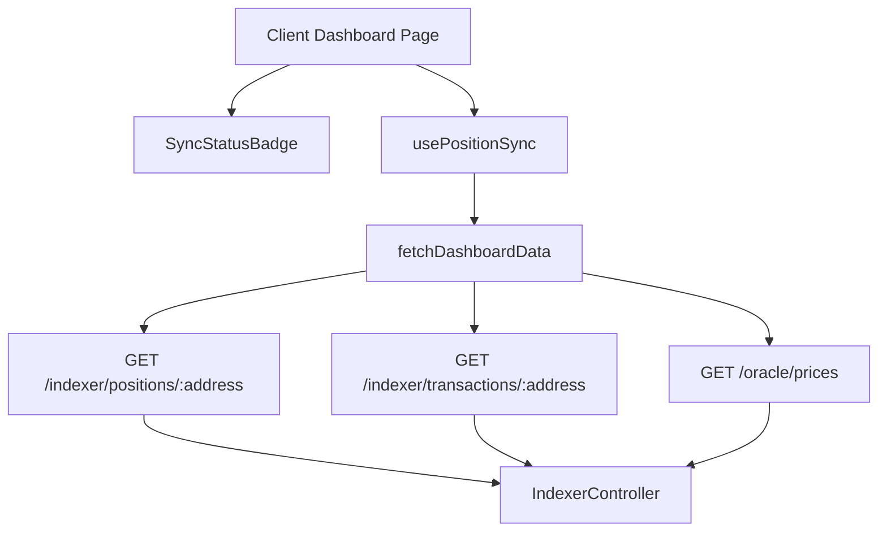
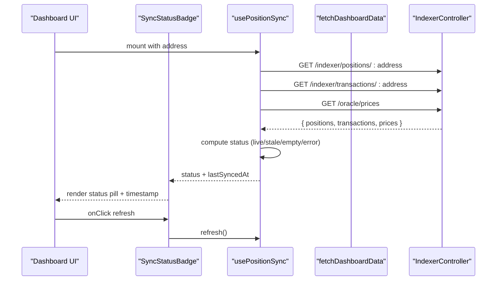
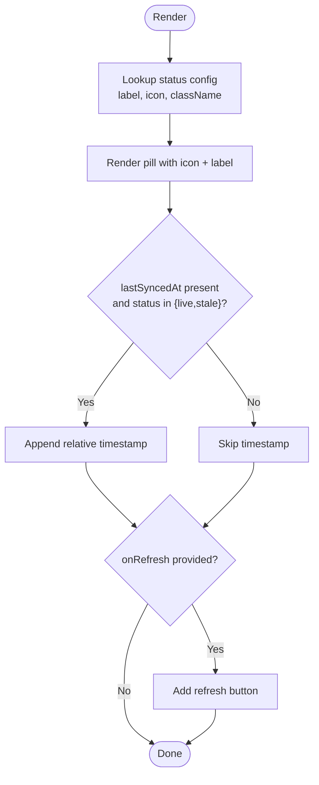
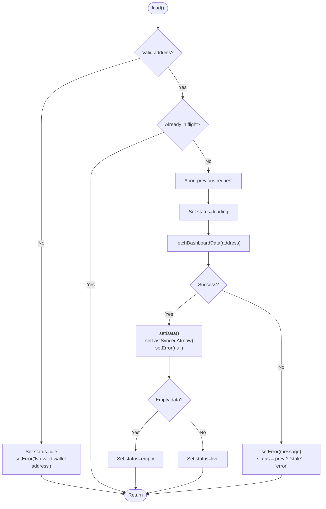
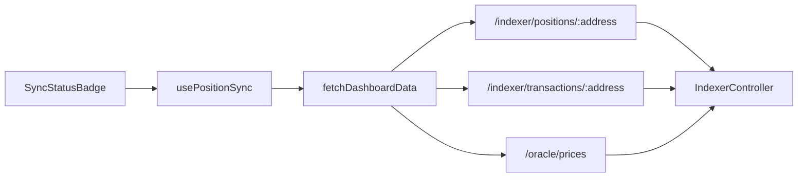

# SyncStatusBadge Component

<cite>
**Referenced Files in This Document**
- [SyncStatusBadge.tsx](file://veilend-web/src/components/SyncStatusBadge.tsx)
- [usePositionSync.ts](file://veilend-web/src/lib/hooks/usePositionSync.ts)
- [dashboard.ts](file://veilend-web/src/lib/api/dashboard.ts)
- [indexer.controller.ts](file://veilend-backend/src/indexer/indexer.controller.ts)
- [protocolStatus.ts](file://veilend-mobile/src/utils/protocolStatus.ts)
- [page.tsx (client dashboard)](file://veilend-web/src/app/(dashboard)/page.tsx)
</cite>

## Table of Contents
1. Introduction
2. Project Structure
3. Core Components
4. Architecture Overview
5. Detailed Component Analysis
6. Dependency Analysis
7. Performance Considerations
8. Troubleshooting Guide
9. Conclusion

## Introduction
The SyncStatusBadge component is a compact, accessible indicator that communicates the live synchronization status of protocol data to users. It shows whether positions are syncing, live, stale, empty, or offline, and can optionally display when the data was last refreshed. The badge integrates with a polling hook that fetches fresh data from backend indexer services and updates the UI in real time.

## Project Structure
This feature spans client-side React components and hooks, an API layer that calls backend indexer endpoints, and backend controllers exposing indexer status and position data. A mobile utility demonstrates how sync staleness is surfaced as banners for broader protocol health signaling.

**Diagram sources**
- [SyncStatusBadge.tsx:18-53](file://veilend-web/src/components/SyncStatusBadge.tsx#L18-L53)
- [usePositionSync.ts:34-106](file://veilend-web/src/lib/hooks/usePositionSync.ts#L34-L106)
- [dashboard.ts:31-64](file://veilend-web/src/lib/api/dashboard.ts#L31-L64)
- [indexer.controller.ts:16-56](file://veilend-backend/src/indexer/indexer.controller.ts#L16-L56)

**Section sources**
- [SyncStatusBadge.tsx:1-101](file://veilend-web/src/components/SyncStatusBadge.tsx#L1-L101)
- [usePositionSync.ts:1-196](file://veilend-web/src/lib/hooks/usePositionSync.ts#L1-L196)
- [dashboard.ts:1-201](file://veilend-web/src/lib/api/dashboard.ts#L1-L201)
- [indexer.controller.ts:1-68](file://veilend-backend/src/indexer/indexer.controller.ts#L1-L68)

## Core Components
- SyncStatusBadge: Renders a small status pill with an icon, label, optional relative timestamp, and an optional refresh button. It uses a configuration map to switch visuals per state.
- usePositionSync: Polls the backend at a configurable interval, tracks last successful sync time, and transitions between idle/loading/live/stale/empty/error states. It exposes a refresh method and error message.
- Dashboard API: Aggregates positions, transactions, and oracle prices, normalizes values, and returns portfolio metrics and recent activity.
- Indexer Controller: Exposes endpoints for positions, transactions, and status; used by the frontend to obtain fresh protocol data.

Key responsibilities:
- Status mapping and visual presentation (badge).
- Real-time polling and staleness detection (hook).
- Data aggregation and normalization (API).
- Backend indexing and retrieval (controller).

**Section sources**
- [SyncStatusBadge.tsx:8-12](file://veilend-web/src/components/SyncStatusBadge.tsx#L8-L12)
- [SyncStatusBadge.tsx:18-53](file://veilend-web/src/components/SyncStatusBadge.tsx#L18-L53)
- [SyncStatusBadge.tsx:56-90](file://veilend-web/src/components/SyncStatusBadge.tsx#L56-L90)
- [usePositionSync.ts:7-18](file://veilend-web/src/lib/hooks/usePositionSync.ts#L7-L18)
- [usePositionSync.ts:34-106](file://veilend-web/src/lib/hooks/usePositionSync.ts#L34-L106)
- [usePositionSync.ts:159-175](file://veilend-web/src/lib/hooks/usePositionSync.ts#L159-L175)
- [dashboard.ts:31-160](file://veilend-web/src/lib/api/dashboard.ts#L31-L160)
- [indexer.controller.ts:16-56](file://veilend-backend/src/indexer/indexer.controller.ts#L16-L56)

## Architecture Overview
The component participates in a polling-based architecture:
- The dashboard page renders SyncStatusBadge and drives it via usePositionSync.
- usePositionSync periodically calls fetchDashboardData, which concurrently requests positions, transactions, and oracle prices from the backend.
- The backend indexer controller serves these endpoints, reading indexed data from storage and returning normalized results.
- The hook updates status based on success/failure and elapsed time since last successful sync, enabling the badge to reflect live, stale, or offline conditions.

**Diagram sources**
- [usePositionSync.ts:59-106](file://veilend-web/src/lib/hooks/usePositionSync.ts#L59-L106)
- [dashboard.ts:31-64](file://veilend-web/src/lib/api/dashboard.ts#L31-L64)
- [indexer.controller.ts:16-56](file://veilend-backend/src/indexer/indexer.controller.ts#L16-L56)
- [SyncStatusBadge.tsx:18-53](file://veilend-web/src/components/SyncStatusBadge.tsx#L18-L53)

## Detailed Component Analysis

### SyncStatusBadge
- Purpose: Provide an at-a-glance view of sync health with minimal visual footprint.
- Props:
  - status: One of idle, loading, live, stale, empty, error.
  - lastSyncedAt: Epoch milliseconds of last successful sync; shown conditionally for live/stale.
  - onRefresh: Optional callback to trigger a manual refresh.
- Visuals:
  - Each status maps to a distinct label, icon, and color scheme via a configuration object.
  - Loading state includes a spinning animation for the icon.
  - Relative timestamp is formatted as “just now”, “Xs ago”, “Xm ago”, or “Xh ago”.
- Accessibility:
  - Uses role="status" and aria-live="polite" to announce changes to assistive technologies.
  - Refresh button has an explicit aria-label.
- Responsive behavior:
  - Compact layout using small font sizes and flexible spacing; scales well across screen sizes.
- Error handling:
  - Displays an “Offline” state when errors occur; relies on the parent hook to set this state.

**Diagram sources**
- [SyncStatusBadge.tsx:18-53](file://veilend-web/src/components/SyncStatusBadge.tsx#L18-L53)
- [SyncStatusBadge.tsx:56-90](file://veilend-web/src/components/SyncStatusBadge.tsx#L56-L90)
- [SyncStatusBadge.tsx:92-100](file://veilend-web/src/components/SyncStatusBadge.tsx#L92-L100)

**Section sources**
- [SyncStatusBadge.tsx:8-12](file://veilend-web/src/components/SyncStatusBadge.tsx#L8-L12)
- [SyncStatusBadge.tsx:18-53](file://veilend-web/src/components/SyncStatusBadge.tsx#L18-L53)
- [SyncStatusBadge.tsx:56-90](file://veilend-web/src/components/SyncStatusBadge.tsx#L56-L90)
- [SyncStatusBadge.tsx:92-100](file://veilend-web/src/components/SyncStatusBadge.tsx#L92-L100)

### usePositionSync
- Responsibilities:
  - Validate wallet address and guard against invalid inputs.
  - Perform initial load and periodic polling at a configurable interval.
  - Track last successful sync time and determine staleness after a threshold.
  - Manage concurrent requests via AbortController and prevent duplicate inflight calls.
  - Expose refresh and error state to consumers.
- State transitions:
  - idle: No valid address or disabled.
  - loading: First load or refresh in progress.
  - live: Successful fetch with non-empty data.
  - empty: Successful fetch but no positions/activity.
  - stale: Data older than configured threshold.
  - error: Network or parsing failure; if previous data exists, falls back to stale; otherwise error.
- Integration points:
  - Calls fetchDashboardData to aggregate positions, transactions, and prices.
  - Updates lastSyncedAt on success and toggles status accordingly.

**Diagram sources**
- [usePositionSync.ts:59-106](file://veilend-web/src/lib/hooks/usePositionSync.ts#L59-L106)
- [usePositionSync.ts:159-175](file://veilend-web/src/lib/hooks/usePositionSync.ts#L159-L175)

**Section sources**
- [usePositionSync.ts:7-18](file://veilend-web/src/lib/hooks/usePositionSync.ts#L7-L18)
- [usePositionSync.ts:34-106](file://veilend-web/src/lib/hooks/usePositionSync.ts#L34-L106)
- [usePositionSync.ts:126-157](file://veilend-web/src/lib/hooks/usePositionSync.ts#L126-L157)
- [usePositionSync.ts:159-175](file://veilend-web/src/lib/hooks/usePositionSync.ts#L159-L175)

### Dashboard API Layer
- Aggregates three backend calls concurrently: positions, transactions, and oracle prices.
- Normalizes amounts and computes USD values using oracle prices.
- Calculates health factor and total balances.
- Returns structured portfolio and recent activity for UI consumption.
- Throws descriptive errors on network or validation failures.

**Section sources**
- [dashboard.ts:31-160](file://veilend-web/src/lib/api/dashboard.ts#L31-L160)

### Backend Indexer Controller
- Provides endpoints for:
  - /indexer/status: Returns active status, contract details, checkpoint, and poll interval.
  - /indexer/positions/:address: Returns indexed positions for a wallet.
  - /indexer/transactions/:address: Returns indexed transactions for a wallet.
- Used by the frontend to obtain authoritative protocol state.

**Section sources**
- [indexer.controller.ts:16-56](file://veilend-backend/src/indexer/indexer.controller.ts#L16-L56)

### Mobile Protocol Status Utility
- Demonstrates how sync staleness is surfaced as actionable banners in the mobile app.
- Considers wallet connectivity, network mismatch, and sync lag thresholds to produce warnings.

**Section sources**
- [protocolStatus.ts:1-73](file://veilend-mobile/src/utils/protocolStatus.ts#L1-L73)

## Dependency Analysis
- SyncStatusBadge depends on:
  - usePositionSync for status and lastSyncedAt.
  - Icon library and utility classes for styling.
- usePositionSync depends on:
  - fetchDashboardData for data retrieval.
  - Configuration for polling intervals and staleness thresholds.
- fetchDashboardData depends on:
  - Backend indexer endpoints for positions and transactions.
  - Oracle endpoint for asset prices.
- Backend indexer controller depends on:
  - Indexer service and repository for data access.

**Diagram sources**
- [SyncStatusBadge.tsx:18-53](file://veilend-web/src/components/SyncStatusBadge.tsx#L18-L53)
- [usePositionSync.ts:59-106](file://veilend-web/src/lib/hooks/usePositionSync.ts#L59-L106)
- [dashboard.ts:31-64](file://veilend-web/src/lib/api/dashboard.ts#L31-L64)
- [indexer.controller.ts:16-56](file://veilend-backend/src/indexer/indexer.controller.ts#L16-L56)

**Section sources**
- [SyncStatusBadge.tsx:18-53](file://veilend-web/src/components/SyncStatusBadge.tsx#L18-L53)
- [usePositionSync.ts:59-106](file://veilend-web/src/lib/hooks/usePositionSync.ts#L59-L106)
- [dashboard.ts:31-64](file://veilend-web/src/lib/api/dashboard.ts#L31-L64)
- [indexer.controller.ts:16-56](file://veilend-backend/src/indexer/indexer.controller.ts#L16-L56)

## Performance Considerations
- Polling interval: Default 10 seconds; tune based on indexer revalidate window and user experience needs.
- Staleness threshold: Default 30 seconds; adjust to balance freshness vs. performance.
- Concurrent requests: Positions, transactions, and prices are fetched in parallel to reduce latency.
- Request cancellation: Previous in-flight requests are aborted before new ones to avoid race conditions.
- Memory and cleanup: Intervals and abort controllers are cleaned up on unmount to prevent leaks.

[No sources needed since this section provides general guidance]

## Troubleshooting Guide
Common issues and resolutions:
- Invalid wallet address:
  - Symptom: Status remains idle with an error message.
  - Cause: Missing or malformed address not starting with expected prefix.
  - Resolution: Ensure a valid Stellar address is provided before mounting the hook.
- Network errors:
  - Symptom: Status switches to error; badge shows Offline.
  - Cause: Backend unreachable or responses with non-OK status.
  - Resolution: Check network connectivity and backend availability; retry via refresh.
- Stale data:
  - Symptom: Status shows Stale with timestamp.
  - Cause: Last successful sync exceeded staleness threshold.
  - Resolution: Trigger refresh; verify indexer health and polling configuration.
- Empty data:
  - Symptom: Status shows No positions.
  - Cause: Valid address but no indexed positions/activity.
  - Resolution: Confirm indexer has processed events for the address; wait for next poll.

Integration tips:
- Use the refresh button to manually trigger a reload when users suspect outdated data.
- Combine with mobile-style banners to warn about sync lag or network mismatch in multi-platform apps.

**Section sources**
- [usePositionSync.ts:59-106](file://veilend-web/src/lib/hooks/usePositionSync.ts#L59-L106)
- [usePositionSync.ts:159-175](file://veilend-web/src/lib/hooks/usePositionSync.ts#L159-L175)
- [dashboard.ts:31-64](file://veilend-web/src/lib/api/dashboard.ts#L31-L64)
- [protocolStatus.ts:29-71](file://veilend-mobile/src/utils/protocolStatus.ts#L29-L71)

## Conclusion
The SyncStatusBadge provides a clear, accessible, and responsive indicator of protocol synchronization health. Paired with usePositionSync and the backend indexer endpoints, it delivers real-time feedback to users, supports manual refresh, and gracefully handles errors and stale data. Its design enables easy integration into dashboards and monitoring interfaces while maintaining performance and accessibility standards.

[No sources needed since this section summarizes without analyzing specific files]