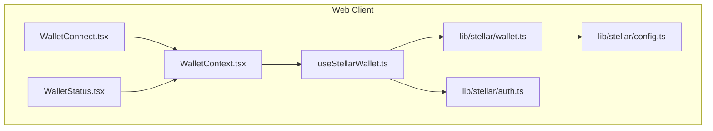
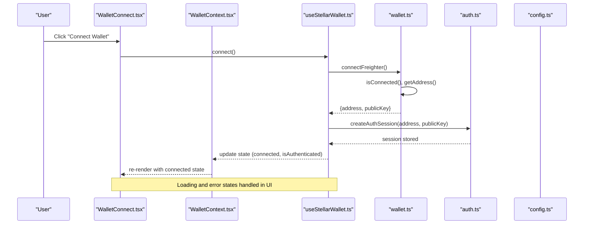
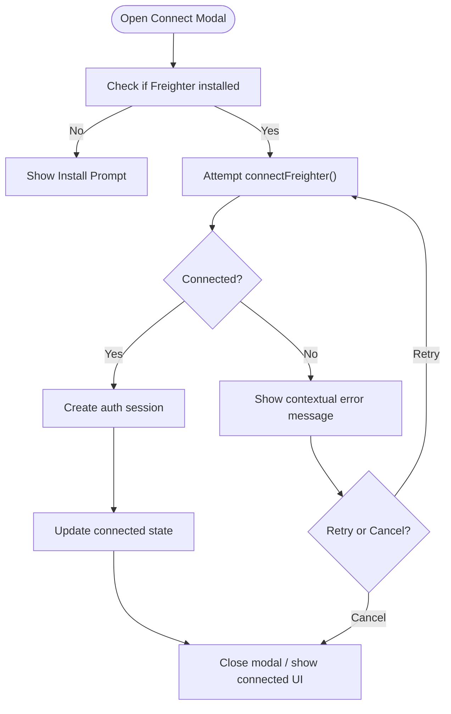
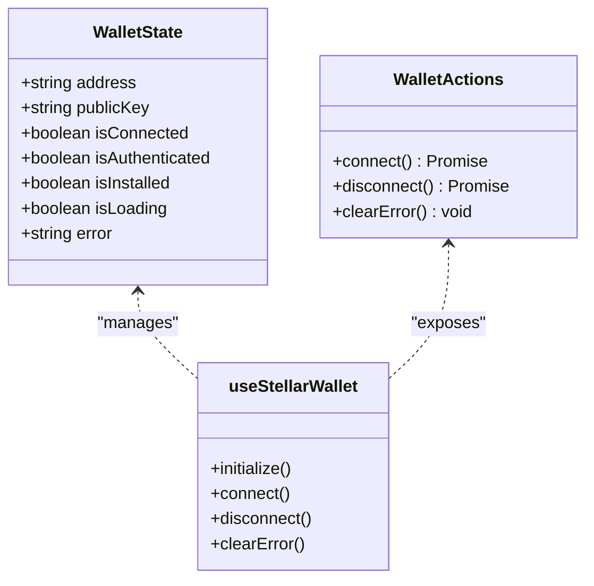
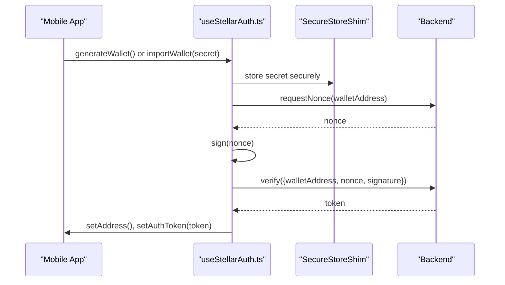
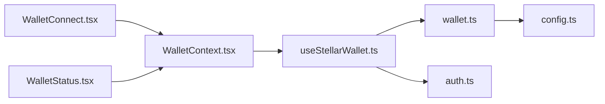

# Wallet Integration Components

<cite>
**Referenced Files in This Document**
- [WalletConnect.tsx](file://veilend-web/src/components/WalletConnect.tsx)
- [WalletStatus.tsx](file://veilend-web/src/components/WalletStatus.tsx)
- [useStellarWallet.ts](file://veilend-web/src/hooks/useStellarWallet.ts)
- [WalletContext.tsx](file://veilend-web/src/context/WalletContext.tsx)
- [wallet.ts](file://veilend-web/src/lib/stellar/wallet.ts)
- [auth.ts](file://veilend-web/src/lib/stellar/auth.ts)
- [config.ts](file://veilend-web/src/lib/stellar/config.ts)
- [useStellarAuth.ts](file://veilend-mobile/src/hooks/useStellarAuth.ts)
- [ConnectWalletScreen.tsx](file://veilend-mobile/src/screens/ConnectWalletScreen.tsx)
</cite>

## Table of Contents
1. [Introduction](#introduction)
2. [Project Structure](#project-structure)
3. [Core Components](#core-components)
4. [Architecture Overview](#architecture-overview)
5. [Detailed Component Analysis](#detailed-component-analysis)
6. [Dependency Analysis](#dependency-analysis)
7. [Performance Considerations](#performance-considerations)
8. [Troubleshooting Guide](#troubleshooting-guide)
9. [Conclusion](#conclusion)
10. [Appendices](#appendices)

## Introduction
This document explains the wallet integration components that provide blockchain connectivity for VeilLend on Stellar. It focuses on:
- WalletConnect: UI to initiate and manage Stellar wallet connections (primarily Freighter).
- WalletStatus: Compact status display for connection state, account info, and network readiness.
- useStellarWallet hook: Centralized lifecycle management for connecting, authenticating, disconnecting, and error handling.
- Mobile flow: A complementary mobile authentication flow using a generated or imported keypair with secure storage.

The goal is to help developers understand how these pieces fit together, how to implement robust connection workflows, handle errors gracefully, and maintain security best practices when interacting with wallets.

## Project Structure
VeilLend’s web client organizes wallet-related logic across components, hooks, context, and Stellar utilities:
- Components: User-facing UI for connecting and displaying wallet status.
- Hook: Encapsulates wallet lifecycle and state transitions.
- Context: Provides wallet state/actions via React context.
- Stellar utilities: Low-level functions for Freighter integration, auth session management, and network configuration.
- Mobile: A separate React Native flow for generating/importing keys and authenticating with the backend.

**Diagram sources**
- [WalletConnect.tsx:1-378](file://veilend-web/src/components/WalletConnect.tsx#L1-L378)
- [WalletStatus.tsx:1-155](file://veilend-web/src/components/WalletStatus.tsx#L1-L155)
- [useStellarWallet.ts:1-122](file://veilend-web/src/hooks/useStellarWallet.ts#L1-L122)
- [WalletContext.tsx:1-24](file://veilend-web/src/context/WalletContext.tsx#L1-L24)
- [wallet.ts:1-218](file://veilend-web/src/lib/stellar/wallet.ts#L1-L218)
- [auth.ts:1-110](file://veilend-web/src/lib/stellar/auth.ts#L1-L110)
- [config.ts:1-22](file://veilend-web/src/lib/stellar/config.ts#L1-L22)

**Section sources**
- [WalletConnect.tsx:1-378](file://veilend-web/src/components/WalletConnect.tsx#L1-L378)
- [WalletStatus.tsx:1-155](file://veilend-web/src/components/WalletStatus.tsx#L1-L155)
- [useStellarWallet.ts:1-122](file://veilend-web/src/hooks/useStellarWallet.ts#L1-L122)
- [WalletContext.tsx:1-24](file://veilend-web/src/context/WalletContext.tsx#L1-L24)
- [wallet.ts:1-218](file://veilend-web/src/lib/stellar/wallet.ts#L1-L218)
- [auth.ts:1-110](file://veilend-web/src/lib/stellar/auth.ts#L1-L110)
- [config.ts:1-22](file://veilend-web/src/lib/stellar/config.ts#L1-L22)

## Core Components
- WalletConnect: A multi-variant component (default, compact, full) that opens a dialog to connect Freighter, shows installation prompts, handles loading/disconnect, and surfaces user-friendly messages based on errors and wallet presence.
- WalletStatus: A lightweight status indicator showing connected/disconnected states, optional address details, error tooltips, and quick actions to connect or disconnect.
- useStellarWallet: Manages wallet lifecycle: initialization, connection, authentication session creation, disconnection, and error clearing.
- WalletContext: Exposes wallet state and actions through React context for easy consumption by components.

Key responsibilities:
- Detect wallet availability (Freighter).
- Initiate connection and create an authenticated session.
- Provide consistent UI feedback for loading, success, and error states.
- Support disconnect and cleanup.

**Section sources**
- [WalletConnect.tsx:20-378](file://veilend-web/src/components/WalletConnect.tsx#L20-L378)
- [WalletStatus.tsx:10-155](file://veilend-web/src/components/WalletStatus.tsx#L10-L155)
- [useStellarWallet.ts:7-122](file://veilend-web/src/hooks/useStellarWallet.ts#L7-L122)
- [WalletContext.tsx:6-24](file://veilend-web/src/context/WalletContext.tsx#L6-L24)

## Architecture Overview
The wallet integration follows a layered architecture:
- UI Layer: WalletConnect and WalletStatus render user interactions and status.
- State Layer: useStellarWallet centralizes state and actions; WalletContext provides access.
- Integration Layer: wallet.ts interacts with Freighter API and Stellar SDK for signing and network calls.
- Auth Layer: auth.ts manages local sessions and validation.
- Config Layer: config.ts defines network settings used throughout.

**Diagram sources**
- [WalletConnect.tsx:58-82](file://veilend-web/src/components/WalletConnect.tsx#L58-L82)
- [useStellarWallet.ts:54-88](file://veilend-web/src/hooks/useStellarWallet.ts#L54-L88)
- [wallet.ts:69-98](file://veilend-web/src/lib/stellar/wallet.ts#L69-L98)
- [auth.ts:73-88](file://veilend-web/src/lib/stellar/auth.ts#L73-L88)
- [config.ts:12-18](file://veilend-web/src/lib/stellar/config.ts#L12-L18)

## Detailed Component Analysis

### WalletConnect Component
Responsibilities:
- Open/close modal for connection flow.
- Show variant-specific UI (compact/full/default).
- Handle connection attempts, loading, and errors.
- Provide install prompts and recovery actions.
- Display truncated address and disconnect option when connected.

Key behaviors:
- Prevents duplicate connection attempts while loading/connecting.
- Uses getWalletConnectionMessage to tailor messaging based on error and installation status.
- Focus management ensures accessibility when opening the modal.
- Supports onSuccess and onError callbacks for parent integration.

**Diagram sources**
- [WalletConnect.tsx:58-82](file://veilend-web/src/components/WalletConnect.tsx#L58-L82)
- [wallet.ts:69-98](file://veilend-web/src/lib/stellar/wallet.ts#L69-L98)
- [auth.ts:73-88](file://veilend-web/src/lib/stellar/auth.ts#L73-L88)

**Section sources**
- [WalletConnect.tsx:20-378](file://veilend-web/src/components/WalletConnect.tsx#L20-L378)

### WalletStatus Component
Responsibilities:
- Display current wallet status (loading, error, not installed, connected, disconnected).
- Provide quick actions to connect/disconnect.
- Optionally show truncated address details.
- Offer tooltip-based error details with dismiss action.

Behavior highlights:
- Shows spinner during loading.
- Displays “Freighter Required” badge with install link when not installed.
- Renders connected badge with optional address and disconnect button.
- Error state includes tooltip with actionable dismiss.

**Section sources**
- [WalletStatus.tsx:10-155](file://veilend-web/src/components/WalletStatus.tsx#L10-L155)

### useStellarWallet Hook
Responsibilities:
- Initialize wallet state on mount (check installation and existing auth).
- Manage connect/disconnect flows.
- Create and clear auth sessions.
- Normalize errors and expose clearError.

Lifecycle:
- On mount: detect Freighter installation and existing authenticated wallet.
- Connect: call connectFreighter, create auth session, set connected state.
- Disconnect: clear local storage and reset state.
- Error handling: capture and store error messages for UI.

**Diagram sources**
- [useStellarWallet.ts:7-21](file://veilend-web/src/hooks/useStellarWallet.ts#L7-L21)
- [useStellarWallet.ts:23-122](file://veilend-web/src/hooks/useStellarWallet.ts#L23-L122)

**Section sources**
- [useStellarWallet.ts:23-122](file://veilend-web/src/hooks/useStellarWallet.ts#L23-L122)

### WalletContext
Responsibilities:
- Provide wallet state and actions via React context.
- Enforce usage within WalletProvider.

Usage pattern:
- Wrap app or feature sections with WalletProvider.
- Consume via useWallet hook in components.

**Section sources**
- [WalletContext.tsx:6-24](file://veilend-web/src/context/WalletContext.tsx#L6-L24)

### Stellar Utilities (wallet.ts, auth.ts, config.ts)
- wallet.ts:
  - Detects Freighter installation.
  - Connects to Freighter, retrieves address/public key.
  - Signs transactions/messages using Freighter and Stellar SDK.
  - Verifies signed messages.
  - Disconnects by clearing local storage.
- auth.ts:
  - Generates challenges for wallet-driven sign-in.
  - Creates, validates, and clears auth sessions with expiration.
  - Validates Stellar address format.
- config.ts:
  - Provides Horizon URL and network passphrase.
  - Determines testnet vs mainnet.

These utilities are consumed by the hook and components to perform low-level operations and ensure consistent behavior across the app.

**Section sources**
- [wallet.ts:1-218](file://veilend-web/src/lib/stellar/wallet.ts#L1-L218)
- [auth.ts:1-110](file://veilend-web/src/lib/stellar/auth.ts#L1-L110)
- [config.ts:1-22](file://veilend-web/src/lib/stellar/config.ts#L1-L22)

### Mobile Wallet Flow (React Native)
While the web uses Freighter, the mobile flow generates or imports a keypair and authenticates with the backend:
- useStellarAuth: Generates a random keypair or imports a secret key, stores securely, requests a nonce from the backend, signs it, and verifies to obtain a token.
- ConnectWalletScreen: UI for choosing between generating a new wallet or importing a secret key, with backup reminders and error handling.

**Diagram sources**
- [useStellarAuth.ts:22-31](file://veilend-mobile/src/hooks/useStellarAuth.ts#L22-L31)
- [ConnectWalletScreen.tsx:55-66](file://veilend-mobile/src/screens/ConnectWalletScreen.tsx#L55-L66)

**Section sources**
- [useStellarAuth.ts:1-72](file://veilend-mobile/src/hooks/useStellarAuth.ts#L1-L72)
- [ConnectWalletScreen.tsx:32-217](file://veilend-mobile/src/screens/ConnectWalletScreen.tsx#L32-L217)

## Dependency Analysis
Component dependencies and relationships:
- WalletConnect depends on WalletContext and Stellar utilities for connection messaging and detection.
- WalletStatus depends on WalletContext for state and actions.
- useStellarWallet depends on wallet.ts and auth.ts for low-level operations and session management.
- All Stellar utilities depend on config.ts for network settings.

**Diagram sources**
- [WalletConnect.tsx:1-378](file://veilend-web/src/components/WalletConnect.tsx#L1-L378)
- [WalletStatus.tsx:1-155](file://veilend-web/src/components/WalletStatus.tsx#L1-L155)
- [useStellarWallet.ts:1-122](file://veilend-web/src/hooks/useStellarWallet.ts#L1-L122)
- [wallet.ts:1-218](file://veilend-web/src/lib/stellar/wallet.ts#L1-L218)
- [auth.ts:1-110](file://veilend-web/src/lib/stellar/auth.ts#L1-L110)
- [config.ts:1-22](file://veilend-web/src/lib/stellar/config.ts#L1-L22)

**Section sources**
- [WalletConnect.tsx:1-378](file://veilend-web/src/components/WalletConnect.tsx#L1-L378)
- [WalletStatus.tsx:1-155](file://veilend-web/src/components/WalletStatus.tsx#L1-L155)
- [useStellarWallet.ts:1-122](file://veilend-web/src/hooks/useStellarWallet.ts#L1-L122)
- [wallet.ts:1-218](file://veilend-web/src/lib/stellar/wallet.ts#L1-L218)
- [auth.ts:1-110](file://veilend-web/src/lib/stellar/auth.ts#L1-L110)
- [config.ts:1-22](file://veilend-web/src/lib/stellar/config.ts#L1-L22)

## Performance Considerations
- Avoid redundant connection attempts: The hook guards against multiple concurrent connects using isLoading.
- Minimize re-renders: Use context sparingly; only expose necessary state/actions.
- Efficient error handling: Normalize errors early to reduce branching in UI.
- Network calls: Ensure Horizon calls are cached where appropriate to reduce latency.
- Local storage: Keep session data minimal and validate expiration to avoid stale reads.

[No sources needed since this section provides general guidance]

## Troubleshooting Guide
Common issues and resolutions:
- Freighter not installed:
  - Symptom: “Freighter is not ready” message and disabled connect button.
  - Resolution: Direct users to install Freighter and retry.
- Wallet not unlocked or not connected:
  - Symptom: Connection requires unlocking or reconnecting.
  - Resolution: Prompt user to unlock Freighter and approve connection.
- Failed to get address/public key:
  - Symptom: Errors indicating missing address or public key.
  - Resolution: Retry connection; ensure Freighter returns valid data.
- Session expired:
  - Symptom: Authenticated state resets unexpectedly.
  - Resolution: Re-authenticate; check session expiration logic.
- Disconnection failures:
  - Symptom: Errors during disconnect.
  - Resolution: Clear local storage manually if needed; reset state.

Best practices:
- Always clear errors before retrying connections.
- Provide actionable feedback (install links, retry buttons).
- Log detailed errors for debugging while keeping user messages concise.

**Section sources**
- [wallet.ts:23-56](file://veilend-web/src/lib/stellar/wallet.ts#L23-L56)
- [wallet.ts:69-98](file://veilend-web/src/lib/stellar/wallet.ts#L69-L98)
- [auth.ts:31-55](file://veilend-web/src/lib/stellar/auth.ts#L31-L55)
- [WalletConnect.tsx:251-312](file://veilend-web/src/components/WalletConnect.tsx#L251-L312)
- [WalletStatus.tsx:59-89](file://veilend-web/src/components/WalletStatus.tsx#L59-L89)

## Conclusion
VeilLend’s wallet integration combines a robust UI layer with a centralized hook and utility functions to manage Stellar wallet connectivity. The design supports multiple variants for different contexts, provides clear user feedback, and enforces security through session management and proper error handling. For mobile, a separate flow ensures secure key generation/import and backend authentication. Following the patterns outlined here will help maintain consistency, reliability, and security across wallet interactions.

[No sources needed since this section summarizes without analyzing specific files]

## Appendices

### Example Workflows

#### Web: Connecting via Freighter
- User clicks “Connect Wallet”.
- App detects Freighter installation and prompts to install if missing.
- If installed, initiates connection and creates an auth session.
- UI updates to show connected state with truncated address and disconnect option.

References:
- [WalletConnect.tsx:58-82](file://veilend-web/src/components/WalletConnect.tsx#L58-L82)
- [useStellarWallet.ts:54-88](file://veilend-web/src/hooks/useStellarWallet.ts#L54-L88)
- [wallet.ts:69-98](file://veilend-web/src/lib/stellar/wallet.ts#L69-L98)
- [auth.ts:73-88](file://veilend-web/src/lib/stellar/auth.ts#L73-L88)

#### Mobile: Generating or Importing a Wallet
- User chooses to generate a new wallet or import a secret key.
- Secret is stored securely; a nonce is requested from the backend.
- User signs the nonce; verification yields a token for authenticated sessions.

References:
- [useStellarAuth.ts:22-31](file://veilend-mobile/src/hooks/useStellarAuth.ts#L22-L31)
- [ConnectWalletScreen.tsx:55-66](file://veilend-mobile/src/screens/ConnectWalletScreen.tsx#L55-L66)

### Security Considerations
- Prefer wallet-driven signing via Freighter to keep private keys out of application memory.
- Validate addresses and signatures using Stellar SDK utilities.
- Implement session expiration and require re-authentication when needed.
- Store sensitive data securely (e.g., mobile secret keys via secure storage).
- Avoid logging secrets or tokens; log only non-sensitive identifiers.

References:
- [wallet.ts:129-192](file://veilend-web/src/lib/stellar/wallet.ts#L129-L192)
- [auth.ts:73-88](file://veilend-web/src/lib/stellar/auth.ts#L73-L88)
- [useStellarAuth.ts:33-48](file://veilend-mobile/src/hooks/useStellarAuth.ts#L33-L48)