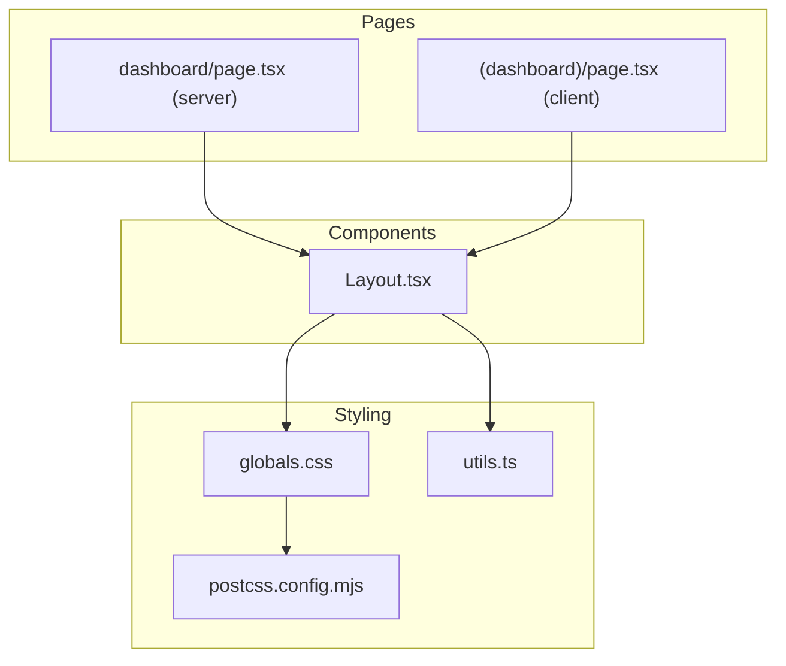
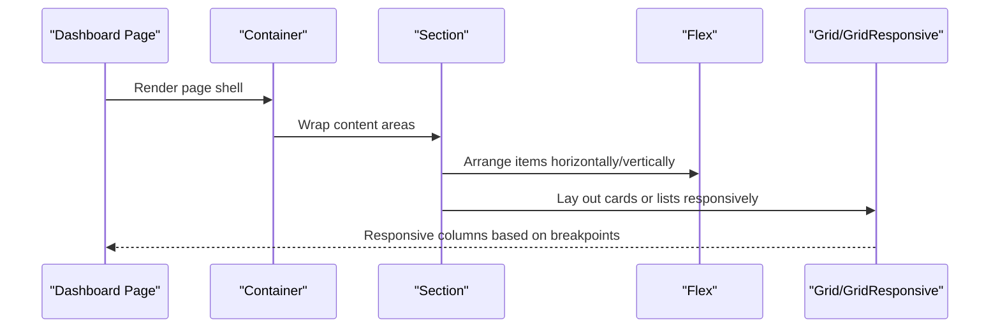
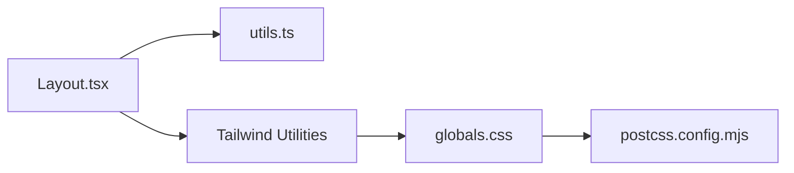

# Layout Components

<cite>
**Referenced Files in This Document**
- [Layout.tsx](file://veilend-web/src/components/Layout.tsx)
- [utils.ts](file://veilend-web/src/lib/utils.ts)
- [globals.css](file://veilend-web/src/app/globals.css)
- [postcss.config.mjs](file://veilend-web/postcss.config.mjs)
- [dashboard page (server)](file://veilend-web/src/app/dashboard/page.tsx)
- [dashboard page (client)](file://veilend-web/src/app/(dashboard)/page.tsx)
</cite>

## Table of Contents
1. Introduction
2. Project Structure
3. Core Components
4. Architecture Overview
5. Detailed Component Analysis
6. Dependency Analysis
7. Performance Considerations
8. Troubleshooting Guide
9. Conclusion
10. Appendices

## Introduction
This document explains the VeilLend layout component system focused on structural and responsive layout primitives: Container, Section, Flex, Grid, and GridResponsive. These components provide a consistent, mobile-first layout foundation built on Tailwind CSS utilities. They are used across pages to create predictable spacing, alignment, and grid layouts that adapt to different screen sizes.

The system emphasizes:
- Semantic structure via Container and Section
- Flexible arrangements with Flex
- Responsive grids with Grid and GridResponsive
- Mobile-first breakpoints using Tailwind’s default breakpoints
- Class composition via a utility function for safe merging

## Project Structure
The layout primitives live in a single component file and are consumed by dashboard pages. The styling is provided by Tailwind CSS v4 imported through PostCSS and global styles.

**Diagram sources**
- [Layout.tsx:1-219](file://veilend-web/src/components/Layout.tsx#L1-L219)
- [utils.ts:1-7](file://veilend-web/src/lib/utils.ts#L1-L7)
- [globals.css:1-161](file://veilend-web/src/app/globals.css#L1-L161)
- [postcss.config.mjs:1-8](file://veilend-web/postcss.config.mjs#L1-L8)
- [dashboard page (server):1-294](file://veilend-web/src/app/dashboard/page.tsx#L1-L294)
- [dashboard page (client):1-302](file://veilend-web/src/app/(dashboard)/page.tsx#L1-L302)

**Section sources**
- [Layout.tsx:1-219](file://veilend-web/src/components/Layout.tsx#L1-L219)
- [globals.css:1-161](file://veilend-web/src/app/globals.css#L1-L161)
- [postcss.config.mjs:1-8](file://veilend-web/postcss.config.mjs#L1-L8)

## Core Components
The layout system exposes five primitives:

- Container: A max-width wrapper with horizontal padding that adapts at sm and lg breakpoints.
- Section: A semantic section element with configurable vertical padding presets.
- Flex: A flexbox container with direction, justification, alignment, gap, and optional wrapping.
- Grid: A responsive grid with either a numeric column count or breakpoint-specific columns.
- GridResponsive: A fully responsive grid where you specify columns per breakpoint.

All components accept an optional className prop to extend or override styles.

Key behaviors:
- Mobile-first: Base styles apply to small screens; larger breakpoints add more columns or spacing.
- Gap tokens: Consistent spacing scale from none to xl.
- Safe class merging: Uses a utility to merge classes deterministically.

**Section sources**
- [Layout.tsx:4-18](file://veilend-web/src/components/Layout.tsx#L4-L18)
- [Layout.tsx:20-43](file://veilend-web/src/components/Layout.tsx#L20-L43)
- [Layout.tsx:45-108](file://veilend-web/src/components/Layout.tsx#L45-L108)
- [Layout.tsx:110-167](file://veilend-web/src/components/Layout.tsx#L110-L167)
- [Layout.tsx:169-208](file://veilend-web/src/components/Layout.tsx#L169-L208)
- [utils.ts:1-7](file://veilend-web/src/lib/utils.ts#L1-L7)

## Architecture Overview
The layout components compose Tailwind utility classes and render semantic HTML. Pages import these components to build dashboards and content sections.

**Diagram sources**
- [Layout.tsx:4-208](file://veilend-web/src/components/Layout.tsx#L4-L208)
- [dashboard page (server):100-166](file://veilend-web/src/app/dashboard/page.tsx#L100-L166)
- [dashboard page (client):100-131](file://veilend-web/src/app/(dashboard)/page.tsx#L100-L131)

## Detailed Component Analysis

### Container
Purpose:
- Provides a centered, constrained width container with responsive horizontal padding.

Props:
- children: React.ReactNode
- className?: string

Default behavior:
- Applies a max-width and horizontal padding that increases at sm and lg breakpoints.

Usage patterns:
- Wrap entire page content to ensure consistent margins and readability.

Accessibility:
- No special attributes required; it is a div wrapper.

**Section sources**
- [Layout.tsx:4-18](file://veilend-web/src/components/Layout.tsx#L4-L18)

### Section
Purpose:
- Adds semantic meaning and consistent vertical spacing between major page areas.

Props:
- children: React.ReactNode
- className?: string
- padding?: "none" | "sm" | "md" | "lg"

Defaults:
- padding defaults to md.

Behavior:
- Maps padding options to vertical spacing utilities.

Accessibility:
- Renders a semantic section element, improving document outline and assistive technology navigation.

**Section sources**
- [Layout.tsx:20-43](file://veilend-web/src/components/Layout.tsx#L20-L43)

### Flex
Purpose:
- Simplifies common flexbox configurations with typed props.

Props:
- children: React.ReactNode
- direction?: "row" | "col"
- justify?: "start" | "center" | "end" | "between" | "around" | "evenly"
- align?: "start" | "center" | "end" | "stretch"
- gap?: "none" | "sm" | "md" | "lg" | "xl"
- wrap?: boolean
- className?: string

Defaults:
- direction: row
- justify: start
- align: start
- gap: md
- wrap: false

Behavior:
- Composes flex utilities and optionally adds wrapping.

Accessibility:
- No special attributes required; use semantic elements inside when appropriate.

**Section sources**
- [Layout.tsx:45-108](file://veilend-web/src/components/Layout.tsx#L45-L108)

### Grid
Purpose:
- Creates responsive grids with either a simple numeric column count or breakpoint-specific configuration.

Props:
- children: React.ReactNode
- columns?: number | { sm?: number; md?: number; lg?: number; xl?: number }
- gap?: "none" | "sm" | "md" | "lg" | "xl"
- className?: string

Defaults:
- columns: 1
- gap: md

Behavior:
- Numeric mode maps to predefined responsive column sets.
- Object mode composes breakpoint-specific grid columns.

Accessibility:
- No special attributes required; ensure meaningful content order for screen readers.

**Section sources**
- [Layout.tsx:110-167](file://veilend-web/src/components/Layout.tsx#L110-L167)

### GridResponsive
Purpose:
- Explicitly define columns per breakpoint for fine-grained control.

Props:
- children: React.ReactNode
- columns?: { sm?: number; md?: number; lg?: number; xl?: number }
- gap?: "none" | "sm" | "md" | "lg" | "xl"
- className?: string

Defaults:
- columns: { sm: 1, md: 2, lg: 3 }
- gap: md

Behavior:
- Builds a grid with only the specified breakpoints active.

Accessibility:
- No special attributes required; maintain logical DOM order.

**Section sources**
- [Layout.tsx:169-208](file://veilend-web/src/components/Layout.tsx#L169-L208)

### Practical Usage Examples
Common patterns demonstrated in the codebase:

- Card grids: Use Grid or GridResponsive to lay out cards in rows that adapt from one column on mobile to multiple columns on larger screens.
- Content sections: Wrap page areas in Section with consistent vertical spacing.
- Flexible arrangements: Use Flex to align items, distribute space, and wrap content as needed.

References:
- Dashboard server page uses Container, Section, Grid, and Flex to structure metrics and lists.
- Dashboard client page uses native grid and flex patterns alongside UI primitives.

**Section sources**
- [dashboard page (server):100-166](file://veilend-web/src/app/dashboard/page.tsx#L100-L166)
- [dashboard page (server):168-241](file://veilend-web/src/app/dashboard/page.tsx#L168-L241)
- [dashboard page (server):243-290](file://veilend-web/src/app/dashboard/page.tsx#L243-L290)
- [dashboard page (client):100-131](file://veilend-web/src/app/(dashboard)/page.tsx#L100-L131)

## Dependency Analysis
The layout components depend on:
- Tailwind CSS utilities for layout and spacing
- A class merging utility to safely combine classes
- Global theme variables and base styles

**Diagram sources**
- [Layout.tsx:1-219](file://veilend-web/src/components/Layout.tsx#L1-L219)
- [utils.ts:1-7](file://veilend-web/src/lib/utils.ts#L1-L7)
- [globals.css:1-161](file://veilend-web/src/app/globals.css#L1-L161)
- [postcss.config.mjs:1-8](file://veilend-web/postcss.config.mjs#L1-L8)

**Section sources**
- [Layout.tsx:1-219](file://veilend-web/src/components/Layout.tsx#L1-L219)
- [utils.ts:1-7](file://veilend-web/src/lib/utils.ts#L1-L7)
- [globals.css:1-161](file://veilend-web/src/app/globals.css#L1-L161)
- [postcss.config.mjs:1-8](file://veilend-web/postcss.config.mjs#L1-L8)

## Performance Considerations
- Prefer GridResponsive over many nested conditionals for responsive columns to keep markup minimal and declarative.
- Use Flex for simple alignments instead of full grids when possible to reduce complexity.
- Keep children lightweight; avoid deeply nested layouts within each grid cell.
- Reuse Section and Container consistently to minimize style duplication and improve rendering predictability.
- Leverage Tailwind’s utility-driven approach to avoid heavy custom CSS.

[No sources needed since this section provides general guidance]

## Troubleshooting Guide
Common issues and resolutions:

- Overlapping or unexpected gaps:
  - Ensure gap values are set consistently on Grid/Flex and not overridden by className.
  - Verify no conflicting margin utilities are applied via className.

- Columns not responding as expected:
  - For Grid numeric mode, confirm the value is within supported mappings or falls back to dynamic columns.
  - For GridResponsive, verify that at least one breakpoint is defined; otherwise, it may default to a single column.

- Spacing inconsistencies:
  - Check Section padding presets and ensure they match design intent.
  - Confirm Container is wrapping content to enforce consistent max-width and margins.

- Class conflicts:
  - Rely on the class merging utility to resolve duplicate or conflicting utilities.

**Section sources**
- [Layout.tsx:110-208](file://veilend-web/src/components/Layout.tsx#L110-L208)
- [utils.ts:1-7](file://veilend-web/src/lib/utils.ts#L1-L7)

## Conclusion
The VeilLend layout system provides a concise, type-safe set of primitives for building responsive, accessible layouts. By combining Container and Section for structure, Flex for flexible arrangements, and Grid/GridResponsive for data-heavy layouts, teams can create consistent experiences across devices while leveraging Tailwind’s mobile-first design.

[No sources needed since this section summarizes without analyzing specific files]

## Appendices

### Responsive Design Approach
- Mobile-first: Base styles target small screens; larger breakpoints progressively enhance layouts.
- Breakpoints: Utilize Tailwind’s default breakpoints (sm, md, lg, xl) via Grid and GridResponsive props.
- Spacing: Use the standardized gap scale for consistent rhythm.

**Section sources**
- [Layout.tsx:110-208](file://veilend-web/src/components/Layout.tsx#L110-L208)
- [globals.css:1-161](file://veilend-web/src/app/globals.css#L1-L161)

### Accessibility Best Practices
- Use Section for major content blocks to improve semantic structure.
- Maintain logical DOM order so screen readers encounter content in a meaningful sequence.
- Provide sufficient contrast and readable text sizes within containers.
- Avoid relying solely on visual layout for conveying information; ensure content is understandable without CSS.

[No sources needed since this section provides general guidance]