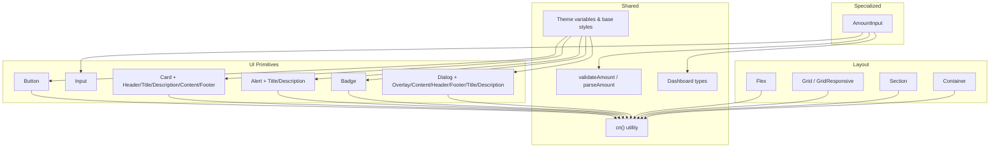
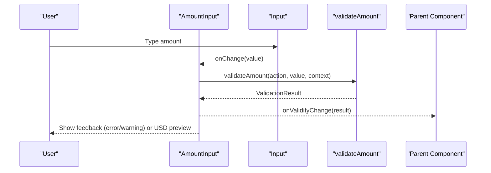
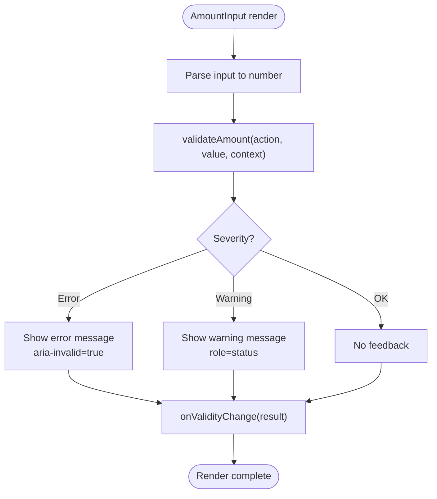
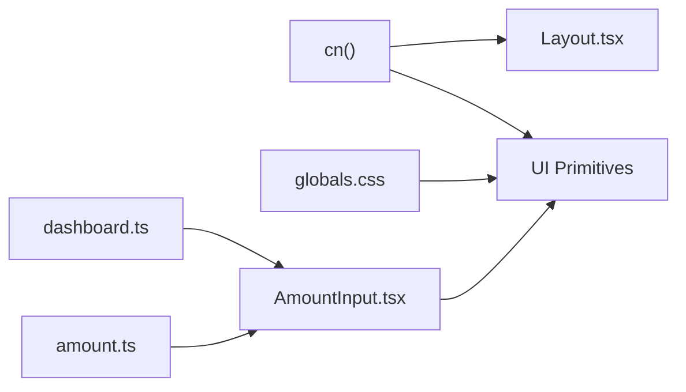

# UI Components & Design System

<cite>
**Referenced Files in This Document**
- [Layout.tsx](file://veilend-web/src/components/Layout.tsx)
- [AmountInput.tsx](file://veilend-web/src/components/AmountInput.tsx)
- [button.tsx](file://veilend-web/src/components/ui/button.tsx)
- [card.tsx](file://veilend-web/src/components/ui/card.tsx)
- [input.tsx](file://veilend-web/src/components/ui/input.tsx)
- [alert.tsx](file://veilend-web/src/components/ui/alert.tsx)
- [badge.tsx](file://veilend-web/src/components/ui/badge.tsx)
- [dialog.tsx](file://veilend-web/src/components/ui/dialog.tsx)
- [globals.css](file://veilend-web/src/app/globals.css)
- [utils.ts](file://veilend-web/src/lib/utils.ts)
- [amount.ts](file://veilend-web/src/lib/validation/amount.ts)
- [dashboard.ts](file://veilend-web/src/lib/types/dashboard.ts)
</cite>

## Table of Contents
1. Introduction
2. Project Structure
3. Core Components
4. Architecture Overview
5. Detailed Component Analysis
6. Dependency Analysis
7. Performance Considerations
8. Troubleshooting Guide
9. Conclusion
10. Appendices

## Introduction
This document describes the VeilLend web UI component library and design system. It focuses on reusable interface elements, their composition patterns, props/events, accessibility, responsive styling with Tailwind CSS, theming, states/animations, cross-browser considerations, and performance best practices. The layout wrapper is provided by Layout.tsx, and core UI primitives live under src/components/ui. Specialized components like AmountInput build on these primitives to deliver protocol-aware inputs with validation and feedback.

## Project Structure
The UI layer is organized into:
- Layout primitives for page structure (Container, Section, Flex, Grid, GridResponsive)
- Base UI primitives (Button, Input, Card, Alert, Badge, Dialog, etc.)
- Specialized components (AmountInput) that compose primitives and integrate validation
- Shared utilities and types (cn utility, validation helpers, dashboard types)
- Global theme variables and base styles

**Diagram sources**
- [Layout.tsx:1-219](file://veilend-web/src/components/Layout.tsx#L1-L219)
- [button.tsx:1-68](file://veilend-web/src/components/ui/button.tsx#L1-L68)
- [card.tsx:1-104](file://veilend-web/src/components/ui/card.tsx#L1-L104)
- [input.tsx:1-20](file://veilend-web/src/components/ui/input.tsx#L1-L20)
- [alert.tsx:1-39](file://veilend-web/src/components/ui/alert.tsx#L1-L39)
- [badge.tsx:1-50](file://veilend-web/src/components/ui/badge.tsx#L1-L50)
- [dialog.tsx:1-166](file://veilend-web/src/components/ui/dialog.tsx#L1-L166)
- [globals.css:1-161](file://veilend-web/src/app/globals.css#L1-L161)
- [utils.ts:1-7](file://veilend-web/src/lib/utils.ts#L1-L7)
- [amount.ts:1-143](file://veilend-web/src/lib/validation/amount.ts#L1-L143)
- [dashboard.ts:1-35](file://veilend-web/src/lib/types/dashboard.ts#L1-L35)

**Section sources**
- [Layout.tsx:1-219](file://veilend-web/src/components/Layout.tsx#L1-L219)
- [globals.css:1-161](file://veilend-web/src/app/globals.css#L1-L161)

## Core Components
- Layout primitives provide consistent spacing, alignment, and grid structures using Tailwind classes via a shared cn utility.
- Button supports multiple variants and sizes, keyboard focus management, and accessible attributes.
- Input provides a styled native input with focus rings and error states.
- Card composes header, title, description, content, footer, and action areas with consistent spacing and visual hierarchy.
- Alert surfaces messages with semantic roles and variants.
- Badge offers compact status indicators with variants.
- Dialog wraps Radix primitives for accessible overlays with animations and focus management.
- AmountInput composes Input with validation logic to enforce protocol constraints and surface warnings/errors.

**Section sources**
- [Layout.tsx:1-219](file://veilend-web/src/components/Layout.tsx#L1-L219)
- [button.tsx:1-68](file://veilend-web/src/components/ui/button.tsx#L1-L68)
- [input.tsx:1-20](file://veilend-web/src/components/ui/input.tsx#L1-L20)
- [card.tsx:1-104](file://veilend-web/src/components/ui/card.tsx#L1-L104)
- [alert.tsx:1-39](file://veilend-web/src/components/ui/alert.tsx#L1-L39)
- [badge.tsx:1-50](file://veilend-web/src/components/ui/badge.tsx#L1-L50)
- [dialog.tsx:1-166](file://veilend-web/src/components/ui/dialog.tsx#L1-L166)
- [AmountInput.tsx:1-123](file://veilend-web/src/components/AmountInput.tsx#L1-L123)

## Architecture Overview
The design system is built around a small set of primitives that are composed into higher-level components. Theming is centralized in global CSS variables and applied through Tailwind classes. Validation is decoupled from UI and reused by specialized components.

**Diagram sources**
- [AmountInput.tsx:1-123](file://veilend-web/src/components/AmountInput.tsx#L1-L123)
- [amount.ts:1-143](file://veilend-web/src/lib/validation/amount.ts#L1-L143)
- [input.tsx:1-20](file://veilend-web/src/components/ui/input.tsx#L1-L20)

## Detailed Component Analysis

### Layout.tsx (Container, Section, Flex, Grid, GridResponsive)
- Purpose: Provide structural building blocks for pages and sections with consistent spacing and responsive grids.
- Key props:
  - Container: children, className
  - Section: children, className, padding ("none" | "sm" | "md" | "lg")
  - Flex: children, direction ("row" | "col"), justify, align, gap ("none" | "sm" | "md" | "lg" | "xl"), wrap, className
  - Grid: children, columns (number or breakpoints), gap, className
  - GridResponsive: children, columns (breakpoints), gap, className
- Events: None directly; pass events to children.
- Slots: All accept ReactNode children.
- Customization: Use className to override or extend; leverage gap and column options for responsive layouts.
- Accessibility: Semantic section element used for Section; ensure meaningful headings inside.
- Responsive: Grid and GridResponsive support breakpoint-based columns; Flex supports wrapping.
- Styling approach: Uses Tailwind classes via cn utility for predictable merging.

Usage example references:
- Compose a responsive card grid with Grid and Card components.
- Arrange items with Flex for toolbars or form rows.

**Section sources**
- [Layout.tsx:1-219](file://veilend-web/src/components/Layout.tsx#L1-L219)

### Button (ui/button.tsx)
- Purpose: Accessible, themed button with variants and sizes.
- Props: variant ("default" | "outline" | "secondary" | "ghost" | "destructive" | "link"), size ("default" | "xs" | "sm" | "lg" | "icon" | "icon-xs" | "icon-sm" | "icon-lg"), asChild, plus standard button props.
- Events: Standard button events (onClick, onKeyDown, etc.).
- Slots: Supports asChild to render as another component while preserving behavior.
- Customization: Variants and sizes control appearance; className can be extended.
- Accessibility: Focus-visible ring, aria-invalid state styling, keyboard navigation.
- States: Hover, focus-visible, active, disabled, aria-expanded contexts.
- Animations: Transitions on color and transform where applicable.

Usage example references:
- Primary actions with default variant; destructive actions with destructive variant; icon-only buttons with icon size.

**Section sources**
- [button.tsx:1-68](file://veilend-web/src/components/ui/button.tsx#L1-L68)

### Input (ui/input.tsx)
- Purpose: Styled native input with focus rings and error states.
- Props: type, className, and all standard input props.
- Events: Standard input events (onChange, onBlur, onFocus).
- Slots: None beyond standard input content.
- Customization: className overrides; use data-slot="input" for testing hooks if needed.
- Accessibility: Focus-visible ring, aria-invalid styling for errors.
- States: Disabled, focus-visible, aria-invalid.

Usage example references:
- Text fields, numeric inputs with appropriate inputMode and validation.

**Section sources**
- [input.tsx:1-20](file://veilend-web/src/components/ui/input.tsx#L1-L20)

### Card (ui/card.tsx)
- Purpose: Composable card with header, title, description, content, footer, and optional action area.
- Props:
  - Card: size ("default" | "sm"), className, and div props
  - CardHeader, CardTitle, CardDescription, CardAction, CardContent, CardFooter: className and respective element props
- Events: Pass-through to underlying elements.
- Slots: Each part renders its own slot; combine to build structured cards.
- Customization: Size affects spacing and typography; className for overrides.
- Accessibility: Semantic headings for titles; proper nesting for screen readers.
- States: Visual grouping with borders and shadows; image handling for rounded corners.

Usage example references:
- Build a dashboard metric card with CardHeader, CardTitle, CardDescription, CardContent, and CardFooter.

**Section sources**
- [card.tsx:1-104](file://veilend-web/src/components/ui/card.tsx#L1-L104)

### Alert (ui/alert.tsx)
- Purpose: Display important messages with semantic role.
- Props: variant ("default" | "destructive"), className, and div props.
- Subcomponents: AlertTitle, AlertDescription.
- Events: None specific; pass-through.
- Slots: Content via children.
- Customization: Variants for emphasis; className for overrides.
- Accessibility: role="alert" on root; semantic heading for title.

Usage example references:
- Show success or error notifications within forms or dashboards.

**Section sources**
- [alert.tsx:1-39](file://veilend-web/src/components/ui/alert.tsx#L1-L39)

### Badge (ui/badge.tsx)
- Purpose: Compact status indicators.
- Props: variant ("default" | "secondary" | "destructive" | "outline" | "ghost" | "link"), asChild, className.
- Events: None specific; pass-through.
- Slots: asChild allows rendering as link or other interactive element.
- Customization: Variants for meaning; className for overrides.
- Accessibility: Suitable for inline status; avoid conveying critical info solely via color.

Usage example references:
- Tag assets, show protocol status, or highlight features.

**Section sources**
- [badge.tsx:1-50](file://veilend-web/src/components/ui/badge.tsx#L1-L50)

### Dialog (ui/dialog.tsx)
- Purpose: Accessible modal overlay with focus management and animations.
- Subcomponents: Dialog, DialogTrigger, DialogPortal, DialogClose, DialogOverlay, DialogContent, DialogHeader, DialogFooter, DialogTitle, DialogDescription.
- Props: Standard Radix props passed through; DialogContent accepts showCloseButton.
- Events: Controlled open/close via Radix props; close via DialogClose or backdrop.
- Slots: Content via children; header/footer slots for layout.
- Customization: Overlay and content classes; animation classes for fade/zoom transitions.
- Accessibility: Focus trap, ARIA roles, keyboard navigation, screen reader announcements.
- States: Open/closed with animated transitions; focus management.

Usage example references:
- Confirmation dialogs, settings modals, or multi-step flows.

**Section sources**
- [dialog.tsx:1-166](file://veilend-web/src/components/ui/dialog.tsx#L1-L166)

### AmountInput (components/AmountInput.tsx)
- Purpose: Controlled amount input with inline validation for protocol actions (DEPOSIT, BORROW, REPAY, WITHDRAW).
- Props:
  - action: ActivityActionType
  - context: ValidationContext (availableBalance, borrowLimitUsd?, outstandingDebt?, priceUsd, decimals?)
  - assetSymbol: string
  - value: string
  - onChange: (value: string) => void
  - onValidityChange?: (result: ValidationResult) => void
  - disabled?: boolean
- Events: onChange for value updates; onValidityChange for enabling/disabling submit based on validity.
- Slots: Renders an Input and Max button; shows feedback text and USD preview.
- Customization: className can be extended on Input; feedback styling uses semantic roles.
- Accessibility: aria-invalid when there is an error; aria-describedby links to feedback; role="alert" for errors and role="status" for warnings.
- States: Touched state controls when feedback appears; error vs warning severity; disabled state.
- Validation: Uses validateAmount and parseAmount to enforce precision, balance limits, borrow limits, and debt constraints; shows USD preview using Intl.NumberFormat.

Usage example references:
- Deposit/Borrow/Repay/Withdraw forms where user input must respect balances and protocol rules.

**Diagram sources**
- [AmountInput.tsx:1-123](file://veilend-web/src/components/AmountInput.tsx#L1-L123)
- [amount.ts:1-143](file://veilend-web/src/lib/validation/amount.ts#L1-L143)

**Section sources**
- [AmountInput.tsx:1-123](file://veilend-web/src/components/AmountInput.tsx#L1-L123)
- [amount.ts:1-143](file://veilend-web/src/lib/validation/amount.ts#L1-L143)
- [dashboard.ts:1-35](file://veilend-web/src/lib/types/dashboard.ts#L1-L35)

## Dependency Analysis
- Layout components depend on the cn utility for class merging.
- UI primitives depend on Tailwind classes and theme variables defined in globals.css.
- AmountInput depends on validation helpers and dashboard types.
- Dialog relies on Radix primitives for accessibility and behavior.

**Diagram sources**
- [utils.ts:1-7](file://veilend-web/src/lib/utils.ts#L1-L7)
- [globals.css:1-161](file://veilend-web/src/app/globals.css#L1-L161)
- [dashboard.ts:1-35](file://veilend-web/src/lib/types/dashboard.ts#L1-L35)
- [amount.ts:1-143](file://veilend-web/src/lib/validation/amount.ts#L1-L143)
- [Layout.tsx:1-219](file://veilend-web/src/components/Layout.tsx#L1-L219)
- [AmountInput.tsx:1-123](file://veilend-web/src/components/AmountInput.tsx#L1-L123)

**Section sources**
- [utils.ts:1-7](file://veilend-web/src/lib/utils.ts#L1-L7)
- [globals.css:1-161](file://veilend-web/src/app/globals.css#L1-L161)
- [dashboard.ts:1-35](file://veilend-web/src/lib/types/dashboard.ts#L1-L35)
- [amount.ts:1-143](file://veilend-web/src/lib/validation/amount.ts#L1-L143)
- [Layout.tsx:1-219](file://veilend-web/src/components/Layout.tsx#L1-L219)
- [AmountInput.tsx:1-123](file://veilend-web/src/components/AmountInput.tsx#L1-L123)

## Performance Considerations
- Prefer memoization for derived values (e.g., AmountInput uses useMemo for validation results).
- Avoid unnecessary re-renders by keeping controlled inputs minimal and delegating heavy computations to validation utilities.
- Use CSS transitions and animations sparingly; rely on Tailwind’s built-in utilities for performance.
- Keep component trees shallow; compose primitives rather than deep nested custom wrappers.
- Leverage lazy loading for non-critical UI (e.g., dialogs) when appropriate.

[No sources needed since this section provides general guidance]

## Troubleshooting Guide
- Invalid amounts: Ensure parseAmount returns a valid number; check decimal precision and positive values.
- Exceeds balance or limits: Verify ValidationContext values (availableBalance, borrowLimitUsd, outstandingDebt, priceUsd).
- Feedback not showing: Confirm touched state is set on blur or change; ensure result.message exists.
- Accessibility issues: Verify aria-invalid and aria-describedby are correctly bound; ensure roles are set for alerts/status.
- Theme mismatches: Check CSS variables in globals.css and ensure dark mode classes are applied where needed.

**Section sources**
- [amount.ts:1-143](file://veilend-web/src/lib/validation/amount.ts#L1-L143)
- [AmountInput.tsx:1-123](file://veilend-web/src/components/AmountInput.tsx#L1-L123)
- [globals.css:1-161](file://veilend-web/src/app/globals.css#L1-L161)

## Conclusion
The VeilLend UI component library provides a cohesive, accessible, and responsive design system built on Tailwind CSS and Radix primitives. Layout components offer consistent structure, while UI primitives deliver standardized interactions. AmountInput demonstrates how to compose primitives with domain-specific validation to create robust, user-friendly forms. Follow the guidelines for responsive design, accessibility, theming, and performance to maintain consistency and quality across the application.

[No sources needed since this section summarizes without analyzing specific files]

## Appendices

### Responsive Design Guidelines (Tailwind CSS)
- Use Grid and GridResponsive for adaptive layouts; prefer breakpoint-based columns for scalability.
- Apply Flex for flexible arrangements; use wrap for smaller screens.
- Rely on Tailwind’s spacing scale and container widths for consistent margins and paddings.
- Test at common breakpoints (sm, md, lg, xl) to ensure readability and usability.

[No sources needed since this section provides general guidance]

### Accessibility Compliance (WCAG)
- Use semantic HTML elements (section, h1–h6, button, input) appropriately.
- Provide visible focus indicators and keyboard navigation.
- Associate labels and descriptions with inputs using aria-describedby and ids.
- Announce errors and warnings with roles="alert" or role="status".
- Ensure sufficient color contrast for text and interactive elements.

[No sources needed since this section provides general guidance]

### Consistent Theming Patterns
- Centralize colors, radii, and shadows in CSS variables under :root and .dark.
- Map theme tokens to Tailwind via @theme for consistent usage across components.
- Use data-slot attributes for testing and targeting without tight coupling to class names.

**Section sources**
- [globals.css:1-161](file://veilend-web/src/app/globals.css#L1-L161)

### Cross-Browser Compatibility
- Prefer widely supported CSS features (flexbox, grid, transitions).
- Use fallbacks for advanced features (e.g., backdrop-filter) via conditional classes.
- Test focus-visible behavior and animations across browsers.

[No sources needed since this section provides general guidance]

### Usage Examples (References)
- Layout composition: Combine Container, Section, Flex, and Grid to build dashboards.
- Form composition: Use Input and AmountInput with validation to collect amounts safely.
- Alerts and badges: Surface status and notifications consistently.
- Dialogs: Wrap complex workflows in accessible overlays with clear actions.

[No sources needed since this section provides general guidance]