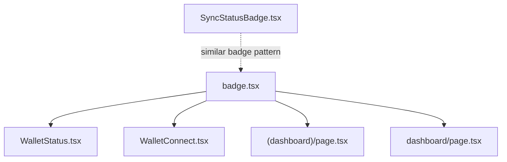
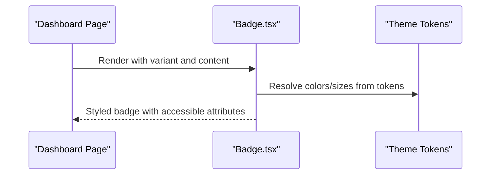
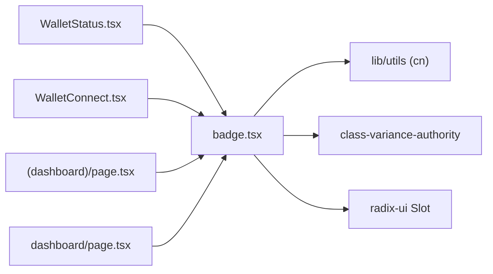

# Badge Component

<cite>
**Referenced Files in This Document**
- [badge.tsx](file://veilend-web/src/components/ui/badge.tsx)
- [page.tsx (Dashboard)](file://veilend-web/src/app/(dashboard)/page.tsx)
- [page.tsx (Server Dashboard)](file://veilend-web/src/app/dashboard/page.tsx)
- [WalletConnect.tsx](file://veilend-web/src/components/WalletConnect.tsx)
- [WalletStatus.tsx](file://veilend-web/src/components/WalletStatus.tsx)
- [SyncStatusBadge.tsx](file://veilend-web/src/components/SyncStatusBadge.tsx)
</cite>

## Table of Contents
1. [Introduction](#introduction)
2. [Project Structure](#project-structure)
3. [Core Components](#core-components)
4. [Architecture Overview](#architecture-overview)
5. [Detailed Component Analysis](#detailed-component-analysis)
6. [Dependency Analysis](#dependency-analysis)
7. [Performance Considerations](#performance-considerations)
8. [Troubleshooting Guide](#troubleshooting-guide)
9. [Conclusion](#conclusion)
10. [Appendices](#appendices)

## Introduction
This document provides comprehensive documentation for the Badge component used across the Veillend web application. It covers variants, sizes, colors, usage patterns (status indicators, notifications, labels), composition with icons and counters, interactive badges, styling customization, positioning options, accessibility features, and consistent usage guidelines for tables, cards, and navigation elements.

## Project Structure
The Badge component is implemented as a reusable UI primitive and consumed by multiple screens and components to communicate status, actions, and metadata.

**Diagram sources**
- [badge.tsx:1-50](file://veilend-web/src/components/ui/badge.tsx#L1-L50)
- [WalletStatus.tsx:1-155](file://veilend-web/src/components/WalletStatus.tsx#L1-L155)
- [WalletConnect.tsx:1-378](file://veilend-web/src/components/WalletConnect.tsx#L1-L378)
- [(dashboard)/page.tsx:1-302](file://veilend-web/src/app/(dashboard)/page.tsx#L1-L302)
- [dashboard/page.tsx:1-294](file://veilend-web/src/app/dashboard/page.tsx#L1-L294)

**Section sources**
- [badge.tsx:1-50](file://veilend-web/src/components/ui/badge.tsx#L1-L50)
- [WalletStatus.tsx:1-155](file://veilend-web/src/components/WalletStatus.tsx#L1-L155)
- [WalletConnect.tsx:1-378](file://veilend-web/src/components/WalletConnect.tsx#L1-L378)
- [(dashboard)/page.tsx:1-302](file://veilend-web/src/app/(dashboard)/page.tsx#L1-L302)
- [dashboard/page.tsx:1-294](file://veilend-web/src/app/dashboard/page.tsx#L1-L294)

## Core Components
- Badge primitive: A small, inline element that conveys status or category using color and text. It supports multiple semantic variants and integrates with theme tokens via class utilities.
- Consumers:
  - WalletStatus: Shows connection state and errors using badges.
  - WalletConnect: Displays connected wallet address and status.
  - Dashboard pages: Use badges for asset filters, risk engine labels, and table statuses.
  - SyncStatusBadge: A custom badge-like indicator for live sync states (conceptual reference).

Key responsibilities:
- Provide accessible, theme-aware visual signals.
- Support composition with icons and counters.
- Maintain consistent sizing and spacing.

**Section sources**
- [badge.tsx:1-50](file://veilend-web/src/components/ui/badge.tsx#L1-L50)
- [WalletStatus.tsx:1-155](file://veilend-web/src/components/WalletStatus.tsx#L1-L155)
- [WalletConnect.tsx:1-378](file://veilend-web/src/components/WalletConnect.tsx#L1-L378)
- [(dashboard)/page.tsx:1-302](file://veilend-web/src/app/(dashboard)/page.tsx#L1-L302)
- [dashboard/page.tsx:1-294](file://veilend-web/src/app/dashboard/page.tsx#L1-L294)

## Architecture Overview
The Badge component uses a variant system to apply consistent styles based on semantic meaning. Consumers select a variant and optionally override styles via className. Icons are supported inside the badge without interfering with pointer events.

**Diagram sources**
- [badge.tsx:7-47](file://veilend-web/src/components/ui/badge.tsx#L7-L47)
- [(dashboard)/page.tsx:140-197](file://veilend-web/src/app/(dashboard)/page.tsx#L140-L197)
- [dashboard/page.tsx:149-156](file://veilend-web/src/app/dashboard/page.tsx#L149-L156)

## Detailed Component Analysis

### Badge Primitive
- Variants: default, secondary, destructive, outline, ghost, link.
- Sizing: Fixed height and padding; designed for compact inline use.
- Colors: Derived from theme tokens (primary, secondary, destructive, border, foreground).
- Accessibility: Focus ring support, aria-invalid integration, keyboard focus behavior.
- Composition: Supports inline icons; icon classes prevent pointer events to avoid click-through issues.
- Interactivity: Can wrap links; hover states defined per variant.

Usage examples in codebase:
- Status labels in dashboard headers and tables.
- Connection status in wallet components.
- Action type labels in activity lists.

**Section sources**
- [badge.tsx:7-47](file://veilend-web/src/components/ui/badge.tsx#L7-L47)
- [WalletStatus.tsx:60-88](file://veilend-web/src/components/WalletStatus.tsx#L60-L88)
- [WalletConnect.tsx:201-218](file://veilend-web/src/components/WalletConnect.tsx#L201-L218)
- [(dashboard)/page.tsx:140-197](file://veilend-web/src/app/(dashboard)/page.tsx#L140-L197)
- [dashboard/page.tsx:149-156](file://veilend-web/src/app/dashboard/page.tsx#L149-L156)

### Usage Patterns

#### Status Indicators
- Connection status: Connected/Disconnected/Error states shown with appropriate variants and colors.
- Live sync status: Custom badge-like indicator shows Idle, Syncing, Live, Stale, Offline with icons and relative timestamps.

Examples:
- WalletStatus uses destructive for errors, outline for requirements, secondary for connected.
- SyncStatusBadge composes icons and dynamic labels for real-time state.

**Section sources**
- [WalletStatus.tsx:60-135](file://veilend-web/src/components/WalletStatus.tsx#L60-L135)
- [SyncStatusBadge.tsx:18-53](file://veilend-web/src/components/SyncStatusBadge.tsx#L18-L53)

#### Notifications and Labels
- Asset filters and section labels: Outline badges for contextual tags like “USDC / XLM Only” and “Risk Engine”.
- Activity action types: Outline badges with dynamic color classes for deposit, borrow, repay, withdraw.

Examples:
- Dashboard page uses outline badges for asset scope and risk engine label.
- Server dashboard applies conditional variant selection based on health factor.

**Section sources**
- [(dashboard)/page.tsx:140-197](file://veilend-web/src/app/(dashboard)/page.tsx#L140-L197)
- [dashboard/page.tsx:26-39](file://veilend-web/src/app/dashboard/page.tsx#L26-L39)
- [dashboard/page.tsx:254-266](file://veilend-web/src/app/dashboard/page.tsx#L254-L266)

#### Badges with Icons and Counters
- Icons: Inline icons are supported; ensure they do not capture pointer events.
- Counters: Add numeric values inside the badge for notification counts or totals.

Guidelines:
- Keep badges concise; prefer short labels.
- Use icons sparingly to maintain clarity.
- For counters, ensure sufficient contrast and readable font size.

[No sources needed since this section provides general guidance]

#### Interactive Badges
- Wrapping links: Some variants include hover states suitable for clickable badges.
- Ensure proper focus management and keyboard accessibility when making badges interactive.

Example references:
- Variant definitions include link and anchor hover behaviors.

**Section sources**
- [badge.tsx:10-27](file://veilend-web/src/components/ui/badge.tsx#L10-L27)

### Styling Customization
- Overriding styles: Use className to adjust background, text, borders, and spacing while preserving core layout.
- Theme tokens: Rely on primary, secondary, destructive, border, and foreground tokens for consistency.
- Dark mode: Variants include dark-mode adjustments for readability.

Recommendations:
- Prefer variant selection over ad-hoc overrides.
- When overriding, maintain focus rings and contrast ratios.

**Section sources**
- [badge.tsx:7-47](file://veilend-web/src/components/ui/badge.tsx#L7-L47)

### Positioning Options
- Inline display: Designed for inline-flex; fits naturally within text flows.
- Grouping: Use flex containers to align badges with other UI elements.
- Placement: Place near relevant context (headers, table cells, list items).

[No sources needed since this section provides general guidance]

### Accessibility Features
- Keyboard focus: Focus-visible ring ensures visibility for keyboard users.
- Semantic roles: Use role="status" and aria-live for dynamic updates where applicable.
- Invalid states: aria-invalid integrates with form validation feedback.

Examples:
- SyncStatusBadge uses role="status" and aria-live for screen reader announcements.

**Section sources**
- [badge.tsx:7-47](file://veilend-web/src/components/ui/badge.tsx#L7-L47)
- [SyncStatusBadge.tsx:22-34](file://veilend-web/src/components/SyncStatusBadge.tsx#L22-L34)

### Use Cases Across UI Elements

#### Tables
- Use badges to indicate operation status or execution results in table cells.
- Keep labels short and meaningful; pair with icons if helpful.

Example:
- Dashboard table rows show operation outcomes with colored badges.

**Section sources**
- [(dashboard)/page.tsx:276-294](file://veilend-web/src/app/(dashboard)/page.tsx#L276-L294)

#### Cards
- Use badges in card headers to denote scope or category (e.g., asset filter, engine label).
- Maintain consistent spacing and alignment with card titles.

Example:
- Card headers include outline badges for “USDC / XLM Only” and “Risk Engine”.

**Section sources**
- [(dashboard)/page.tsx:136-143](file://veilend-web/src/app/(dashboard)/page.tsx#L136-L143)
- [(dashboard)/page.tsx:192-199](file://veilend-web/src/app/(dashboard)/page.tsx#L192-L199)

#### Navigation Elements
- Use badges to highlight active sections or unread counts in navigation.
- Ensure badges do not obstruct navigation affordances.

[No sources needed since this section provides general guidance]

## Dependency Analysis
The Badge component depends on utility functions and libraries for variant styling and rendering. Consumers import and render it within their contexts.

**Diagram sources**
- [badge.tsx:1-6](file://veilend-web/src/components/ui/badge.tsx#L1-L6)
- [WalletStatus.tsx:1-10](file://veilend-web/src/components/WalletStatus.tsx#L1-L10)
- [WalletConnect.tsx:1-16](file://veilend-web/src/components/WalletConnect.tsx#L1-L16)
- [(dashboard)/page.tsx:15-18](file://veilend-web/src/app/(dashboard)/page.tsx#L15-L18)
- [dashboard/page.tsx:1-5](file://veilend-web/src/app/dashboard/page.tsx#L1-L5)

**Section sources**
- [badge.tsx:1-6](file://veilend-web/src/components/ui/badge.tsx#L1-L6)
- [WalletStatus.tsx:1-10](file://veilend-web/src/components/WalletStatus.tsx#L1-L10)
- [WalletConnect.tsx:1-16](file://veilend-web/src/components/WalletConnect.tsx#L1-L16)
- [(dashboard)/page.tsx:15-18](file://veilend-web/src/app/(dashboard)/page.tsx#L15-L18)
- [dashboard/page.tsx:1-5](file://veilend-web/src/app/dashboard/page.tsx#L1-L5)

## Performance Considerations
- Minimal DOM: Badge renders a lightweight span or slot root.
- CSS-in-JS alternative: Uses class utilities for efficient styling.
- Icon handling: Prevents unnecessary event listeners on icons.

Best practices:
- Avoid excessive nesting around badges.
- Reuse variants instead of creating many custom styles.

[No sources needed since this section provides general guidance]

## Troubleshooting Guide
Common issues and resolutions:
- Contrast problems: Ensure sufficient contrast between badge text and background; prefer theme tokens.
- Focus visibility: Verify focus-visible ring is visible in all themes; do not remove focus styles.
- Icon interactions: If icons intercept clicks, ensure pointer-events are disabled on nested SVGs.
- Dynamic updates: Use role="status" and aria-live for screen readers when badge content changes frequently.

References:
- Focus and invalid states are handled in the base component.
- SyncStatusBadge demonstrates dynamic status updates with accessibility attributes.

**Section sources**
- [badge.tsx:7-47](file://veilend-web/src/components/ui/badge.tsx#L7-L47)
- [SyncStatusBadge.tsx:22-34](file://veilend-web/src/components/SyncStatusBadge.tsx#L22-L34)

## Conclusion
The Badge component provides a consistent, accessible way to communicate status, categories, and metadata across the application. By selecting appropriate variants, composing with icons and counters, and following accessibility guidelines, teams can maintain a cohesive user experience in tables, cards, and navigation elements.

[No sources needed since this section summarizes without analyzing specific files]

## Appendices

### Variants Reference
- default: Primary background and foreground; suitable for main actions or highlights.
- secondary: Secondary background and foreground; useful for less prominent labels.
- destructive: Subtle background with strong text; ideal for error or warning states.
- outline: Border-based style; good for tags and filters.
- ghost: Transparent with hover; minimal presence.
- link: Underlined text; indicates interactivity.

**Section sources**
- [badge.tsx:10-27](file://veilend-web/src/components/ui/badge.tsx#L10-L27)

### Example Usage Paths
- Dashboard headers and tables: [(dashboard)/page.tsx:140-197](file://veilend-web/src/app/(dashboard)/page.tsx#L140-L197), [(dashboard)/page.tsx:276-294](file://veilend-web/src/app/(dashboard)/page.tsx#L276-L294)
- Health factor badge: [dashboard/page.tsx:149-156](file://veilend-web/src/app/dashboard/page.tsx#L149-L156)
- Wallet connection status: [WalletConnect.tsx:201-218](file://veilend-web/src/components/WalletConnect.tsx#L201-L218), [WalletStatus.tsx:60-135](file://veilend-web/src/components/WalletStatus.tsx#L60-L135)
- Sync status indicator: [SyncStatusBadge.tsx:18-53](file://veilend-web/src/components/SyncStatusBadge.tsx#L18-L53)