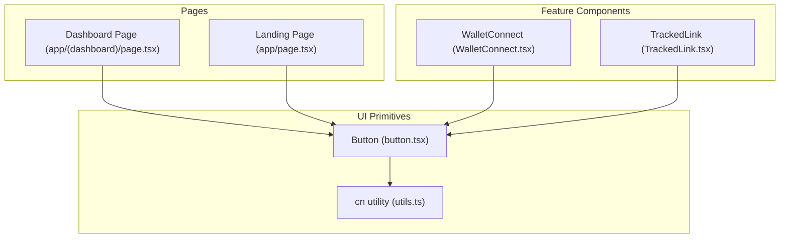
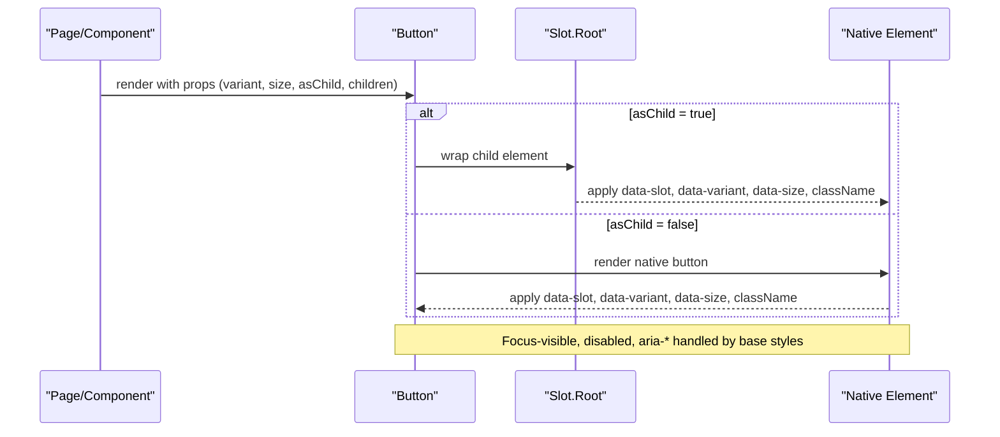
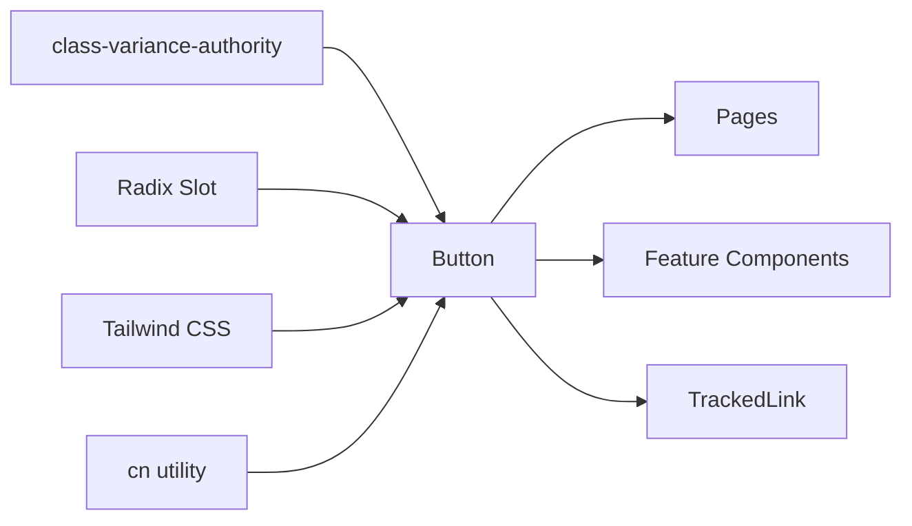

# Button Component

<cite>
**Referenced Files in This Document**
- [button.tsx](file://veilend-web/src/components/ui/button.tsx)
- [utils.ts](file://veilend-web/src/lib/utils.ts)
- [page.tsx](file://veilend-web/src/app/(dashboard)/page.tsx)
- [page.tsx](file://veilend-web/src/app/page.tsx)
- [WalletConnect.tsx](file://veilend-web/src/components/WalletConnect.tsx)
- [TrackedLink.tsx](file://veilend-web/src/components/TrackedLink.tsx)
</cite>

## Table of Contents
1. Introduction
2. Project Structure
3. Core Components
4. Architecture Overview
5. Detailed Component Analysis
6. Dependency Analysis
7. Performance Considerations
8. Troubleshooting Guide
9. Conclusion
10. Appendices

## Introduction
This document provides comprehensive documentation for the Button component used across the web application. It covers available props, variant styles, sizes, states, color schemes, icon integration, event handling patterns, accessibility features, composition with other components, and performance considerations. The goal is to help developers use the Button consistently and effectively throughout the UI.

## Project Structure
The Button component lives under the shared UI primitives and is consumed by pages and feature components:
- UI primitive: Button implementation and variants
- Utilities: class name merging helper
- Usage examples: dashboard page, landing page, wallet connect flow, tracked link wrapper

**Diagram sources**
- [button.tsx:1-68](file://veilend-web/src/components/ui/button.tsx#L1-L68)
- [utils.ts:1-7](file://veilend-web/src/lib/utils.ts#L1-L7)
- [page.tsx:79-96](file://veilend-web/src/app/(dashboard)/page.tsx#L79-L96)
- [page.tsx:100-127](file://veilend-web/src/app/page.tsx#L100-L127)
- [WalletConnect.tsx:121-147](file://veilend-web/src/components/WalletConnect.tsx#L121-L147)
- [TrackedLink.tsx:1-47](file://veilend-web/src/components/TrackedLink.tsx#L1-L47)

**Section sources**
- [button.tsx:1-68](file://veilend-web/src/components/ui/button.tsx#L1-L68)
- [utils.ts:1-7](file://veilend-web/src/lib/utils.ts#L1-L7)
- [page.tsx:79-96](file://veilend-web/src/app/(dashboard)/page.tsx#L79-L96)
- [page.tsx:100-127](file://veilend-web/src/app/page.tsx#L100-L127)
- [WalletConnect.tsx:121-147](file://veilend-web/src/components/WalletConnect.tsx#L121-L147)
- [TrackedLink.tsx:1-47](file://veilend-web/src/components/TrackedLink.tsx#L1-L47)

## Core Components
- Button: A flexible, accessible button built with class-variance-authority for variants and sizes, and Radix Slot for composition. It supports multiple visual variants, sizes, disabled state, focus-visible styling, and invalid state styling via aria attributes.
- TrackedLink: A reusable anchor styled as a button using the same variant system, enabling analytics tracking while preserving link semantics.

Key capabilities:
- Variants: default, outline, secondary, ghost, destructive, link
- Sizes: default, xs, sm, lg, icon, icon-xs, icon-sm, icon-lg
- States: disabled, focus-visible, aria-invalid, aria-expanded (via parent context)
- Composition: asChild prop enables rendering as any element (e.g., Link) without losing behavior
- Styling: Tailwind classes merged via cn utility; icons are automatically sized and non-pointer-events when nested

**Section sources**
- [button.tsx:7-42](file://veilend-web/src/components/ui/button.tsx#L7-L42)
- [button.tsx:44-65](file://veilend-web/src/components/ui/button.tsx#L44-L65)
- [TrackedLink.tsx:1-47](file://veilend-web/src/components/TrackedLink.tsx#L1-L47)
- [utils.ts:1-7](file://veilend-web/src/lib/utils.ts#L1-L7)

## Architecture Overview
The Button component is a presentational primitive that composes well with other UI elements. It uses:
- class-variance-authority to manage variant/style combinations
- Radix Slot to support asChild composition
- Tailwind CSS for styling and responsive design
- cn utility for safe class merging

**Diagram sources**
- [button.tsx:44-65](file://veilend-web/src/components/ui/button.tsx#L44-L65)

## Detailed Component Analysis

### Props and API
- variant: Controls visual style. Supported values include default, outline, secondary, ghost, destructive, link.
- size: Controls dimensions and spacing. Supported values include default, xs, sm, lg, icon, icon-xs, icon-sm, icon-lg.
- asChild: When true, renders via Radix Slot to compose with other interactive elements (e.g., Next.js Link).
- className: Additional classes merged into the final class list.
- All standard HTML button attributes are supported (e.g., onClick, disabled, type, aria-*).

Notes:
- Default values: variant defaults to default; size defaults to default.
- Data attributes: data-slot="button", data-variant, data-size are set for consistent targeting.

**Section sources**
- [button.tsx:7-42](file://veilend-web/src/components/ui/button.tsx#L7-L42)
- [button.tsx:44-65](file://veilend-web/src/components/ui/button.tsx#L44-L65)

### Variant Styles
- default: Primary action style with background and foreground colors from theme tokens.
- outline: Outlined style suitable for secondary actions; includes expanded state styling for dropdowns.
- secondary: Subtle background variant for less prominent actions.
- ghost: Transparent background with hover emphasis; good for toolbars or dense layouts.
- destructive: Error/destructive actions with themed colors and focus rings.
- link: Underlined text-style link appearance.

These are implemented via class-variance-authority and Tailwind utilities.

**Section sources**
- [button.tsx:7-42](file://veilend-web/src/components/ui/button.tsx#L7-L42)

### Sizes
- default: Balanced height and padding for most cases.
- xs/sm/lg: Compact to large options for different densities and contexts.
- icon/icon-xs/icon-sm/icon-lg: Square-sized buttons optimized for icon-only usage.

Sizes adjust height, padding, gap, and icon sizing rules.

**Section sources**
- [button.tsx:23-35](file://veilend-web/src/components/ui/button.tsx#L23-L35)

### States
- Disabled: Native disabled behavior with reduced opacity and no pointer events.
- Focus-visible: Visible ring and border on keyboard focus.
- Invalid: When aria-invalid is true, applies destructive border and ring styles.
- Expanded: When aria-expanded is true (typically managed by parent), applies expanded background/text styles for certain variants.

These behaviors are enforced through base styles and attribute selectors.

**Section sources**
- [button.tsx:8-8](file://veilend-web/src/components/ui/button.tsx#L8-L8)
- [button.tsx:13-21](file://veilend-web/src/components/ui/button.tsx#L13-L21)

### Color Schemes and Theming
Colors are derived from CSS variables (e.g., primary, secondary, background, foreground, destructive) and adapt to dark mode where applicable. Variants leverage these tokens to ensure consistency across themes.

**Section sources**
- [button.tsx:8-21](file://veilend-web/src/components/ui/button.tsx#L8-L21)

### Icon Integration
Icons are supported inside buttons:
- Icons are automatically sized based on the button size.
- Icons do not capture pointer events to avoid interfering with button clicks.
- Padding adjusts when icons are placed inline-start or inline-end.

Use any SVG icon library (e.g., lucide-react) as children alongside text.

**Section sources**
- [button.tsx:8-8](file://veilend-web/src/components/ui/button.tsx#L8-L8)
- [WalletConnect.tsx:121-147](file://veilend-web/src/components/WalletConnect.tsx#L121-L147)

### Event Handling Patterns
- Standard click handlers work as expected (onClick).
- For navigation, use asChild with a Link component to preserve semantics and SEO.
- Loading/disabled states can be controlled by passing disabled and combining with a spinner icon.

Examples in the codebase:
- Dashboard page toggles empty state and syncs ledger with loading state.
- Landing page uses asChild with Link for primary CTAs.
- WalletConnect shows loading spinner and disables during connection attempts.

**Section sources**
- [page.tsx:79-96](file://veilend-web/src/app/(dashboard)/page.tsx#L79-L96)
- [page.tsx:100-127](file://veilend-web/src/app/page.tsx#L100-L127)
- [WalletConnect.tsx:121-147](file://veilend-web/src/components/WalletConnect.tsx#L121-L147)

### Accessibility Features
- Keyboard navigation: Buttons are natively focusable and navigable via Tab/Enter/Space.
- Focus-visible: Clear focus indicators for keyboard users.
- Screen readers:
  - Use semantic button or link (via asChild) so screen readers announce intent correctly.
  - aria-invalid communicates validation state when needed.
  - aria-expanded can be used by parent components to indicate open/closed states.
- Disabled state: Prevents interaction and indicates unavailability.

Best practices:
- Provide descriptive labels or visible text.
- Pair icons with text or aria-label when icon-only.
- Ensure sufficient color contrast for all variants.

**Section sources**
- [button.tsx:8-8](file://veilend-web/src/components/ui/button.tsx#L8-L8)
- [button.tsx:13-21](file://veilend-web/src/components/ui/button.tsx#L13-L21)

### Composition Patterns
- With Link: Use asChild to render a Link while keeping button styling and behavior.
- With Dialogs: Combine with dialog components for modal flows; ensure focus management and descriptions.
- With Tooltips: Wrap or place near tooltip triggers for contextual help.
- With Analytics: Use TrackedLink to apply button variants to anchors while capturing campaign events.

**Section sources**
- [page.tsx:100-127](file://veilend-web/src/app/page.tsx#L100-L127)
- [TrackedLink.tsx:1-47](file://veilend-web/src/components/TrackedLink.tsx#L1-L47)

### Usage Examples
- Ghost and outline buttons with icons and loading states in the dashboard header.
- Primary and outline CTAs on the landing page using asChild with Link.
- WalletConnect demonstrates multiple sizes and states (default, outline, ghost) with icons and loading spinners.

**Section sources**
- [page.tsx:79-96](file://veilend-web/src/app/(dashboard)/page.tsx#L79-L96)
- [page.tsx:100-127](file://veilend-web/src/app/page.tsx#L100-L127)
- [WalletConnect.tsx:121-147](file://veilend-web/src/components/WalletConnect.tsx#L121-L147)

## Dependency Analysis
The Button depends on:
- class-variance-authority for variant/style management
- Radix Slot for composition
- Tailwind CSS for styling
- cn utility for class merging

Consumers:
- Pages use Button for CTAs and controls
- Feature components like WalletConnect use Button extensively
- TrackedLink reuses buttonVariants for consistent link styling

**Diagram sources**
- [button.tsx:1-6](file://veilend-web/src/components/ui/button.tsx#L1-L6)
- [utils.ts:1-7](file://veilend-web/src/lib/utils.ts#L1-L7)
- [TrackedLink.tsx:1-47](file://veilend-web/src/components/TrackedLink.tsx#L1-L47)

**Section sources**
- [button.tsx:1-6](file://veilend-web/src/components/ui/button.tsx#L1-L6)
- [utils.ts:1-7](file://veilend-web/src/lib/utils.ts#L1-L7)
- [TrackedLink.tsx:1-47](file://veilend-web/src/components/TrackedLink.tsx#L1-L47)

## Performance Considerations
- Minimal runtime overhead: Button is a lightweight presentational component.
- Class merging: Uses efficient class merging to avoid redundant styles.
- Avoid excessive re-renders: Pass stable props and memoize handlers if necessary.
- Icon sizing: Leverage built-in icon sizing to prevent layout shifts.
- Navigation: Prefer asChild with Link for client-side routing to avoid full page reloads.

[No sources needed since this section provides general guidance]

## Troubleshooting Guide
Common issues and resolutions:
- Button not clickable: Ensure it is not disabled and has proper pointer events. Check for overlaying elements.
- Focus indicator missing: Verify focus-visible styles are applied; ensure no custom CSS overrides focus styles.
- Invalid state not showing: Confirm aria-invalid is set when needed; ensure parent manages state correctly.
- Icon overlaps or misaligned: Use appropriate size prop; rely on built-in padding adjustments for icons.
- Link not navigating: Use asChild with Link; ensure href is provided and not prevented by event handlers.

Accessibility checks:
- Test keyboard navigation (Tab, Enter, Space).
- Validate screen reader announcements for button purpose.
- Confirm contrast ratios for all variants and states.

**Section sources**
- [button.tsx:8-8](file://veilend-web/src/components/ui/button.tsx#L8-L8)
- [button.tsx:13-21](file://veilend-web/src/components/ui/button.tsx#L13-L21)

## Conclusion
The Button component offers a robust, accessible, and highly customizable foundation for user interactions. Its variant and size system, combined with composition support and strong accessibility foundations, makes it suitable for a wide range of UI scenarios. Follow the usage patterns and best practices outlined here to maintain consistency and quality across the application.

[No sources needed since this section summarizes without analyzing specific files]

## Appendices

### Quick Reference: Variants and Sizes
- Variants: default, outline, secondary, ghost, destructive, link
- Sizes: default, xs, sm, lg, icon, icon-xs, icon-sm, icon-lg

**Section sources**
- [button.tsx:10-35](file://veilend-web/src/components/ui/button.tsx#L10-L35)

### Example Compositions
- Dashboard controls: ghost and outline buttons with icons and loading states
- Landing CTAs: primary and outline buttons using asChild with Link
- Wallet flows: multiple sizes and states with icons and loading spinners

**Section sources**
- [page.tsx:79-96](file://veilend-web/src/app/(dashboard)/page.tsx#L79-L96)
- [page.tsx:100-127](file://veilend-web/src/app/page.tsx#L100-L127)
- [WalletConnect.tsx:121-147](file://veilend-web/src/components/WalletConnect.tsx#L121-L147)