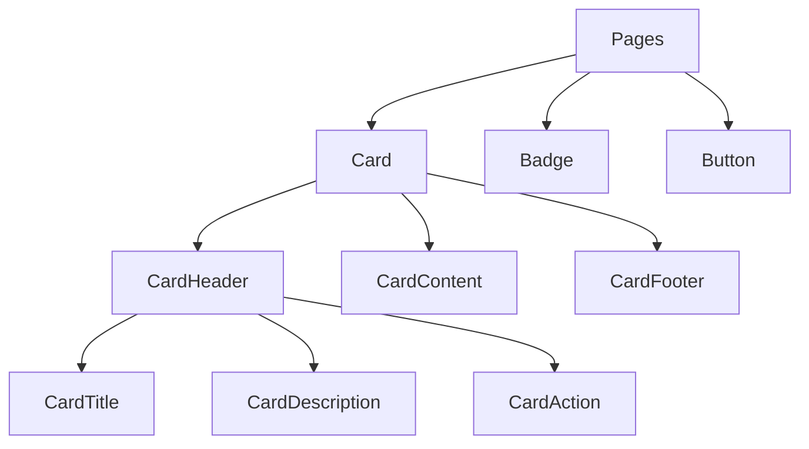
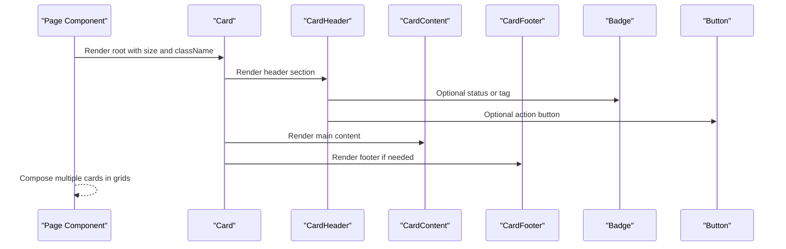
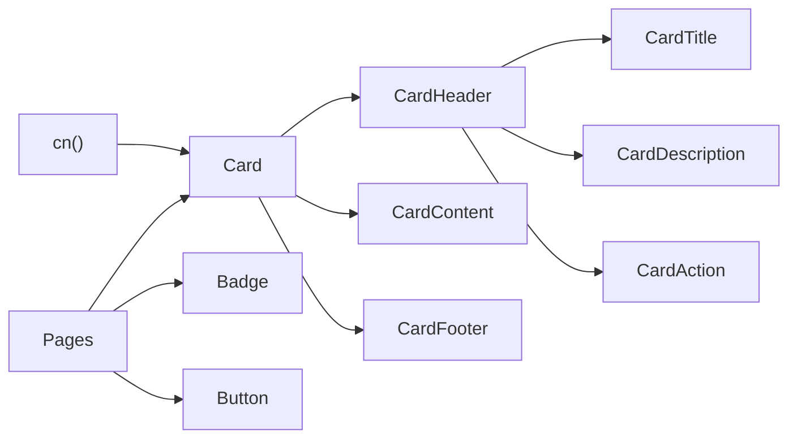

# Card Component

<cite>
**Referenced Files in This Document**
- [card.tsx](file://veilend-web/src/components/ui/card.tsx)
- [utils.ts](file://veilend-web/src/lib/utils.ts)
- [dashboard page (client)](file://veilend-web/src/app/(dashboard)/page.tsx)
- [dashboard page (server)](file://veilend-web/src/app/dashboard/page.tsx)
- [landing page](file://veilend-web/src/app/page.tsx)
- [badge.tsx](file://veilend-web/src/components/ui/badge.tsx)
- [button.tsx](file://veilend-web/src/components/ui/button.tsx)
</cite>

## Table of Contents
1. [Introduction](#introduction)
2. [Project Structure](#project-structure)
3. [Core Components](#core-components)
4. [Architecture Overview](#architecture-overview)
5. [Detailed Component Analysis](#detailed-component-analysis)
6. [Dependency Analysis](#dependency-analysis)
7. [Performance Considerations](#performance-considerations)
8. [Troubleshooting Guide](#troubleshooting-guide)
9. [Conclusion](#conclusion)
10. [Appendices](#appendices)

## Introduction
This document explains the Card component system used across the web application. It covers the card structure (header, content, footer), available props and styling options, border and shadow behavior, responsive layout patterns, nested composition with other UI components, accessibility considerations, semantic HTML usage, performance characteristics, and browser compatibility notes based on the implementation in this repository.

## Project Structure
The Card system is implemented as a set of small, composable React components under the shared UI library. They are used throughout the Next.js app pages to present dashboards, landing sections, and data panels.

**Diagram sources**
- [card.tsx:5-93](file://veilend-web/src/components/ui/card.tsx#L5-L93)
- [dashboard page (client):16](file://veilend-web/src/app/(dashboard)/page.tsx#L16)
- [dashboard page (server):3](file://veilend-web/src/app/dashboard/page.tsx#L3)
- [landing page:16](file://veilend-web/src/app/page.tsx#L16)

**Section sources**
- [card.tsx:5-93](file://veilend-web/src/components/ui/card.tsx#L5-L93)
- [dashboard page (client):16](file://veilend-web/src/app/(dashboard)/page.tsx#L16)
- [dashboard page (server):3](file://veilend-web/src/app/dashboard/page.tsx#L3)
- [landing page:16](file://veilend-web/src/app/page.tsx#L16)

## Core Components
- Card: Root container that provides consistent spacing, rounded corners, background, subtle ring, and shadow. Supports a size prop for compact layouts.
- CardHeader: Container for title, description, and optional action area; uses grid layout to support actions aligned to the right.
- CardTitle: Prominent heading text sized appropriately for default and small card sizes.
- CardDescription: Secondary descriptive text using muted foreground color.
- CardAction: Positioned to the right side of the header via CSS grid placement.
- CardContent: Main body area with horizontal padding.
- CardFooter: Bottom area with rounded bottom corners and optional top border spacing when needed.

Props and attributes
- Card accepts standard div props plus an optional size prop with values "default" or "sm". The size influences internal spacing variables.
- All subcomponents accept standard element props and className overrides.
- Data attributes: Each component sets a data-slot attribute for testing and styling hooks (e.g., "card", "card-header", "card-title", "card-description", "card-action", "card-content", "card-footer").

Styling approach
- Uses a utility function to merge class names safely.
- Tailwind classes provide spacing, typography, borders, shadows, and responsive behaviors.
- CSS custom properties control spacing and visual tokens consistently across sizes.

Accessibility and semantics
- Components render as generic 
 elements with data slots rather than semantic landmarks like <article>. For accessible cards, wrap them with appropriate semantic elements or add roles/labels at the page level where necessary.
- Keyboard focus and screen reader behavior depend on child interactive elements (buttons, links). Ensure those children have proper labels and states.

**Section sources**
- [card.tsx:5-93](file://veilend-web/src/components/ui/card.tsx#L5-L93)
- [utils.ts:4-6](file://veilend-web/src/lib/utils.ts#L4-L6)

## Architecture Overview
The Card system follows a composition pattern:
- Pages import Card and its parts from the UI library.
- Pages compose headers, titles, descriptions, content, and footers to build varied layouts.
- Cards nest other UI components such as Badges and Buttons within their sections.

**Diagram sources**
- [card.tsx:5-93](file://veilend-web/src/components/ui/card.tsx#L5-L93)
- [dashboard page (client):16](file://veilend-web/src/app/(dashboard)/page.tsx#L16)
- [dashboard page (server):3](file://veilend-web/src/app/dashboard/page.tsx#L3)
- [badge.tsx:30-46](file://veilend-web/src/components/ui/badge.tsx#L30-L46)
- [button.tsx:44-64](file://veilend-web/src/components/ui/button.tsx#L44-L64)

## Detailed Component Analysis

### Card
- Purpose: Provides a consistent container with spacing, rounded corners, background, subtle ring, and shadow.
- Props:
  - size: "default" | "sm" — controls internal spacing variable for compact vs. standard density.
  - className: Additional styles merged into base classes.
- Behavior:
  - Uses group/card for scoped styling.
  - Applies overflow-hidden and rounded-xl for consistent corner treatment.
  - Uses a CSS variable for spacing that changes with size.
  - First image handling adjusts padding and rounding automatically.

Usage examples in the app
- Dashboard login prompt card with header, title, description, and content containing a wallet connect button.
- Metric cards with header-only content displaying key figures.
- Feature cards on the landing page with icon, title, and description inside content.

**Section sources**
- [card.tsx:5-21](file://veilend-web/src/components/ui/card.tsx#L5-L21)
- [dashboard page (client):39-55](file://veilend-web/src/app/(dashboard)/page.tsx#L39-L55)
- [dashboard page (client):103-127](file://veilend-web/src/app/(dashboard)/page.tsx#L103-L127)
- [landing page:193-229](file://veilend-web/src/app/page.tsx#L193-L229)

### CardHeader
- Purpose: Groups title, description, and optional action into a structured header.
- Layout:
  - Grid-based layout supports placing an action to the right while keeping title/description left-aligned.
  - Conditional row/column adjustments when description or action is present.
  - Top-rounded corners align with the parent card.

Common patterns
- Title + Description for metric cards.
- Title + Action for tables or lists with controls.

**Section sources**
- [card.tsx:23-33](file://veilend-web/src/components/ui/card.tsx#L23-L33)
- [dashboard page (client):104-108](file://veilend-web/src/app/(dashboard)/page.tsx#L104-L108)
- [dashboard page (client):135-143](file://veilend-web/src/app/(dashboard)/page.tsx#L135-L143)

### CardTitle
- Purpose: Displays the primary heading within the header.
- Sizing: Adjusts font size based on card size context.

**Section sources**
- [card.tsx:36-47](file://veilend-web/src/components/ui/card.tsx#L36-L47)
- [dashboard page (client):106-107](file://veilend-web/src/app/(dashboard)/page.tsx#L106-L107)

### CardDescription
- Purpose: Shows secondary explanatory text with muted color.

**Section sources**
- [card.tsx:49-57](file://veilend-web/src/components/ui/card.tsx#L49-L57)
- [dashboard page (client):142](file://veilend-web/src/app/(dashboard)/page.tsx#L142)

### CardAction
- Purpose: Positions an action element (e.g., menu, button) to the right side of the header using grid placement.

**Section sources**
- [card.tsx:59-70](file://veilend-web/src/components/ui/card.tsx#L59-L70)

### CardContent
- Purpose: Main content area with horizontal padding.

**Section sources**
- [card.tsx:72-80](file://veilend-web/src/components/ui/card.tsx#L72-L80)
- [dashboard page (client):144-187](file://veilend-web/src/app/(dashboard)/page.tsx#L144-L187)

### CardFooter
- Purpose: Bottom area with rounded bottom corners and optional top border spacing.

**Section sources**
- [card.tsx:82-93](file://veilend-web/src/components/ui/card.tsx#L82-L93)

### Styling Options, Borders, Shadows, and Responsive Behavior
- Border variants:
  - Base card applies a subtle ring around the card.
  - Pages commonly override borders using Tailwind utilities (e.g., semi-transparent borders) to match dark themes.
- Shadow effects:
  - Base card includes a light shadow utility.
  - Pages may adjust or layer additional shadows for emphasis.
- Spacing and sizing:
  - size="sm" reduces internal spacing for denser layouts.
  - CSS variables drive consistent spacing across header, content, and footer.
- Responsive behavior:
  - Grid layouts in pages adapt columns based on breakpoints.
  - Header grid adapts to include actions without breaking layout.
  - Images placed first or last get automatic padding and corner rounding adjustments.

Examples from pages
- Dark-themed cards with custom backgrounds, borders, and backdrop blur.
- Metric cards with minimal header content and progress bars in content.
- Feature cards with icons, titles, and descriptions.

**Section sources**
- [card.tsx:10-21](file://veilend-web/src/components/ui/card.tsx#L10-L21)
- [card.tsx:23-33](file://veilend-web/src/components/ui/card.tsx#L23-L33)
- [dashboard page (client):39-55](file://veilend-web/src/app/(dashboard)/page.tsx#L39-L55)
- [dashboard page (client):103-127](file://veilend-web/src/app/(dashboard)/page.tsx#L103-L127)
- [landing page:193-229](file://veilend-web/src/app/page.tsx#L193-L229)

### Nested Components and Customization Patterns
- Nesting badges and buttons inside headers and content for status indicators and actions.
- Using Skeleton components inside content for loading states.
- Applying custom className overrides to tailor colors, spacing, and borders per page needs.

Patterns observed
- Header with title + badge for asset type or risk label.
- Content with lists, tables, or progress bars.
- Footer not used extensively in current pages but available for actions or summaries.

**Section sources**
- [dashboard page (client):135-143](file://veilend-web/src/app/(dashboard)/page.tsx#L135-L143)
- [dashboard page (client):144-187](file://veilend-web/src/app/(dashboard)/page.tsx#L144-L187)
- [badge.tsx:30-46](file://veilend-web/src/components/ui/badge.tsx#L30-L46)
- [button.tsx:44-64](file://veilend-web/src/components/ui/button.tsx#L44-L64)

### Accessibility and Semantic HTML
- Current implementation uses generic divs with data-slot attributes for testability and styling hooks.
- For accessible cards:
  - Wrap cards with semantic elements like <section> or <article> when they represent independent content units.
  - Provide meaningful headings and ensure keyboard navigation works for interactive children.
  - Use aria-label or aria-labelledby when a card represents a specific entity without a visible heading.
- Status and alerts:
  - Other components in the app use role="alert" and aria-live for dynamic messages; apply similar patterns for card-related updates.

**Section sources**
- [card.tsx:10-93](file://veilend-web/src/components/ui/card.tsx#L10-L93)
- [alert.tsx:27-35](file://veilend-web/src/components/ui/alert.tsx#L27-L35)

### Integration with Other UI Components
- Badge: Used to annotate assets, statuses, and risk levels within card headers and content.
- Button: Integrated in headers and content for actions like connecting wallets or refreshing data.
- Progress and Skeleton: Used within card content to visualize metrics and loading states.

**Section sources**
- [dashboard page (client):16](file://veilend-web/src/app/(dashboard)/page.tsx#L16)
- [dashboard page (client):103-127](file://veilend-web/src/app/(dashboard)/page.tsx#L103-L127)
- [badge.tsx:30-46](file://veilend-web/src/components/ui/badge.tsx#L30-L46)
- [button.tsx:44-64](file://veilend-web/src/components/ui/button.tsx#L44-L64)

## Dependency Analysis
The Card system depends on:
- Utility functions for class merging.
- Tailwind CSS for styling.
- Page-level composition for layout and responsiveness.

**Diagram sources**
- [utils.ts:4-6](file://veilend-web/src/lib/utils.ts#L4-L6)
- [card.tsx:5-93](file://veilend-web/src/components/ui/card.tsx#L5-L93)
- [dashboard page (client):16](file://veilend-web/src/app/(dashboard)/page.tsx#L16)
- [dashboard page (server):3](file://veilend-web/src/app/dashboard/page.tsx#L3)
- [landing page:16](file://veilend-web/src/app/page.tsx#L16)

**Section sources**
- [utils.ts:4-6](file://veilend-web/src/lib/utils.ts#L4-L6)
- [card.tsx:5-93](file://veilend-web/src/components/ui/card.tsx#L5-L93)

## Performance Considerations
- Lightweight components: Each part renders a single div with minimal logic, reducing overhead.
- Class merging: Uses efficient class name merging to avoid redundant styles.
- Layout efficiency: Grid-based header layout avoids complex nesting and improves reflow performance.
- Image handling: Automatic padding and rounding for first/last images reduce extra wrapper nodes.
- Server-side rendering: Pages demonstrate both client and server usage; keep card usage stateless where possible to benefit from SSR.

[No sources needed since this section provides general guidance]

## Troubleshooting Guide
Common issues and resolutions
- Unexpected spacing or alignment:
  - Verify size prop usage and ensure no conflicting className overrides.
  - Check for missing CardHeader/CardContent wrappers that affect grid layout.
- Borders and shadows not appearing:
  - Confirm theme tokens and Tailwind configuration are loaded.
  - Ensure no parent containers override background or box-shadow.
- Accessibility concerns:
  - If a card acts as a landmark, wrap it with semantic HTML or add appropriate roles/labels.
  - Ensure interactive children inside cards are focusable and labeled.

**Section sources**
- [card.tsx:10-93](file://veilend-web/src/components/ui/card.tsx#L10-L93)

## Conclusion
The Card component system provides a flexible, composable foundation for building consistent UI surfaces across the application. With clear separation of header, content, and footer, along with robust styling and responsive behavior, it integrates seamlessly with other UI primitives. For best results, follow the established composition patterns, leverage size and className customization judiciously, and enhance accessibility by wrapping cards in semantic contexts when appropriate.

[No sources needed since this section summarizes without analyzing specific files]

## Appendices

### Example Layouts Observed in the App
- Metric cards: Header-only with title and description for quick stats.
- Data panels: Header with title and description, content with lists or tables, optional footer for actions.
- Feature cards: Icon, title, and description within content for marketing sections.

**Section sources**
- [dashboard page (client):103-127](file://veilend-web/src/app/(dashboard)/page.tsx#L103-L127)
- [dashboard page (client):135-187](file://veilend-web/src/app/(dashboard)/page.tsx#L135-L187)
- [landing page:193-229](file://veilend-web/src/app/page.tsx#L193-L229)