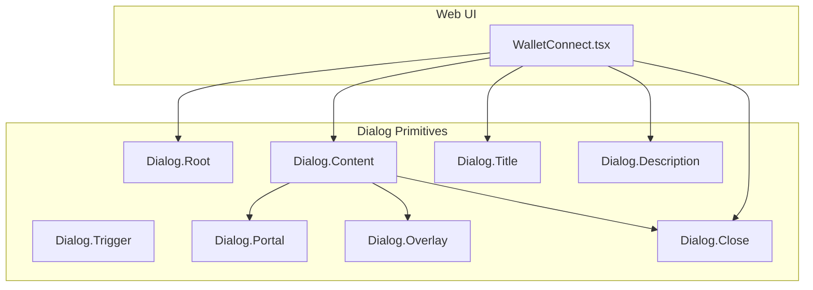
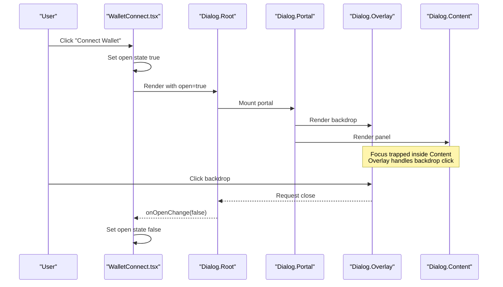
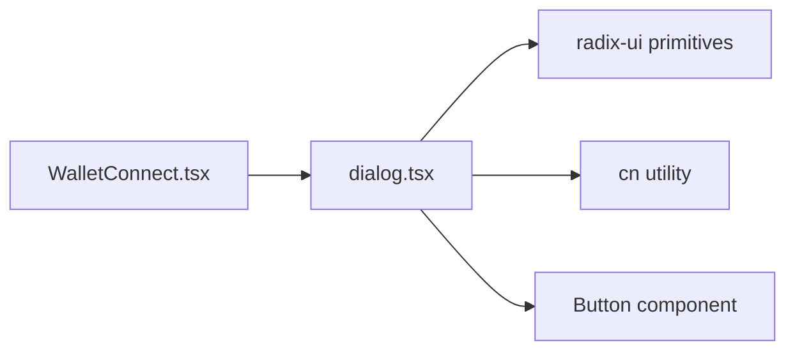

# Dialog Component

<cite>
**Referenced Files in This Document**
- [dialog.tsx](file://veilend-web/src/components/ui/dialog.tsx)
- [WalletConnect.tsx](file://veilend-web/src/components/WalletConnect.tsx)
</cite>

## Table of Contents
1. [Introduction](#introduction)
2. [Project Structure](#project-structure)
3. [Core Components](#core-components)
4. [Architecture Overview](#architecture-overview)
5. [Detailed Component Analysis](#detailed-component-analysis)
6. [Dependency Analysis](#dependency-analysis)
7. [Performance Considerations](#performance-considerations)
8. [Troubleshooting Guide](#troubleshooting-guide)
9. [Conclusion](#conclusion)

## Introduction
This document describes the Dialog component system used in the web application. It covers modal dialogs, confirmation prompts, and form-like dialogs built from a shared UI primitive. It explains trigger mechanisms, backdrop handling, focus management, keyboard navigation, accessibility (ARIA attributes and screen reader support), animation transitions, z-index management, responsive behavior, and programmatic control patterns. Examples are grounded in the actual implementation and usage within the codebase.

## Project Structure
The dialog system is implemented as a small set of composable primitives that wrap a robust underlying dialog primitive. A single consumer demonstrates how to assemble these primitives into a complete modal experience with proper accessibility and UX.

**Diagram sources**
- [WalletConnect.tsx:239-373](file://veilend-web/src/components/WalletConnect.tsx#L239-L373)
- [dialog.tsx:10-86](file://veilend-web/src/components/ui/dialog.tsx#L10-L86)

**Section sources**
- [dialog.tsx:1-166](file://veilend-web/src/components/ui/dialog.tsx#L1-L166)
- [WalletConnect.tsx:1-378](file://veilend-web/src/components/WalletConnect.tsx#L1-L378)

## Core Components
The dialog system exposes a focused API for building accessible modals:

- Dialog Root: Provides context and state for the open/closed lifecycle.
- Dialog Trigger: The element that opens the dialog.
- Dialog Portal: Renders the dialog outside the normal DOM hierarchy to avoid stacking issues.
- Dialog Overlay: Backdrop that captures clicks and helps trap focus.
- Dialog Content: The visible panel; includes optional close button and animations.
- Dialog Close: Programmatic or user-triggered closing.
- Dialog Title/Description: Semantic headings and descriptions for assistive tech.

Key behaviors observed in the implementation:
- Backdrop: A fixed overlay with subtle blur and fade-in/out transitions.
- Centering and sizing: Fixed positioning with centering transforms and responsive max-width constraints.
- Animations: Fade and zoom transitions on open/close states.
- Focus management: The underlying primitive manages focus trapping and initial focus; consumers can additionally manage focus for custom actions.
- Accessibility: Uses semantic title/description elements and screen-reader-only labels where appropriate.

**Section sources**
- [dialog.tsx:10-86](file://veilend-web/src/components/ui/dialog.tsx#L10-L86)
- [dialog.tsx:88-152](file://veilend-web/src/components/ui/dialog.tsx#L88-L152)

## Architecture Overview
At runtime, the consumer controls visibility via local state and passes it to the dialog root. When opened, the content is portaled into the document body, an overlay is rendered behind it, and focus is managed by the underlying primitive. Closing can be triggered by the overlay click, explicit close buttons, or programmatic control.

**Diagram sources**
- [WalletConnect.tsx:239-373](file://veilend-web/src/components/WalletConnect.tsx#L239-L373)
- [dialog.tsx:22-86](file://veilend-web/src/components/ui/dialog.tsx#L22-L86)

## Detailed Component Analysis

### Dialog Primitives (UI Layer)
Responsibilities:
- Provide consistent styling and data attributes for testability.
- Compose portal + overlay + content with default animations and responsive layout.
- Offer optional close button inside content.
- Expose header/footer/title/description wrappers for structure and semantics.

Props and behaviors (derived from usage and composition):
- Dialog.Root: Accepts standard props from the underlying primitive; used to own open state.
- Dialog.Trigger: Standard trigger element; not used in the current consumer but available for other flows.
- Dialog.Portal: Ensures correct stacking and isolation.
- Dialog.Overlay: Fixed full-screen backdrop with fade transitions and subtle blur.
- Dialog.Content: Fixed centered panel with responsive width, rounded corners, ring, and fade/zoom transitions; supports a configurable close button.
- Dialog.Close: Closes the dialog when invoked.
- Dialog.Header/Footer/Title/Description: Structural and semantic containers.

Accessibility highlights:
- Title and Description provide accessible names and context for screen readers.
- Close button includes a screen-reader-only label.
- Focus management is handled by the underlying primitive; consumers should ensure interactive elements inside the dialog are reachable and labeled.

Animation and visual details:
- Overlay: Fade in/out with short duration and backdrop blur support.
- Content: Fade in/out plus zoom-in/zoom-out transitions on open/close.
- Z-index: Both overlay and content use high z-index to ensure they appear above app content.

Responsive design:
- Content uses responsive max-width and full-width on small screens, with padding and grid layout for spacing.

**Section sources**
- [dialog.tsx:10-86](file://veilend-web/src/components/ui/dialog.tsx#L10-L86)
- [dialog.tsx:88-152](file://veilend-web/src/components/ui/dialog.tsx#L88-L152)

### Consumer: Wallet Connect Dialog
Responsibilities:
- Control dialog open/close via local state.
- Manage connection flow and errors within the dialog.
- Ensure primary action receives focus after open for keyboard users.
- Provide clear titles, descriptions, and actionable feedback.

Key behaviors:
- Open state controlled by component state; passed to Dialog.Root via open prop.
- onOpenChange updates local state and clears errors when closing.
- Primary action ref focuses automatically after open to improve keyboard usability.
- Error messages are presented inside the dialog with appropriate roles and live regions.
- Footer provides a close action and contextual messaging.

Accessibility:
- aria-describedby links description to content for screen readers.
- Alert region uses role="alert" and aria-live="polite" for dynamic status updates.
- Close button has a screen-reader-only label.

Programmatic control:
- Dialog is fully controlled by React state; external functions can toggle visibility by updating state.
- Connection logic runs asynchronously and closes the dialog on success.

**Section sources**
- [WalletConnect.tsx:47-108](file://veilend-web/src/components/WalletConnect.tsx#L47-L108)
- [WalletConnect.tsx:239-373](file://veilend-web/src/components/WalletConnect.tsx#L239-L373)

### Modal Dialogs, Confirmation Prompts, and Form Dialogs
Patterns supported by the primitives:
- Modal dialogs: Use Dialog.Root + Dialog.Content with a title and description. Add actions in footer or content.
- Confirmation prompts: Place confirm/cancel actions in DialogFooter; use Dialog.Close for cancel and a handler for confirm.
- Form dialogs: Put inputs inside Dialog.Content; manage form state locally; submit via handlers; show inline errors using alert-like components.

Trigger mechanisms:
- Use Dialog.Trigger for declarative triggers, or control via open/onOpenChange as shown in the consumer.

Backdrop handling:
- Clicking the overlay closes the dialog via the underlying primitive’s behavior.

Focus management:
- Underlying primitive traps focus within the dialog and returns focus to the trigger on close.
- Consumers can programmatically focus key elements (e.g., primary action) after open.

Keyboard navigation:
- Escape typically closes the dialog (handled by the underlying primitive).
- Tab order remains logical within the dialog; ensure interactive elements are properly ordered and labeled.

**Section sources**
- [dialog.tsx:22-86](file://veilend-web/src/components/ui/dialog.tsx#L22-L86)
- [WalletConnect.tsx:239-373](file://veilend-web/src/components/WalletConnect.tsx#L239-L373)

### Nested Dialogs
While the primitives support nesting through portals, best practice is to avoid nested dialogs due to focus and accessibility complexity. If needed:
- Ensure each dialog has a unique title and description.
- Confirm that focus trapping works correctly for the topmost dialog.
- Test keyboard navigation thoroughly across devices and assistive technologies.

[No sources needed since this section provides general guidance]

### Programmatic Control
- Controlled pattern: Maintain open state in the parent and pass open/onOpenChange to Dialog.Root.
- Uncontrolled pattern: Use default open state and let the primitive manage internal state if preferred.
- In this codebase, the consumer uses a controlled approach with local state.

**Section sources**
- [WalletConnect.tsx:47-56](file://veilend-web/src/components/WalletConnect.tsx#L47-L56)
- [WalletConnect.tsx:239-243](file://veilend-web/src/components/WalletConnect.tsx#L239-L243)

## Dependency Analysis
The dialog layer depends on a robust underlying primitive for semantics, focus management, and keyboard interactions. The consumer composes these primitives to build domain-specific dialogs.

**Diagram sources**
- [WalletConnect.tsx:7-14](file://veilend-web/src/components/WalletConnect.tsx#L7-L14)
- [dialog.tsx:3-8](file://veilend-web/src/components/ui/dialog.tsx#L3-L8)

**Section sources**
- [dialog.tsx:3-8](file://veilend-web/src/components/ui/dialog.tsx#L3-L8)
- [WalletConnect.tsx:7-14](file://veilend-web/src/components/WalletConnect.tsx#L7-L14)

## Performance Considerations
- Keep dialog content lightweight; defer heavy computations until the dialog opens.
- Avoid re-renders by memoizing expensive children if necessary.
- Use conditional rendering to mount portal only when open.
- Prefer CSS-based animations already provided for smooth transitions without JS overhead.

[No sources needed since this section provides general guidance]

## Troubleshooting Guide
Common issues and resolutions:
- Dialog does not close on backdrop click: Ensure the overlay is rendered and not blocked by z-index or pointer-events overrides.
- Focus not trapped: Verify the dialog is mounted and no custom focus handlers interfere with the underlying primitive.
- Screen reader not announcing title/description: Confirm that Dialog.Title and Dialog.Description are present and linked via aria-describedby.
- Keyboard escape not working: Check for event listeners that prevent default behavior on the document or dialog.
- Animation glitches: Ensure CSS classes for transitions are applied and not overridden by global styles.

**Section sources**
- [dialog.tsx:34-86](file://veilend-web/src/components/ui/dialog.tsx#L34-L86)
- [WalletConnect.tsx:239-373](file://veilend-web/src/components/WalletConnect.tsx#L239-L373)

## Conclusion
The dialog system provides a minimal, accessible, and flexible foundation for building modals, confirmations, and forms. By composing a few primitives and following the patterns demonstrated in the consumer, you can create consistent experiences with reliable focus management, keyboard navigation, and screen reader support. Animations and responsive styles are included out of the box, while z-index and portal usage ensure dialogs render predictably above app content.