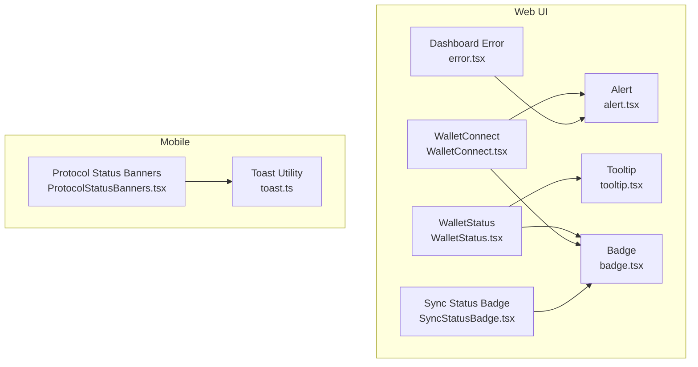
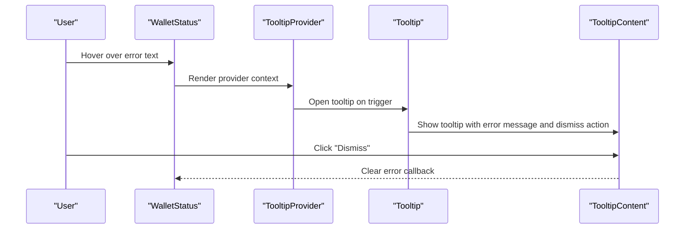
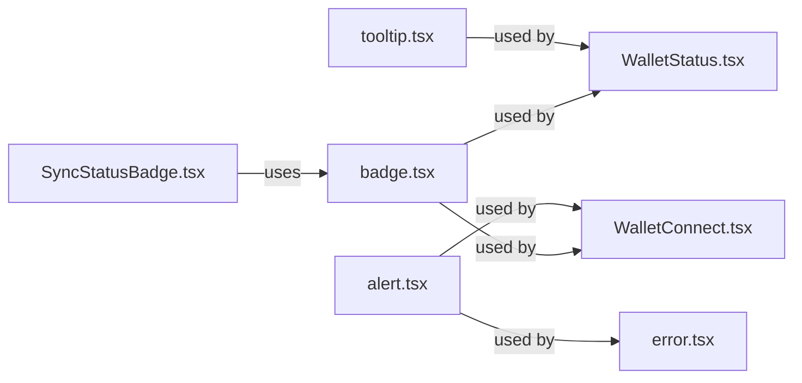

# Feedback Components

<cite>
**Referenced Files in This Document**
- [alert.tsx](file://veilend-web/src/components/ui/alert.tsx)
- [tooltip.tsx](file://veilend-web/src/components/ui/tooltip.tsx)
- [badge.tsx](file://veilend-web/src/components/ui/badge.tsx)
- [WalletStatus.tsx](file://veilend-web/src/components/WalletStatus.tsx)
- [WalletConnect.tsx](file://veilend-web/src/components/WalletConnect.tsx)
- [error.tsx](file://veilend-web/src/app/dashboard/error.tsx)
- [SyncStatusBadge.tsx](file://veilend-web/src/components/SyncStatusBadge.tsx)
- [ProtocolStatusBanners.tsx](file://veilend-mobile/src/components/ProtocolStatusBanners.tsx)
- [toast.ts](file://veilend-mobile/src/utils/toast.ts)
</cite>

## Table of Contents
1. Introduction
2. Project Structure
3. Core Components
4. Architecture Overview
5. Detailed Component Analysis
6. Dependency Analysis
7. Performance Considerations
8. Troubleshooting Guide
9. Conclusion

## Introduction
This document explains the feedback and informational components used across the web and mobile applications: Alert, Tooltip, and Badge. It covers alert types and patterns, dismissible behaviors, tooltip positioning and triggers, badge variants for status and contextual help, accessibility and keyboard navigation, timing controls and animations, and responsive behavior on different screen sizes. Examples are grounded in actual components and usage within the codebase.

## Project Structure
The feedback components live primarily in the web application under a shared UI directory and are consumed by feature components (wallet, dashboard). The mobile app provides its own banner and toast utilities for feedback.

**Diagram sources**
- [alert.tsx:1-39](file://veilend-web/src/components/ui/alert.tsx#L1-L39)
- [tooltip.tsx:1-30](file://veilend-web/src/components/ui/tooltip.tsx#L1-L30)
- [badge.tsx:1-50](file://veilend-web/src/components/ui/badge.tsx#L1-L50)
- [WalletStatus.tsx:1-155](file://veilend-web/src/components/WalletStatus.tsx#L1-L155)
- [WalletConnect.tsx:1-378](file://veilend-web/src/components/WalletConnect.tsx#L1-L378)
- [error.tsx:1-81](file://veilend-web/src/app/dashboard/error.tsx#L1-L81)
- [SyncStatusBadge.tsx:1-101](file://veilend-web/src/components/SyncStatusBadge.tsx#L1-L101)
- [ProtocolStatusBanners.tsx:1-123](file://veilend-mobile/src/components/ProtocolStatusBanners.tsx#L1-L123)
- [toast.ts:1-31](file://veilend-mobile/src/utils/toast.ts#L1-L31)

**Section sources**
- [alert.tsx:1-39](file://veilend-web/src/components/ui/alert.tsx#L1-L39)
- [tooltip.tsx:1-30](file://veilend-web/src/components/ui/tooltip.tsx#L1-L30)
- [badge.tsx:1-50](file://veilend-web/src/components/ui/badge.tsx#L1-L50)
- [WalletStatus.tsx:1-155](file://veilend-web/src/components/WalletStatus.tsx#L1-L155)
- [WalletConnect.tsx:1-378](file://veilend-web/src/components/WalletConnect.tsx#L1-L378)
- [error.tsx:1-81](file://veilend-web/src/app/dashboard/error.tsx#L1-L81)
- [SyncStatusBadge.tsx:1-101](file://veilend-web/src/components/SyncStatusBadge.tsx#L1-L101)
- [ProtocolStatusBanners.tsx:1-123](file://veilend-mobile/src/components/ProtocolStatusBanners.tsx#L1-L123)
- [toast.ts:1-31](file://veilend-mobile/src/utils/toast.ts#L1-L31)

## Core Components
- Alert: A semantic container with role="alert" and variant-driven styling for destructive messages. Used to surface errors and important notices.
- Tooltip: A Radix-based tooltip with Provider, Trigger, and Content primitives; includes slide/fade animations and side offsets.
- Badge: A compact status indicator with multiple variants (default, secondary, destructive, outline, ghost, link) and focus-visible states.

Key implementation highlights:
- Alerts use class-variance-authority to switch between default and destructive styles and expose title/description slots.
- Tooltips provide accessible content with animation classes and side offset configuration.
- Badges support asChild composition and include focus and invalid state hooks via aria attributes.

**Section sources**
- [alert.tsx:6-38](file://veilend-web/src/components/ui/alert.tsx#L6-L38)
- [tooltip.tsx:8-28](file://veilend-web/src/components/ui/tooltip.tsx#L8-L28)
- [badge.tsx:7-49](file://veilend-web/src/components/ui/badge.tsx#L7-L49)

## Architecture Overview
The web application composes these primitives into higher-level UX patterns:
- WalletStatus uses Badge to show connection state and Tooltip to display error details without cluttering the UI.
- WalletConnect uses Alert to communicate connection errors and guidance, and Badge to indicate connected state.
- Dashboard error page uses Alert to present actionable error recovery.
- SyncStatusBadge is a custom status indicator that follows badge-like semantics for sync states.

**Diagram sources**
- [WalletStatus.tsx:59-88](file://veilend-web/src/components/WalletStatus.tsx#L59-L88)
- [tooltip.tsx:8-28](file://veilend-web/src/components/ui/tooltip.tsx#L8-L28)

**Section sources**
- [WalletStatus.tsx:1-155](file://veilend-web/src/components/WalletStatus.tsx#L1-L155)
- [WalletConnect.tsx:239-373](file://veilend-web/src/components/WalletConnect.tsx#L239-L373)
- [error.tsx:23-50](file://veilend-web/src/app/dashboard/error.tsx#L23-L50)
- [SyncStatusBadge.tsx:18-54](file://veilend-web/src/components/SyncStatusBadge.tsx#L18-L54)

## Detailed Component Analysis

### Alert
- Purpose: Surface system or user-facing notifications, especially errors and warnings.
- Variants:
  - Default: neutral card-like appearance.
  - Destructive: high-emphasis styling for errors.
- Composition: Supports AlertTitle and AlertDescription for structured messaging.
- Usage examples:
  - Dashboard error page shows a destructive alert with contextual copy and recovery actions.
  - WalletConnect modal displays an inline alert when a connection error occurs.

Accessibility and semantics:
- The root element sets role="alert" to announce changes to assistive technologies.
- Title and description elements provide clear hierarchy for screen readers.

Timing and dismissal:
- No built-in auto-dismiss or timers; consumers control visibility and lifecycle.

Responsive behavior:
- Uses utility classes for padding, borders, and typography; adapts to container width.

**Section sources**
- [alert.tsx:6-38](file://veilend-web/src/components/ui/alert.tsx#L6-L38)
- [error.tsx:23-50](file://veilend-web/src/app/dashboard/error.tsx#L23-L50)
- [WalletConnect.tsx:252-260](file://veilend-web/src/components/WalletConnect.tsx#L252-L260)

### Tooltip
- Purpose: Provide contextual help and supplementary information on hover or focus.
- Primitives:
  - TooltipProvider: context for all tooltips.
  - TooltipTrigger: wraps interactive element.
  - TooltipContent: styled overlay with animations and sideOffset.
- Positioning and triggers:
  - Side placement is handled by Radix; sideOffset defaults to a small spacing.
  - Triggers are standard interactive elements; focus and hover are supported by the underlying primitive.
- Animations:
  - Fade/slide transitions based on open/closed state and side.
- Usage example:
  - WalletStatus wraps truncated error text in a Tooltip to reveal full message and a dismiss button.

Accessibility:
- Radix primitives manage focus trapping and announcements; ensure trigger has appropriate labels.

Timing and dismissal:
- Controlled by Radix; no explicit delay props here. Consumers can wrap logic if needed.

**Section sources**
- [tooltip.tsx:8-28](file://veilend-web/src/components/ui/tooltip.tsx#L8-L28)
- [WalletStatus.tsx:60-88](file://veilend-web/src/components/WalletStatus.tsx#L60-L88)

### Badge
- Purpose: Compact indicators for status, tags, or counts.
- Variants:
  - default, secondary, destructive, outline, ghost, link.
- Semantics:
  - Focus-visible ring for keyboard navigation.
  - aria-invalid integration for validation contexts.
- Composition:
  - asChild enables rendering inside other components while preserving behavior.
- Usage examples:
  - WalletStatus shows “Error”, “Freighter Required”, and “Connected” badges.
  - WalletConnect shows a connected address badge with a pulsing dot.
  - SyncStatusBadge is a custom component following badge-like semantics for sync states.

Accessibility:
- Use role="status" and aria-live where appropriate (see SyncStatusBadge).

Timing and animations:
- Includes transition utilities; some usages add pulse/spin animations for dynamic states.

**Section sources**
- [badge.tsx:7-49](file://veilend-web/src/components/ui/badge.tsx#L7-L49)
- [WalletStatus.tsx:60-135](file://veilend-web/src/components/WalletStatus.tsx#L60-L135)
- [WalletConnect.tsx:201-218](file://veilend-web/src/components/WalletConnect.tsx#L201-L218)
- [SyncStatusBadge.tsx:18-54](file://veilend-web/src/components/SyncStatusBadge.tsx#L18-L54)

### Mobile Feedback Patterns
- ProtocolStatusBanners: Stacked banners for network/wallet issues with severity-based styling and action buttons.
- Toast utility: Cross-platform notifications (Android native toast, iOS alert fallback) with success/info/error helpers.

Accessibility and responsiveness:
- Banners use accessibilityRole and labels for actions.
- Toasts adapt to platform capabilities.

**Section sources**
- [ProtocolStatusBanners.tsx:16-72](file://veilend-mobile/src/components/ProtocolStatusBanners.tsx#L16-L72)
- [toast.ts:5-19](file://veilend-mobile/src/utils/toast.ts#L5-L19)

## Dependency Analysis
- Web UI components depend on:
  - class-variance-authority for variant-driven styling (Alert, Badge).
  - Radix UI primitives for Tooltip behavior and accessibility.
  - Utility functions for className merging.
- Feature components compose UI primitives:
  - WalletStatus composes Badge and Tooltip.
  - WalletConnect composes Alert and Badge.
  - Dashboard error page composes Alert.
  - SyncStatusBadge is a custom status indicator inspired by badge semantics.

**Diagram sources**
- [alert.tsx:22-38](file://veilend-web/src/components/ui/alert.tsx#L22-L38)
- [tooltip.tsx:8-28](file://veilend-web/src/components/ui/tooltip.tsx#L8-L28)
- [badge.tsx:30-49](file://veilend-web/src/components/ui/badge.tsx#L30-L49)
- [WalletStatus.tsx:60-88](file://veilend-web/src/components/WalletStatus.tsx#L60-L88)
- [WalletConnect.tsx:201-218](file://veilend-web/src/components/WalletConnect.tsx#L201-L218)
- [error.tsx:23-50](file://veilend-web/src/app/dashboard/error.tsx#L23-L50)
- [SyncStatusBadge.tsx:18-54](file://veilend-web/src/components/SyncStatusBadge.tsx#L18-L54)

**Section sources**
- [alert.tsx:22-38](file://veilend-web/src/components/ui/alert.tsx#L22-L38)
- [tooltip.tsx:8-28](file://veilend-web/src/components/ui/tooltip.tsx#L8-L28)
- [badge.tsx:30-49](file://veilend-web/src/components/ui/badge.tsx#L30-L49)
- [WalletStatus.tsx:60-88](file://veilend-web/src/components/WalletStatus.tsx#L60-L88)
- [WalletConnect.tsx:201-218](file://veilend-web/src/components/WalletConnect.tsx#L201-L218)
- [error.tsx:23-50](file://veilend-web/src/app/dashboard/error.tsx#L23-L50)
- [SyncStatusBadge.tsx:18-54](file://veilend-web/src/components/SyncStatusBadge.tsx#L18-L54)

## Performance Considerations
- Tooltips: Keep content concise to avoid layout thrashing; rely on Radix’s portal rendering to minimize reflows.
- Alerts: Avoid frequent mount/unmount cycles; reuse instances where possible to reduce DOM churn.
- Badges: Prefer lightweight variants; excessive animations (e.g., spin/pulse) should be reserved for active states.
- Mobile toasts: Native Android toasts are efficient; iOS fallback uses alerts which block interaction—use sparingly.

[No sources needed since this section provides general guidance]

## Troubleshooting Guide
Common issues and resolutions:
- Tooltip not appearing:
  - Ensure TooltipProvider wraps the tree and the trigger is an interactive element.
  - Verify no overflow clipping hides the content.
- Alert not announced:
  - Confirm role="alert" is set on the root element and content updates do not break focus.
- Badge not focusing correctly:
  - When using asChild, ensure the child supports focus and keyboard events.
- Mobile toast not visible:
  - On iOS, alerts are shown; verify permissions and that the app is in foreground.

**Section sources**
- [tooltip.tsx:8-28](file://veilend-web/src/components/ui/tooltip.tsx#L8-L28)
- [alert.tsx:22-38](file://veilend-web/src/components/ui/alert.tsx#L22-L38)
- [badge.tsx:30-49](file://veilend-web/src/components/ui/badge.tsx#L30-L49)
- [toast.ts:5-19](file://veilend-mobile/src/utils/toast.ts#L5-L19)

## Conclusion
The project implements a consistent feedback system using Alert, Tooltip, and Badge across web and mobile. Alerts provide clear, semantic notifications; Tooltips deliver contextual help without clutter; Badges offer compact status signals. Accessibility is addressed through roles, aria attributes, and keyboard-friendly interactions. Timing and animations are controlled via CSS utilities and Radix primitives, while mobile uses native patterns for broad compatibility.

[No sources needed since this section summarizes without analyzing specific files]