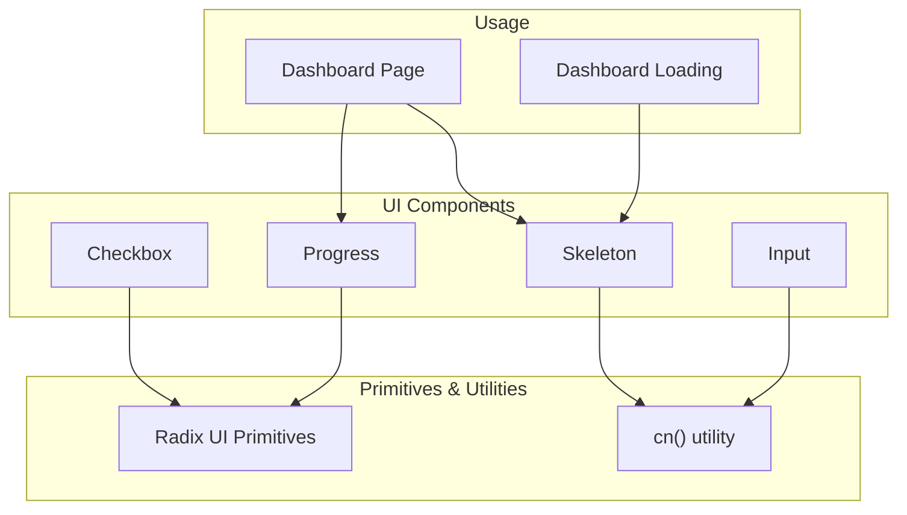
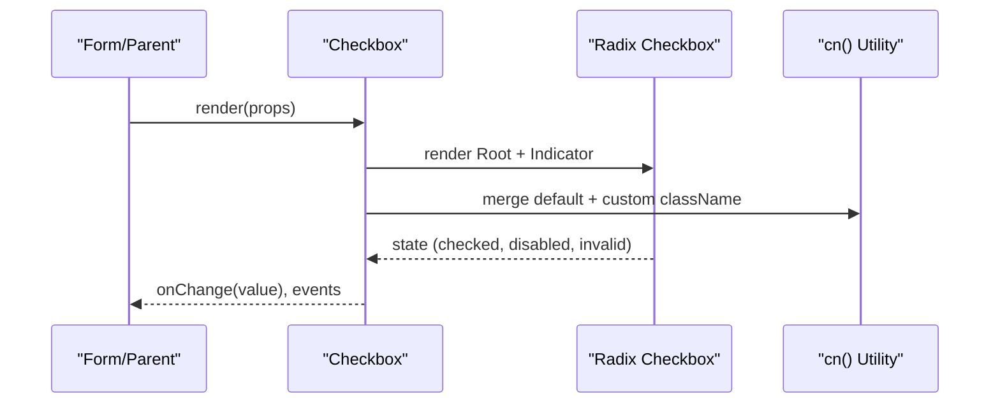
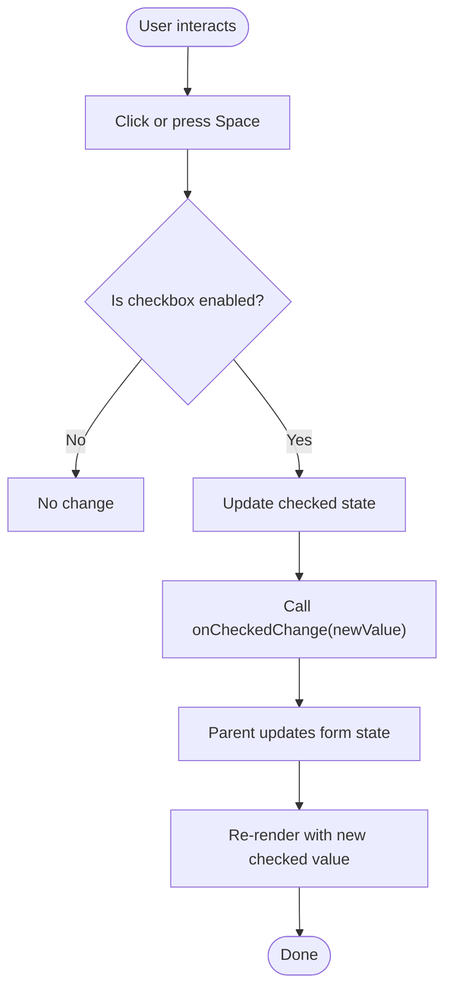
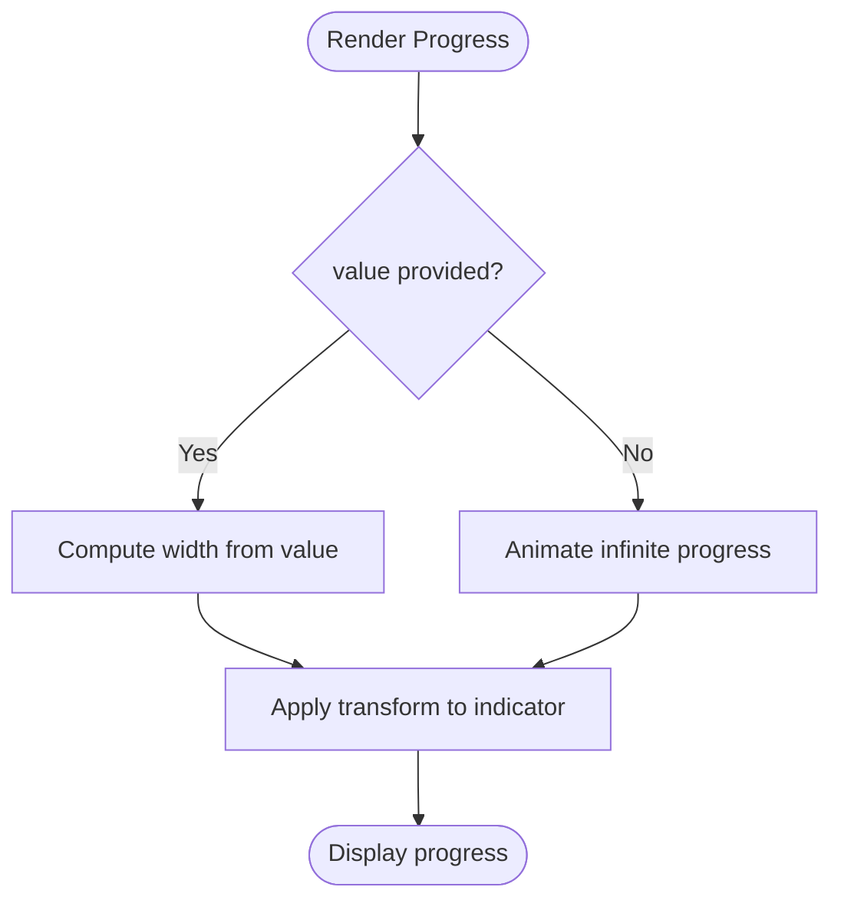
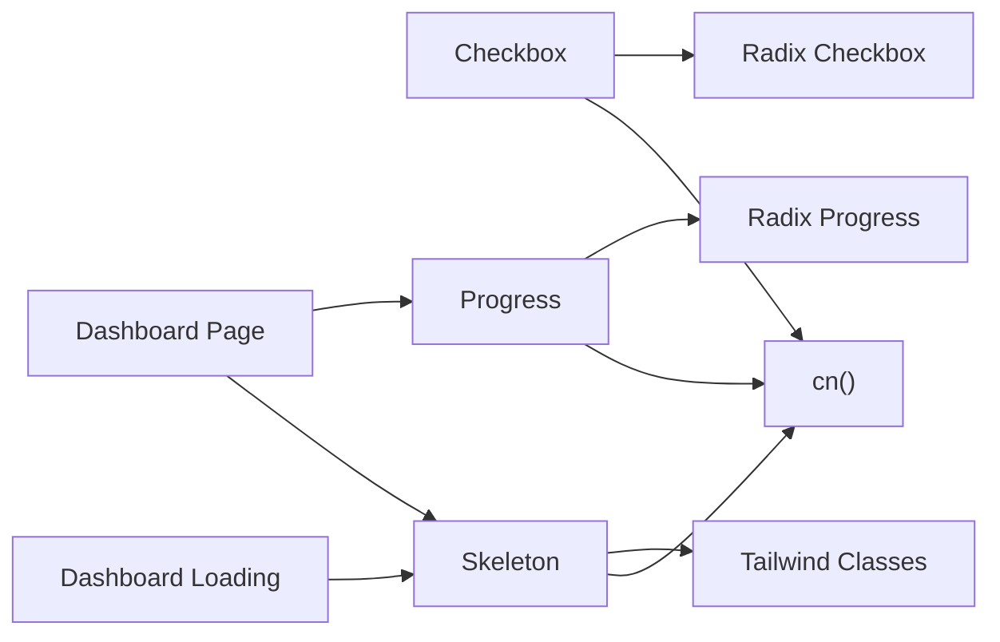

# Form Controls

<cite>
**Referenced Files in This Document**
- [checkbox.tsx](file://veilend-web/src/components/ui/checkbox.tsx)
- [progress.tsx](file://veilend-web/src/components/ui/progress.tsx)
- [skeleton.tsx](file://veilend-web/src/components/ui/skeleton.tsx)
- [input.tsx](file://veilend-web/src/components/ui/input.tsx)
- [utils.ts](file://veilend-web/src/lib/utils.ts)
- [page.tsx](file://veilend-web/src/app/(dashboard)/page.tsx)
- [loading.tsx](file://veilend-web/src/app/dashboard/loading.tsx)
</cite>

## Table of Contents
1. [Introduction](#introduction)
2. [Project Structure](#project-structure)
3. [Core Components](#core-components)
4. [Architecture Overview](#architecture-overview)
5. [Detailed Component Analysis](#detailed-component-analysis)
6. [Dependency Analysis](#dependency-analysis)
7. [Performance Considerations](#performance-considerations)
8. [Troubleshooting Guide](#troubleshooting-guide)
9. [Conclusion](#conclusion)
10. [Appendices](#appendices)

## Introduction
This document provides detailed documentation for form control components used across the web application: Checkbox, Progress, and Skeleton loaders. It explains props, states, interaction patterns, accessibility features, styling customization, animation options, and performance considerations. It also covers how these components integrate with forms and validation, including checkbox groups and radio button patterns.

## Project Structure
The form controls are implemented as small, focused React components under a shared UI library. They rely on Radix UI primitives for accessibility and behavior, and Tailwind CSS utilities for styling via a class-name merger utility.

**Diagram sources**
- [checkbox.tsx:1-33](file://veilend-web/src/components/ui/checkbox.tsx#L1-L33)
- [progress.tsx:1-32](file://veilend-web/src/components/ui/progress.tsx#L1-L32)
- [skeleton.tsx:1-14](file://veilend-web/src/components/ui/skeleton.tsx#L1-L14)
- [input.tsx:1-20](file://veilend-web/src/components/ui/input.tsx#L1-L20)
- [utils.ts:1-7](file://veilend-web/src/lib/utils.ts#L1-L7)
- [page.tsx:18-19](file://veilend-web/src/app/(dashboard)/page.tsx#L18-L19)
- [loading.tsx:1-10](file://veilend-web/src/app/dashboard/loading.tsx#L1-L10)

**Section sources**
- [checkbox.tsx:1-33](file://veilend-web/src/components/ui/checkbox.tsx#L1-L33)
- [progress.tsx:1-32](file://veilend-web/src/components/ui/progress.tsx#L1-L32)
- [skeleton.tsx:1-14](file://veilend-web/src/components/ui/skeleton.tsx#L1-L14)
- [input.tsx:1-20](file://veilend-web/src/components/ui/input.tsx#L1-L20)
- [utils.ts:1-7](file://veilend-web/src/lib/utils.ts#L1-L7)
- [page.tsx:18-19](file://veilend-web/src/app/(dashboard)/page.tsx#L18-L19)
- [loading.tsx:1-10](file://veilend-web/src/app/dashboard/loading.tsx#L1-L10)

## Core Components
- Checkbox: A controlled checkbox built on Radix UI with accessible semantics and focus/invalid/disabled states.
- Progress: A progress bar supporting determinate values; indeterminate mode can be achieved by omitting or controlling value to animate continuously.
- Skeleton: A lightweight placeholder with a pulse animation for loading states.
- Input: An accessible input field that integrates with validation via aria-invalid and focus rings.

Key behaviors:
- Accessibility: Keyboard navigation, focus management, and ARIA attributes are provided by Radix UI and enhanced by Tailwind classes.
- Styling: Class merging via cn() enables theme-aware styles and responsive variants.
- Composition: Components accept standard DOM/Radix props and forward them to underlying elements.

**Section sources**
- [checkbox.tsx:9-31](file://veilend-web/src/components/ui/checkbox.tsx#L9-L31)
- [progress.tsx:8-29](file://veilend-web/src/components/ui/progress.tsx#L8-L29)
- [skeleton.tsx:3-11](file://veilend-web/src/components/ui/skeleton.tsx#L3-L11)
- [input.tsx:5-16](file://veilend-web/src/components/ui/input.tsx#L5-L16)
- [utils.ts:4-6](file://veilend-web/src/lib/utils.ts#L4-L6)

## Architecture Overview
The components follow a consistent pattern:
- Wrap Radix UI primitives to inherit robust accessibility and state management.
- Apply Tailwind-based styles through cn() for composable, themeable design.
- Expose minimal, predictable APIs (className, value, onChange, etc.) suitable for controlled usage in forms.

**Diagram sources**
- [checkbox.tsx:9-31](file://veilend-web/src/components/ui/checkbox.tsx#L9-L31)
- [utils.ts:4-6](file://veilend-web/src/lib/utils.ts#L4-L6)

## Detailed Component Analysis

### Checkbox
- Purpose: Accessible, themed checkbox for single selections and grouping.
- Props: Inherits all Radix Checkbox.Root props (e.g., checked, defaultChecked, onCheckedChange, disabled, required). Accepts className for additional styling.
- States:
  - Checked/Unchecked via data-checked attribute.
  - Focus-visible ring for keyboard users.
  - Disabled state reduces opacity and prevents interaction.
  - Invalid state uses destructive colors and ring when aria-invalid is set.
- Interaction Patterns:
  - Controlled: Manage checked state in parent component and pass onChange to update form state.
  - Uncontrolled: Provide defaultChecked and let Radix manage internal state.
  - Grouping: Use multiple checkboxes within a fieldset or form section to represent multi-select options. For mutually exclusive selection, use RadioGroup (not included here) or manage state to allow only one checked at a time.
- Accessibility:
  - Semantic checkbox element with proper roles and states managed by Radix.
  - Focus-visible outlines and aria-invalid integration for screen readers.
- Styling Customization:
  - Override or extend styles via className using Tailwind utilities.
  - Dark mode support is included.
- Validation Integration:
  - Set aria-invalid based on validation results to show error styling.
  - Combine with form libraries (e.g., React Hook Form, Zod) by binding value and onChange to the form controller.

**Diagram sources**
- [checkbox.tsx:9-31](file://veilend-web/src/components/ui/checkbox.tsx#L9-L31)

**Section sources**
- [checkbox.tsx:9-31](file://veilend-web/src/components/ui/checkbox.tsx#L9-L31)

### Progress
- Purpose: Visual indicator of task completion or loading progress.
- Props: Inherits Radix Progress.Root props (e.g., value, max, onValueChange). Accepts className.
- Modes:
  - Determinate: Provide a numeric value between 0 and max to show exact progress.
  - Indeterminate: Omit value or set it to undefined to trigger an infinite animation loop (commonly done by not passing value).
- States:
  - Value-driven width via transform translateX to fill the track.
  - Smooth transitions on value changes.
- Interaction Patterns:
  - Controlled: Update value from async operations (e.g., file upload progress).
  - Uncontrolled: Let parent manage value externally while child renders accordingly.
- Accessibility:
  - Uses Radix’s accessible progress semantics.
  - Avoid relying solely on color; consider adding text labels for context when needed.
- Styling Customization:
  - Customize track and indicator colors via className and Tailwind utilities.
  - Adjust height and rounded corners as needed.

**Diagram sources**
- [progress.tsx:8-29](file://veilend-web/src/components/ui/progress.tsx#L8-L29)

**Section sources**
- [progress.tsx:8-29](file://veilend-web/src/components/ui/progress.tsx#L8-L29)

### Skeleton
- Purpose: Placeholder content during loading to improve perceived performance and layout stability.
- Props: Standard div props plus className.
- States:
  - Animated pulse to indicate activity.
  - Fully customizable dimensions and shape via className.
- Interaction Patterns:
  - Show while fetching data or rendering heavy content.
  - Replace with actual content once ready.
- Accessibility:
  - Use sparingly; avoid placing inside interactive regions.
  - If representing meaningful content, consider providing a live region or label for screen readers.
- Styling Customization:
  - Use Tailwind utilities to match layout shapes (e.g., rounded-full for avatars).
  - Control animation intensity via existing utilities.

**Section sources**
- [skeleton.tsx:3-11](file://veilend-web/src/components/ui/skeleton.tsx#L3-L11)

### Input (Validation Context)
- Purpose: Base input field integrated with validation styling and focus management.
- Props: Standard input props plus className.
- Validation Integration:
  - aria-invalid triggers destructive border and ring when validation fails.
  - Combine with form libraries to bind value, onChange, onBlur, and error messages.

**Section sources**
- [input.tsx:5-16](file://veilend-web/src/components/ui/input.tsx#L5-L16)

## Dependency Analysis
- External Dependencies:
  - Radix UI: Provides accessible primitives for Checkbox and Progress.
  - Tailwind CSS: Used for styling via utility classes.
  - lucide-react: Icon used for checkbox indicator.
- Internal Dependencies:
  - cn(): Merges class names to compose styles cleanly.
- Usage Points:
  - Dashboard page demonstrates Progress and Skeleton usage.
  - Dashboard loading page demonstrates Skeleton usage for loading states.

**Diagram sources**
- [checkbox.tsx:1-33](file://veilend-web/src/components/ui/checkbox.tsx#L1-L33)
- [progress.tsx:1-32](file://veilend-web/src/components/ui/progress.tsx#L1-L32)
- [skeleton.tsx:1-14](file://veilend-web/src/components/ui/skeleton.tsx#L1-L14)
- [utils.ts:1-7](file://veilend-web/src/lib/utils.ts#L1-L7)
- [page.tsx:18-19](file://veilend-web/src/app/(dashboard)/page.tsx#L18-L19)
- [loading.tsx:1-10](file://veilend-web/src/app/dashboard/loading.tsx#L1-L10)

**Section sources**
- [checkbox.tsx:1-33](file://veilend-web/src/components/ui/checkbox.tsx#L1-L33)
- [progress.tsx:1-32](file://veilend-web/src/components/ui/progress.tsx#L1-L32)
- [skeleton.tsx:1-14](file://veilend-web/src/components/ui/skeleton.tsx#L1-L14)
- [utils.ts:1-7](file://veilend-web/src/lib/utils.ts#L1-L7)
- [page.tsx:18-19](file://veilend-web/src/app/(dashboard)/page.tsx#L18-L19)
- [loading.tsx:1-10](file://veilend-web/src/app/dashboard/loading.tsx#L1-L10)

## Performance Considerations
- Large Forms:
  - Prefer controlled components with efficient state updates; debounce onChange where appropriate.
  - Use skeleton placeholders to reduce reflows during initial load.
- Animations:
  - Skeleton pulse is lightweight; avoid excessive concurrent animations.
  - Progress transitions are GPU-accelerated via transforms.
- Rendering:
  - Keep component trees shallow; memoize expensive computations around form state.
  - Defer non-critical UI until after primary content loads.

[No sources needed since this section provides general guidance]

## Troubleshooting Guide
- Checkbox not updating:
  - Ensure you pass a controlled value and onChange handler.
  - Verify parent state updates and re-renders correctly.
- Progress not animating:
  - For indeterminate mode, do not provide a value so the primitive can animate automatically.
  - For determinate mode, ensure value is within expected range.
- Skeleton not visible:
  - Confirm it is rendered while data is loading and replaced when ready.
  - Check container sizing if skeletons appear collapsed.
- Validation styling not showing:
  - Ensure aria-invalid is set when validation fails.
  - Confirm focus-visible styles are not overridden by global styles.

**Section sources**
- [checkbox.tsx:9-31](file://veilend-web/src/components/ui/checkbox.tsx#L9-L31)
- [progress.tsx:8-29](file://veilend-web/src/components/ui/progress.tsx#L8-L29)
- [skeleton.tsx:3-11](file://veilend-web/src/components/ui/skeleton.tsx#L3-L11)
- [input.tsx:5-16](file://veilend-web/src/components/ui/input.tsx#L5-L16)

## Conclusion
The Checkbox, Progress, and Skeleton components provide accessible, themeable building blocks for forms and loading experiences. By leveraging Radix UI primitives and Tailwind CSS, they offer consistent behavior and styling across the application. Integrate them with your form library for robust validation and user feedback, and apply skeletons to improve perceived performance during data loading.

[No sources needed since this section summarizes without analyzing specific files]

## Appendices

### Example: Integrating Checkbox with Form Validation
- Bind checked/defaultChecked and onCheckedChange to your form state.
- When validation fails, set aria-invalid on the checkbox to display error styling.
- For checkbox groups, manage an array of booleans or IDs in form state.

**Section sources**
- [checkbox.tsx:9-31](file://veilend-web/src/components/ui/checkbox.tsx#L9-L31)
- [input.tsx:5-16](file://veilend-web/src/components/ui/input.tsx#L5-L16)

### Example: Using Progress for Determinate and Indeterminate Modes
- Determinate: Pass a numeric value to reflect current progress.
- Indeterminate: Omit value to enable automatic animation.

**Section sources**
- [progress.tsx:8-29](file://veilend-web/src/components/ui/progress.tsx#L8-L29)

### Example: Showing Skeletons During Load
- Render Skeleton components in place of heavy content while data fetches.
- Replace with actual content once loaded to minimize layout shifts.

**Section sources**
- [skeleton.tsx:3-11](file://veilend-web/src/components/ui/skeleton.tsx#L3-L11)
- [page.tsx:18-19](file://veilend-web/src/app/(dashboard)/page.tsx#L18-L19)
- [loading.tsx:1-10](file://veilend-web/src/app/dashboard/loading.tsx#L1-L10)