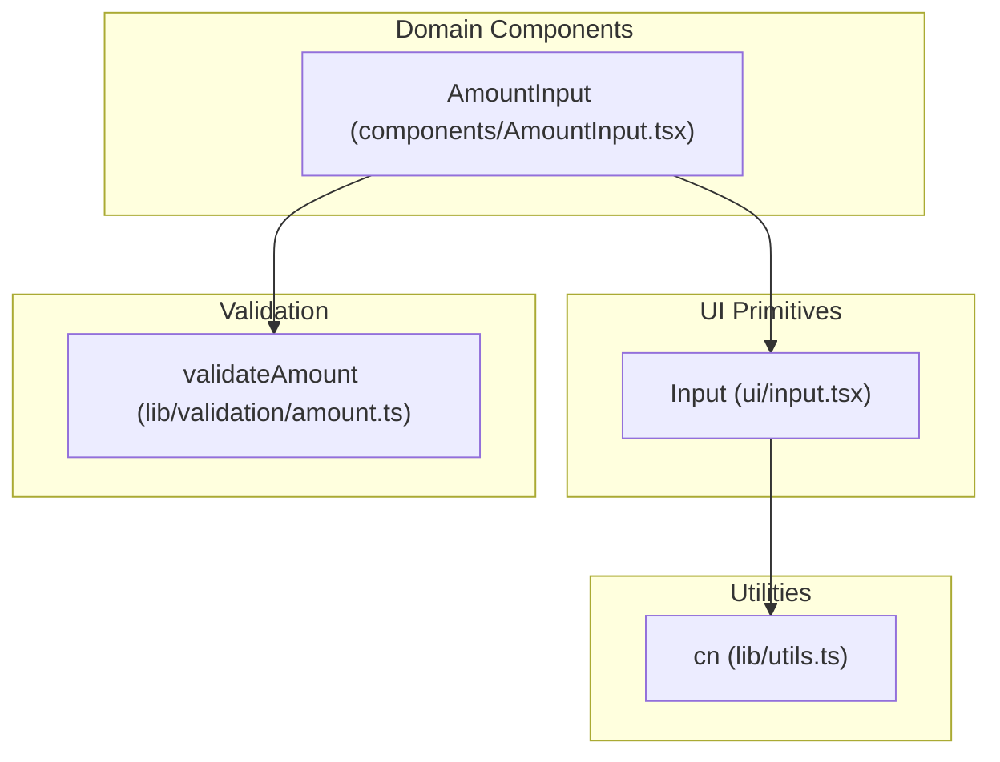
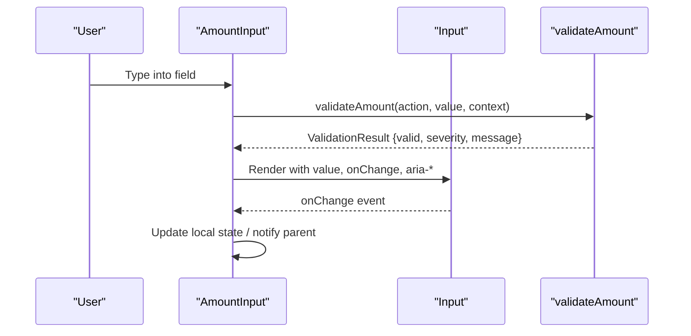
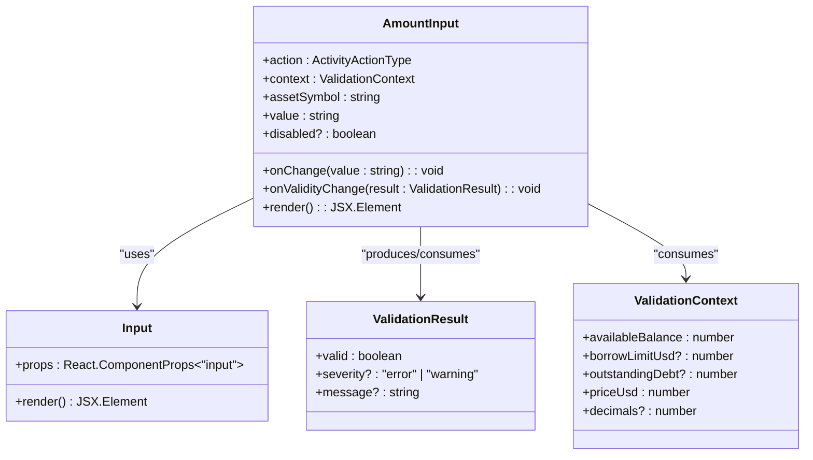
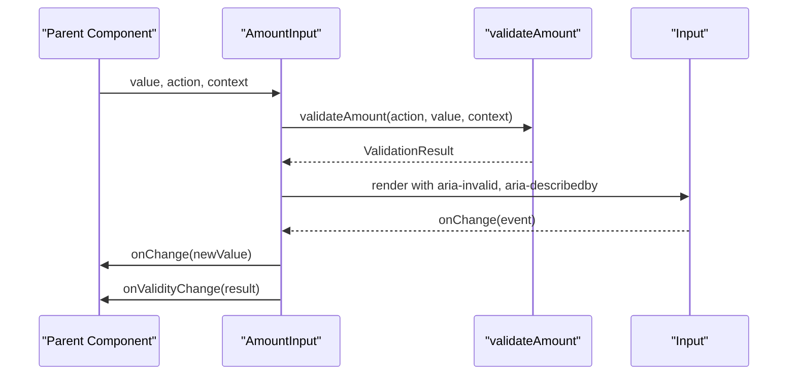
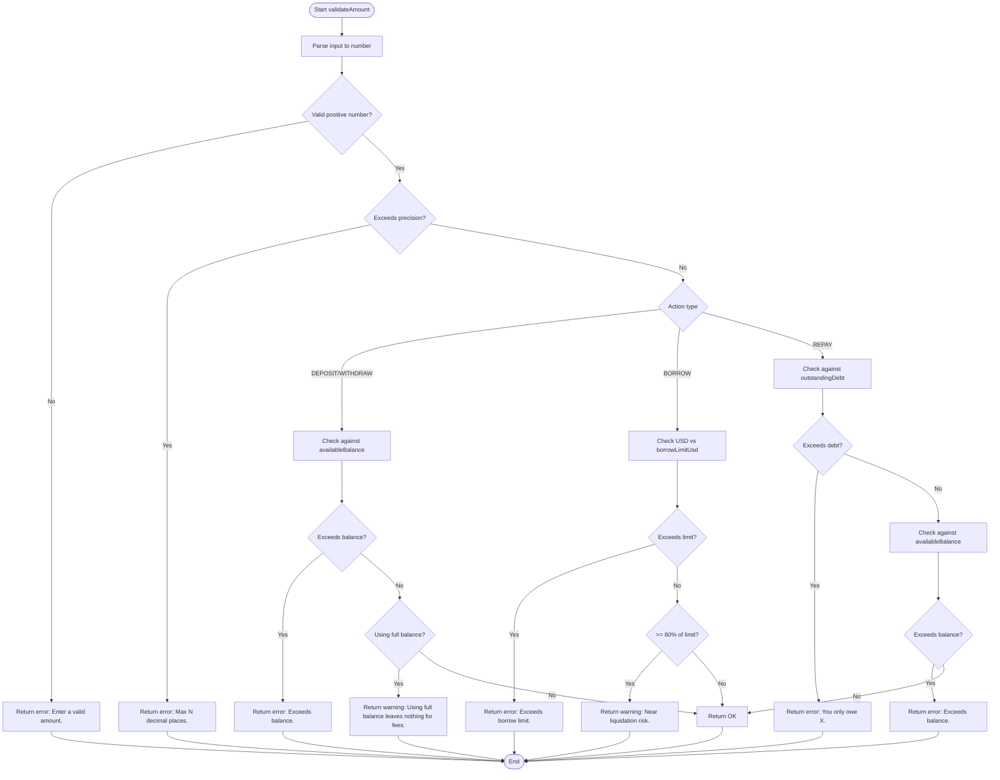
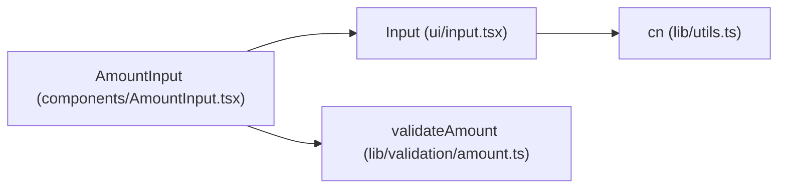

# Input Component

<cite>
**Referenced Files in This Document**
- [input.tsx](file://veilend-web/src/components/ui/input.tsx)
- [AmountInput.tsx](file://veilend-web/src/components/AmountInput.tsx)
- [amount.ts](file://veilend-web/src/lib/validation/amount.ts)
- [utils.ts](file://veilend-web/src/lib/utils.ts)
</cite>

## Table of Contents
1. [Introduction](#introduction)
2. [Project Structure](#project-structure)
3. [Core Components](#core-components)
4. [Architecture Overview](#architecture-overview)
5. [Detailed Component Analysis](#detailed-component-analysis)
6. [Dependency Analysis](#dependency-analysis)
7. [Performance Considerations](#performance-considerations)
8. [Troubleshooting Guide](#troubleshooting-guide)
9. [Conclusion](#conclusion)
10. [Appendices](#appendices)

## Introduction
This document provides comprehensive documentation for the Input component used in the web application. It covers supported input types, validation states, error handling patterns, props for placeholders and labels, controlled and uncontrolled usage, form integration, accessibility features, styling customization, focus states, mobile optimizations, security considerations for sensitive inputs, and performance best practices. The primary implementation is a thin wrapper around the native HTML input element with consistent Tailwind-based styling and accessibility attributes. A higher-level AmountInput demonstrates how to integrate validation, feedback, and mobile-friendly behaviors.

## Project Structure
The Input component lives under the shared UI primitives and is consumed by domain-specific components such as AmountInput. Validation logic is centralized in a dedicated module.

**Diagram sources**
- [input.tsx:5-17](file://veilend-web/src/components/ui/input.tsx#L5-L17)
- [AmountInput.tsx:29-87](file://veilend-web/src/components/AmountInput.tsx#L29-L87)
- [amount.ts:55-138](file://veilend-web/src/lib/validation/amount.ts#L55-L138)
- [utils.ts:4-6](file://veilend-web/src/lib/utils.ts#L4-L6)

**Section sources**
- [input.tsx:1-20](file://veilend-web/src/components/ui/input.tsx#L1-L20)
- [AmountInput.tsx:1-123](file://veilend-web/src/components/AmountInput.tsx#L1-L123)
- [amount.ts:1-143](file://veilend-web/src/lib/validation/amount.ts#L1-L143)
- [utils.ts:1-7](file://veilend-web/src/lib/utils.ts#L1-L7)

## Core Components
- Input (ui/input.tsx): A minimal, accessible wrapper around the native input element that applies consistent styles, focus rings, disabled state, and invalid state via aria-invalid. It forwards all standard input props and supports any valid HTML input type.
- AmountInput (components/AmountInput.tsx): A controlled numeric input tailored for protocol actions. It integrates validation, inline feedback, a Max button, asset symbol suffix, and USD preview. It uses the base Input and composes additional UX features.

Key responsibilities:
- Input: Styling, focus/invalid/disabled states, accessibility hooks, prop forwarding.
- AmountInput: Controlled value management, validation-driven feedback, mobile inputMode, and action-specific behavior.

**Section sources**
- [input.tsx:5-17](file://veilend-web/src/components/ui/input.tsx#L5-L17)
- [AmountInput.tsx:14-87](file://veilend-web/src/components/AmountInput.tsx#L14-L87)

## Architecture Overview
The Input component is designed as a building block. Higher-order components like AmountInput add business logic and UX enhancements while reusing the base Input’s styling and accessibility.

**Diagram sources**
- [AmountInput.tsx:38-87](file://veilend-web/src/components/AmountInput.tsx#L38-L87)
- [amount.ts:55-138](file://veilend-web/src/lib/validation/amount.ts#L55-L138)
- [input.tsx:5-17](file://veilend-web/src/components/ui/input.tsx#L5-L17)

## Detailed Component Analysis

### Base Input Component
- Purpose: Provide a consistent, accessible, and stylable input primitive.
- Props: Accepts all standard HTML input props via spread; explicitly exposes className and type.
- Styling: Uses a utility function to merge classes; includes focus-visible ring, disabled opacity, placeholder color, and invalid state styling via aria-invalid.
- Accessibility: Supports aria-invalid for invalid state; data-slot for testing or targeting.

Supported input types: Any valid HTML input type (text, password, email, number, tel, url, search, etc.). For numeric-only fields, prefer using type="number" or text with inputMode="decimal" depending on desired behavior.

Focus and invalid states:
- Focus-visible: Adds border and ring for keyboard navigation.
- Invalid: When aria-invalid is true, applies destructive border and ring colors.

Disabled state: Disables pointer events, changes cursor, and reduces opacity.

Mobile optimization: Use inputMode="decimal" or appropriate values to trigger correct virtual keyboards when needed.

Security considerations:
- For sensitive inputs (e.g., passwords), use type="password" to mask content.
- Avoid storing secrets in client-side state longer than necessary.
- Ensure server-side validation and sanitization for all user inputs.

Performance characteristics:
- Lightweight wrapper with no internal state; renders efficiently.
- Defer heavy computations to parent components.

Usage examples:
- Controlled: Bind value and onChange from parent state.
- Uncontrolled: Omit value and rely on native behavior; collect via refs if needed.

Form integration:
- Works seamlessly with forms; can be paired with labels and validation messages.
- Combine with aria-describedby to link help or error text.

Styling customization:
- Override or extend styles via className prop.
- Use theme tokens through Tailwind classes for consistency.

Accessibility checklist:
- Associate label via htmlFor/id or visually hidden label.
- Provide aria-invalid when validation fails.
- Provide aria-describedby for error/help text.
- Ensure sufficient color contrast for focus and invalid states.

**Section sources**
- [input.tsx:5-17](file://veilend-web/src/components/ui/input.tsx#L5-L17)
- [utils.ts:4-6](file://veilend-web/src/lib/utils.ts#L4-L6)

### AmountInput Component
- Purpose: Provide a controlled amount input with inline validation for protocol actions (deposit, withdraw, borrow, repay).
- Props:
  - action: ActivityActionType indicating the operation context.
  - context: ValidationContext including balance, limits, price, decimals.
  - assetSymbol: Displayed suffix next to the input.
  - value: Controlled string value.
  - onChange: Callback to update value.
  - onValidityChange: Optional callback to propagate ValidationResult to parent.
  - disabled: Optional disabled state.
- Behavior:
  - Computes validation result using validateAmount and shows inline feedback after touch.
  - Provides a Max button to fill available balance or outstanding debt based on action.
  - Shows a USD preview when applicable.
  - Sets aria-invalid and aria-describedby for accessibility.

Validation flow:
- parseAmount validates format and positivity.
- exceedsPrecision enforces decimal precision.
- Action-specific checks enforce balances, limits, and debt constraints.
- Returns errors (blocking) or warnings (non-blocking) with concise messages.

Mobile optimization:
- Uses inputMode="decimal" to show numeric keypad.
- Short, readable messages suitable for small screens.

Accessibility:
- aria-invalid toggles based on error presence.
- aria-describedby links to feedback element.
- Feedback element uses role="alert" for errors and role="status" for warnings.

**Section sources**
- [AmountInput.tsx:14-123](file://veilend-web/src/components/AmountInput.tsx#L14-L123)
- [amount.ts:1-143](file://veilend-web/src/lib/validation/amount.ts#L1-L143)

#### Class Diagram

**Diagram sources**
- [input.tsx:5-17](file://veilend-web/src/components/ui/input.tsx#L5-L17)
- [AmountInput.tsx:14-87](file://veilend-web/src/components/AmountInput.tsx#L14-L87)
- [amount.ts:3-23](file://veilend-web/src/lib/validation/amount.ts#L3-L23)

#### Sequence Diagram: Validation Flow

**Diagram sources**
- [AmountInput.tsx:38-87](file://veilend-web/src/components/AmountInput.tsx#L38-L87)
- [amount.ts:55-138](file://veilend-web/src/lib/validation/amount.ts#L55-L138)

#### Flowchart: Validation Logic

**Diagram sources**
- [amount.ts:55-138](file://veilend-web/src/lib/validation/amount.ts#L55-L138)

## Dependency Analysis
- Input depends on the cn utility for class merging and applies Tailwind classes for consistent styling and accessibility.
- AmountInput depends on Input and the validation module to compute and display feedback.
- Validation module defines typed contexts and results, ensuring predictable behavior across actions.

**Diagram sources**
- [input.tsx:5-17](file://veilend-web/src/components/ui/input.tsx#L5-L17)
- [AmountInput.tsx:29-87](file://veilend-web/src/components/AmountInput.tsx#L29-L87)
- [amount.ts:55-138](file://veilend-web/src/lib/validation/amount.ts#L55-L138)
- [utils.ts:4-6](file://veilend-web/src/lib/utils.ts#L4-L6)

**Section sources**
- [input.tsx:1-20](file://veilend-web/src/components/ui/input.tsx#L1-L20)
- [AmountInput.tsx:1-123](file://veilend-web/src/components/AmountInput.tsx#L1-L123)
- [amount.ts:1-143](file://veilend-web/src/lib/validation/amount.ts#L1-L143)
- [utils.ts:1-7](file://veilend-web/src/lib/utils.ts#L1-L7)

## Performance Considerations
- Keep Input stateless; manage state in parent components to avoid unnecessary re-renders.
- Debounce expensive operations triggered by onChange if needed.
- Use memoization for derived values (as shown in AmountInput with useMemo).
- Prefer controlled inputs for forms where you need validation feedback; use uncontrolled inputs sparingly and collect values at submission time.
- Avoid heavy computations inside render paths; offload to callbacks or workers.

[No sources needed since this section provides general guidance]

## Troubleshooting Guide
Common issues and resolutions:
- Invalid state not showing: Ensure aria-invalid is set to true when validation fails and provide an aria-describedby element linking to the message.
- Placeholder not visible: Verify placeholder prop is passed and that styles do not override visibility.
- Mobile keyboard not numeric: Use inputMode="decimal" or type="number" for numeric inputs.
- Disabled state not working: Pass disabled prop to Input; ensure parent does not override it.
- Validation feedback not updating: Confirm onChange updates value and triggers recomputation of validation result.

**Section sources**
- [AmountInput.tsx:72-87](file://veilend-web/src/components/AmountInput.tsx#L72-L87)
- [amount.ts:55-138](file://veilend-web/src/lib/validation/amount.ts#L55-L138)

## Conclusion
The Input component provides a robust, accessible foundation for text entry across the application. Combined with AmountInput and centralized validation, it supports controlled and uncontrolled usage, clear error handling, and mobile-friendly interactions. Follow the accessibility guidelines, leverage styling customization via className, and apply security best practices for sensitive inputs.

[No sources needed since this section summarizes without analyzing specific files]

## Appendices

### Props Reference
- Input (ui/input.tsx):
  - className: Additional Tailwind classes to merge with default styles.
  - type: HTML input type (e.g., text, password, email, number).
  - All other standard HTML input props are forwarded.

- AmountInput (components/AmountInput.tsx):
  - action: ActivityActionType for context-aware validation.
  - context: ValidationContext with balance, limits, price, decimals.
  - assetSymbol: Suffix displayed next to the input.
  - value: Controlled string value.
  - onChange: Callback to update value.
  - onValidityChange: Optional callback to propagate ValidationResult.
  - disabled: Optional disabled state.

**Section sources**
- [input.tsx:5-17](file://veilend-web/src/components/ui/input.tsx#L5-L17)
- [AmountInput.tsx:14-23](file://veilend-web/src/components/AmountInput.tsx#L14-L23)

### Accessibility Checklist
- Associate labels with inputs using htmlFor/id or visually hidden labels.
- Set aria-invalid when validation fails.
- Link error/help text via aria-describedby.
- Ensure focus-visible states are visible and high-contrast.
- Use semantic roles for feedback (alert for errors, status for warnings).

**Section sources**
- [AmountInput.tsx:72-119](file://veilend-web/src/components/AmountInput.tsx#L72-L119)

### Security Considerations
- Use type="password" for sensitive inputs to mask content.
- Validate and sanitize all inputs on the server side.
- Avoid logging or exposing sensitive values in client-side state or analytics.
- Implement rate limiting and CSRF protections for form submissions.

[No sources needed since this section provides general guidance]