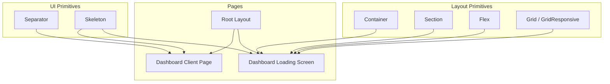
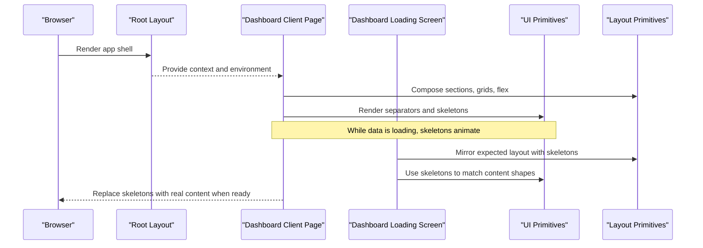
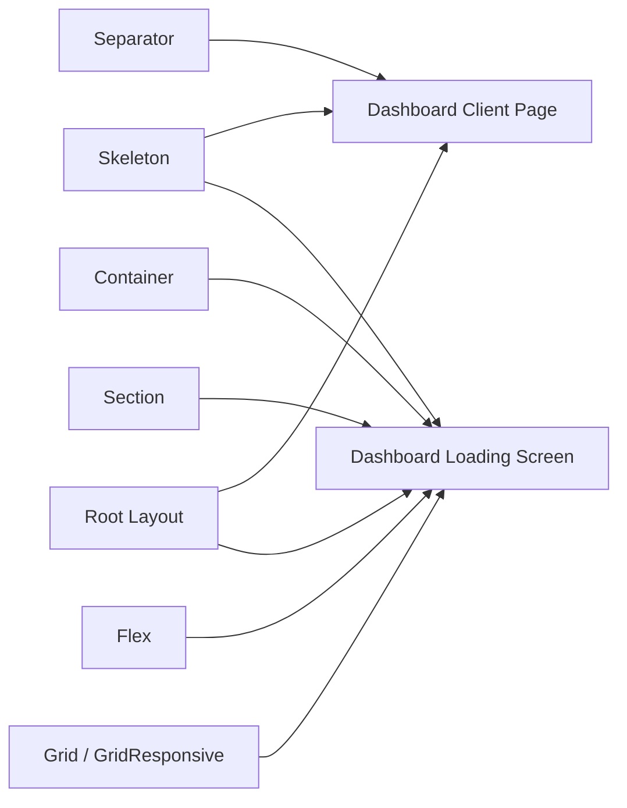
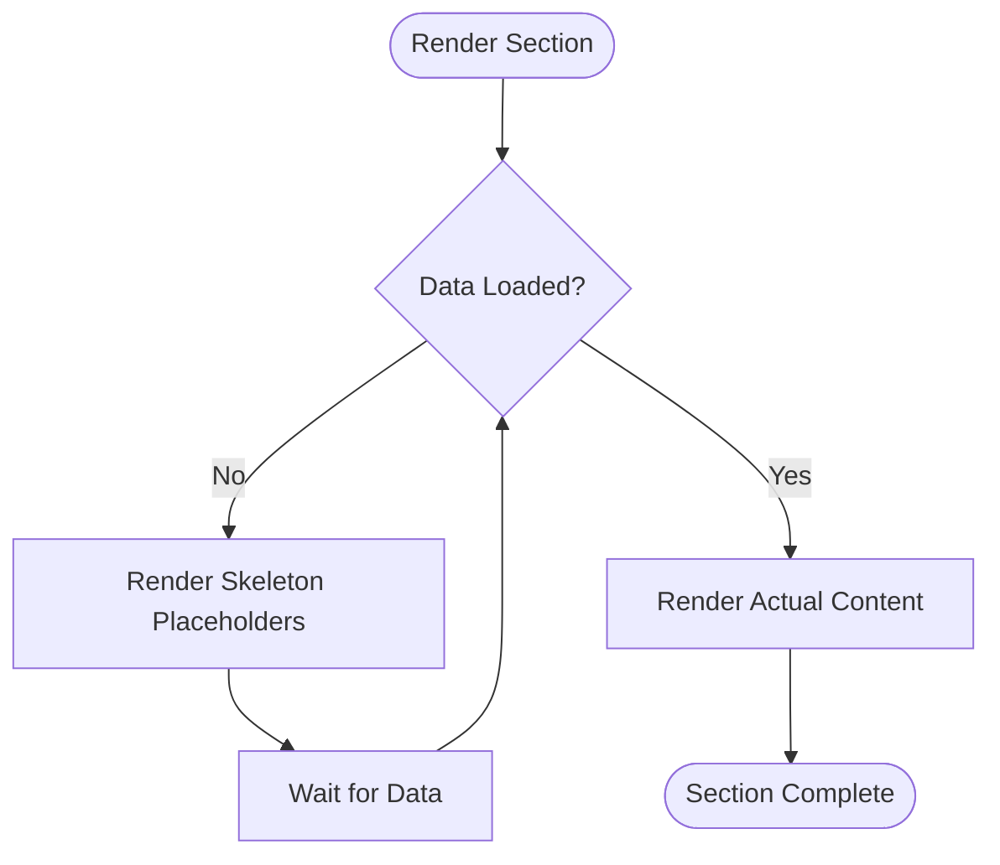

# Layout Components

<cite>
**Referenced Files in This Document**
- [separator.tsx](file://veilend-web/src/components/ui/separator.tsx)
- [skeleton.tsx](file://veilend-web/src/components/ui/skeleton.tsx)
- [Layout.tsx](file://veilend-web/src/components/Layout.tsx)
- [page.tsx (dashboard client)](file://veilend-web/src/app/(dashboard)/page.tsx)
- [loading.tsx (dashboard loading)](file://veilend-web/src/app/dashboard/loading.tsx)
- [layout.tsx (root layout)](file://veilend-web/src/app/layout.tsx)
</cite>

## Table of Contents
1. Introduction
2. Project Structure
3. Core Components
4. Architecture Overview
5. Detailed Component Analysis
6. Dependency Analysis
7. Performance Considerations
8. Troubleshooting Guide
9. Conclusion
10. Appendices

## Introduction
This document provides comprehensive guidance for layout and structural components with a focus on Separator and Skeleton loaders, their variants, styling, spacing, and integration patterns. It also covers skeleton loading strategies for different content types, animation controls, performance optimization, accessibility considerations, responsive design patterns, and how these components integrate with page layouts and content components across the web application.

## Project Structure
The layout and structural components are implemented as reusable UI primitives and higher-level layout building blocks:
- UI primitives: Separator and Skeleton under the ui directory.
- Layout primitives: Container, Section, Flex, Grid, GridResponsive under a shared Layout module.
- Usage examples: Dashboard pages and dedicated loading screens demonstrate practical composition and responsive behavior.

**Diagram sources**
- [separator.tsx:8-25](file://veilend-web/src/components/ui/separator.tsx#L8-L25)
- [skeleton.tsx:3-11](file://veilend-web/src/components/ui/skeleton.tsx#L3-L11)
- [Layout.tsx:9-16](file://veilend-web/src/components/Layout.tsx#L9-L16)
- [Layout.tsx:26-43](file://veilend-web/src/components/Layout.tsx#L26-L43)
- [Layout.tsx:55-108](file://veilend-web/src/components/Layout.tsx#L55-L108)
- [Layout.tsx:117-167](file://veilend-web/src/components/Layout.tsx#L117-L167)
- [Layout.tsx:176-208](file://veilend-web/src/components/Layout.tsx#L176-L208)
- [page.tsx (dashboard client):1-302](file://veilend-web/src/app/(dashboard)/page.tsx#L1-L302)
- [loading.tsx (dashboard loading):1-101](file://veilend-web/src/app/dashboard/loading.tsx#L1-L101)
- [layout.tsx (root layout):25-39](file://veilend-web/src/app/layout.tsx#L25-L39)

**Section sources**
- [separator.tsx:8-25](file://veilend-web/src/components/ui/separator.tsx#L8-L25)
- [skeleton.tsx:3-11](file://veilend-web/src/components/ui/skeleton.tsx#L3-L11)
- [Layout.tsx:9-16](file://veilend-web/src/components/Layout.tsx#L9-L16)
- [Layout.tsx:26-43](file://veilend-web/src/components/Layout.tsx#L26-L43)
- [Layout.tsx:55-108](file://veilend-web/src/components/Layout.tsx#L55-L108)
- [Layout.tsx:117-167](file://veilend-web/src/components/Layout.tsx#L117-L167)
- [Layout.tsx:176-208](file://veilend-web/src/components/Layout.tsx#L176-L208)
- [page.tsx (dashboard client):1-302](file://veilend-web/src/app/(dashboard)/page.tsx#L1-L302)
- [loading.tsx (dashboard loading):1-101](file://veilend-web/src/app/dashboard/loading.tsx#L1-L101)
- [layout.tsx (root layout):25-39](file://veilend-web/src/app/layout.tsx#L25-L39)

## Core Components
- Separator: A semantic divider supporting horizontal and vertical orientations with decorative mode to exclude from accessibility trees when appropriate.
- Skeleton: A lightweight placeholder element using a pulsing animation to indicate loading states.
- Layout primitives: Container, Section, Flex, Grid, GridResponsive provide consistent spacing, alignment, and responsive grid behaviors.

Key characteristics:
- Separator uses orientation and decorative props to control visual role and accessibility semantics.
- Skeleton applies a pulse animation and rounded background to mimic content shape during loading.
- Layout primitives compose predictable structures with Tailwind-based classes for responsive grids and flexible arrangements.

**Section sources**
- [separator.tsx:8-25](file://veilend-web/src/components/ui/separator.tsx#L8-L25)
- [skeleton.tsx:3-11](file://veilend-web/src/components/ui/skeleton.tsx#L3-L11)
- [Layout.tsx:9-16](file://veilend-web/src/components/Layout.tsx#L9-L16)
- [Layout.tsx:26-43](file://veilend-web/src/components/Layout.tsx#L26-L43)
- [Layout.tsx:55-108](file://veilend-web/src/components/Layout.tsx#L55-L108)
- [Layout.tsx:117-167](file://veilend-web/src/components/Layout.tsx#L117-L167)
- [Layout.tsx:176-208](file://veilend-web/src/components/Layout.tsx#L176-L208)

## Architecture Overview
The layout architecture composes UI primitives within higher-level layout containers to build responsive pages and loading screens. The root layout sets up global styles and providers; dashboard pages use layout primitives to structure content and apply Skeleton placeholders while data loads.

**Diagram sources**
- [layout.tsx (root layout):25-39](file://veilend-web/src/app/layout.tsx#L25-L39)
- [page.tsx (dashboard client):1-302](file://veilend-web/src/app/(dashboard)/page.tsx#L1-L302)
- [loading.tsx (dashboard loading):1-101](file://veilend-web/src/app/dashboard/loading.tsx#L1-L101)
- [separator.tsx:8-25](file://veilend-web/src/components/ui/separator.tsx#L8-L25)
- [skeleton.tsx:3-11](file://veilend-web/src/components/ui/skeleton.tsx#L3-L11)
- [Layout.tsx:9-16](file://veilend-web/src/components/Layout.tsx#L9-L16)
- [Layout.tsx:26-43](file://veilend-web/src/components/Layout.tsx#L26-L43)
- [Layout.tsx:55-108](file://veilend-web/src/components/Layout.tsx#L55-L108)
- [Layout.tsx:117-167](file://veilend-web/src/components/Layout.tsx#L117-L167)
- [Layout.tsx:176-208](file://veilend-web/src/components/Layout.tsx#L176-L208)

## Detailed Component Analysis

### Separator
- Variants: Horizontal and vertical via orientation prop.
- Styling: Uses border-like background color and sizing based on orientation; supports custom className overrides.
- Spacing: Shrink-0 ensures it does not collapse; width/height adapt to orientation.
- Accessibility: Decorative flag allows excluding from assistive technology when used purely for visual separation.

Usage patterns:
- Horizontal separators between sections or list items.
- Vertical separators inside rows to divide columns or groups.

Integration tips:
- Combine with Flex/Grid to create clear visual hierarchies.
- Use decorative mode for non-semantic dividers to keep the accessibility tree clean.

**Section sources**
- [separator.tsx:8-25](file://veilend-web/src/components/ui/separator.tsx#L8-L25)

### Skeleton
- Purpose: Placeholder that mimics content shape during loading.
- Animation: Pulse animation applied by default; can be overridden via className.
- Styling: Rounded rectangle with muted background; supports custom dimensions and colors through className.
- Performance: Lightweight DOM node; avoid excessive nesting to minimize reflows.

Patterns:
- List rows: Height-matched skeletons for titles, subtitles, and avatars.
- Cards: Header and body skeletons matching final content size.
- Tables: Row skeletons aligned to table cell heights.

Controls:
- Adjust height/width to match target content.
- Override animation or color via className when needed.

**Section sources**
- [skeleton.tsx:3-11](file://veilend-web/src/components/ui/skeleton.tsx#L3-L11)

### Layout Primitives
- Container: Centers content with max-width and responsive padding.
- Section: Semantic section wrapper with configurable vertical padding scale.
- Flex: Flexible container with direction, alignment, justification, gap, and wrap options.
- Grid: Responsive grid with numeric or breakpoint-specific column configurations and gap control.
- GridResponsive: Explicit breakpoint-driven columns for fine-grained responsiveness.

Responsiveness:
- Grid and GridResponsive support sm/md/lg/xl breakpoints for column counts.
- Flex gap utilities provide consistent spacing across screen sizes.

Composition:
- Build page shells with Container > Section > Grid/Flex.
- Use Grid for multi-column dashboards; Flex for inline elements and lists.

**Section sources**
- [Layout.tsx:9-16](file://veilend-web/src/components/Layout.tsx#L9-L16)
- [Layout.tsx:26-43](file://veilend-web/src/components/Layout.tsx#L26-L43)
- [Layout.tsx:55-108](file://veilend-web/src/components/Layout.tsx#L55-L108)
- [Layout.tsx:117-167](file://veilend-web/src/components/Layout.tsx#L117-L167)
- [Layout.tsx:176-208](file://veilend-web/src/components/Layout.tsx#L176-L208)

### Page Layouts and Content Organization
- Dashboard client page demonstrates conditional rendering for loading, empty, and data states, using Skeleton placeholders during load and structured grids for content.
- Dedicated loading screen mirrors the final layout with Skeleton components to prevent layout shift and maintain perceived performance.

Examples:
- Top metrics row using responsive grid.
- Two-column content area with cards containing lists and progress indicators.
- Activity log table with skeleton rows during load.

**Section sources**
- [page.tsx (dashboard client):1-302](file://veilend-web/src/app/(dashboard)/page.tsx#L1-L302)
- [loading.tsx (dashboard loading):1-101](file://veilend-web/src/app/dashboard/loading.tsx#L1-L101)

### Accessibility Considerations
- Separator: Set decorative to true when used purely for visual separation to avoid unnecessary announcements.
- Skeleton: Ensure surrounding content remains navigable; do not place interactive elements behind skeletons without proper focus management.
- Semantic structure: Use Section for meaningful landmarks; ensure headings and labels remain accessible even when skeletons are present.
- Motion sensitivity: If animations cause discomfort, consider respecting prefers-reduced-motion by overriding animation via className where necessary.

**Section sources**
- [separator.tsx:8-25](file://veilend-web/src/components/ui/separator.tsx#L8-L25)
- [skeleton.tsx:3-11](file://veilend-web/src/components/ui/skeleton.tsx#L3-L11)
- [Layout.tsx:26-43](file://veilend-web/src/components/Layout.tsx#L26-L43)

### Responsive Design Patterns
- Use Grid with numeric or breakpoint-specific columns to adapt layouts from single-column on small screens to multi-column on larger screens.
- Leverage Flex gap and alignment utilities for consistent spacing and alignment across breakpoints.
- Apply Container and Section to standardize margins and paddings globally.

**Section sources**
- [Layout.tsx:117-167](file://veilend-web/src/components/Layout.tsx#L117-L167)
- [Layout.tsx:176-208](file://veilend-web/src/components/Layout.tsx#L176-L208)
- [page.tsx (dashboard client):100-131](file://veilend-web/src/app/(dashboard)/page.tsx#L100-L131)

### Integration with Content Components
- Pair Skeleton with Card, Badge, Progress, and other UI components to mirror final content shapes during loading.
- Use Separator to visually group related content within cards or lists.
- Compose complex layouts with Grid and Flex to align skeletons precisely with content regions.

**Section sources**
- [page.tsx (dashboard client):145-187](file://veilend-web/src/app/(dashboard)/page.tsx#L145-L187)
- [page.tsx (dashboard client):202-240](file://veilend-web/src/app/(dashboard)/page.tsx#L202-L240)
- [loading.tsx (dashboard loading):18-65](file://veilend-web/src/app/dashboard/loading.tsx#L18-L65)

## Dependency Analysis
The following diagram shows how layout primitives and UI primitives are composed in pages and loading screens.

**Diagram sources**
- [separator.tsx:8-25](file://veilend-web/src/components/ui/separator.tsx#L8-L25)
- [skeleton.tsx:3-11](file://veilend-web/src/components/ui/skeleton.tsx#L3-L11)
- [Layout.tsx:9-16](file://veilend-web/src/components/Layout.tsx#L9-L16)
- [Layout.tsx:26-43](file://veilend-web/src/components/Layout.tsx#L26-L43)
- [Layout.tsx:55-108](file://veilend-web/src/components/Layout.tsx#L55-L108)
- [Layout.tsx:117-167](file://veilend-web/src/components/Layout.tsx#L117-L167)
- [Layout.tsx:176-208](file://veilend-web/src/components/Layout.tsx#L176-L208)
- [page.tsx (dashboard client):1-302](file://veilend-web/src/app/(dashboard)/page.tsx#L1-L302)
- [loading.tsx (dashboard loading):1-101](file://veilend-web/src/app/dashboard/loading.tsx#L1-L101)
- [layout.tsx (root layout):25-39](file://veilend-web/src/app/layout.tsx#L25-L39)

**Section sources**
- [page.tsx (dashboard client):1-302](file://veilend-web/src/app/(dashboard)/page.tsx#L1-L302)
- [loading.tsx (dashboard loading):1-101](file://veilend-web/src/app/dashboard/loading.tsx#L1-L101)
- [layout.tsx (root layout):25-39](file://veilend-web/src/app/layout.tsx#L25-L39)

## Performance Considerations
- Minimize skeleton depth: Keep skeleton trees shallow to reduce layout recalculations.
- Match dimensions: Size skeletons to approximate final content to avoid layout shifts.
- Avoid heavy animations: The default pulse animation is lightweight; override only if necessary.
- Conditional rendering: Show skeletons only while data is loading; switch to actual content promptly to reduce wasted work.
- Batch updates: Group state changes to minimize re-renders when transitioning from skeletons to content.

[No sources needed since this section provides general guidance]

## Troubleshooting Guide
Common issues and resolutions:
- Skeletons not visible: Ensure parent has sufficient height and background contrast; verify className overrides are not hiding the element.
- Misaligned skeletons: Align skeleton dimensions with final content; use Grid/Flex to lock positions.
- Excessive reflows: Reduce number of nested skeletons; prefer flat structures.
- Accessibility noise: Set decorative on Separator when used purely for visuals; ensure skeletons do not trap focus.

**Section sources**
- [skeleton.tsx:3-11](file://veilend-web/src/components/ui/skeleton.tsx#L3-L11)
- [separator.tsx:8-25](file://veilend-web/src/components/ui/separator.tsx#L8-L25)
- [Layout.tsx:55-108](file://veilend-web/src/components/Layout.tsx#L55-L108)
- [Layout.tsx:117-167](file://veilend-web/src/components/Layout.tsx#L117-L167)

## Conclusion
Separator and Skeleton are foundational layout components that, when combined with Container, Section, Flex, and Grid, enable consistent, responsive, and accessible page structures. By carefully sizing skeletons, controlling animations, and leveraging responsive grids, you can deliver smooth loading experiences that preserve layout stability and improve perceived performance. Use Separator thoughtfully to organize content and maintain a clean accessibility tree.

[No sources needed since this section summarizes without analyzing specific files]

## Appendices

### Example Workflows

#### Skeleton Loading Flow for a Dashboard Section

[No sources needed since this diagram shows conceptual workflow, not actual code structure]