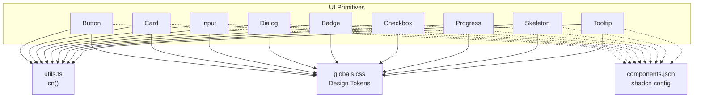
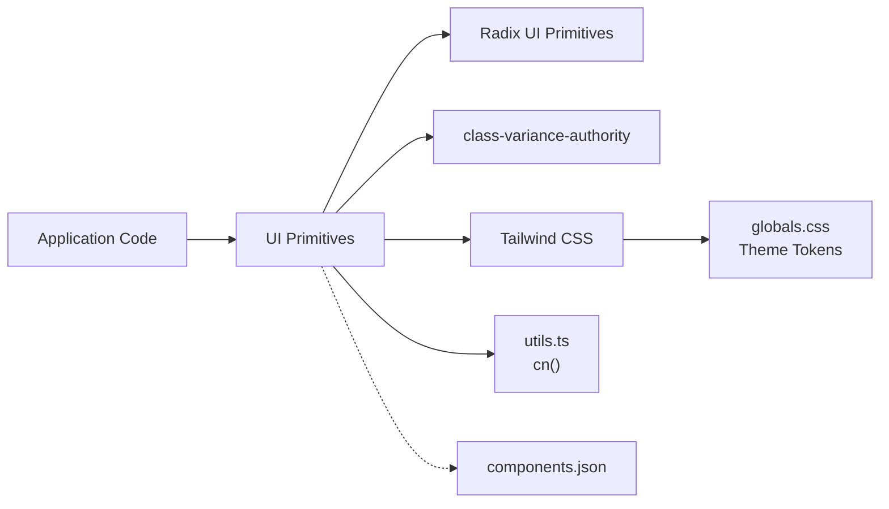
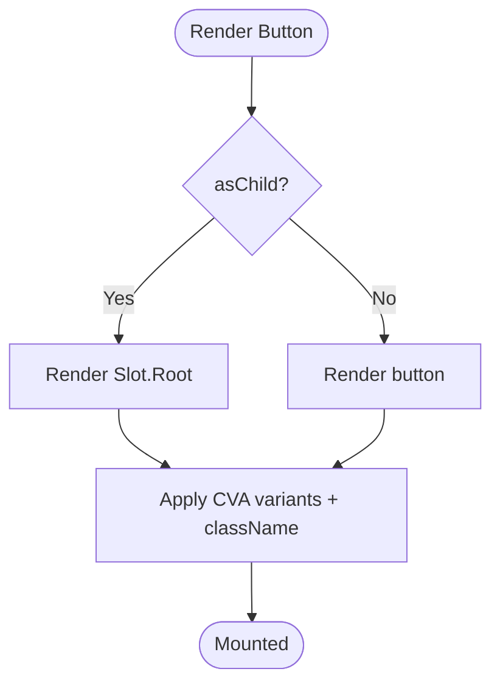
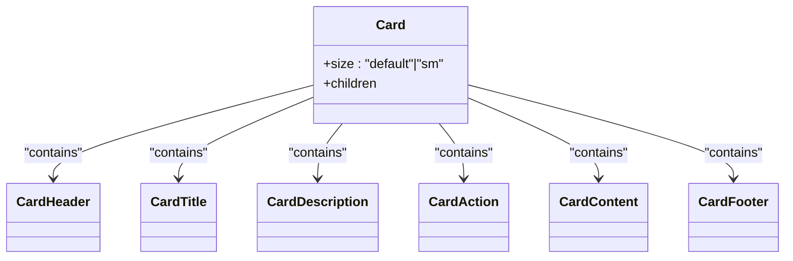
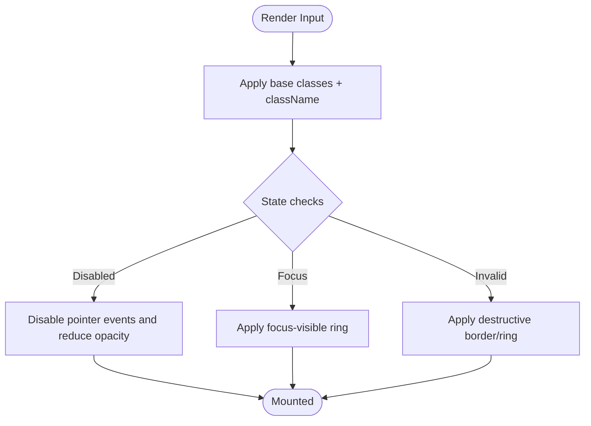
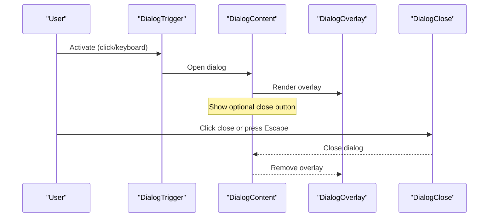
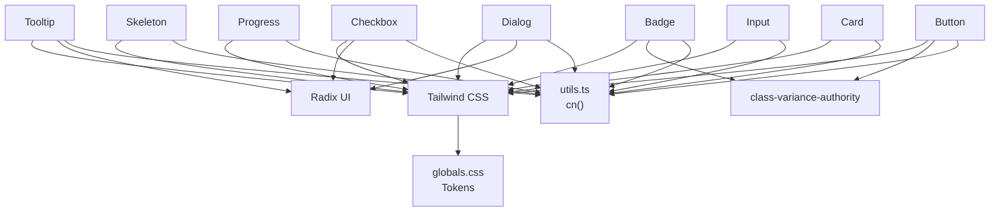

# UI Primitives

<cite>
**Referenced Files in This Document**
- [button.tsx](file://veilend-web/src/components/ui/button.tsx)
- [card.tsx](file://veilend-web/src/components/ui/card.tsx)
- [input.tsx](file://veilend-web/src/components/ui/input.tsx)
- [dialog.tsx](file://veilend-web/src/components/ui/dialog.tsx)
- [badge.tsx](file://veilend-web/src/components/ui/badge.tsx)
- [checkbox.tsx](file://veilend-web/src/components/ui/checkbox.tsx)
- [progress.tsx](file://veilend-web/src/components/ui/progress.tsx)
- [skeleton.tsx](file://veilend-web/src/components/ui/skeleton.tsx)
- [tooltip.tsx](file://veilend-web/src/components/ui/tooltip.tsx)
- [globals.css](file://veilend-web/src/app/globals.css)
- [utils.ts](file://veilend-web/src/lib/utils.ts)
- [components.json](file://veilend-web/components.json)
</cite>

## Table of Contents
1. Introduction
2. Project Structure
3. Core Components
4. Architecture Overview
5. Detailed Component Analysis
6. Dependency Analysis
7. Performance Considerations
8. Troubleshooting Guide
9. Conclusion
10. Appendices

## Introduction
This document describes the foundational UI primitive components used across the web application: Button, Card, Input, Dialog, Badge, Checkbox, Progress, Skeleton, and Tooltip. It explains each component’s props, variants, states, styling options, accessibility features, keyboard behavior, and how they integrate with the design system tokens defined in global CSS. It also provides guidance for composition, theming, Tailwind CSS integration, performance tips, and browser compatibility considerations.

## Project Structure
The UI primitives live under a shared UI directory and are built on top of Radix UI primitives, class-variance-authority (CVA) for variant management, and Tailwind CSS utilities. A utility function merges classes deterministically to avoid conflicts. Global CSS defines theme tokens (colors, radii, shadows, typography) and light/dark modes.

**Diagram sources**
- [button.tsx:1-68](file://veilend-web/src/components/ui/button.tsx#L1-L68)
- [card.tsx:1-104](file://veilend-web/src/components/ui/card.tsx#L1-L104)
- [input.tsx:1-20](file://veilend-web/src/components/ui/input.tsx#L1-L20)
- [dialog.tsx:1-166](file://veilend-web/src/components/ui/dialog.tsx#L1-L166)
- [badge.tsx:1-50](file://veilend-web/src/components/ui/badge.tsx#L1-L50)
- [checkbox.tsx:1-34](file://veilend-web/src/components/ui/checkbox.tsx#L1-L34)
- [progress.tsx:1-32](file://veilend-web/src/components/ui/progress.tsx#L1-L32)
- [skeleton.tsx:1-14](file://veilend-web/src/components/ui/skeleton.tsx#L1-L14)
- [tooltip.tsx:1-30](file://veilend-web/src/components/ui/tooltip.tsx#L1-L30)
- [utils.ts:1-7](file://veilend-web/src/lib/utils.ts#L1-L7)
- [globals.css:1-161](file://veilend-web/src/app/globals.css#L1-L161)
- [components.json:1-26](file://veilend-web/components.json#L1-L26)

**Section sources**
- [components.json:1-26](file://veilend-web/components.json#L1-L26)
- [utils.ts:1-7](file://veilend-web/src/lib/utils.ts#L1-L7)
- [globals.css:1-161](file://veilend-web/src/app/globals.css#L1-L161)

## Core Components
Below is a concise overview of each primitive, its purpose, key props, variants/states, and styling hooks.

- Button
  - Purpose: Primary interactive element with multiple visual styles and sizes.
  - Props: Standard button attributes plus variant, size, asChild.
  - Variants: default, outline, secondary, ghost, destructive, link.
  - Sizes: default, xs, sm, lg, icon, icon-xs, icon-sm, icon-lg.
  - States: hover, focus-visible, active, disabled, aria-invalid, expanded (via data attributes).
  - Styling: Uses CVA with Tailwind classes; integrates with ring, border, and color tokens.
  - Accessibility: Focus-visible ring, keyboard support via native button semantics, aria-invalid support.

- Card
  - Purpose: Content container with header, description, action area, content, and footer.
  - Props: size (default, sm), standard div attributes.
  - Sub-components: CardHeader, CardTitle, CardDescription, CardAction, CardContent, CardFooter.
  - States: Responsive spacing via CSS variables; image-aware padding adjustments.
  - Styling: Shadow, ring, rounded corners, semantic grouping via data-slot.

- Input
  - Purpose: Text input field with consistent styling and validation states.
  - Props: type and all standard input attributes.
  - States: focus-visible, disabled, aria-invalid.
  - Styling: Transparent background, border, ring, placeholder and file input handling.

- Dialog
  - Purpose: Accessible modal overlay with portal rendering and optional close button.
  - Props: Standard Radix dialog props; showCloseButton on content/footer.
  - Sub-components: Dialog, DialogTrigger, DialogPortal, DialogClose, DialogOverlay, DialogContent, DialogHeader, DialogFooter, DialogTitle, DialogDescription.
  - States: Open/closed animations, focus trapping via Radix.
  - Accessibility: Proper role/aria attributes from Radix, screen reader text for close button.

- Badge
  - Purpose: Small label or status indicator.
  - Props: variant, asChild, standard span attributes.
  - Variants: default, secondary, destructive, outline, ghost, link.
  - States: focus-visible, aria-invalid.
  - Styling: Compact inline layout with icon spacing rules.

- Checkbox
  - Purpose: Binary selection control.
  - Props: Standard Radix checkbox root props.
  - States: checked, disabled, focus-visible, aria-invalid.
  - Accessibility: Keyboard navigation and screen reader labels via Radix.

- Progress
  - Props: value (percentage), standard progress root props.
  - States: Visual indicator reflects current value.
  - Styling: Rounded track with primary-colored fill.

- Skeleton
  - Props: Standard div attributes.
  - Purpose: Placeholder while content loads.
  - Styling: Pulsing animation and muted background.

- Tooltip
  - Props: sideOffset, standard tooltip props.
  - Sub-components: TooltipProvider, Tooltip, TooltipTrigger, TooltipContent.
  - States: Open/closed with slide/fade animations.
  - Accessibility: Tooltips provide contextual information; ensure meaningful trigger content.

**Section sources**
- [button.tsx:7-67](file://veilend-web/src/components/ui/button.tsx#L7-L67)
- [card.tsx:5-103](file://veilend-web/src/components/ui/card.tsx#L5-L103)
- [input.tsx:5-19](file://veilend-web/src/components/ui/input.tsx#L5-L19)
- [dialog.tsx:10-165](file://veilend-web/src/components/ui/dialog.tsx#L10-L165)
- [badge.tsx:7-49](file://veilend-web/src/components/ui/badge.tsx#L7-L49)
- [checkbox.tsx:9-33](file://veilend-web/src/components/ui/checkbox.tsx#L9-L33)
- [progress.tsx:8-31](file://veilend-web/src/components/ui/progress.tsx#L8-L31)
- [skeleton.tsx:3-13](file://veilend-web/src/components/ui/skeleton.tsx#L3-L13)
- [tooltip.tsx:8-29](file://veilend-web/src/components/ui/tooltip.tsx#L8-L29)

## Architecture Overview
The UI primitives follow a layered architecture:
- Presentation layer: React components that compose Radix primitives and apply Tailwind classes.
- Styling layer: CVA-based variants and Tailwind utilities, merged via cn().
- Theme layer: CSS custom properties define colors, radii, shadows, and typography tokens.
- Configuration layer: shadcn configuration maps aliases and style preferences.

**Diagram sources**
- [button.tsx:1-68](file://veilend-web/src/components/ui/button.tsx#L1-L68)
- [utils.ts:1-7](file://veilend-web/src/lib/utils.ts#L1-L7)
- [globals.css:1-161](file://veilend-web/src/app/globals.css#L1-L161)
- [components.json:1-26](file://veilend-web/components.json#L1-L26)

## Detailed Component Analysis

### Button
- Props
  - variant: default | outline | secondary | ghost | destructive | link
  - size: default | xs | sm | lg | icon | icon-xs | icon-sm | icon-lg
  - asChild: boolean (renders as Slot.Root when true)
  - All standard HTML button attributes
- States and Styling
  - Hover, focus-visible ring, active translation, disabled opacity
  - aria-invalid styling for error states
  - Icon sizing and spacing handled via data attributes
- Accessibility
  - Native button semantics ensure keyboard support
  - Focus-visible ring improves visibility
  - aria-invalid communicates invalid state to assistive tech

**Diagram sources**
- [button.tsx:44-67](file://veilend-web/src/components/ui/button.tsx#L44-L67)

**Section sources**
- [button.tsx:7-67](file://veilend-web/src/components/ui/button.tsx#L7-L67)

### Card
- Props
  - size: default | sm
  - Standard div attributes
- Sub-components
  - CardHeader, CardTitle, CardDescription, CardAction, CardContent, CardFooter
- Layout and Styling
  - Uses CSS variable for spacing (--card-spacing)
  - Image-aware padding and rounded corners
  - Shadow and ring for elevation and boundary definition

**Diagram sources**
- [card.tsx:5-103](file://veilend-web/src/components/ui/card.tsx#L5-L103)

**Section sources**
- [card.tsx:5-103](file://veilend-web/src/components/ui/card.tsx#L5-L103)

### Input
- Props
  - type: string (e.g., text, email, password)
  - All standard input attributes
- States and Styling
  - Focus-visible ring, disabled state, aria-invalid styling
  - File input styling for file-type inputs
  - Transparent background with border and shadow

**Diagram sources**
- [input.tsx:5-19](file://veilend-web/src/components/ui/input.tsx#L5-L19)

**Section sources**
- [input.tsx:5-19](file://veilend-web/src/components/ui/input.tsx#L5-L19)

### Dialog
- Props
  - Root and child components accept standard Radix props
  - DialogContent.showCloseButton: boolean
  - DialogFooter.showCloseButton: boolean
- Behavior
  - Portal rendering for overlay and content
  - Overlay with backdrop blur and fade transitions
  - Optional close button with screen-reader-only text
- Accessibility
  - Focus trap and proper ARIA roles provided by Radix
  - Keyboard interactions (Escape to close) handled by Radix

**Diagram sources**
- [dialog.tsx:10-165](file://veilend-web/src/components/ui/dialog.tsx#L10-L165)

**Section sources**
- [dialog.tsx:10-165](file://veilend-web/src/components/ui/dialog.tsx#L10-L165)

### Badge
- Props
  - variant: default | secondary | destructive | outline | ghost | link
  - asChild: boolean
  - Standard span attributes
- States and Styling
  - Focus-visible ring, aria-invalid styling
  - Icon spacing via data attributes
  - Link-like hover behavior for certain variants

**Section sources**
- [badge.tsx:7-49](file://veilend-web/src/components/ui/badge.tsx#L7-L49)

### Checkbox
- Props
  - Standard Radix checkbox root props
- States and Styling
  - Checked state with primary color and foreground
  - Disabled state with reduced opacity
  - Focus-visible ring and aria-invalid styling

**Section sources**
- [checkbox.tsx:9-33](file://veilend-web/src/components/ui/checkbox.tsx#L9-L33)

### Progress
- Props
  - value: number (percentage)
  - Standard Radix progress root props
- Behavior
  - Indicator width computed from value
  - Smooth transition on value changes

**Section sources**
- [progress.tsx:8-31](file://veilend-web/src/components/ui/progress.tsx#L8-L31)

### Skeleton
- Props
  - Standard div attributes
- Purpose
  - Loading placeholder with pulsing animation

**Section sources**
- [skeleton.tsx:3-13](file://veilend-web/src/components/ui/skeleton.tsx#L3-L13)

### Tooltip
- Props
  - sideOffset: number
  - Standard tooltip props
- Sub-components
  - TooltipProvider, Tooltip, TooltipTrigger, TooltipContent
- Behavior
  - Animated open/close with slide and fade
  - Positioned relative to trigger

**Section sources**
- [tooltip.tsx:8-29](file://veilend-web/src/components/ui/tooltip.tsx#L8-L29)

## Dependency Analysis
- Internal dependencies
  - All components use utils.ts cn() to merge Tailwind classes deterministically.
  - Components rely on Tailwind CSS utilities and theme tokens from globals.css.
  - Dialog, Checkbox, and Tooltip wrap Radix primitives for robust accessibility.
- External dependencies
  - Radix UI for accessible primitives (Dialog, Checkbox, Tooltip).
  - class-variance-authority for variant management (Button, Badge).
  - Tailwind CSS for utility-first styling.
  - Lucide icons used within some components (e.g., Dialog close button).

**Diagram sources**
- [button.tsx:1-68](file://veilend-web/src/components/ui/button.tsx#L1-L68)
- [badge.tsx:1-50](file://veilend-web/src/components/ui/badge.tsx#L1-L50)
- [card.tsx:1-104](file://veilend-web/src/components/ui/card.tsx#L1-L104)
- [input.tsx:1-20](file://veilend-web/src/components/ui/input.tsx#L1-L20)
- [dialog.tsx:1-166](file://veilend-web/src/components/ui/dialog.tsx#L1-L166)
- [checkbox.tsx:1-34](file://veilend-web/src/components/ui/checkbox.tsx#L1-L34)
- [progress.tsx:1-32](file://veilend-web/src/components/ui/progress.tsx#L1-L32)
- [skeleton.tsx:1-14](file://veilend-web/src/components/ui/skeleton.tsx#L1-L14)
- [tooltip.tsx:1-30](file://veilend-web/src/components/ui/tooltip.tsx#L1-L30)
- [utils.ts:1-7](file://veilend-web/src/lib/utils.ts#L1-L7)
- [globals.css:1-161](file://veilend-web/src/app/globals.css#L1-L161)

**Section sources**
- [utils.ts:1-7](file://veilend-web/src/lib/utils.ts#L1-L7)
- [globals.css:1-161](file://veilend-web/src/app/globals.css#L1-L161)

## Performance Considerations
- Prefer using asChild on Button/Badge when you need to render as another element to avoid extra DOM nodes.
- Keep variant and size props static where possible to minimize re-renders caused by dynamic class computation.
- Avoid excessive nested dialogs; use portals judiciously to prevent heavy overlay stacks.
- Use Skeleton during loading to improve perceived performance and reduce layout shifts.
- Leverage Tailwind’s utility classes for minimal CSS overhead; avoid overriding with large custom stylesheets.
- Debounce frequent updates to Progress if driven by high-frequency events.

[No sources needed since this section provides general guidance]

## Troubleshooting Guide
- Focus not visible
  - Ensure focus-visible styles are applied; check that no custom CSS removes outlines or rings.
  - Verify that disabled elements do not receive focus unintentionally.
- Invalid state not reflected
  - Pass aria-invalid to Input/Button/Badge to trigger destructive styling.
  - Ensure parent form logic sets aria-invalid based on validation results.
- Dialog not closing
  - Confirm DialogClose is wired correctly and that showCloseButton is enabled where expected.
  - Check that Radix primitives are properly mounted and not blocked by z-index issues.
- Tooltip not appearing
  - Ensure TooltipProvider wraps the tree so tooltips can be managed globally.
  - Verify trigger has appropriate interactive content and is not disabled.
- Class conflicts
  - Use cn() to merge classes; avoid manually concatenating conflicting Tailwind classes.
  - Prefer variants and sizes over ad-hoc overrides to maintain consistency.

**Section sources**
- [input.tsx:5-19](file://veilend-web/src/components/ui/input.tsx#L5-L19)
- [button.tsx:7-67](file://veilend-web/src/components/ui/button.tsx#L7-L67)
- [badge.tsx:7-49](file://veilend-web/src/components/ui/badge.tsx#L7-L49)
- [dialog.tsx:10-165](file://veilend-web/src/components/ui/dialog.tsx#L10-L165)
- [tooltip.tsx:8-29](file://veilend-web/src/components/ui/tooltip.tsx#L8-L29)
- [utils.ts:1-7](file://veilend-web/src/lib/utils.ts#L1-L7)

## Conclusion
The UI primitives provide a cohesive, accessible, and themeable foundation for building consistent interfaces. They leverage Radix for accessibility, CVA for flexible variants, and Tailwind for efficient styling. By adhering to the documented props, states, and tokens, teams can compose complex UIs quickly while maintaining design consistency and performance.

[No sources needed since this section summarizes without analyzing specific files]

## Appendices

### Design System Tokens
- Colors
  - Semantic tokens (primary, secondary, muted, destructive, etc.) mapped to OKLCH values for light mode and overridden in dark mode.
  - Brand tokens (veil-primary, veil-secondary, veil-background, etc.) exposed via CSS variables and mapped into theme tokens.
- Typography
  - Font families: sans-serif and mono fonts defined via CSS variables.
  - Heading font family token provided for consistent headings.
- Spacing and Radius
  - Consistent spacing via CSS functions and variables.
  - Radius tokens for small, medium, large, and extended radii.
- Shadows
  - Card shadow token defined for elevation.

**Section sources**
- [globals.css:7-149](file://veilend-web/src/app/globals.css#L7-L149)

### Theming and Customization
- Light/Dark Mode
  - Toggle the .dark class to switch between predefined token sets.
- Extending Tokens
  - Add new brand or semantic tokens in :root and map them in @theme inline.
- Overriding Styles
  - Use cn() to merge additional classes; prefer variants and sizes before custom overrides.
- Integration with Tailwind
  - Ensure Tailwind is configured to import globals.css and includes shadcn styles.

**Section sources**
- [globals.css:1-161](file://veilend-web/src/app/globals.css#L1-L161)
- [components.json:1-26](file://veilend-web/components.json#L1-L26)

### Accessibility and Keyboard Navigation
- Keyboard Support
  - Buttons and Inputs respond to Enter/Space natively.
  - Dialogs manage focus trapping and Escape to close via Radix.
  - Checkboxes toggle via Space and navigate via arrow keys within groups.
- Screen Reader Support
  - Use descriptive labels and aria-invalid for validation feedback.
  - Provide sr-only text for icon-only actions (e.g., Dialog close).
- Focus Management
  - Ensure focus-visible rings are present and not suppressed by custom styles.

**Section sources**
- [dialog.tsx:10-165](file://veilend-web/src/components/ui/dialog.tsx#L10-L165)
- [checkbox.tsx:9-33](file://veilend-web/src/components/ui/checkbox.tsx#L9-L33)
- [input.tsx:5-19](file://veilend-web/src/components/ui/input.tsx#L5-L19)
- [button.tsx:7-67](file://veilend-web/src/components/ui/button.tsx#L7-L67)

### Usage Examples (Guidelines)
- Button Styles
  - Use default for primary actions, outline for secondary actions, destructive for danger actions, and link for inline actions.
  - Choose sizes based on context: xs/sm for compact spaces, lg for prominent actions, icon for icon-only buttons.
- Card Layouts
  - Compose Card with Header, Title, Description, Action, Content, and Footer for structured content blocks.
  - Use size="sm" for compact cards in dense layouts.
- Input Configurations
  - Set appropriate type, placeholders, and validation via aria-invalid.
  - Combine with forms and submit handlers; ensure accessible labels.
- Dialog Patterns
  - Wrap triggers with DialogTrigger, render DialogContent with optional close button, and structure with Header/Footer.
  - Use DialogTitle and DialogDescription for clear context.

[No sources needed since this section provides general guidance]

### Browser Compatibility
- Modern browsers supported by Tailwind and Radix UI.
- Ensure CSS variables and modern features (e.g., backdrop-filter) degrade gracefully where necessary.
- Test focus-visible behavior across browsers; fallbacks may be required for older environments.

[No sources needed since this section provides general guidance]