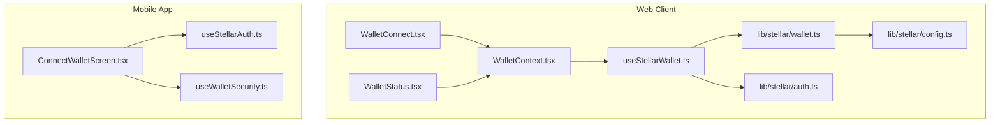
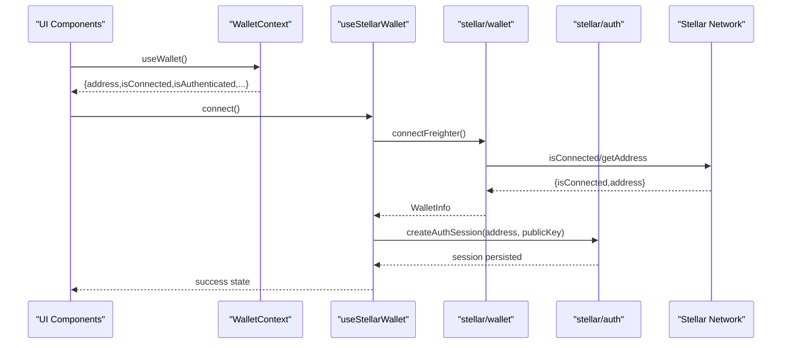
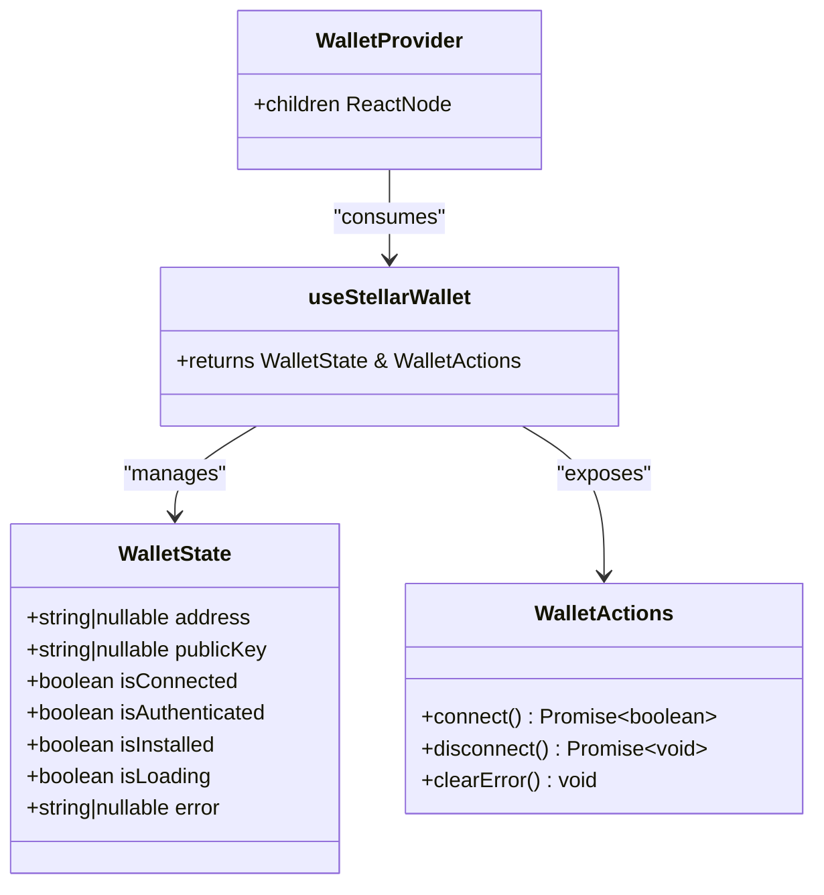
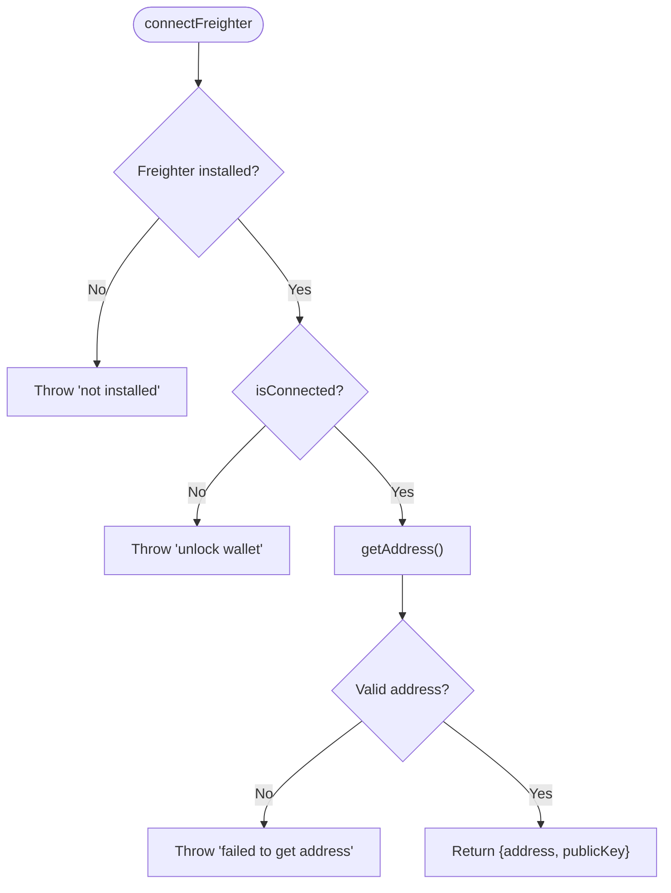
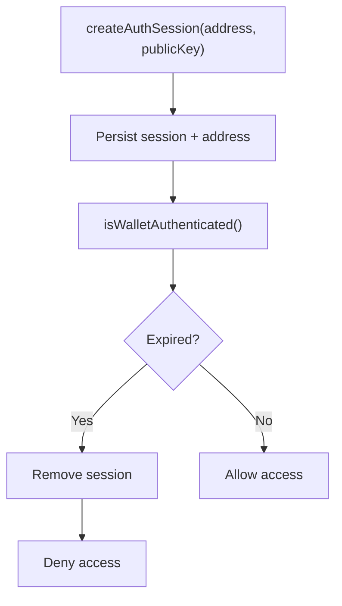
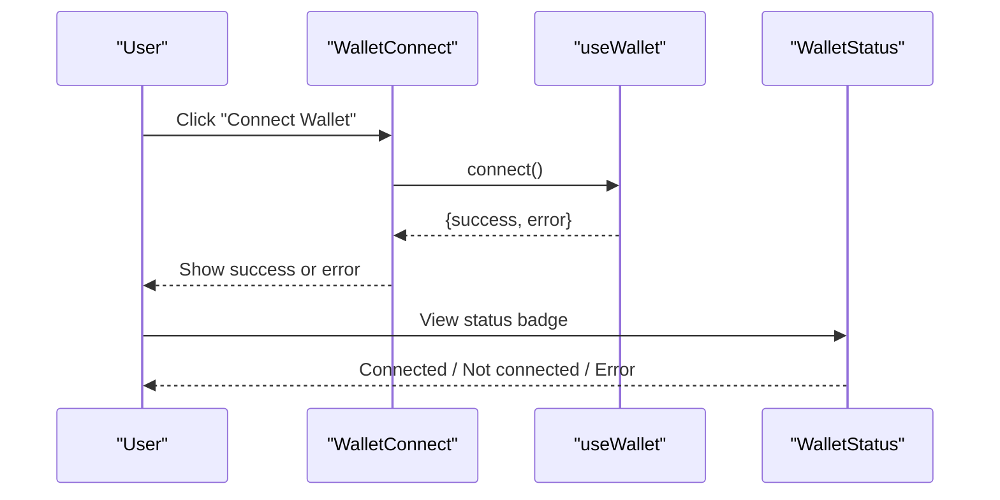
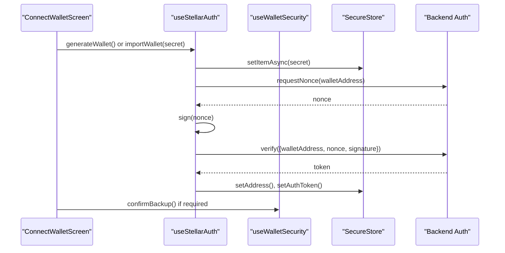
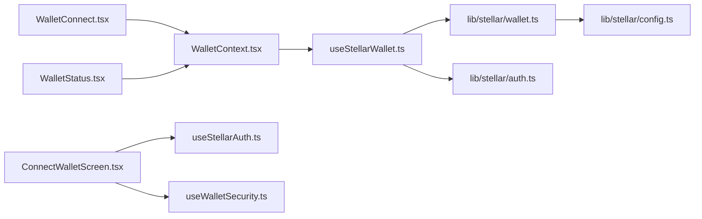

# Wallet Integration & Context

<cite>
**Referenced Files in This Document**
- [WalletContext.tsx](file://veilend-web/src/context/WalletContext.tsx)
- [useStellarWallet.ts](file://veilend-web/src/hooks/useStellarWallet.ts)
- [wallet.ts](file://veilend-web/src/lib/stellar/wallet.ts)
- [auth.ts](file://veilend-web/src/lib/stellar/auth.ts)
- [config.ts](file://veilend-web/src/lib/stellar/config.ts)
- [WalletConnect.tsx](file://veilend-web/src/components/WalletConnect.tsx)
- [WalletStatus.tsx](file://veilend-web/src/components/WalletStatus.tsx)
- [ConnectWalletScreen.tsx](file://veilend-mobile/src/screens/ConnectWalletScreen.tsx)
- [useStellarAuth.ts](file://veilend-mobile/src/hooks/useStellarAuth.ts)
- [useWalletSecurity.ts](file://veilend-mobile/src/hooks/useWalletSecurity.ts)
</cite>

## Table of Contents
1. [Introduction](#introduction)
2. [Project Structure](#project-structure)
3. [Core Components](#core-components)
4. [Architecture Overview](#architecture-overview)
5. [Detailed Component Analysis](#detailed-component-analysis)
6. [Dependency Analysis](#dependency-analysis)
7. [Performance Considerations](#performance-considerations)
8. [Troubleshooting Guide](#troubleshooting-guide)
9. [Conclusion](#conclusion)
10. [Appendices](#appendices)

## Introduction
This document explains the wallet integration system for Stellar, focusing on the web client’s WalletProvider context, connection lifecycle, transaction signing workflows, and session management. It also covers the mobile wallet flow using secret key generation/import and secure storage. The goal is to help both beginners and experienced developers implement robust wallet features with clear error handling and security best practices.

## Project Structure
The wallet integration spans three main areas:
- Web client React hooks and context that manage Freighter wallet connection and UI state
- Stellar SDK utilities for network configuration, message signing, and address retrieval
- Mobile screens and hooks for generating or importing a Stellar wallet and authenticating via nonce/signature

**Diagram sources**
- [WalletContext.tsx:10-14](file://veilend-web/src/context/WalletContext.tsx#L10-L14)
- [useStellarWallet.ts:23-122](file://veilend-web/src/hooks/useStellarWallet.ts#L23-L122)
- [wallet.ts:69-98](file://veilend-web/src/lib/stellar/wallet.ts#L69-L98)
- [auth.ts:73-88](file://veilend-web/src/lib/stellar/auth.ts#L73-L88)
- [config.ts:5-22](file://veilend-web/src/lib/stellar/config.ts#L5-L22)
- [WalletConnect.tsx:28-45](file://veilend-web/src/components/WalletConnect.tsx#L28-L45)
- [WalletStatus.tsx:17-33](file://veilend-web/src/components/WalletStatus.tsx#L17-L33)
- [ConnectWalletScreen.tsx:32-66](file://veilend-mobile/src/screens/ConnectWalletScreen.tsx#L32-L66)
- [useStellarAuth.ts:16-72](file://veilend-mobile/src/hooks/useStellarAuth.ts#L16-L72)
- [useWalletSecurity.ts:25-166](file://veilend-mobile/src/hooks/useWalletSecurity.ts#L25-L166)

**Section sources**
- [WalletContext.tsx:1-24](file://veilend-web/src/context/WalletContext.tsx#L1-L24)
- [useStellarWallet.ts:1-122](file://veilend-web/src/hooks/useStellarWallet.ts#L1-L122)
- [wallet.ts:1-218](file://veilend-web/src/lib/stellar/wallet.ts#L1-L218)
- [auth.ts:1-110](file://veilend-web/src/lib/stellar/auth.ts#L1-L110)
- [config.ts:1-22](file://veilend-web/src/lib/stellar/config.ts#L1-L22)
- [WalletConnect.tsx:1-378](file://veilend-web/src/components/WalletConnect.tsx#L1-L378)
- [WalletStatus.tsx:1-155](file://veilend-web/src/components/WalletStatus.tsx#L1-L155)
- [ConnectWalletScreen.tsx:1-377](file://veilend-mobile/src/screens/ConnectWalletScreen.tsx#L1-L377)
- [useStellarAuth.ts:1-72](file://veilend-mobile/src/hooks/useStellarAuth.ts#L1-L72)
- [useWalletSecurity.ts:1-166](file://veilend-mobile/src/hooks/useWalletSecurity.ts#L1-L166)

## Core Components
- WalletProvider (context): Wraps the app with wallet state and actions derived from useStellarWallet. Consumers access connect/disconnect/error via useWallet.
- useStellarWallet hook: Manages connection lifecycle (install detection, connect, disconnect), creates auth sessions, and exposes UI state flags like isConnected, isAuthenticated, isInstalled, isLoading, and error.
- Stellar wallet utilities: Provide Freighter detection, connection, address retrieval, message signing, and network configuration.
- Auth utilities: Persist and validate an authentication session in localStorage with expiration handling.
- UI components: WalletConnect offers multiple variants and guided flows; WalletStatus shows compact status and quick actions.
- Mobile flow: Generates or imports a Stellar wallet, stores secrets securely, and authenticates via nonce/signature.

**Section sources**
- [WalletContext.tsx:6-22](file://veilend-web/src/context/WalletContext.tsx#L6-L22)
- [useStellarWallet.ts:7-21](file://veilend-web/src/hooks/useStellarWallet.ts#L7-L21)
- [wallet.ts:10-21](file://veilend-web/src/lib/stellar/wallet.ts#L10-L21)
- [auth.ts:11-17](file://veilend-web/src/lib/stellar/auth.ts#L11-L17)
- [WalletConnect.tsx:20-45](file://veilend-web/src/components/WalletConnect.tsx#L20-L45)
- [WalletStatus.tsx:10-33](file://veilend-web/src/components/WalletStatus.tsx#L10-L33)
- [ConnectWalletScreen.tsx:32-66](file://veilend-mobile/src/screens/ConnectWalletScreen.tsx#L32-L66)
- [useStellarAuth.ts:16-72](file://veilend-mobile/src/hooks/useStellarAuth.ts#L16-L72)
- [useWalletSecurity.ts:25-166](file://veilend-mobile/src/hooks/useWalletSecurity.ts#L25-L166)

## Architecture Overview
The web wallet flow integrates a React context with a hook that delegates to Stellar SDK and Freighter API. The mobile flow uses local secret storage and server-side nonce verification.

**Diagram sources**
- [WalletContext.tsx:10-14](file://veilend-web/src/context/WalletContext.tsx#L10-L14)
- [useStellarWallet.ts:54-88](file://veilend-web/src/hooks/useStellarWallet.ts#L54-L88)
- [wallet.ts:69-98](file://veilend-web/src/lib/stellar/wallet.ts#L69-L98)
- [auth.ts:73-88](file://veilend-web/src/lib/stellar/auth.ts#L73-L88)

## Detailed Component Analysis

### WalletProvider and useStellarWallet
- WalletProvider provides a unified context value combining state and actions from useStellarWallet.
- useStellarWallet initializes by checking Freighter installation and existing auth session, then exposes connect/disconnect/clearError.
- On connect, it calls the wallet library to obtain the address/publicKey, creates an auth session, and updates UI state.
- On disconnect, it clears local wallet state and auth session.

**Diagram sources**
- [WalletContext.tsx:6-22](file://veilend-web/src/context/WalletContext.tsx#L6-L22)
- [useStellarWallet.ts:7-21](file://veilend-web/src/hooks/useStellarWallet.ts#L7-L21)
- [useStellarWallet.ts:23-122](file://veilend-web/src/hooks/useStellarWallet.ts#L23-L122)

**Section sources**
- [WalletContext.tsx:1-24](file://veilend-web/src/context/WalletContext.tsx#L1-L24)
- [useStellarWallet.ts:23-122](file://veilend-web/src/hooks/useStellarWallet.ts#L23-L122)

### Stellar Wallet Utilities (Freighter Integration)
- Installation detection: checks for window.freighter presence.
- Connection: validates connectivity and retrieves address/publicKey.
- Message signing: builds a minimal transaction XDR and signs via Freighter, returning signed XDR.
- Address retrieval: safe wrapper around getAddress with validation.
- Disconnect: clears local wallet-related keys.

**Diagram sources**
- [wallet.ts:61-98](file://veilend-web/src/lib/stellar/wallet.ts#L61-L98)

**Section sources**
- [wallet.ts:61-218](file://veilend-web/src/lib/stellar/wallet.ts#L61-L218)

### Authentication Session Management
- Session creation: persists authenticated session with expiry and wallet address.
- Session validation: checks existence, authenticated flag, and expiration; cleans up expired sessions.
- Logout: removes session and address from storage.
- Address validation: ensures valid Stellar public key format.

**Diagram sources**
- [auth.ts:31-88](file://veilend-web/src/lib/stellar/auth.ts#L31-L88)
- [auth.ts:93-110](file://veilend-web/src/lib/stellar/auth.ts#L93-L110)

**Section sources**
- [auth.ts:1-110](file://veilend-web/src/lib/stellar/auth.ts#L1-110)

### UI Components: WalletConnect and WalletStatus
- WalletConnect:
  - Multiple variants (default, compact, full) for flexible placement.
  - Handles modal open/close, connection attempts, and user feedback.
  - Uses helper messages to guide users when Freighter is missing or needs unlocking.
- WalletStatus:
  - Displays current connection state with optional details and quick actions.
  - Provides tooltips for errors and easy dismissal.

**Diagram sources**
- [WalletConnect.tsx:58-92](file://veilend-web/src/components/WalletConnect.tsx#L58-L92)
- [WalletStatus.tsx:35-47](file://veilend-web/src/components/WalletStatus.tsx#L35-L47)

**Section sources**
- [WalletConnect.tsx:28-378](file://veilend-web/src/components/WalletConnect.tsx#L28-L378)
- [WalletStatus.tsx:17-155](file://veilend-web/src/components/WalletStatus.tsx#L17-L155)

### Mobile Wallet Flow
- ConnectWalletScreen:
  - Offers generate new wallet or import secret key.
  - Integrates backup confirmation flow after generation.
- useStellarAuth:
  - Generates or imports Keypair, stores secret securely, requests nonce, signs, verifies, and sets address/token.
- useWalletSecurity:
  - Manages secret reveal timers, clipboard safety, and backup confirmation flags.

**Diagram sources**
- [ConnectWalletScreen.tsx:55-66](file://veilend-mobile/src/screens/ConnectWalletScreen.tsx#L55-L66)
- [useStellarAuth.ts:22-63](file://veilend-mobile/src/hooks/useStellarAuth.ts#L22-L63)
- [useWalletSecurity.ts:107-123](file://veilend-mobile/src/hooks/useWalletSecurity.ts#L107-L123)

**Section sources**
- [ConnectWalletScreen.tsx:32-217](file://veilend-mobile/src/screens/ConnectWalletScreen.tsx#L32-L217)
- [useStellarAuth.ts:16-72](file://veilend-mobile/src/hooks/useStellarAuth.ts#L16-L72)
- [useWalletSecurity.ts:25-166](file://veilend-mobile/src/hooks/useWalletSecurity.ts#L25-L166)

## Dependency Analysis
- Web client dependencies:
  - useStellarWallet depends on stellar/wallet and stellar/auth.
  - stellar/wallet depends on stellar/config for network settings.
  - WalletProvider composes useStellarWallet into a React context.
  - UI components depend on the context for state and actions.
- Mobile dependencies:
  - ConnectWalletScreen depends on useStellarAuth and useWalletSecurity.
  - useStellarAuth depends on SecureStore and backend auth endpoints.
  - useWalletSecurity manages local secure state and timers.

**Diagram sources**
- [WalletContext.tsx:10-14](file://veilend-web/src/context/WalletContext.tsx#L10-L14)
- [useStellarWallet.ts:4-5](file://veilend-web/src/hooks/useStellarWallet.ts#L4-L5)
- [wallet.ts:6-8](file://veilend-web/src/lib/stellar/wallet.ts#L6-L8)
- [config.ts:5-22](file://veilend-web/src/lib/stellar/config.ts#L5-L22)
- [WalletConnect.tsx:5-18](file://veilend-web/src/components/WalletConnect.tsx#L5-L18)
- [WalletStatus.tsx:3-8](file://veilend-web/src/components/WalletStatus.tsx#L3-L8)
- [ConnectWalletScreen.tsx:24-26](file://veilend-mobile/src/screens/ConnectWalletScreen.tsx#L24-L26)
- [useStellarAuth.ts:1-4](file://veilend-mobile/src/hooks/useStellarAuth.ts#L1-L4)
- [useWalletSecurity.ts:1-4](file://veilend-mobile/src/hooks/useWalletSecurity.ts#L1-L4)

**Section sources**
- [useStellarWallet.ts:4-5](file://veilend-web/src/hooks/useStellarWallet.ts#L4-L5)
- [wallet.ts:6-8](file://veilend-web/src/lib/stellar/wallet.ts#L6-L8)
- [config.ts:5-22](file://veilend-web/src/lib/stellar/config.ts#L5-L22)
- [WalletContext.tsx:10-14](file://veilend-web/src/context/WalletContext.tsx#L10-L14)
- [WalletConnect.tsx:5-18](file://veilend-web/src/components/WalletConnect.tsx#L5-L18)
- [WalletStatus.tsx:3-8](file://veilend-web/src/components/WalletStatus.tsx#L3-L8)
- [ConnectWalletScreen.tsx:24-26](file://veilend-mobile/src/screens/ConnectWalletScreen.tsx#L24-L26)
- [useStellarAuth.ts:1-4](file://veilend-mobile/src/hooks/useStellarAuth.ts#L1-L4)
- [useWalletSecurity.ts:1-4](file://veilend-mobile/src/hooks/useWalletSecurity.ts#L1-L4)

## Performance Considerations
- Avoid redundant re-renders by memoizing callbacks in useStellarWallet where appropriate.
- Debounce frequent state updates during connection attempts to reduce UI thrashing.
- Use environment variables for network configuration to avoid runtime config churn.
- In mobile, limit secret key exposure time and clear clipboard automatically to minimize risk.

[No sources needed since this section provides general guidance]

## Troubleshooting Guide
Common issues and resolutions:
- Wallet not detected:
  - Ensure Freighter extension is installed and enabled; check isFreighterInstalled and display install prompts.
  - Reference: [wallet.ts:61-64](file://veilend-web/src/lib/stellar/wallet.ts#L61-L64)
- Wallet locked or not connected:
  - Prompt user to unlock Freighter and retry; show friendly messages via getWalletConnectionMessage.
  - Reference: [wallet.ts:39-47](file://veilend-web/src/lib/stellar/wallet.ts#L39-L47)
- Failed to get address:
  - Validate response shape and handle missing fields gracefully.
  - Reference: [wallet.ts:80-88](file://veilend-web/src/lib/stellar/wallet.ts#L80-L88)
- Session expired:
  - Clear stale sessions and require reconnect.
  - Reference: [auth.ts:41-49](file://veilend-web/src/lib/stellar/auth.ts#L41-L49)
- Mobile secret key handling:
  - Confirm backup before proceeding; enforce temporary reveal timers and auto-clear clipboard.
  - References: [useWalletSecurity.ts:74-123](file://veilend-mobile/src/hooks/useWalletSecurity.ts#L74-L123), [useStellarAuth.ts:33-63](file://veilend-mobile/src/hooks/useStellarAuth.ts#L33-L63)

**Section sources**
- [wallet.ts:39-98](file://veilend-web/src/lib/stellar/wallet.ts#L39-L98)
- [auth.ts:41-98](file://veilend-web/src/lib/stellar/auth.ts#L41-L98)
- [useWalletSecurity.ts:74-123](file://veilend-mobile/src/hooks/useWalletSecurity.ts#L74-L123)
- [useStellarAuth.ts:33-63](file://veilend-mobile/src/hooks/useStellarAuth.ts#L33-L63)

## Conclusion
The wallet integration combines a React context and hook-based state management with Stellar SDK utilities and Freighter API for seamless web wallet connections. Mobile flows provide secure secret key management and server-backed authentication. By following the documented patterns—robust error handling, session validation, and secure secret handling—you can build reliable wallet experiences across platforms.

[No sources needed since this section summarizes without analyzing specific files]

## Appendices

### How to Connect Wallets (Web)
- Wrap your app with WalletProvider to expose useWallet.
- Call connect() from UI; handle success/failure and update UI accordingly.
- Display WalletStatus or WalletConnect to reflect state and allow disconnect.

References:
- [WalletContext.tsx:10-22](file://veilend-web/src/context/WalletContext.tsx#L10-L22)
- [useStellarWallet.ts:54-88](file://veilend-web/src/hooks/useStellarWallet.ts#L54-L88)
- [WalletConnect.tsx:58-92](file://veilend-web/src/components/WalletConnect.tsx#L58-L92)
- [WalletStatus.tsx:35-47](file://veilend-web/src/components/WalletStatus.tsx#L35-L47)

### Transaction Signing Workflow (Web)
- Build a minimal transaction XDR using Stellar SDK and sign via Freighter.
- Return signed XDR for submission to the network.

References:
- [wallet.ts:129-192](file://veilend-web/src/lib/stellar/wallet.ts#L129-L192)

### Mobile Wallet Creation and Authentication
- Generate or import a Stellar secret key, store securely, request nonce, sign, and verify against backend.
- Enforce backup confirmation and secure reveal timers.

References:
- [ConnectWalletScreen.tsx:55-66](file://veilend-mobile/src/screens/ConnectWalletScreen.tsx#L55-L66)
- [useStellarAuth.ts:22-63](file://veilend-mobile/src/hooks/useStellarAuth.ts#L22-L63)
- [useWalletSecurity.ts:74-123](file://veilend-mobile/src/hooks/useWalletSecurity.ts#L74-L123)