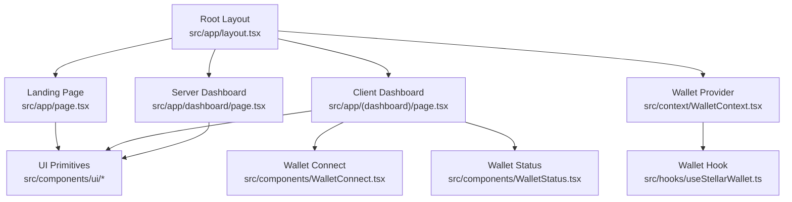
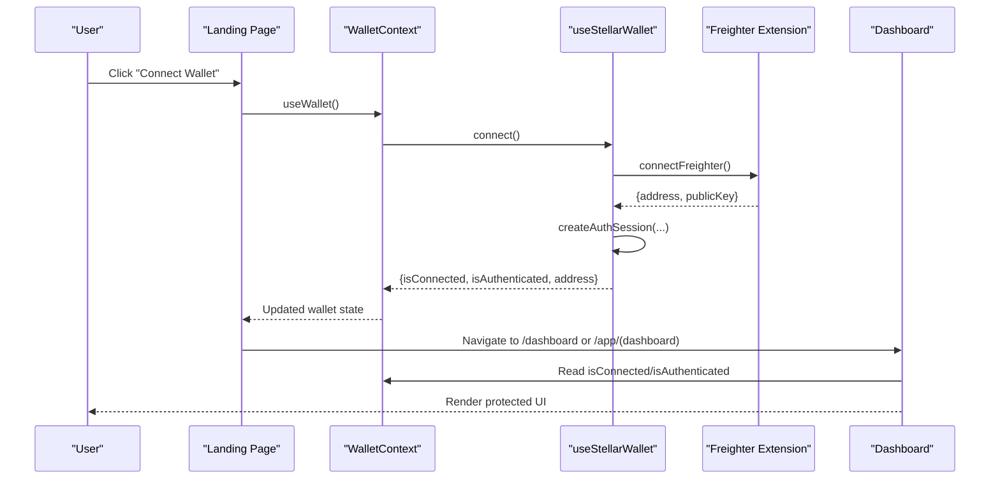
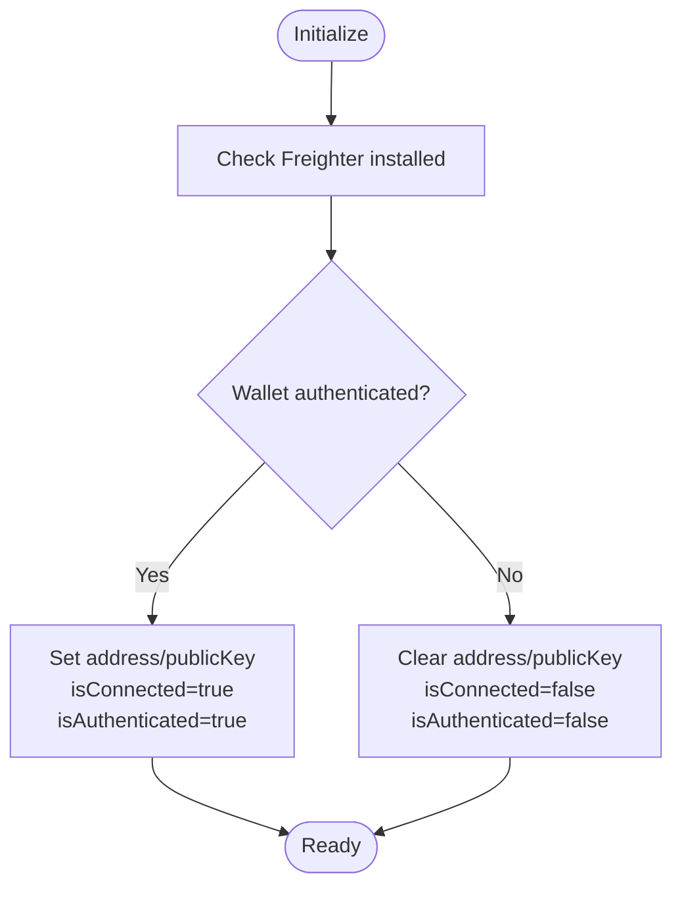
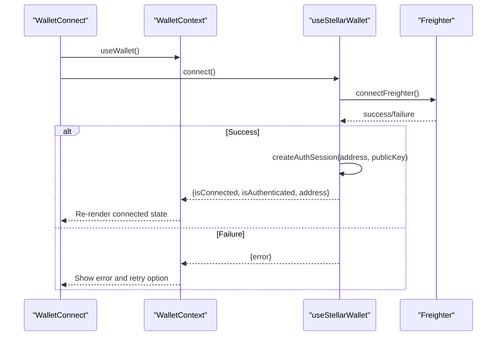
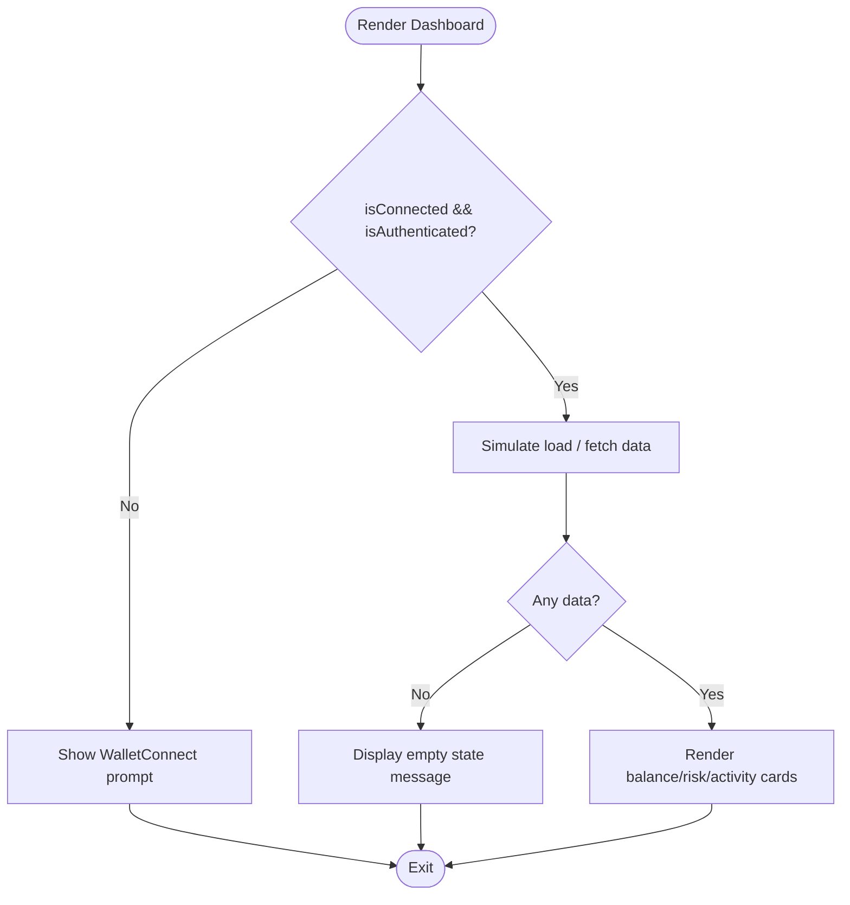
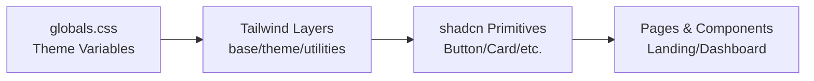
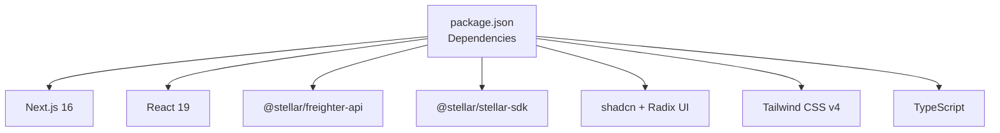

# Web Application (Next.js)

<cite>
**Referenced Files in This Document**
- [package.json](file://veilend-web/package.json)
- [next.config.ts](file://veilend-web/next.config.ts)
- [layout.tsx](file://veilend-web/src/app/layout.tsx)
- [page.tsx](file://veilend-web/src/app/page.tsx)
- [page.tsx](file://veilend-web/src/app/(dashboard)/page.tsx)
- [page.tsx](file://veilend-web/src/app/dashboard/page.tsx)
- [WalletContext.tsx](file://veilend-web/src/context/WalletContext.tsx)
- [useStellarWallet.ts](file://veilend-web/src/hooks/useStellarWallet.ts)
- [WalletConnect.tsx](file://veilend-web/src/components/WalletConnect.tsx)
- [WalletStatus.tsx](file://veilend-web/src/components/WalletStatus.tsx)
- [button.tsx](file://veilend-web/src/components/ui/button.tsx)
- [card.tsx](file://veilend-web/src/components/ui/card.tsx)
- [globals.css](file://veilend-web/src/app/globals.css)
- [components.json](file://veilend-web/components.json)
</cite>

## Table of Contents
1. [Introduction](#introduction)
2. [Project Structure](#project-structure)
3. [Core Components](#core-components)
4. [Architecture Overview](#architecture-overview)
5. [Detailed Component Analysis](#detailed-component-analysis)
6. [Dependency Analysis](#dependency-analysis)
7. [Performance Considerations](#performance-considerations)
8. [Troubleshooting Guide](#troubleshooting-guide)
9. [Conclusion](#conclusion)
10. [Appendices](#appendices)

## Introduction
This document explains the VeilLend web application built with Next.js 16, focusing on its privacy-first design and Stellar network integration. It covers the app router structure, component hierarchy, Tailwind CSS styling, TypeScript type safety, wallet context management, responsive components, and the user-facing dashboard interface. The goal is to help both users and developers understand how the application works and how to extend it safely and effectively.

## Project Structure
The web application uses the Next.js App Router with a clear separation between client-side pages and shared UI primitives:
- Root layout sets up fonts, global styles, and wraps the app with WalletProvider for global wallet state.
- Client-side landing page demonstrates wallet connection flows and routes authenticated users to the dashboard.
- Two dashboard implementations exist:
  - A client-side dashboard under the (dashboard) route group that renders interactive UI with skeleton states and simulated data.
  - A server-rendered dashboard page that reads headers for authentication and fetches portfolio data server-side.
- Shared UI components are implemented with shadcn-style primitives and styled via Tailwind CSS with custom theme variables.
- Wallet integration is encapsulated in a React hook and exposed through a context provider for consistent access across components.

**Diagram sources**
- [layout.tsx:1-39](file://veilend-web/src/app/layout.tsx#L1-L39)
- [page.tsx:1-340](file://veilend-web/src/app/page.tsx#L1-L340)
- [page.tsx:1-302](file://veilend-web/src/app/(dashboard)/page.tsx#L1-L302)
- [page.tsx:1-294](file://veilend-web/src/app/dashboard/page.tsx#L1-L294)
- [WalletContext.tsx:1-24](file://veilend-web/src/context/WalletContext.tsx#L1-L24)
- [useStellarWallet.ts:1-122](file://veilend-web/src/hooks/useStellarWallet.ts#L1-L122)
- [WalletConnect.tsx:1-378](file://veilend-web/src/components/WalletConnect.tsx#L1-L378)
- [WalletStatus.tsx:1-155](file://veilend-web/src/components/WalletStatus.tsx#L1-L155)
- [button.tsx:1-68](file://veilend-web/src/components/ui/button.tsx#L1-L68)
- [card.tsx:1-104](file://veilend-web/src/components/ui/card.tsx#L1-L104)

**Section sources**
- [layout.tsx:1-39](file://veilend-web/src/app/layout.tsx#L1-L39)
- [page.tsx:1-340](file://veilend-web/src/app/page.tsx#L1-L340)
- [page.tsx:1-302](file://veilend-web/src/app/(dashboard)/page.tsx#L1-L302)
- [page.tsx:1-294](file://veilend-web/src/app/dashboard/page.tsx#L1-L294)
- [WalletContext.tsx:1-24](file://veilend-web/src/context/WalletContext.tsx#L1-L24)
- [useStellarWallet.ts:1-122](file://veilend-web/src/hooks/useStellarWallet.ts#L1-L122)
- [WalletConnect.tsx:1-378](file://veilend-web/src/components/WalletConnect.tsx#L1-L378)
- [WalletStatus.tsx:1-155](file://veilend-web/src/components/WalletStatus.tsx#L1-L155)
- [button.tsx:1-68](file://veilend-web/src/components/ui/button.tsx#L1-L68)
- [card.tsx:1-104](file://veilend-web/src/components/ui/card.tsx#L1-L104)

## Core Components
- Root layout:
  - Initializes global metadata, fonts, and applies Tailwind classes.
  - Wraps all children with WalletProvider to expose wallet state globally.
- Landing page:
  - Displays hero content, campaign metrics, feature highlights, and CTAs.
  - Uses the wallet context to show connection status and navigate to the dashboard when authenticated.
- Client dashboard:
  - Enforces wallet connection before rendering protected content.
  - Provides interactive controls to simulate loading and empty states for robust UX.
  - Shows shielded balances, debt/collateral ratios, and activity logs using UI primitives.
- Server dashboard:
  - Reads wallet address from request headers and redirects if not present.
  - Fetches portfolio and recent activity data server-side and renders cards and lists.
- Wallet context and hook:
  - Encapsulates Freighter detection, connection, authentication session creation, and disconnection.
  - Exposes typed state and actions for connect, disconnect, and error clearing.
- UI primitives:
  - Button and Card components follow shadcn patterns with Tailwind utility composition and Radix integration.
  - Theme variables define brand colors, typography, and dark mode support.

**Section sources**
- [layout.tsx:1-39](file://veilend-web/src/app/layout.tsx#L1-L39)
- [page.tsx:1-340](file://veilend-web/src/app/page.tsx#L1-L340)
- [page.tsx:1-302](file://veilend-web/src/app/(dashboard)/page.tsx#L1-L302)
- [page.tsx:1-294](file://veilend-web/src/app/dashboard/page.tsx#L1-L294)
- [WalletContext.tsx:1-24](file://veilend-web/src/context/WalletContext.tsx#L1-L24)
- [useStellarWallet.ts:1-122](file://veilend-web/src/hooks/useStellarWallet.ts#L1-L122)
- [button.tsx:1-68](file://veilend-web/src/components/ui/button.tsx#L1-L68)
- [card.tsx:1-104](file://veilend-web/src/components/ui/card.tsx#L1-L104)

## Architecture Overview
The application follows a layered architecture:
- Presentation layer: Pages and components render the UI using Tailwind CSS and shadcn primitives.
- State layer: Wallet context provides unified wallet state and actions across the app.
- Integration layer: The wallet hook interacts with Freighter and manages auth sessions.
- Routing layer: App Router separates public landing, client dashboard, and server dashboard routes.

**Diagram sources**
- [page.tsx:1-340](file://veilend-web/src/app/page.tsx#L1-L340)
- [WalletContext.tsx:1-24](file://veilend-web/src/context/WalletContext.tsx#L1-L24)
- [useStellarWallet.ts:1-122](file://veilend-web/src/hooks/useStellarWallet.ts#L1-L122)
- [page.tsx:1-302](file://veilend-web/src/app/(dashboard)/page.tsx#L1-L302)

## Detailed Component Analysis

### Wallet Context and Hook
The wallet context centralizes wallet state and actions, ensuring consistent behavior across components. The hook initializes installation checks, authentication status, and exposes typed connect/disconnect methods. Errors are captured and surfaced to UI components for graceful handling.

**Diagram sources**
- [useStellarWallet.ts:1-122](file://veilend-web/src/hooks/useStellarWallet.ts#L1-L122)

**Section sources**
- [WalletContext.tsx:1-24](file://veilend-web/src/context/WalletContext.tsx#L1-L24)
- [useStellarWallet.ts:1-122](file://veilend-web/src/hooks/useStellarWallet.ts#L1-L122)

### Wallet Connect Flow
The WalletConnect component orchestrates the user flow to connect to Freighter, handle errors, and provide feedback. It supports multiple variants and integrates with the wallet context to trigger connection and display status.

**Diagram sources**
- [WalletConnect.tsx:1-378](file://veilend-web/src/components/WalletConnect.tsx#L1-L378)
- [useStellarWallet.ts:1-122](file://veilend-web/src/hooks/useStellarWallet.ts#L1-L122)

**Section sources**
- [WalletConnect.tsx:1-378](file://veilend-web/src/components/WalletConnect.tsx#L1-L378)
- [useStellarWallet.ts:1-122](file://veilend-web/src/hooks/useStellarWallet.ts#L1-L122)

### Dashboard Rendering Patterns
The client dashboard enforces wallet authentication and renders protected content with loading and empty states. It composes UI primitives to present balances, risk metrics, and activity logs. The server dashboard reads headers for authentication and fetches data server-side, demonstrating hybrid rendering strategies.

**Diagram sources**
- [page.tsx:1-302](file://veilend-web/src/app/(dashboard)/page.tsx#L1-L302)
- [page.tsx:1-294](file://veilend-web/src/app/dashboard/page.tsx#L1-L294)

**Section sources**
- [page.tsx:1-302](file://veilend-web/src/app/(dashboard)/page.tsx#L1-L302)
- [page.tsx:1-294](file://veilend-web/src/app/dashboard/page.tsx#L1-L294)

### Design System and Theming
The design system leverages Tailwind CSS with shadcn-style components and a cohesive theme:
- Global theme variables define primary, secondary, background, card, text, border, success, warning, and error colors.
- Dark mode overrides ensure contrast and readability.
- Typography uses Inter and Geist fonts configured in the root layout.
- UI primitives like Button and Card compose utilities for consistent spacing, sizing, and accessibility attributes.

**Diagram sources**
- [globals.css:1-161](file://veilend-web/src/app/globals.css#L1-L161)
- [button.tsx:1-68](file://veilend-web/src/components/ui/button.tsx#L1-L68)
- [card.tsx:1-104](file://veilend-web/src/components/ui/card.tsx#L1-L104)
- [layout.tsx:1-39](file://veilend-web/src/app/layout.tsx#L1-L39)

**Section sources**
- [globals.css:1-161](file://veilend-web/src/app/globals.css#L1-L161)
- [button.tsx:1-68](file://veilend-web/src/components/ui/button.tsx#L1-L68)
- [card.tsx:1-104](file://veilend-web/src/components/ui/card.tsx#L1-L104)
- [layout.tsx:1-39](file://veilend-web/src/app/layout.tsx#L1-L39)
- [components.json:1-26](file://veilend-web/components.json#L1-L26)

## Dependency Analysis
The web application depends on:
- Next.js 16 for routing and build tooling.
- React 19 for component-based UI.
- @stellar/freighter-api and @stellar/stellar-sdk for wallet integration and Stellar interactions.
- shadcn and Radix UI for accessible primitives.
- Tailwind CSS v4 for styling and theming.
- TypeScript for type safety across hooks, contexts, and components.

**Diagram sources**
- [package.json:1-43](file://veilend-web/package.json#L1-L43)

**Section sources**
- [package.json:1-43](file://veilend-web/package.json#L1-L43)

## Performance Considerations
- Prefer client-side wallet state updates within the context to minimize re-renders; keep heavy computations out of render paths.
- Use skeletons and empty states to improve perceived performance during data fetching or simulation.
- Leverage server dashboard for initial data loads where possible to reduce client-side work.
- Keep UI primitives composable and avoid deep nesting to maintain efficient diffing.
- Validate environment configuration at startup to fail fast and avoid runtime surprises.

[No sources needed since this section provides general guidance]

## Troubleshooting Guide
Common issues and resolutions:
- Freighter not detected:
  - Ensure the extension is installed and enabled. The WalletConnect component guides users to install and retry.
- Connection errors:
  - Errors are surfaced via the wallet context and displayed in the UI. Clear errors and retry connections.
- Authentication mismatch:
  - For server dashboard, verify that the wallet address header is present and valid; otherwise, redirect to home.
- Build-time config validation:
  - Environment variables are validated at startup; fix missing or invalid variables to prevent cryptic runtime failures.

**Section sources**
- [WalletConnect.tsx:1-378](file://veilend-web/src/components/WalletConnect.tsx#L1-L378)
- [useStellarWallet.ts:1-122](file://veilend-web/src/hooks/useStellarWallet.ts#L1-L122)
- [page.tsx:1-294](file://veilend-web/src/app/dashboard/page.tsx#L1-L294)
- [next.config.ts:1-20](file://veilend-web/next.config.ts#L1-L20)

## Conclusion
The VeilLend web application combines a privacy-first approach with a modern Next.js 16 stack. The app router cleanly separates public and protected routes, while the wallet context and hook provide robust Stellar integration. Tailwind CSS and shadcn primitives deliver a consistent, accessible design system. Developers can extend the app by composing existing components, leveraging type safety, and following established patterns for state management and error handling.

[No sources needed since this section summarizes without analyzing specific files]

## Appendices

### Practical Examples

- Component composition example:
  - Compose WalletConnect and WalletStatus within the dashboard to manage connection and display status.
  - Reference: [page.tsx:1-302](file://veilend-web/src/app/(dashboard)/page.tsx#L1-L302), [WalletConnect.tsx:1-378](file://veilend-web/src/components/WalletConnect.tsx#L1-L378), [WalletStatus.tsx:1-155](file://veilend-web/src/components/WalletStatus.tsx#L1-L155)

- State management pattern:
  - Initialize wallet state on mount, update via connect/disconnect, and surface errors for UI feedback.
  - Reference: [useStellarWallet.ts:1-122](file://veilend-web/src/hooks/useStellarWallet.ts#L1-L122), [WalletContext.tsx:1-24](file://veilend-web/src/context/WalletContext.tsx#L1-L24)

- Wallet integration workflow:
  - Detect Freighter, initiate connection, create auth session, and navigate to dashboard upon success.
  - Reference: [WalletConnect.tsx:1-378](file://veilend-web/src/components/WalletConnect.tsx#L1-L378), [useStellarWallet.ts:1-122](file://veilend-web/src/hooks/useStellarWallet.ts#L1-L122)

- Responsive design patterns:
  - Use Tailwind responsive utilities to adapt layouts across breakpoints; leverage grid and flexbox for flexible structures.
  - Reference: [page.tsx:1-340](file://veilend-web/src/app/page.tsx#L1-L340), [page.tsx:1-302](file://veilend-web/src/app/(dashboard)/page.tsx#L1-L302)

- Type safety practices:
  - Define explicit types for wallet state and actions; enforce usage via context to prevent misuse.
  - Reference: [useStellarWallet.ts:1-122](file://veilend-web/src/hooks/useStellarWallet.ts#L1-L122), [WalletContext.tsx:1-24](file://veilend-web/src/context/WalletContext.tsx#L1-L24)